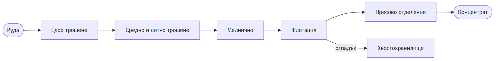

# Покритие по цехове

## Ядрото на стратегията – технологичен обхват и измерими ефекти по корпуси

> **Предназначение на раздела:** за всеки технологичен корпус да се дефинират решаваните производствени проблеми, конкретните аналитични и оптимизационни решения и количествено измеримите ефекти върху ключовите производствени показатели (KPI).

За всеки корпус се прилага единна аналитична рамка:

- **Технологична роля** – принос към общия материален и метален баланс на фабриката.
- **Основно оборудване и агрегати** – машините и съоръженията, които формират процеса.
- **КИП и А и източници на данни** – контролно-измервателна апаратура и автоматика, налична в `PulseSCADA`.
- **Текущи ограничения** – експлоатационни дефицити и неоползотворени резерви.
- **Решение на системата** – мониторинг, оптимизация (задания към АСУТП) и интелигентни анализи.
- **Измерим ефект и KPI** – целеви показатели и конкретен механизъм на подобрение.
- **Ефект за поддръжката и експлоатацията** – принос към надеждността и проактивната поддръжка.

> **Принципно положение:** максималната стойност не се генерира на ниво отделен корпус, а от **интеграцията на целия технологичен поток в единен материален баланс** (виж „Свързване на цеховете в обща картина“ по-долу). Поради това обхватът се разширява end-to-end по цялата верига, а не изолирано в един участък.

---

## Технологичният поток накратко

| №   | Корпус                 | Вход                  | Изход                                      |
| --- | ---------------------- | --------------------- | ------------------------------------------ |
| 1   | Едро трошене           | Руда                  | Едро натрошена руда                        |
| 2   | Средно и ситно трошене | Едро натрошена руда   | Ситно натрошена руда                       |
| 3   | Мелнично               | Ситно натрошена руда  | Смляна пулпа                               |
| 4   | Флотация               | Смляна пулпа          | Концентрат (+ отпадък към хвостохранилище) |
| 5   | Пресово отделение      | Концентрат            | Готов концентрат за реализация             |
| 6   | Хвостохранилище        | Отпадък от флотацията | Съхранен отпадък, върнат водооборот        |

Всеки корпус приема продукта на предходния, поради което всяко технологично решение се разпространява надолу по веригата с натрупващ се ефект. Стратегията прави тези междукорпусни зависимости видими и количествено измерими.

---

## 4.1. Едро трошене (Корпуси за едро трошене – КЕТ1 и КЕТ3)

### Технологична роля

Първият стадий на едринното намаляване – рудничната маса от кариера се редуцира до по-дребен клас, подходящ за последващото смилане. Преработката се разпределя между **два корпуса – КЕТ1 и КЕТ3**. Производителността им задава такта на цялата преработвателна верига и формира първия възел от материалния баланс.

### Основно оборудване и агрегати

В **КЕТ1** работят конусно-гираторна трошачка (`ККД`) и конусни редукционни трошачки (`КРД1`, `КРД2`) за вторично дробене. **КЕТ3** разполага с два паралелни трошачни клона, обединявани в обща изнасяща лента:

- **Приемни бункери за руда** – захранвани от самосвали, управлявани от оператор от климатизирана кабина.
- **Първи трошачен клон:** пластинчат захранвач → насочващ улей с пресевна скара → челюстно-конусен трошачен агрегат → изнасяща лента.
- **Втори трошачен клон:** директно захранване от самосвалите чрез вибрационни захранвачи → конусен трошачен агрегат → изнасяща лента.
- **Претоварен възел** – обединява двата клона в обща главна изнасяща лента.
- **Лентови везни** на изнасящите ленти – свързани с честотното управление на захранвачите за регулиране на производителността.
- **Металоуловители** на изнасящите ленти преди претоварване на главната лента.
- **Хидравлични чукове** за разбиване на негабарит; **мостов кран** за обслужване на трошачките.
- **Система за прахоподтискане**.
- **Камера за зърнометричен анализ** на изнасящата лента на втория клон.
- **SCADA** на операторски станции за управление, контрол и мониторинг.

### КИП и А и източници на данни (SCADA / `PulseSCADA`)

- **Производителност на системата** – чрез лентови везни и честотно управление на захранвачите.
- **Състояние на трошачните агрегати** – температура и дебит на смазващото масло, ниво в маслената станция, налягане във филтрите, височина на подвижния конус (разтоварен отвор), работна мощност и обороти на вала.
- **Едрина на изходния материал** – визуален контрол и камера за зърнометричен анализ.

### Текущи ограничения

- Корпусите **не са включени** в аналитичната и оптимизационна платформа, въпреки че данните се визуализират в `PulseSCADA`.
- Износването на броните и натоварването се оценяват предимно локално, без исторически анализ на тенденциите.
- Неравномерното подаване поражда колебания в товара на следващите стадии и влошава стабилността на мелничното отделение.

### Решение на системата

- **Мониторинг:** непрекъснат контрол на натоварването на трошачните агрегати, производителността и простоите в реално време, с контролни карти (SPC – статистически контрол на процеса).
- **Оптимизация:** препоръки за стабилизиране на подаването и за оптимална настройка на **разтоварния отвор на трошачката** (разстоянието между трошащите повърхности, което определя едрината на трошения продукт) спрямо типа руда, водещи до по-нисък специфичен разход на енергия.
- **Интелигентни анализи:** ранно разпознаване на аномално натоварване и нарастващо износване на броните; автоматизирани сменни отчети с причинно-следствен анализ на простоите – кое събитие колко време е отнело и защо, с открояване на повтарящи се причини за загуба на производителност и препоръки за ограничаването им.

### Измерим ефект и KPI

- **Производителност (t/h)** и **коефициент на техническо използване** – чрез стабилизирано подаване и намалени престои.
- **Специфичен разход на енергия (kWh/t)** – чрез оптимално натоварване и настройка на разтоварния отвор на трошачките.
- **Стабилност на едрината на трошения продукт** – по-ниската вариация осигурява стабилен товар надолу по веригата.

### Ефект за поддръжката и експлоатацията

- **Технолози:** обективна картина кога и защо подаването отклонява от режима.
- **Поддръжка:** проактивно планиране на смяната на брони по реално износване, а не по фиксиран график – намаляване на аварийните престои.

---

## 4.2. Средно и ситно трошене (Корпус средно и ситно трошене – ССТ)

### Технологична роля

Доредуцира едротрошения продукт до подходящ за смилане клас и го подава към мелничното отделение. Гранулометричният състав на изхода от ССТ е **пряк детерминант на производителността и специфичния енергиен разход на мелничното отделение**.

### Основно оборудване и агрегати

- **Открит склад №2** – буферен склад между едрото трошене и ССТ, захранващ средното трошене чрез питатели.
- **Поточно-транспортна система от гумено-лентови транспортьори (ГТЛ), организирани в технологични потоци:**
  - **Средно трошене:** ГТЛ → вибрационни сита (предварително пресяване) → конусни трошачни агрегати → контролно пресяване с вибрационни сита.
  - **Ситно трошене:** регулируеми лентови питатели → конусни трошачни агрегати → контролно пресяване с вибрационни сита.
  - **15-ти и 16-ти поток:** реверсивни подвижни ГТЛ – транспортират надситовия материал от средното към склада за ситно трошене.
- **Събирателни ленти** – събират подситовия материал от средното и от ситното трошене.
- **Претоварна лента** – пренася надситовия материал за допълнително трошене.
- **Транспортни ленти към склад „Междинни бункери" (МБ)** – пренасят обединения материал и го разпределят равномерно в склада.
- **Склад „Междинни бункери"** – захранва мелничните агрегати.
- **Мостови кранове** – за обслужване на трошачните инсталации.
- **Командна зала** – управление и мониторинг на технологичния процес от оператори КИП и А.
- **Аспирационна система** за обезпрашаване.
- **Помпена станция за свежа вода**.
- ССТ разполага с **АСУТП за управление, мониторинг и контрол на конусните трошачни агрегати** – основа за приемане на оптимизационни задания.

### КИП и А и източници на данни (налични в `PulseSCADA`)

- **Баланс по руда:** `Вход ССТ`, `Изход ССТ` и **циркулационен товар** (t/h), измервани с електронни лентови везни.
- **По поток/трошачка:** мощност, налягане и температура на маслото, разтоварен отвор и обороти на вала.
- **Металдетектори** на входните ленти.
- **Лентови питатели с честотни преобразуватели (инвертори)** – регулиране на подаваното количество руда към средното трошене.
- **Сензори за вибрации** на вибрационните сита.
- **Сензори за ниво** на приемните бункери, открития склад, МБ склада и захранващите мелнични бункери.
- **Товар и скорост на транспортните ленти**, с аварийни крайни изключватели и аварийни стопове.
- **Гранулометричен състав на изхода** на ССТ.

### Текущи ограничения

- Данните от АСУТП и балансът по руда **не се използват аналитично** за междукорпусна оптимизация.
- Разпределението на товара между потоците и циркулиращият товар се балансират предимно операторно.
- Количествената връзка „гранулометрия → производителност на мелниците“ не е формализирана.

### Решение на системата

- **Мониторинг:** гранулометричен състав, циркулиращ товар, натоварване по потоци и нива на складовете/бункерите в реално време.
- **Оптимизация:** задания към АСУТП за поддържане на стабилна едрина на изхода при оптимален циркулиращ товар и равномерно натоварване на потоците.
- **Интелигентни анализи:** количествен анализ на връзката „едрина от трошене → производителност на мелниците“ с препоръки за целеви задания.

### Измерим ефект и KPI

- **Стабилност на едрината към мелничното** – по-ниска вариация повишава производителността на мелниците.
- **Производителност (t/h)** и **специфичен разход на енергия** на цикъла трошене – смилане.

### Ефект за поддръжката и експлоатацията

- **Технолози:** обективна основа как настройките влияят на цялата верига надолу.
- **Поддръжка:** планиране на ремонтите по реалното натоварване на трошачките и ситата.

---

## 4.3. Мелнично отделение (доизграждане)

### Технологична роля

Осъществява мокрото смилане и класификация, при които се постига **разкриване (либерация) на медните минерали** – определящо условие за ефективна флотация. Това е най-енергоемкият процес във фабриката и единственият корпус с вече изградена оптимизационна функционалност.

### Основно оборудване и агрегати

Схемата на смилане е **едностадиална, с класификация в хидроциклон в затворен цикъл**.

- **Топкови мелници:** дванадесет основни агрегата.
- **Мелница за досмилане** – захранвана с пясъци от хидроциклоните, повишаваща производителността.
- **Класификация:** центробежни пясъчни помпи (с инвертори за плавно водене) и хидроциклони.
- **Пресевни бутари** – предпазват центробежните помпи; надситовият продукт (руден скрап) се извежда и се депонира.
- **Система PSI 300 (Outotec)** за непрекъснато проследяване на едрината на частиците (фракциите +200 µm и −80 µm) – монтирана на три от мелниците, с предстоящо разширяване към останалите.

### КИП и А и източници на данни (вече налични)

- Разход на руда и вода, мощност/ток на двигателите, налягания на хидроциклоните и плътност на пулпа.
- **Финост на смилане** – ключовият качествен показател, измерван от PSI 300 чрез фракциите +200 µm и −80 µm.
- Нива, режими и циркулиращ товар на всичките дванадесет агрегата.
- **Енергийни критерии**, заложени в АСУ на цеха (автоматизираната система за управление): мощност и ток на мелницата, дял твърдо в слива на хидроциклоните и отчитане на специфичния разход на енергия (kWh/t преработена руда).

### Текущи ограничения

- Покритието е **частично** – не всички агрегати и режими са обхванати равностойно от моделите.
- Компромисът „финост ↔ производителност ↔ специфичен енергиен разход“ се балансира предимно операторно.

### Решение на системата

- **Мониторинг:** пълно покритие на всичките дванадесет мелнични агрегата и режими в единно табло със сравнителен анализ между агрегатите.
- **Оптимизация:** разработените прогнозни модели дават препоръки и целеви задания за оптимална финост при максимална производителност и контролиран енергиен разход; наличен симулатор за предварителна проверка на сценарии.
- **Интелигентни анализи:** автоматизирани сменни отчети, анализ на ефективността и на специфичния енергиен разход по агрегати.

### Измерим ефект и KPI

- **Стабилност на фиността на смилане** – по-предвидим вход към флотацията повишава извличането.
- **Производителност (t/h)** и **специфичен разход на енергия (kWh/t)** – пряк ефект върху разходите в най-енергоемкия процес.
- **Разход на смилащи тела – стоманени топки (kg/t)** – чрез оптимизирани режими.

### Ефект за поддръжката и експлоатацията

- **Технолози:** количествени препоръки и възможност за симулация на сценарии преди прилагане.
- **Поддръжка:** проследяване на натоварването и ранни сигнали за отклонения в лагери, помпи и футеровки.

---

## 4.4. Флотация

### Технологична роля

Селективно отделя медните минерали в пенен продукт чрез реагентен режим и аерация. Това е корпусът, **който най-пряко определя технологичното извличане на мед** – затова е с най-висок приоритет по отношение на приходите.

### Основно оборудване и агрегати

Колективна флотация в **отворен цикъл** с досмилане на грубия колективен концентрат и три (четири) пречистни операции.

- **Основна флотация** – няколко реда флотационни машини „Денвер", допълнени с внедрен (от 2020 г.) нов ред съвременни машини OUTOTEC.
- **Досмилане на грубия концентрат** – топкова мелница, осигуряваща по-висока финост преди пречистните операции.
- **Пречистни флотации** – няколко последователни пречистни и контролни операции за повишаване на качеството на концентрата.
- **Реагентен режим** – събирател и пенообразовател, с **многоточково подаване** по фронта на основната флотация.
- **Реагентово стопанство** – приготвяне и дозиране на реагентите с дозиращи помпи.
- **Варова централа** – подава варно мляко чрез дозатори за регулиране на pH.
- **Онлайн анализатори на пулпа Courier® 6X SL (2 бр.)** за съдържание на мед, желязо и твърдо вещество по потоци.

### КИП и А и източници на данни

- **Нива на флотационните редове** – задавани от флотиера, в диапазон 20÷60 %; процесът е автоматизиран.
- **pH** в флотацията – поддържано 9,2÷10.
- Разход на реагенти по видове (g/t); многоточкови точки на подаване.
- Състояние на пяната (вкл. машинно зрение) и плътност на пулпа.
- Съдържание на мед в захранката, концентрата и отпадъка по линии.

> **Анализатори Courier® 6X SL – удвоен аналитичен капацитет.** В началото на 2026 г. във фабриката беше въведен в експлоатация втори онлайн рентгенофлуоресцентен анализатор Courier® 6X SL (Metso). Вторият инструмент удвоява аналитичния капацитет – покрива пълния брой потоци и осигурява по-висока честота на измерванията, като събира значително повече данни от повече точки по веригата. Всеки анализатор извършва непрекъснато автоматично опробване и анализ на пулпа от до 24 технологични потока едновременно, като предоставя в реално време данни за съдържанието на мед (Cu), желязо (Fe) и твърдо вещество (Solid) в захранването на флотацията, концентрата, отпадъка и междинните продукти. Технологията (WDXRF) осигурява точност, сравнима с ръчното лабораторно опробване. Производствените ползи: ранно откриване на отклонения и бърза реакция; подобрено извличане на мед чрез непрекъснат контрол; по-добър контрол върху качеството на концентрата; намалени разходи за лабораторно опробване; оптимизирани циркулиращи товари и по-висок добив. Двата анализатора работят интегрирано с АСУТП платформата на предприятието.

### Текущи ограничения

- Корпусът **не е включен** в аналитичната и оптимизационна платформа.
- Реагентният режим се настройва предимно емпирично, в зависимост от смяната.
- Връзката „финост на смилане → извличане“ не е количествено формализирана.

### Решение на системата

- **Мониторинг:** извличане, разход на реагенти и състояние на процеса в реално време, със стойности от онлайн анализатора.
- **Оптимизация:** препоръки за реагентен режим спрямо веществения състав на рудата и фиността на смилане.
- **Интелигентни анализи:** модел, който свързва фиността на смилане и състава на рудата с извличането и препоръчва целеви задания.

### Измерим ефект и KPI

- **Технологично извличане на мед (%)** – дори малък ръст се отразява осезаемо върху приходите.
- **Съдържание на мед в концентрата в склада** – качеството на крайния търговски продукт.
- **Специфичен разход на реагенти (g/t)** – по-икономичен и стабилен разход.

### Ефект за поддръжката и експлоатацията

- **Технолози:** обективна основа за дозиране на реагентите вместо подход „проба-грешка“.
- **Поддръжка:** мониторинг на импелерите, въздуходувката и помпите с навременни интервенции.

---

## 4.5. Пресово отделение

### Технологична роля

Довежда медния концентрат до нормативна влажност, пригодна за транспорт и реализация. Определя качеството на крайния търговски продукт.

### Основно оборудване и агрегати

Процесът се извършва в **два етапа – сгъстяване и филтрация**.

- **Сгъстители** – повишават дяла твърдо в концентрата; работи се с един сгъстител, вторият е резервен.
- **Контролно сгъстяване** – приема сливните води; избистрените води се връщат във вътрешния водооборот.
- **Буферен чан** – осигурява захранването на филтър пресата.
- **Филтър преси** – вертикална и хоризонтална филтър преса.

### КИП и А и източници на данни

- **Влажност на концентрата**.
- **Производителност на филтрацията (t/h)**.
- Степен на сгъстяване (дял твърдо).
- Работни цикли и настройки на пресата; състояние на филтърните платна и помпи.

### Текущи ограничения

- Корпусът **не е включен** в аналитичната платформа.
- Компромисът между влажност и производителност се балансира операторно.

### Решение на системата

- **Мониторинг:** влажност, производителност и състояние на филтрите в реално време.
- **Оптимизация:** оптимален баланс между ниска влажност и висока производителност.
- **Интелигентни анализи:** предиктивно предупреждение за износване на платната и помпите преди отказ.

### Измерим ефект и KPI

- **Влажност на концентрата (%)** и **производителност на филтрите** – стабилно качество при оптимален цикъл.
- **Непланирани престои** – намалени чрез предиктивна поддръжка.

### Ефект за поддръжката и експлоатацията

- **Технолози:** ясна картина на работата на филтрите и цикълите.
- **Поддръжка:** планиране на смяната на филтърните платна по реално състояние.

---

## 4.6. Хвостохранилище (ВХС „Бенковски 2")

### Технологична роля

Приема и депонира флотационния отпадък (хвост) и управлява водооборота. За този корпус **безопасността на хвостовата дига и съответствието с екологичните изисквания** са приоритет от първа степен.

### Основно оборудване и съоръжения

- **Хидротранспортна система** (гравитачна + напорна) – открит стоманобетонов канал, главен и резервен напорен хвостопровод и намивни хвостопроводи („Ай дере", „Сулуджа дере").
- **Хидроциклони Ø500 mm** по короните на двете секции – сепарират пясъци (опорна призма) от слив (отвеждан в езерото).
- **Дренажна система** – скатови/площни дренажи, каптажни батерии, колектори и шахти, отвеждащи филтрационните води до аванкамерите.
- **Дренажни помпени станции** – НДПС, СДПС, ДПС „Улама" и потопяема помпа „Сулуджа дере", всяка с режим **1 работещ / 2 в резерв**.
- **Мерителна шахта „Ай дере"** (триъгълен преливник) + **3 бр. дебитомери** на дренажните трасета.
- **Пиезометрични мониторингови сондажи** в телата на стените „Ай дере" и „Сулуджа дере".

### КИП и А и източници на данни (мониторинг и автоматизация)

- **Ниво на депресионната крива** – автоматизиран мониторинг, отчитан на всеки час чрез сензори в оборудваните наблюдателни сондажи (ръчно/месечно за калибрация в необорудваните).
- **Дебит на дренажните води** – мерителна шахта „Ай дере" (по ключова крива) и 3 бр. дебитомери преди аванкамерите на НДПС/СДПС.
- **Работни параметри на помпените агрегати** – работен/резервен режим по станции.
- **Зърнометричен състав на хидроциклонирания материал** – ситов анализ (пясъци dср. ≥ 0,18 mm / слив dср. ≤ 0,04 mm), 4 пъти месечно.
- **Физико-механични показатели на депонирания хвост** – пробонабиране на въздушния откос и в плажните зони.
- **Геодезическо заснемане на въздушните откоси** – месечно, с баланс на депонираните количества.
- **Комуникация в реално време** – GPRS/WiFi/радио модеми и кабелни трасета → сървър → мониторингов софтуер с **алармени прагове** (предупредителни/критични).

### Текущи ограничения

- Корпусът **не е включен** в аналитичната платформа.
- Рисковите състояния се оценяват предимно ръчно, без интегрирано историческо проследяване.

### Решение на системата

- **Мониторинг:** дебити, плътност, пиезометрични нива и показатели за безопасност в реално време.
- **Оптимизация:** по-добро управление на водооборота и плътността на депонирания хвост.
- **Интелигентни анализи:** ранно предупреждение за рискови състояния и автоматизирана отчетност за съответствие с изискванията.

### Измерим ефект и KPI

- **Показатели за стабилитет на дигата** в норма – по-висока безопасност и регулаторно съответствие.
- **Дял на оползотворената оборотна вода (%)** – по-добър водооборот.

### Ефект за поддръжката и експлоатацията

- **Технолози:** ясна картина на режима на хранилището и водооборота.
- **Поддръжка и безопасност:** ранни сигнали за рискови ситуации и поддръжка на помпите по състояние.

---

## 4.7. Свързване на цеховете в обща картина (най-важното)

### Защо това е ключово

Стратегическата стойност се реализира при преход от локална оптимизация на отделните корпуси към **управление на целия технологичен поток като единна система**. Това позволява отговор на въпроси като:

- Как промяна в трошенето се отразява на извличането във флотацията?
- Къде по веригата се „губи“ най-много мед или енергия?
- Коя настройка дава най-добър общ резултат, а не само локален?

### Какво ще изградим

- **Проследяване на материалния поток** от приемането на рудата до концентрата и хвоста.
- **Материален и метален баланс** – количествено отчитане на входа, изхода и локализация на загубите.
- **Единни KPI на ниво фабрика** и цифров двойник на технологичната верига.

### Очаквана полза

- Решения, които оптимизират **крайния резултат на фабриката**, а не локален оптимум.
- Бърза идентификация на тесните места (bottlenecks) във веригата.
- Обща, обективна основа за координация между всички корпуси.

---

## Обобщение

| Корпус                  | Приоритет        | Ключови KPI                                                 |
| ----------------------- | ---------------- | ----------------------------------------------------------- |
| Едро трошене            | Производителност | t/h, kWh/t, стабилност на едрината, износване на брони      |
| Средно и ситно трошене  | Производителност | стабилност на едрината, циркулиращ товар, t/h               |
| Мелнично (доизграждане) | И трите          | финост на смилане, t/h, kWh/t, смилащи тела (kg/t)          |
| Флотация                | Извличане        | технологично извличане (%), мед в концентрата, реагенти g/t |
| Пресово отделение       | Разходи/качество | Влажност (%), производителност, престои                     |
| Хвостохранилище         | Безопасност      | Стабилитет на дигата, водооборот (%)                        |
| Свързване на корпусите  | И трите          | Метален баланс, фабрични KPI, bottlenecks                   |
