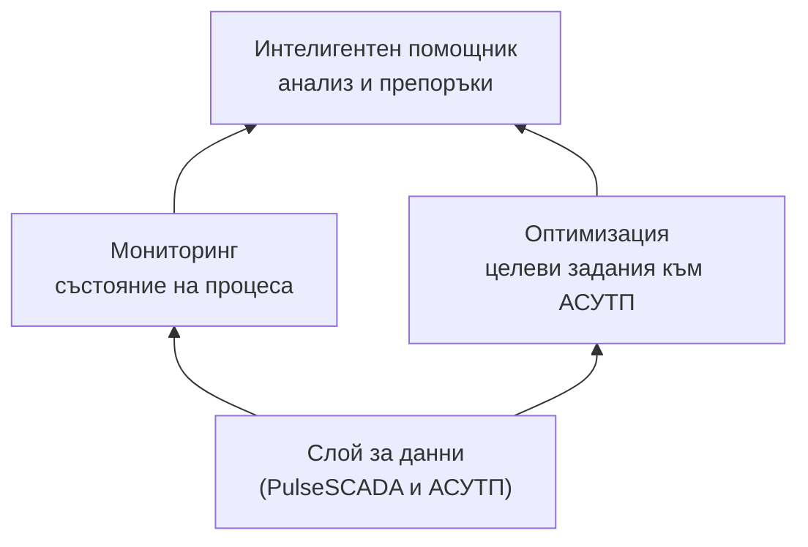

# Трите компонента на системата

## Архитектура на платформата

> **Предназначение на раздела:** да опише функционалната архитектура на платформата – ролята на всеки компонент и взаимодействието между тях.

Платформата се състои от **три интегрирани функционални компонента**, изградени върху общ слой за бази данни:

| Слой                   | Компонент                | Роля                                            |
| ---------------------- | ------------------------ | ----------------------------------------------- |
| **3. Приложен слой**   | Интелигентен помощник    | Анализ, обобщения и препоръки на естествен език |
| **2. Аналитичен слой** | Мониторинг · Оптимизация | Състояние на процеса · целеви задания към АСУТП |
| **1. Слой за данни**   | `PulseSCADA` и АСУТП     | Събиране и съхранение на производствените данни |

Потокът е отдолу нагоре: **данните** захранват **аналитичния слой** (мониторинг и оптимизация), а резултатите се поднасят чрез **интелигентния помощник**.

> АСУТП = автоматизирана система за управление на технологичния процес.

---

## 1. Компонент 1: Мониторинг и анализ

### Функция

Слоят за **наблюдаемост (observability)** на процеса. Агрегира данните от корпусите и ги визуализира в аналитични табла – в реално време и в исторически разрез.

### Какво ще развием

- Табла за **всеки корпус**, а не само за мелничното.
- **Ролево ориентирани изгледи** – ръководител, технолог, механик.
- Аларми и предупреждения при отклонения от режим (вкл. контролни карти SPC).
- Единна оперативна картина на цялата фабрика.

### Каква е ползата

Обективна и навременна видимост върху състоянието на процеса, вместо разпокъсани ръчни справки.

---

## 2. Компонент 2: Оптимизация на процесите (машинно обучение)

### Функция

Превръща наблюдението в действие: чрез модели за машинно обучение генерира **препоръки за целеви задания към АСУТП** – кои работни параметри осигуряват оптималния компромис между качество, производителност и специфичен разход.

### Принцип на работа

На базата на историческите данни се обучават **прогнозни модели**, които формализират зависимостите между работните параметри и резултатните показатели. На тяхна основа системата:

- Прогнозира резултата при дадени задания.
- Позволява симулация на сценарии преди реално прилагане (цифров двойник).
- Препоръчва оптималните целеви задания.

### Какво ще развием

- Модели за всеки корпус, а не само за смилането.
- Постепенен преход от **препоръка към оператора** (open-loop) към **автоматизирано управление по задания** (closed-loop) там, където е безопасно и валидирано.

### Каква е ползата

По-стабилен процес, по-високо извличане и производителност, по-нисък специфичен разход – без рискови експерименти върху реалния процес.

---

## 3. Компонент 3: Интелигентен помощник (изкуствен интелект)

### Функция

Естественоезиков интерфейс към данните и анализите. Обработва заявки на български език и автоматично генерира аналитични отчети.

### Възможности

- Отговаря на заявки като _„Защо спадна производителността през нощната смяна?“_ или _„Сравни текущата седмица с предходната.“_
- Генерира **автоматизирани сменни отчети** за минути вместо часове.
- Поднася информацията **според ролята** – резюме за ръководителя, детайлен анализ за технолога.

### Какво ще развием

- Разширяване към всички корпуси.
- По-задълбочено отчитане на спецификите на производството (доменни знания).
- Интеграция с другите два компонента – помощникът интерпретира данните от мониторинга и обосновава препоръките на оптимизацията.

### Каква е ползата

Информацията става **достъпна за всяка роля** – без нужда от експертиза по анализ на данни, за да се получи ясен и обоснован отговор.

---

## 4. Слой за бази данни (общата основа)

### Защо е критичен

И трите компонента стъпват върху данните. Затова **изграждането на единния слой за бази данни е първата стъпка** в програмата.

### От какво се състои

Слоят обединява данни от разнородни източници – **бази данни MS SQL Server и PostgreSQL, Excel файлове, текстови файлове и др.** Данните се генерират както **автоматично** (от КИП и А и АСУТП), така и **ръчно** (от лабораторни измервания и анализи).

### Какво ще направим

- Консолидация на данните от корпусите в **единно хранилище** с уеднаквен модел (върху `PulseSCADA` и интеграция с АСУТП).
- Осигуряване на **качество и надеждност** на данните (валидация, попълване на пропуски, отстраняване на погрешни и недостоверни стойности).
- Изграждане на **материален баланс и проследимост** по целия поток (виж раздел 04).

### Каква е ползата

Качествените и консолидирани данни са предпоставка за **точни анализи и надеждни препоръки**. Без тях нито един от останалите компоненти не може да работи коректно.

---

## 5. Как трите компонента се допълват (пример)

Сценарий – спад в качеството на концентрата:

1. **Мониторингът** засича отклонението и генерира аларма.
2. **Оптимизацията** изчислява коригиращите целеви задания за връщане на процеса в норма.
3. **Интелигентният помощник** интерпретира причината, обосновава препоръката и я документира в сменния отчет.

Резултатът: проблемът се адресира **бързо, обективно и проследимо**, а не чрез догадки.

---

## 6. Накратко

| Компонент             | Роля                                | Технологична същност             |
| --------------------- | ----------------------------------- | -------------------------------- |
| Мониторинг            | Състояние на процеса в реално време | Наблюдаемост и визуализация      |
| Оптимизация           | Целеви задания към АСУТП            | Прогнозни модели и симулация     |
| Интелигентен помощник | Анализ и автоматизирани отчети      | Естественоезиков AI интерфейс    |
| Слой за бази данни    | Обща основа                         | Консолидация и материален баланс |

> Подробните технически детайли (бази данни, модели, инфраструктура) са изнесени в приложенията, за да не натоварват основния текст.
