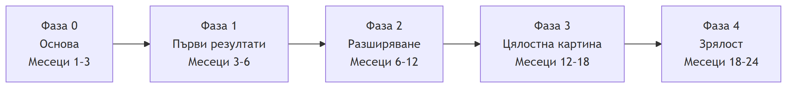

# План за изпълнение

## Как ще го изпълним стъпка по стъпка (24 месеца)

> **Цел на този раздел:** да покажем ясен план за изпълнение – какво правим, кога и какъв резултат очакваме. Подходът е първите ползи да дойдат бързо, а след това постепенно да обхванем цялата фабрика.

---

## 1. Водещи принципи на изпълнението

- **Бързи първи резултати.** Осезаема полза още в първите месеци (quick wins).
- **Итеративен подход.** Всеки етап стъпва върху предишния и добавя нов корпус или нова функционалност.
- **Интеграция от самото начало.** Корпусите се свързват постепенно, за да се вижда материалният поток като цяло още в ранните фази.
- **Без риск за производството.** Начало с мониторинг и препоръки (open-loop); автоматизирано управление (closed-loop) – само след валидация.

---

## 2. Етапите накратко

| Фаза       | Етап             | Период       |
| ---------- | ---------------- | ------------ |
| **Фаза 0** | Основа           | Месеци 1–3   |
| **Фаза 1** | Първи резултати  | Месеци 3–6   |
| **Фаза 2** | Разширяване      | Месеци 6–12  |
| **Фаза 3** | Цялостна картина | Месеци 12–18 |
| **Фаза 4** | Зрялост          | Месеци 18–24 |

---

## 3. Фаза 0 – Основа (Месеци 1–3)

### Какво правим

- Консолидираме данните от корпусите в единно хранилище с уеднаквен модел (върху `PulseSCADA`).
- Осигуряваме достъп до езиковия модел (Claude Opus) и работната станция за машинно обучение.
- Установяваме изходните стойности на ключовите показатели за ефективност (KPI – Key Performance Indicators; изходно ниво / baseline) за последващо измерване на напредъка.

### Резултат в края на фазата

Готов слой за бази данни и инструментариум, върху които стъпва цялата програма.

---

## 4. Фаза 1 – Първи резултати (Месеци 3–6)

### Какво правим

- Завършваме напълно мелничното отделение (всички агрегати и режими).
- Пускаме автоматизираните аналитични отчети за всички роли.
- Изграждаме първите междукорпусни връзки: трошене → мелнично и мелнично → флотация.

### Резултат в края на фазата

Първи осезаеми ползи – по-стабилно мелнично отделение и работещи автоматизирани отчети.

---

## 5. Фаза 2 – Разширяване (Месеци 6–12)

### Какво правим

- Добавяме **флотацията** (с най-пряк ефект върху технологичното извличане).
- Добавяме **едрото и ситното трошене** (с голямо значение за производителността).
- Изграждаме първия материален баланс по основната технологична линия.

### Резултат в края на фазата

Покрити са ключовите корпуси; видима е зависимостта между финост на смилане и извличане.

---

## 6. Фаза 3 – Цялостна картина (Месеци 12–18)

### Какво правим

- Добавяме **пресовото отделение** и **хвостохранилището**.
- Завършваме материалния баланс по целия поток – от рудата до концентрата и хвоста.
- Въвеждаме препоръки за оператора и анализ на специфичните разходи (енергия и реагенти) по цялата верига.

### Резултат в края на фазата

Цялата фабрика е обхваната като единна система; решенията се оптимизират по общия резултат.

---

## 7. Фаза 4 – Зрялост (Месеци 18–24)

### Какво правим

- Въвеждаме предиктивна поддръжка по състояние в цялата фабрика.
- Установяваме единни KPI на ниво предприятие.
- Въвеждаме автоматизирано управление по задания (closed-loop) там, където е валидирано и безопасно.

### Резултат в края на фазата

Зряла, проактивна система, обхващаща цялата фабрика и работеща в полза на трите цели – извличане, производителност и специфични разходи.

---

## 8. Обобщена таблица

| Фаза                | Период       | Главен фокус                              | Видим резултат                |
| ------------------- | ------------ | ----------------------------------------- | ----------------------------- |
| 0. Основа           | Месеци 1–3   | Слой за бази данни, AI и инструментариум  | Готова основа                 |
| 1. Първи резултати  | Месеци 3–6   | Завършено мелнично + отчети               | Първи ползи                   |
| 2. Разширяване      | Месеци 6–12  | Флотация + трошене                        | Покрити ключови корпуси       |
| 3. Цялостна картина | Месеци 12–18 | Преса, хвостохранилище, материален баланс | Фабриката като единна система |
| 4. Зрялост          | Месеци 18–24 | Предиктивна поддръжка + closed-loop       | Проактивна система            |

---

## 9. Как ще следим напредъка

- На края на всяка фаза правим **кратък преглед** с ръководството: какво постигнахме спрямо целите.
- При нужда **коригираме приоритетите** според реалните резултати и данни.
- Подробните показатели за измерване (KPI) са в раздела „KPI, рискове и управление“.
