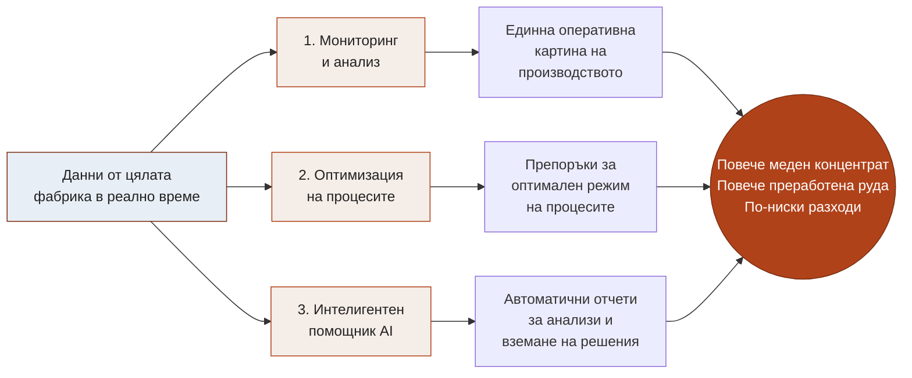
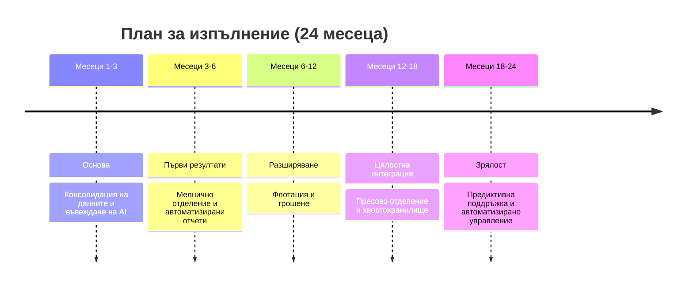

# Производствени информационни системи с изкуствен интелект

## Резюме

Изкуственият интелект вече променя начина, по който работят водещите производствени предприятия по света. „Елаците-МЕД“ има възможността да го постави в основата на своето производство – за по-високо извличане, по-висока производителност и по-ниски разходи. Следващите страници представят накратко **защо** инвестираме в тази посока, **каква стойност** носи тя на предприятието и **как** ще я постигнем стъпка по стъпка.

---

## Визия

Предлагаме развитие на **единна интелигентна платформа, която наблюдава цялата технологична верига в реално време** – от приемането на рудата до хвостохранилището. Тя ще подпомага по-бързи и по-обосновани решения с ясна цел: **повече извлечена мед, повече преработена руда и по-ниски разходи**.

През **2025 г. ръководството на „Елаците-МЕД“ вече пое инициативата** за вътрешна разработка на интегрираната управленска система **„Profimine“** – платформа за визуализация в реално време на ключовите производствени показатели (KPI) от всички етапи на обогатяването. През **2026 г. започва нейното естествено надграждане** с модули, базирани на изкуствен интелект, и изграждане на дигитални близнаци с машинно обучение за оптимизация на процесите. Настоящото предложение продължава и ускорява именно този вече поет курс.

---

## Накъде вървим

Фабриката вече разполага с ценен актив – обширна измервателна инфраструктура, централизирана база данни и вътрешно разработваната платформа „Profimine“. Пред нас стои възможността да **оползотворим този потенциал докрай** и да превърнем данните в ежедневно конкурентно предимство.

Днес част от стойността на тези данни все още остава неизползвана:

- **Голяма част от анализа е ръчен.** Информацията се събира и обработва на ръка, което отнема време, което би могло да отиде за същинска технологична работа.
- **Картината невинаги е единна.** Без обща обективна основа различните екипи и смени понякога преценяват ситуацията по различен начин.
- **Реакцията може да бъде по-бърза.** Голяма част от събитията се анализират след настъпването им, вместо да бъдат предвидени.

С интегрирането на изкуствения интелект в производствените и бизнес процесите „Елаците-МЕД“ прави решителна крачка към **проактивно, предвидимо и оптимизирано производство** – фабрика, която не просто реагира, а предвижда; която стабилизира режимите си автоматично и непрекъснато се самоусъвършенства. Технологиите за изкуствен интелект днес са **зрели, достъпни и икономически изгодни**, а водещите минно-обогатителни предприятия в света вече ги внедряват. Влагайки сега, предприятието затвърждава ролята си на технологичен лидер в бранша.

---

## Какво предлагаме

Платформа с **три интегрирани компонента**, които заедно превръщат данните в стойност:

- **1. Мониторинг и анализ.** Единна картина на цялата фабрика – ясни табла с показателите, важни за всеки корпус и за предприятието като цяло.
- **2. Оптимизация на процесите.** Системата не само наблюдава, но и **препоръчва оптимални настройки** – например режим на смилане, който осигурява желаната финост при максимална производителност и минимален разход на енергия.
- **3. Интелигентен помощник (AI).** Отговаря на въпроси на естествен език (напр. „Защо спадна качеството през нощната смяна?“) и **автоматично изготвя аналитични отчети на български**. Помощникът не само описва какво се е случило, а **открива причините** и предлага **конкретни действия** на технолози, мениджъри и поддръжка. Така отговорът идва за минути вместо за часове.

Платформата ще обхване **целия технологичен поток** – трошене, мелнично отделение, флотация, пресово отделение и хвостохранилище.

---

## Ползи за предприятието

Стойността е конкретна и измерима и действа едновременно по три направления:

| Направление            | Какво се променя                                                  | Влияние върху приходите                                                            |
| ---------------------- | ----------------------------------------------------------------- | ---------------------------------------------------------------------------------- |
| **Извличане на мед**   | По-стабилен и по-добре настроен процес                            | Дори малък ръст в извличането дава осезаем приход заради големите обеми преработка |
| **Производителност**   | По-малко непланирани спирания, по-добра координация               | Повече продукция със същото оборудване                                             |
| **Специфични разходи** | По-икономично използване на енергия, смилащи тела, реагенти и др. | По-ниска себестойност на всеки тон руда                                            |

Допълнително:

- **По-малко аварии** благодарение на ранно предупреждение преди настъпване на повредата.
- **По-бързи и уверени управленски решения** на базата на обща, обективна картина.
- **Натрупано знание.** Експертният опит се кодифицира в системата и остава в предприятието независимо от текучеството на кадри.

---

## План за изпълнение

Изпълнението е разделено на стъпки, така че **първите резултати идват бързо**, а обхватът се разширява постепенно. Така инвестицията се възвръща поетапно, а не наведнъж.

Подходът е **поетапен и нискорисков**: всяка фаза носи самостоятелна стойност и не зависи от завършването на следващите.

---

## Инвестиция в AI

Инвестицията е **скромна спрямо мащаба на фабриката** и се състои основно от два елемента:

- **Достъп до водещ езиков модел (Claude Opus)** – „мозъкът“ на интелигентния помощник, който осигурява качествените анализи и отчетите на български език. Заплаща се **според реалното потребление** (модел „плащаш каквото ползваш“), без голям еднократен разход – ориентировъчно **около 250 USD на месец** в началния период, с плавно нарастване според натоварването.
- **Работна станция за разработка на модели** – еднократен разход (ориентировъчно €4 200–4 800), на която екипът обучава и подобрява собствените прогнозни модели бързо и независимо.

При нужда – доизграждане на измервателна техника в корпусите, които още не са напълно покрити.

Капиталовият разход е пренебрежим спрямо потенциалния ефект върху извличането, производителността и разходите на цялата фабрика.

---

_Изготвил: / Светослав Любенов /_
