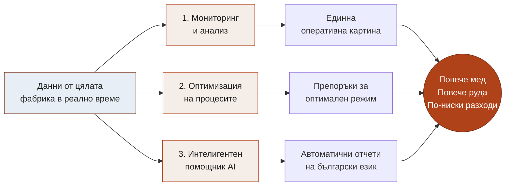
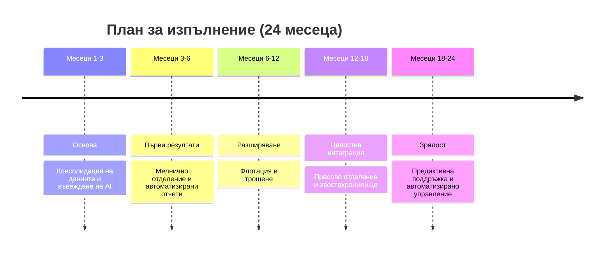

# Защо инвестираме в изкуствен интелект

## Резюме за собствениците на „Елаците-МЕД“ АД

> **За кого е този документ:** за собствениците и инвеститорите в „Елаците-МЕД“ АД.
> **Цел:** да обясним накратко и на ясен език **защо** предлагаме инвестиция в изкуствен интелект (AI), **каква стойност** носи тя на предприятието и **как** ще я постигнем. Подробната техническа стратегия е описана в съпътстващите раздели.

---

## 1. Същината в едно изречение

Предлагаме изграждане на **единна интелигентна платформа, която наблюдава цялата технологична верига в реално време** – от приемането на рудата до хвостохранилището – и подпомага по-бързи и по-обосновани решения с ясна цел: **повече извлечена мед, повече преработена руда и по-ниски разходи**.

---

## 2. Защо точно сега

Фабриката вече разполага с ценен актив – обширна измервателна инфраструктура и централизирана база данни. Проблемът е, че **тези данни не се оползотворяват пълноценно**:

- **Реагираме късно.** Проблемите често се откриват _след_ настъпването им – след аварийно спиране, влошено качество или преразход на енергия и реагенти.
- **Решенията се различават от смяна на смяна.** Без единна обективна картина различните екипи преценяват ситуацията различно.
- **Информацията е разпръсната.** Анализите са бавни и трудоемки.

**Цената на това всеки ден** е пропуснат добив на мед, излишни престои и по-висока себестойност на тон руда.

Технологиите за изкуствен интелект днес са **зрели, достъпни и икономически изгодни**. Конкурентните минно-обогатителни предприятия в света вече ги внедряват. Влагайки сега, „Елаците-МЕД“ изпреварва, а не догонва.

---

## 3. Какво предлагаме

Платформа с **три интегрирани компонента**, които заедно превръщат данните в стойност:

- **1. Мониторинг и анализ.** Единна картина на цялата фабрика – ясни табла с показателите, важни за всеки корпус и за предприятието като цяло.
- **2. Оптимизация на процесите.** Системата не само наблюдава, но и **препоръчва оптимални настройки** – например режим на смилане, който осигурява желаната финост при максимална производителност и минимален разход на енергия.
- **3. Интелигентен помощник (AI).** Помощник, който **автоматично изготвя аналитични отчети на български** и отговаря на въпроси на естествен език, напр. „Защо спадна качеството през нощната смяна?“. Отговор за минути вместо за часове.

Платформата ще обхване **целия технологичен поток** – трошене, мелнично отделение, флотация, пресово отделение и хвостохранилище.

---

## 4. Какво печели предприятието

Стойността е конкретна и измерима и действа едновременно по три направления:

| Направление            | Какво се променя                                    | Защо има значение за приходите                                                     |
| ---------------------- | --------------------------------------------------- | ---------------------------------------------------------------------------------- |
| **Извличане на мед**   | По-стабилен и по-добре настроен процес              | Дори малък ръст в извличането дава осезаем приход заради големите обеми преработка |
| **Производителност**   | По-малко непланирани спирания, по-добра координация | Повече продукция със същото оборудване                                             |
| **Специфични разходи** | По-икономично използване на енергия и реагенти      | По-ниска себестойност на всеки тон руда                                            |

Допълнително:

- **По-малко аварии** благодарение на ранно предупреждение преди настъпване на повредата.
- **По-бързи и уверени управленски решения** на базата на обща, обективна картина.
- **Запазено знание.** Експертният опит се кодифицира в системата и остава в предприятието независимо от текучеството на кадри.

---

## 5. Как ще го постигнем

Изпълнението е разделено на стъпки, така че **първите резултати идват бързо**, а обхватът се разширява постепенно. Така инвестицията се възвръща поетапно, а не наведнъж.

Подходът е **поетапен и нискорисков**: всяка фаза носи самостоятелна стойност и не зависи от завършването на следващите.

---

## 6. Какво искаме да инвестираме (накратко)

Инвестицията е **скромна спрямо мащаба на фабриката** и се състои основно от два елемента:

- **Достъп до водещ езиков модел (Claude Opus)** – „мозъкът“ на интелигентния помощник, който осигурява качествените анализи и отчетите на български език. Заплаща се **според реалното потребление** (модел „плащаш каквото ползваш“), без голям еднократен разход – ориентировъчно **около 250 USD на месец** в началния период, с плавно нарастване според натоварването.
- **Работна станция за разработка на модели** – еднократен разход (ориентировъчно €4 200–4 800), на която екипът обучава и подобрява собствените прогнозни модели бързо и независимо.

При нужда – доизграждане на измервателна техника в корпусите, които още не са напълно покрити.

> **Ключова мисъл:** капиталовият разход е **пренебрежим спрямо потенциалния ефект** върху извличането, производителността и разходите на цялата фабрика.

---

## 7. Какво е необходимо от собствениците

За да финализираме инвестиционната обосновка с конкретни числа и срок на възвръщаемост:

1. **Бюджетна рамка** за инвестиционната програма.
2. **Целеви стойности** – например с колко искаме да повишим извличането или да намалим престоите. На тяхна база изчисляваме точния срок на възвръщаемост (ROI).
3. **Потвърждение за старт** на двата основни елемента (езиков модел и работна станция), необходими още във фаза „Основа“.

---

_Изготвил: / Светослав Любенов /_
