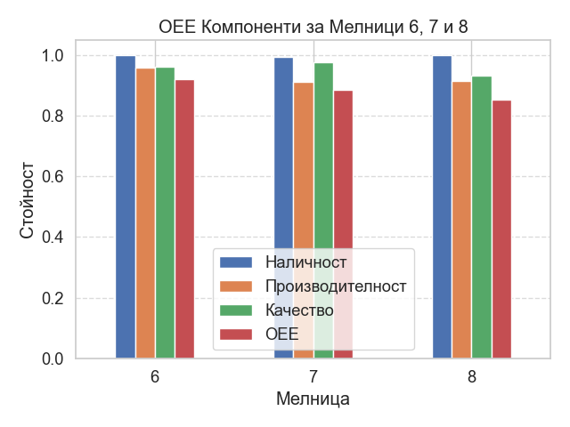
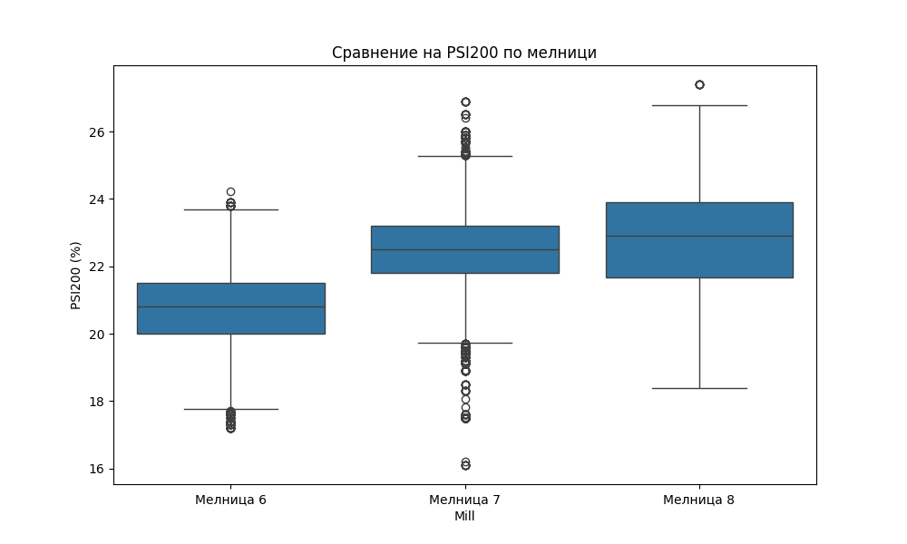
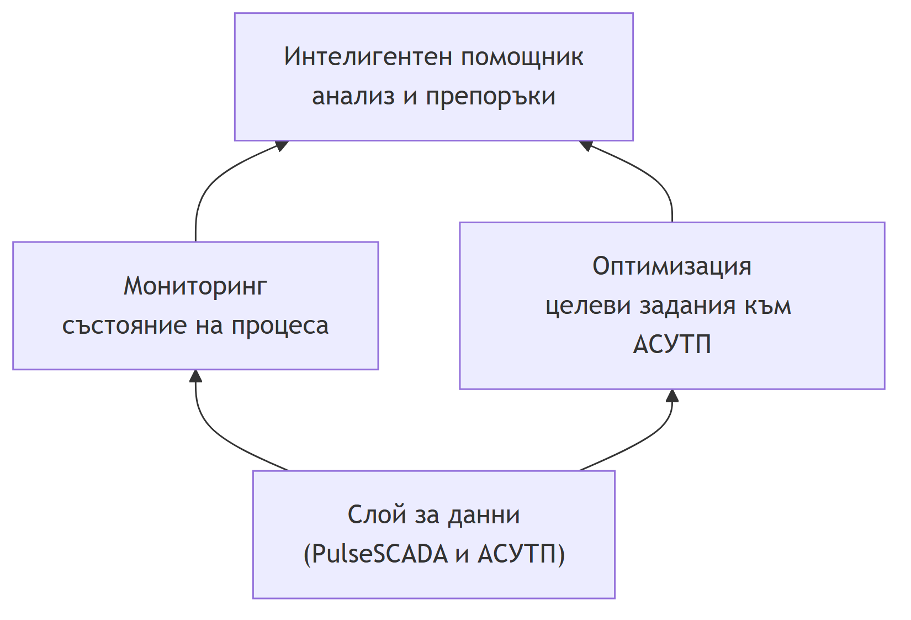
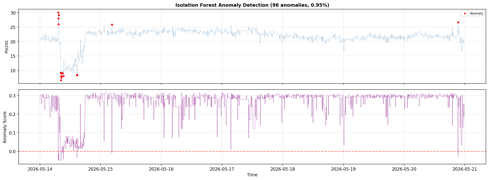

{width=8cm}

# Стратегия за развитие на интелигентна платформа с изкуствен интелект Profimine в обогатителната фабрика "Елаците-МЕД" АД {.unnumbered}

| Дата: | Изготвил: |
|:---|:---|
| 26-06-2026г. | / Светослав Любенов / |

```{=openxml}
<w:p><w:r><w:br w:type="page"/></w:r></w:p>
```

# Съдържание {.unnumbered}

1. Изпълнително резюме
2. Текущо състояние (As-Is)
3. Визия и цели (To-Be)
4. Покритие по цехове
5. Архитектура на компонентите
6. Ползи по роли
7. Инвестиционна програма
8. План за изпълнение
9. KPI, рискове и управление

```{=openxml}
<w:p><w:r><w:br w:type="page"/></w:r></w:p>
```


# Изпълнително резюме {#sec-01}

## Стратегия за развитие на интелигентната система за управление на Обогатителната фабрика

> **За кого е този документ:** за ръководството на предприятието.
> **Какво ще намерите тук:** накратко – какъв е проблемът днес, какво предлагаме, какво печели предприятието и какво искаме да инвестираме. Подробностите са в следващите раздели.

---

## Накратко (в едно изречение)

Предлагаме изграждане на **единна интелигентна платформа, обхващаща цялата технологична верига в реално време** – от приемането на рудата до хвостохранилището – която подпомага по-бързи и по-обосновани решения с цел по-високо извличане, по-висока производителност и по-ниски специфични разходи.

---

## Проблемът днес

Фабриката разполага с обширна КИП и А инфраструктура и централизирана база данни (`PulseSCADA`), но тези данни **не се оползотворяват пълноценно**:

- **Частичен обхват.** Платформата покрива предимно мелничното отделение. Едрото и ситното трошене, флотацията, пресовото отделение и хвостохранилището остават извън обхвата.
- **Реактивен, а не проактивен модел.** Проблемите често се регистрират след настъпването им – след аварийно спиране, влошено качество или преразход.
- **Решенията се различават от смяна на смяна.** При липса на единна, обективна картина различните смени и специалисти преценяват ситуацията по различен начин.
- **Фрагментирана информация.** Данните са разпръснати и хетерогенни по формат, което забавя анализа и отчетността.

**Цената на това:** пропуснат добив на мед, излишни престои, по-висок разход на енергия и реагенти и забавени решения.

---

## Какво предлагаме

Платформа с **три интегрирани компонента**:

- **1. Мониторинг и анализ.** Единна оперативна картина на цялата фабрика – аналитични табла с показателите, значими за всеки корпус и за предприятието като цяло.
- **2. Оптимизация на процесите.** Освен наблюдение, системата генерира **препоръки за целеви задания към АСУТП** (автоматизираната система за управление на технологичния процес) – например режим на смилане, който осигурява желаната финост при максимална производителност и оптимален енергиен разход.
- **3. Интелигентен помощник (изкуствен интелект).** Естественоезиков помощник, който **автоматично изготвя аналитични отчети на български** и отговаря на заявки на естествен език – напр. „Защо спадна качеството през нощната смяна?“. Така ръководители и технолози получават отговор за минути вместо за часове.

Платформата ще покрие **целия технологичен поток** – едро трошене, средно и ситно трошене, мелнично, флотация, пресово отделение и хвостохранилище – с проследимост на материалния поток между тях.

---

## Какво печели предприятието

- **Повече извлечена мед.** По-стабилно и по-добре настроено производство означава по-висок процент полезен метал от същата руда.
- **Повече преработена руда.** По-малко непланирани спирания и по-добра координация между корпусите.
- **По-ниски разходи.** По-икономично използване на енергия, реагенти и материали.
- **По-малко аварии.** Ранно предупреждение за назряващи проблеми позволява поддръжката да реагира преди да настъпи повредата.
- **По-бързи и по-уверени решения.** Ръководството и технолозите разполагат с обща, обективна и навременна картина.

---

## Какви хора подпомага системата

- **Ръководството** – единна картина на производството, качеството и разходите за решения в реално време.
- **Технолозите** – предиктивен анализ, симулация на сценарии („какво ако…“) и по-дълбоко разбиране на процеса.
- **Поддръжката** – ранни предупреждения за назряващи откази и предиктивно планиране на ремонтите.
- **Операторите** – конкретни препоръки за целеви задания в момента.

---

## Какво искаме да инвестираме

Два основни елемента (подробности и обосновка – в раздел „Инвестиционна програма“):

- **Достъп до водещ езиков модел (Claude Opus).** Изчислителното ядро на интелигентния помощник – осигурява качествени анализи и аналитични отчети на български език.
- **Работна станция за разработка на модели.** Необходима за обучение и валидиране на собствените прогнозни модели бързо и независимо. Точната спецификация ще бъде уточнена.

При необходимост – доизграждане на измервателна техника в корпусите, които още не са напълно покрити.

---

## Как ще го изпълним (за 24 месеца)

Развитието е разделено на стъпки, като **първите резултати идват бързо**, а след това разширяваме обхвата:

- **Месеци 1–3 – Основа.** Консолидация на данните, въвеждане на изкуствения интелект и осигуряване на техниката.
- **Месеци 3–6 – Първи резултати.** Завършване на мелничното отделение и пускане на автоматизираните отчети.
- **Месеци 6–12 – Разширяване.** Включване на флотацията и трошенето.
- **Месеци 12–18 – Цялостна интеграция.** Включване на пресовото отделение и хвостохранилището; интеграция на целия поток.
- **Месеци 18–24 – Зрялост.** Предиктивна поддръжка в цялата фабрика и автоматизирано управление по целеви задания.

---

## Следваща стъпка

За да завършим финансовата обосновка и да заложим конкретни цели, имаме нужда от:

- **Целеви числа** от ръководството (например с колко искаме да повишим извличането или да намалим спиранията).
- **Бюджетна рамка** за инвестицията.

След това представяме пълната стратегия с очаквана възвръщаемост на инвестицията.


# Текущо състояние (As-Is) {#sec-02}

## Откъде тръгваме днес

> **Цел на този раздел:** да опишем честно какво вече имаме изградено, какво работи добре и къде са празнините. Това е отправната точка, спрямо която ще измерваме напредъка.

---

## Какво вече сме изградили

Разработена е работеща платформа с **три функционални компонента**, която към момента обслужва предимно **мелничното отделение** (дванадесет топкови мелнични агрегата). Платформата стъпва върху данните от индустриалната система `PulseSCADA`.

### Мониторинг и анализ

- Табла (dashboards), които визуализират **в реално време** ключовите показатели на мелничното отделение.
- **Сравнителен анализ между агрегатите** (benchmarking) – идентификация на най-добре и най-слабо представящите се мелници.
- Статистически анализ – средни стойности, тенденции, вариация и отклонения.
- Отделен модул за **анализ на престоите** (честота и продължителност на спиранията).



_Пример: автоматичен анализ на OEE по мелници – наличност, производителност и качество._

### Оптимизация на смилането

- Изградени са **прогнозни модели**, които предвиждат фиността на смилане (фракциите +200 µm и −80 µm, измервани от PSI 300) при различни режими на работа.
- Наличен е **симулатор** за предварителна проверка на сценарии без риск за реалния процес.
- Системата генерира **препоръки за целеви задания**, осигуряващи желаната финост при максимална производителност.



_Пример: сравнителен анализ на фиността на смилане (PSI200) между отделните мелници._

### Интелигентен помощник за анализи и отчети

- Изграден е **помощник с изкуствен интелект**, който изготвя **аналитични отчети на български език**.
- Поддържа различни видове анализи – сменни обобщения, откриване на аномалии, прогнози и анализ на ефективността.
- Отчетите са **ролево ориентирани** – ръководител, технолог и механик получават различно ниво на детайлност според функциите си.

---

## С какви данни разполагаме

Това е едно от **най-силните ни конкурентни предимства**. Предприятието разполага с:

- **Централизирана база данни (`PulseSCADA`)**, в която се агрегират данните от локалните АСУТП по всеки производствен тракт.
- **КИП и А на практически всички възли** – разход на руда и вода, енергия, налягания, нива, плътности и др.
- **Гранулометричен контрол** на смилането чрез внедрената система **PSI 300 (Outotec)**, която измерва фракциите **+200 µm** и **−80 µm** за три от мелниците; предстои доставка и монтаж на още три броя за останалите мелници.
- **Онлайн анализ на пулпа** чрез **два броя рентгенофлуоресцентни анализатора Courier® 6X SL**, които измерват разнообразни показатели на пулпа (съдържание на мед, желязо и твърдо вещество), допълнен с лабораторни проби за веществения състав на рудата и концентрата.

Накратко: **разполагаме със значителен обем исторически и оперативни данни.** Предизвикателството е тяхната интеграция, качество и пълноценно аналитично оползотворяване.

---

## Къде са празнините

Въпреки доброто начало, системата все още има съществени ограничения:

### Покрита е само част от фабриката

Обхванато е предимно **мелничното отделение**, и то частично. **Извън обхвата остават:**

- **Едро трошене** (корпус за едро трошене).
- **Средно и ситно трошене** (въпреки наличната АСУТП, данните не се оползотворяват аналитично).
- **Флотацията** – корпусът с най-пряк ефект върху технологичното извличане.
- **Пресовото отделение** (обезводняване на концентрата).
- **Хвостохранилището**.

### Липсва интеграция на технологичния поток

Корпусите се разглеждат изолирано. Липсва **проследяване на материалния поток end-to-end** и единен материален баланс, поради което междукорпусните зависимости не са количествено видими.

### Данните не се оползотворяват пълноценно

Значителен дял от наличните данни все още **не са интегрирани и обработени** до ниво, носещо решения. Информацията е фрагментирана и хетерогенна по формат.

### Реактивен, а не проактивен модел на управление

При липса на пълно наблюдение и предиктивни модели значителна част от проблемите се регистрират **след настъпването им**, а не се предотвратяват.

---

## Кратко обобщение

| Област                  | Състояние днес                                      |
| ----------------------- | --------------------------------------------------- |
| Мелнично отделение      | Частично покрито – мониторинг, оптимизация и отчети |
| Едро трошене            | Не е обхванато                                      |
| Средно и ситно трошене  | Има АСУТП, но без аналитично оползотворяване        |
| Флотация                | Не е обхваната                                      |
| Пресово отделение       | Не е обхванато                                      |
| Хвостохранилище         | Не е обхванато                                      |
| Интеграция на корпусите | Липсва единен материален баланс                     |
| Данни                   | Значителен обем, но недостатъчно интегрирани        |
| Изкуствен интелект      | Работещ помощник, засега само за мелничното         |

**Извод:** налице е стабилна технологична основа и силно предимство в данните. Следващата стъпка е **разширяване на обхвата към цялата фабрика** и **интеграция на корпусите в единен технологичен поток** – предмет на следващия раздел.


# Визия и цели (To-Be) {#sec-03}

## Накъде искаме да стигнем

> **Цел на този раздел:** да опишем ясно каква искаме да бъде системата след две години и какви конкретни резултати очакваме от нея.

---

## Визията накратко

Целта е изграждане на **единна интелигентна платформа, обхващаща цялата технологична верига** – от приемането на рудата до хвостохранилището – която подпомага **проактивното управление** на производството: предвиждане и превантивна настройка на процеса, вместо реакция пост фактум.

Архитектурно това се реализира като **цифров двойник (digital twin) на фабриката** – постоянно актуализиращ се цифров модел на технологичния процес, който позволява мониторинг, симулация на сценарии и предиктивен анализ без риск за реалното производство.

---

## Трите стълба на визията

### Единна оперативна картина

Целият технологичен процес – от приемането на рудата до хвостохранилището – се наблюдава в реално време от едно общо място. Всяка роля вижда именно тази част от информацията, която е важна за нея, но всички стъпват върху **една и съща достоверна картина на процеса**.

### Проактивно управление и предиктивна поддръжка

Системата генерира **ранни предупреждения** – за назряващ отказ на оборудване, влошаване на качеството или преразход. **Предиктивната поддръжка по състояние** превръща непланираните аварийни спирания в планирани интервенции – пряк ефект върху коефициента на техническо използване и производителността.

### Решения, подкрепени с данни и изкуствен интелект

Към експертния опит се добавя **обективен количествен анализ и препоръки за целеви задания към АСУТП** (автоматизирана система за управление на технологичния процес). Интелигентните анализи водят до по-добър избор на работни режими и по-дълбоко разбиране на процеса; експертният опит остава ценен, но вече подкрепен с факти и изчисления.

---

## Какво ще се промени на практика

| Днес                                      | След въвеждане на системата                     |
| ----------------------------------------- | ----------------------------------------------- |
| Видимост само върху мелничното отделение  | Цялата фабрика като единна система              |
| Реактивна намеса след инцидент            | Предиктивно предотвратяване на проблеми         |
| Решенията се различават от смяна на смяна | Единни, обективни критерии за управление        |
| Ръчно, бавно изготвяне на отчети          | Автоматизирани аналитични отчети за минути      |
| Неоползотворени данни                     | Данните се превръщат в решения и целеви задания |
| Локално управление по корпуси             | Съгласувано управление по материален баланс     |

---

## Главните ни цели

Стратегията преследва **три равностойни цели** едновременно:

### Повишаване на технологичното извличане

По-висок **дял извлечена мед (%)** от същата руда – чрез по-стабилна финост на смилане и оптимизиран реагентен режим във флотацията.

### По-висока производителност

Повече **преработена руда (t/h)** при намалени непланирани престои и по-висок коефициент на техническо използване, осигурени от предиктивната поддръжка и съгласуваността между корпусите.

### По-ниски специфични разходи

По-нисък **специфичен разход на енергия (kWh/t), реагенти (g/t) и смилащи тела – стоманени топки (kg/t)** за всеки тон преработена руда, без компромис с качеството.

> Тези три цели са взаимосвързани и често конкуриращи (по-финото смилане може да повиши извличането, но увеличава специфичния енергиен разход). Стойността на системата е в намирането на **оптималния компромис** между тях на ниво цяла фабрика.

---

## Как ще измерваме успеха

За всяка цел ще зададем **измерими показатели** и ще проследяваме напредъка спрямо изходно ниво. Примери:

- **Извличане:** технологично извличане на мед (%) и съдържание на мед в концентрата в склада.
- **Производителност:** преработена руда (t/h) и коефициент на техническо използване (работно време спрямо престои).
- **Разходи:** специфичен разход на енергия (kWh/t), реагенти (g/t) и смилащи тела (kg/t).
- **Надеждност:** честота и продължителност на непланираните престои (MTBF – средно време между откази; MTTR – средно време за възстановяване).
- **Обща ефективност на оборудването (OEE – Overall Equipment Effectiveness):** обобщаващ показател, който събира в едно число три съставки – **готовност** (колко от планираното време оборудването реално работи), **производителност** (колко близо до проектния капацитет работи) и **качество** (какъв дял от продукцията отговаря на изискванията). OEE дава на ръководството и технолозите една ясна, сравнима мярка къде точно се губи производствен потенциал – от престои, от забавен ход или от некачествена продукция.
- **Скорост на решенията:** време от възникване на въпрос до получаване на анализ/отчет.

> Конкретните целеви стойности ще определим заедно с ръководството (виж раздел „Отворени въпроси“ в плана). Подробната рамка за измерване е в раздела **„KPI, рискове и управление“**.

---

## Какъв е срокът

Визията е разчетена за **24 месеца**, на стъпки – с първи осезаеми резултати още в първите месеци и постепенно разширяване към цялата фабрика. Подробният план за изпълнение е в раздела **„План за изпълнение“**.

---

## Защо точно сега

- **Данните вече са налични** в `PulseSCADA` – остава тяхното аналитично оползотворяване.
- **Технологичната основа е изградена** – платформата вече работи в мелничното отделение.
- **Технологиите за изкуствен интелект са зрели** – надеждни и приложими в производствена среда.

Отлагането означава пропуснат добив и по-високи оперативни разходи от необходимото.


# Покритие по цехове {#sec-04}

## Ядрото на стратегията – технологичен обхват и измерими ефекти по корпуси

> **Предназначение на раздела:** за всеки технологичен корпус да се дефинират решаваните производствени проблеми, конкретните аналитични и оптимизационни решения и количествено измеримите ефекти върху ключовите производствени показатели (KPI).

За всеки корпус се прилага единна аналитична рамка:

- **Технологична роля** – принос към общия материален и метален баланс на фабриката.
- **Основно оборудване и агрегати** – машините и съоръженията, които формират процеса.
- **КИП и А и източници на данни** – контролно-измервателна апаратура и автоматика, налична в `PulseSCADA`.
- **Текущи ограничения** – експлоатационни дефицити и неоползотворени резерви.
- **Решение на системата** – мониторинг, оптимизация (задания към АСУТП) и интелигентни анализи.
- **Измерим ефект и KPI** – целеви показатели и конкретен механизъм на подобрение.
- **Ефект за поддръжката и експлоатацията** – принос към надеждността и проактивната поддръжка.

> **Принципно положение:** максималната стойност не се генерира на ниво отделен корпус, а от **интеграцията на целия технологичен поток в единен материален баланс** (виж „Свързване на цеховете в обща картина“ по-долу). Поради това обхватът се разширява end-to-end по цялата верига, а не изолирано в един участък.

---

## Технологичният поток накратко


| №   | Корпус                 | Вход                  | Изход                                      |
| --- | ---------------------- | --------------------- | ------------------------------------------ |
| 1   | Едро трошене           | Руда                  | Едро натрошена руда                        |
| 2   | Средно и ситно трошене | Едро натрошена руда   | Ситно натрошена руда                       |
| 3   | Мелнично               | Ситно натрошена руда  | Смляна пулпа                               |
| 4   | Флотация               | Смляна пулпа          | Концентрат (+ отпадък към хвостохранилище) |
| 5   | Пресово отделение      | Концентрат            | Готов концентрат за реализация             |
| 6   | Хвостохранилище        | Отпадък от флотацията | Съхранен отпадък, върнат водооборот        |

Всеки корпус приема продукта на предходния, поради което всяко технологично решение се разпространява надолу по веригата с натрупващ се ефект. Стратегията прави тези междукорпусни зависимости видими и количествено измерими.

---

## Едро трошене (Корпуси за едро трошене – КЕТ1 и КЕТ3)

### Технологична роля

Първият стадий на едринното намаляване – рудничната маса от кариера се редуцира до по-дребен клас, подходящ за последващото смилане. Преработката се разпределя между **два корпуса – КЕТ1 и КЕТ3**. Производителността им задава такта на цялата преработвателна верига и формира първия възел от материалния баланс.

### Основно оборудване и агрегати

В **КЕТ1** работят конусно-гираторна трошачка (`ККД`) и конусни редукционни трошачки (`КРД1`, `КРД2`) за вторично дробене. **КЕТ3** разполага с два паралелни трошачни клона, обединявани в обща изнасяща лента:

- **Приемни бункери за руда** – захранвани от самосвали, управлявани от оператор от климатизирана кабина.
- **Първи трошачен клон:** пластинчат захранвач → насочващ улей с пресевна скара → челюстно-конусен трошачен агрегат → изнасяща лента.
- **Втори трошачен клон:** директно захранване от самосвалите чрез вибрационни захранвачи → конусен трошачен агрегат → изнасяща лента.
- **Претоварен възел** – обединява двата клона в обща главна изнасяща лента.
- **Лентови везни** на изнасящите ленти – свързани с честотното управление на захранвачите за регулиране на производителността.
- **Металоуловители** на изнасящите ленти преди претоварване на главната лента.
- **Хидравлични чукове** за разбиване на негабарит; **мостов кран** за обслужване на трошачките.
- **Система за прахоподтискане**.
- **Камера за зърнометричен анализ** на изнасящата лента на втория клон.
- **SCADA** на операторски станции за управление, контрол и мониторинг.

### КИП и А и източници на данни (SCADA / `PulseSCADA`)

- **Производителност на системата** – чрез лентови везни и честотно управление на захранвачите.
- **Състояние на трошачните агрегати** – температура и дебит на смазващото масло, ниво в маслената станция, налягане във филтрите, височина на подвижния конус (разтоварен отвор), работна мощност и обороти на вала.
- **Едрина на изходния материал** – визуален контрол и камера за зърнометричен анализ.

### Текущи ограничения

- Корпусите **не са включени** в аналитичната и оптимизационна платформа, въпреки че данните се визуализират в `PulseSCADA`.
- Износването на броните и натоварването се оценяват предимно локално, без исторически анализ на тенденциите.
- Неравномерното подаване поражда колебания в товара на следващите стадии и влошава стабилността на мелничното отделение.

### Решение на системата

- **Мониторинг:** непрекъснат контрол на натоварването на трошачните агрегати, производителността и простоите в реално време, с контролни карти (SPC – статистически контрол на процеса).
- **Оптимизация:** препоръки за стабилизиране на подаването и за оптимална настройка на **разтоварния отвор на трошачката** (разстоянието между трошащите повърхности, което определя едрината на трошения продукт) спрямо типа руда, водещи до по-нисък специфичен разход на енергия.
- **Интелигентни анализи:** ранно разпознаване на аномално натоварване и нарастващо износване на броните; автоматизирани сменни отчети с причинно-следствен анализ на простоите – кое събитие колко време е отнело и защо, с открояване на повтарящи се причини за загуба на производителност и препоръки за ограничаването им.

### Измерим ефект и KPI

- **Производителност (t/h)** и **коефициент на техническо използване** – чрез стабилизирано подаване и намалени престои.
- **Специфичен разход на енергия (kWh/t)** – чрез оптимално натоварване и настройка на разтоварния отвор на трошачките.
- **Стабилност на едрината на трошения продукт** – по-ниската вариация осигурява стабилен товар надолу по веригата.

### Ефект за поддръжката и експлоатацията

- **Технолози:** обективна картина кога и защо подаването отклонява от режима.
- **Поддръжка:** проактивно планиране на смяната на брони по реално износване, а не по фиксиран график – намаляване на аварийните престои.

---

## Средно и ситно трошене (Корпус средно и ситно трошене – ССТ)

### Технологична роля

Доредуцира едротрошения продукт до подходящ за смилане клас и го подава към мелничното отделение. Гранулометричният състав на изхода от ССТ е **пряк детерминант на производителността и специфичния енергиен разход на мелничното отделение**.

### Основно оборудване и агрегати

- **Открит склад №2** – буферен склад между едрото трошене и ССТ, захранващ средното трошене чрез питатели.
- **Поточно-транспортна система от гумено-лентови транспортьори (ГТЛ), организирани в технологични потоци:**
  - **Средно трошене:** ГТЛ → вибрационни сита (предварително пресяване) → конусни трошачни агрегати → контролно пресяване с вибрационни сита.
  - **Ситно трошене:** регулируеми лентови питатели → конусни трошачни агрегати → контролно пресяване с вибрационни сита.
  - **15-ти и 16-ти поток:** реверсивни подвижни ГТЛ – транспортират надситовия материал от средното към склада за ситно трошене.
- **Събирателни ленти** – събират подситовия материал от средното и от ситното трошене.
- **Претоварна лента** – пренася надситовия материал за допълнително трошене.
- **Транспортни ленти към склад „Междинни бункери" (МБ)** – пренасят обединения материал и го разпределят равномерно в склада.
- **Склад „Междинни бункери"** – захранва мелничните агрегати.
- **Мостови кранове** – за обслужване на трошачните инсталации.
- **Командна зала** – управление и мониторинг на технологичния процес от оператори КИП и А.
- **Аспирационна система** за обезпрашаване.
- **Помпена станция за свежа вода**.
- ССТ разполага с **АСУТП за управление, мониторинг и контрол на конусните трошачни агрегати** – основа за приемане на оптимизационни задания.

### КИП и А и източници на данни (налични в `PulseSCADA`)

- **Баланс по руда:** `Вход ССТ`, `Изход ССТ` и **циркулационен товар** (t/h), измервани с електронни лентови везни.
- **По поток/трошачка:** мощност, налягане и температура на маслото, разтоварен отвор и обороти на вала.
- **Металдетектори** на входните ленти.
- **Лентови питатели с честотни преобразуватели (инвертори)** – регулиране на подаваното количество руда към средното трошене.
- **Сензори за вибрации** на вибрационните сита.
- **Сензори за ниво** на приемните бункери, открития склад, МБ склада и захранващите мелнични бункери.
- **Товар и скорост на транспортните ленти**, с аварийни крайни изключватели и аварийни стопове.
- **Гранулометричен състав на изхода** на ССТ.

### Текущи ограничения

- Данните от АСУТП и балансът по руда **не се използват аналитично** за междукорпусна оптимизация.
- Разпределението на товара между потоците и циркулиращият товар се балансират предимно операторно.
- Количествената връзка „гранулометрия → производителност на мелниците“ не е формализирана.

### Решение на системата

- **Мониторинг:** гранулометричен състав, циркулиращ товар, натоварване по потоци и нива на складовете/бункерите в реално време.
- **Оптимизация:** задания към АСУТП за поддържане на стабилна едрина на изхода при оптимален циркулиращ товар и равномерно натоварване на потоците.
- **Интелигентни анализи:** количествен анализ на връзката „едрина от трошене → производителност на мелниците“ с препоръки за целеви задания.

### Измерим ефект и KPI

- **Стабилност на едрината към мелничното** – по-ниска вариация повишава производителността на мелниците.
- **Производителност (t/h)** и **специфичен разход на енергия** на цикъла трошене – смилане.

### Ефект за поддръжката и експлоатацията

- **Технолози:** обективна основа как настройките влияят на цялата верига надолу.
- **Поддръжка:** планиране на ремонтите по реалното натоварване на трошачките и ситата.

---

## Мелнично отделение (доизграждане)

### Технологична роля

Осъществява мокрото смилане и класификация, при които се постига **разкриване (либерация) на медните минерали** – определящо условие за ефективна флотация. Това е най-енергоемкият процес във фабриката и единственият корпус с вече изградена оптимизационна функционалност.

### Основно оборудване и агрегати

Схемата на смилане е **едностадиална, с класификация в хидроциклон в затворен цикъл**.

- **Топкови мелници:** дванадесет основни агрегата.
- **Мелница за досмилане** – захранвана с пясъци от хидроциклоните, повишаваща производителността.
- **Класификация:** центробежни пясъчни помпи (с инвертори за плавно водене) и хидроциклони.
- **Пресевни бутари** – предпазват центробежните помпи; надситовият продукт (руден скрап) се извежда и се депонира.
- **Система PSI 300 (Outotec)** за непрекъснато проследяване на едрината на частиците (фракциите +200 µm и −80 µm) – монтирана на три от мелниците, с предстоящо разширяване към останалите.

### КИП и А и източници на данни (вече налични)

- Разход на руда и вода, мощност/ток на двигателите, налягания на хидроциклоните и плътност на пулпа.
- **Финост на смилане** – ключовият качествен показател, измерван от PSI 300 чрез фракциите +200 µm и −80 µm.
- Нива, режими и циркулиращ товар на всичките дванадесет агрегата.
- **Енергийни критерии**, заложени в АСУ на цеха (автоматизираната система за управление): мощност и ток на мелницата, дял твърдо в слива на хидроциклоните и отчитане на специфичния разход на енергия (kWh/t преработена руда).

### Текущи ограничения

- Покритието е **частично** – не всички агрегати и режими са обхванати равностойно от моделите.
- Компромисът „финост ↔ производителност ↔ специфичен енергиен разход“ се балансира предимно операторно.

### Решение на системата

- **Мониторинг:** пълно покритие на всичките дванадесет мелнични агрегата и режими в единно табло със сравнителен анализ между агрегатите.
- **Оптимизация:** разработените прогнозни модели дават препоръки и целеви задания за оптимална финост при максимална производителност и контролиран енергиен разход; наличен симулатор за предварителна проверка на сценарии.
- **Интелигентни анализи:** автоматизирани сменни отчети, анализ на ефективността и на специфичния енергиен разход по агрегати.

### Измерим ефект и KPI

- **Стабилност на фиността на смилане** – по-предвидим вход към флотацията повишава извличането.
- **Производителност (t/h)** и **специфичен разход на енергия (kWh/t)** – пряк ефект върху разходите в най-енергоемкия процес.
- **Разход на смилащи тела – стоманени топки (kg/t)** – чрез оптимизирани режими.

### Ефект за поддръжката и експлоатацията

- **Технолози:** количествени препоръки и възможност за симулация на сценарии преди прилагане.
- **Поддръжка:** проследяване на натоварването и ранни сигнали за отклонения в лагери, помпи и футеровки.

---

## Флотация

### Технологична роля

Селективно отделя медните минерали в пенен продукт чрез реагентен режим и аерация. Това е корпусът, **който най-пряко определя технологичното извличане на мед** – затова е с най-висок приоритет по отношение на приходите.

### Основно оборудване и агрегати

Колективна флотация в **отворен цикъл** с досмилане на грубия колективен концентрат и три (четири) пречистни операции.

- **Основна флотация** – няколко реда флотационни машини „Денвер", допълнени с внедрен (от 2020 г.) нов ред съвременни машини OUTOTEC.
- **Досмилане на грубия концентрат** – топкова мелница, осигуряваща по-висока финост преди пречистните операции.
- **Пречистни флотации** – няколко последователни пречистни и контролни операции за повишаване на качеството на концентрата.
- **Реагентен режим** – събирател и пенообразовател, с **многоточково подаване** по фронта на основната флотация.
- **Реагентово стопанство** – приготвяне и дозиране на реагентите с дозиращи помпи.
- **Варова централа** – подава варно мляко чрез дозатори за регулиране на pH.
- **Онлайн анализатори на пулпа Courier® 6X SL (2 бр.)** за съдържание на мед, желязо и твърдо вещество по потоци.

### КИП и А и източници на данни

- **Нива на флотационните редове** – задавани от флотиера, в диапазон 20÷60 %; процесът е автоматизиран.
- **pH** в флотацията – поддържано 9,2÷10.
- Разход на реагенти по видове (g/t); многоточкови точки на подаване.
- Състояние на пяната (вкл. машинно зрение) и плътност на пулпа.
- Съдържание на мед в захранката, концентрата и отпадъка по линии.

> **Анализатори Courier® 6X SL – удвоен аналитичен капацитет.** В началото на 2026 г. във фабриката беше въведен в експлоатация втори онлайн рентгенофлуоресцентен анализатор Courier® 6X SL (Metso). Вторият инструмент удвоява аналитичния капацитет – покрива пълния брой потоци и осигурява по-висока честота на измерванията, като събира значително повече данни от повече точки по веригата. Всеки анализатор извършва непрекъснато автоматично опробване и анализ на пулпа от до 24 технологични потока едновременно, като предоставя в реално време данни за съдържанието на мед (Cu), желязо (Fe) и твърдо вещество (Solid) в захранването на флотацията, концентрата, отпадъка и междинните продукти. Технологията (WDXRF) осигурява точност, сравнима с ръчното лабораторно опробване. Производствените ползи: ранно откриване на отклонения и бърза реакция; подобрено извличане на мед чрез непрекъснат контрол; по-добър контрол върху качеството на концентрата; намалени разходи за лабораторно опробване; оптимизирани циркулиращи товари и по-висок добив. Двата анализатора работят интегрирано с АСУТП платформата на предприятието.

### Текущи ограничения

- Корпусът **не е включен** в аналитичната и оптимизационна платформа.
- Реагентният режим се настройва предимно емпирично, в зависимост от смяната.
- Връзката „финост на смилане → извличане“ не е количествено формализирана.

### Решение на системата

- **Мониторинг:** извличане, разход на реагенти и състояние на процеса в реално време, със стойности от онлайн анализатора.
- **Оптимизация:** препоръки за реагентен режим спрямо веществения състав на рудата и фиността на смилане.
- **Интелигентни анализи:** модел, който свързва фиността на смилане и състава на рудата с извличането и препоръчва целеви задания.

### Измерим ефект и KPI

- **Технологично извличане на мед (%)** – дори малък ръст се отразява осезаемо върху приходите.
- **Съдържание на мед в концентрата в склада** – качеството на крайния търговски продукт.
- **Специфичен разход на реагенти (g/t)** – по-икономичен и стабилен разход.

### Ефект за поддръжката и експлоатацията

- **Технолози:** обективна основа за дозиране на реагентите вместо подход „проба-грешка“.
- **Поддръжка:** мониторинг на импелерите, въздуходувката и помпите с навременни интервенции.

---

## Пресово отделение

### Технологична роля

Довежда медния концентрат до нормативна влажност, пригодна за транспорт и реализация. Определя качеството на крайния търговски продукт.

### Основно оборудване и агрегати

Процесът се извършва в **два етапа – сгъстяване и филтрация**.

- **Сгъстители** – повишават дяла твърдо в концентрата; работи се с един сгъстител, вторият е резервен.
- **Контролно сгъстяване** – приема сливните води; избистрените води се връщат във вътрешния водооборот.
- **Буферен чан** – осигурява захранването на филтър пресата.
- **Филтър преси** – вертикална и хоризонтална филтър преса.

### КИП и А и източници на данни

- **Влажност на концентрата**.
- **Производителност на филтрацията (t/h)**.
- Степен на сгъстяване (дял твърдо).
- Работни цикли и настройки на пресата; състояние на филтърните платна и помпи.

### Текущи ограничения

- Корпусът **не е включен** в аналитичната платформа.
- Компромисът между влажност и производителност се балансира операторно.

### Решение на системата

- **Мониторинг:** влажност, производителност и състояние на филтрите в реално време.
- **Оптимизация:** оптимален баланс между ниска влажност и висока производителност.
- **Интелигентни анализи:** предиктивно предупреждение за износване на платната и помпите преди отказ.

### Измерим ефект и KPI

- **Влажност на концентрата (%)** и **производителност на филтрите** – стабилно качество при оптимален цикъл.
- **Непланирани престои** – намалени чрез предиктивна поддръжка.

### Ефект за поддръжката и експлоатацията

- **Технолози:** ясна картина на работата на филтрите и цикълите.
- **Поддръжка:** планиране на смяната на филтърните платна по реално състояние.

---

## Хвостохранилище (ВХС „Бенковски 2")

### Технологична роля

Приема и депонира флотационния отпадък (хвост) и управлява водооборота. За този корпус **безопасността на хвостовата дига и съответствието с екологичните изисквания** са приоритет от първа степен.

### Основно оборудване и съоръжения

- **Хидротранспортна система** (гравитачна + напорна) – открит стоманобетонов канал, главен и резервен напорен хвостопровод и намивни хвостопроводи („Ай дере", „Сулуджа дере").
- **Хидроциклони Ø500 mm** по короните на двете секции – сепарират пясъци (опорна призма) от слив (отвеждан в езерото).
- **Дренажна система** – скатови/площни дренажи, каптажни батерии, колектори и шахти, отвеждащи филтрационните води до аванкамерите.
- **Дренажни помпени станции** – НДПС, СДПС, ДПС „Улама" и потопяема помпа „Сулуджа дере", всяка с режим **1 работещ / 2 в резерв**.
- **Мерителна шахта „Ай дере"** (триъгълен преливник) + **3 бр. дебитомери** на дренажните трасета.
- **Пиезометрични мониторингови сондажи** в телата на стените „Ай дере" и „Сулуджа дере".

### КИП и А и източници на данни (мониторинг и автоматизация)

- **Ниво на депресионната крива** – автоматизиран мониторинг, отчитан на всеки час чрез сензори в оборудваните наблюдателни сондажи (ръчно/месечно за калибрация в необорудваните).
- **Дебит на дренажните води** – мерителна шахта „Ай дере" (по ключова крива) и 3 бр. дебитомери преди аванкамерите на НДПС/СДПС.
- **Работни параметри на помпените агрегати** – работен/резервен режим по станции.
- **Зърнометричен състав на хидроциклонирания материал** – ситов анализ (пясъци dср. ≥ 0,18 mm / слив dср. ≤ 0,04 mm), 4 пъти месечно.
- **Физико-механични показатели на депонирания хвост** – пробонабиране на въздушния откос и в плажните зони.
- **Геодезическо заснемане на въздушните откоси** – месечно, с баланс на депонираните количества.
- **Комуникация в реално време** – GPRS/WiFi/радио модеми и кабелни трасета → сървър → мониторингов софтуер с **алармени прагове** (предупредителни/критични).

### Текущи ограничения

- Корпусът **не е включен** в аналитичната платформа.
- Рисковите състояния се оценяват предимно ръчно, без интегрирано историческо проследяване.

### Решение на системата

- **Мониторинг:** дебити, плътност, пиезометрични нива и показатели за безопасност в реално време.
- **Оптимизация:** по-добро управление на водооборота и плътността на депонирания хвост.
- **Интелигентни анализи:** ранно предупреждение за рискови състояния и автоматизирана отчетност за съответствие с изискванията.

### Измерим ефект и KPI

- **Показатели за стабилитет на дигата** в норма – по-висока безопасност и регулаторно съответствие.
- **Дял на оползотворената оборотна вода (%)** – по-добър водооборот.

### Ефект за поддръжката и експлоатацията

- **Технолози:** ясна картина на режима на хранилището и водооборота.
- **Поддръжка и безопасност:** ранни сигнали за рискови ситуации и поддръжка на помпите по състояние.

---

## Свързване на цеховете в обща картина (най-важното)

### Защо това е ключово

Стратегическата стойност се реализира при преход от локална оптимизация на отделните корпуси към **управление на целия технологичен поток като единна система**. Това позволява отговор на въпроси като:

- Как промяна в трошенето се отразява на извличането във флотацията?
- Къде по веригата се „губи“ най-много мед или енергия?
- Коя настройка дава най-добър общ резултат, а не само локален?

### Какво ще изградим

- **Проследяване на материалния поток** от приемането на рудата до концентрата и хвоста.
- **Материален и метален баланс** – количествено отчитане на входа, изхода и локализация на загубите.
- **Единни KPI на ниво фабрика** и цифров двойник на технологичната верига.

### Очаквана полза

- Решения, които оптимизират **крайния резултат на фабриката**, а не локален оптимум.
- Бърза идентификация на тесните места (bottlenecks) във веригата.
- Обща, обективна основа за координация между всички корпуси.

---

## Обобщение

| Корпус                  | Приоритет        | Ключови KPI                                                 |
| ----------------------- | ---------------- | ----------------------------------------------------------- |
| Едро трошене            | Производителност | t/h, kWh/t, стабилност на едрината, износване на брони      |
| Средно и ситно трошене  | Производителност | стабилност на едрината, циркулиращ товар, t/h               |
| Мелнично (доизграждане) | И трите          | финост на смилане, t/h, kWh/t, смилащи тела (kg/t)          |
| Флотация                | Извличане        | технологично извличане (%), мед в концентрата, реагенти g/t |
| Пресово отделение       | Разходи/качество | Влажност (%), производителност, престои                     |
| Хвостохранилище         | Безопасност      | Стабилитет на дигата, водооборот (%)                        |
| Свързване на корпусите  | И трите          | Метален баланс, фабрични KPI, bottlenecks                   |


# Архитектура на компонентите {#sec-05}

## Архитектура на платформата

> **Предназначение на раздела:** да опише функционалната архитектура на платформата – ролята на всеки компонент и взаимодействието между тях.

Платформата се състои от **три интегрирани функционални компонента**, изградени върху общ слой за бази данни:



| Слой                   | Компонент                | Роля                                            |
| ---------------------- | ------------------------ | ----------------------------------------------- |
| **3. Приложен слой**   | Интелигентен помощник    | Анализ, обобщения и препоръки на естествен език |
| **2. Аналитичен слой** | Мониторинг · Оптимизация | Състояние на процеса · целеви задания към АСУТП |
| **1. Слой за данни**   | `PulseSCADA` и АСУТП     | Събиране и съхранение на производствените данни |

Потокът е отдолу нагоре: **данните** захранват **аналитичния слой** (мониторинг и оптимизация), а резултатите се поднасят чрез **интелигентния помощник**.

> АСУТП = автоматизирана система за управление на технологичния процес.

---

## Компонент 1: Мониторинг и анализ

### Функция

Слоят за **наблюдаемост (observability)** на процеса. Агрегира данните от корпусите и ги визуализира в аналитични табла – в реално време и в исторически разрез.

### Какво ще развием

- Табла за **всеки корпус**, а не само за мелничното.
- **Ролево ориентирани изгледи** – ръководител, технолог, механик.
- Аларми и предупреждения при отклонения от режим (вкл. контролни карти SPC).
- Единна оперативна картина на цялата фабрика.

### Каква е ползата

Обективна и навременна видимост върху състоянието на процеса, вместо разпокъсани ръчни справки.



_Пример за аналитичен изглед от компонента за мониторинг – автоматично откриване на аномалии и отклонения._

---

## Компонент 2: Оптимизация на процесите (машинно обучение)

### Функция

Превръща наблюдението в действие: чрез модели за машинно обучение генерира **препоръки за целеви задания към АСУТП** – кои работни параметри осигуряват оптималния компромис между качество, производителност и специфичен разход.

### Принцип на работа

На базата на историческите данни се обучават **прогнозни модели**, които формализират зависимостите между работните параметри и резултатните показатели. На тяхна основа системата:

- Прогнозира резултата при дадени задания.
- Позволява симулация на сценарии преди реално прилагане (цифров двойник).
- Препоръчва оптималните целеви задания.

### Какво ще развием

- Модели за всеки корпус, а не само за смилането.
- Постепенен преход от **препоръка към оператора** (open-loop) към **автоматизирано управление по задания** (closed-loop) там, където е безопасно и валидирано.

### Каква е ползата

По-стабилен процес, по-високо извличане и производителност, по-нисък специфичен разход – без рискови експерименти върху реалния процес.

---

## Компонент 3: Интелигентен помощник (изкуствен интелект)

### Функция

Естественоезиков интерфейс към данните и анализите. Обработва заявки на български език и автоматично генерира аналитични отчети.

### Възможности

- Отговаря на заявки като _„Защо спадна производителността през нощната смяна?“_ или _„Сравни текущата седмица с предходната.“_
- Генерира **автоматизирани сменни отчети** за минути вместо часове.
- Поднася информацията **според ролята** – резюме за ръководителя, детайлен анализ за технолога.

### Какво ще развием

- Разширяване към всички корпуси.
- По-задълбочено отчитане на спецификите на производството (доменни знания).
- Интеграция с другите два компонента – помощникът интерпретира данните от мониторинга и обосновава препоръките на оптимизацията.

### Каква е ползата

Информацията става **достъпна за всяка роля** – без нужда от експертиза по анализ на данни, за да се получи ясен и обоснован отговор.

---

## Слой за бази данни (общата основа)

### Защо е критичен

И трите компонента стъпват върху данните. Затова **изграждането на единния слой за бази данни е първата стъпка** в програмата.

### От какво се състои

Слоят обединява данни от разнородни източници – **бази данни MS SQL Server и PostgreSQL, Excel файлове, текстови файлове и др.** Данните се генерират както **автоматично** (от КИП и А и АСУТП), така и **ръчно** (от лабораторни измервания и анализи).

### Какво ще направим

- Консолидация на данните от корпусите в **единно хранилище** с уеднаквен модел (върху `PulseSCADA` и интеграция с АСУТП).
- Осигуряване на **качество и надеждност** на данните (валидация, попълване на пропуски, отстраняване на погрешни и недостоверни стойности).
- Изграждане на **материален баланс и проследимост** по целия поток (виж раздела „Покритие по цехове“).

### Каква е ползата

Качествените и консолидирани данни са предпоставка за **точни анализи и надеждни препоръки**. Без тях нито един от останалите компоненти не може да работи коректно.

---

## Как трите компонента се допълват (пример)

Сценарий – спад в качеството на концентрата:

1. **Мониторингът** засича отклонението и генерира аларма.
2. **Оптимизацията** изчислява коригиращите целеви задания за връщане на процеса в норма.
3. **Интелигентният помощник** интерпретира причината, обосновава препоръката и я документира в сменния отчет.

Резултатът: проблемът се адресира **бързо, обективно и проследимо**, а не чрез догадки.

---

## Накратко

| Компонент             | Роля                                | Технологична същност             |
| --------------------- | ----------------------------------- | -------------------------------- |
| Мониторинг            | Състояние на процеса в реално време | Наблюдаемост и визуализация      |
| Оптимизация           | Целеви задания към АСУТП            | Прогнозни модели и симулация     |
| Интелигентен помощник | Анализ и автоматизирани отчети      | Естественоезиков AI интерфейс    |
| Слой за бази данни    | Обща основа                         | Консолидация и материален баланс |

> Подробните технически детайли (бази данни, модели, инфраструктура) са изнесени в приложенията, за да не натоварват основния текст.


# Ползи по роли {#sec-06}

## Какво печели всеки в предприятието

> **Цел на този раздел:** да покажем конкретно как системата улеснява работата на всяка група хора – от ръководството до операторите. Технологията има смисъл само ако прави работата на хората по-лесна и по-резултатна.

---

## Ръководство

### Какво е трудно днес

- Информацията постъпва фрагментирано, със закъснение и в различен формат.
- Затруднено е бързото локализиране на загубите по добив, производителност и себестойност.
- Решенията зависят от ръчни справки и съгласувания.

### Какво носи системата

- **Единна оперативна картина** на производството, качеството и разходите в реално време.
- **Агрегирани KPI** на ниво фабрика, а не само по корпуси.
- **Естественоезикови заявки** към данните с отговор за минути.

### Какво печели

- По-бързи и по-обосновани решения.
- По-ранно идентифициране на проблеми и възможности.
- Обективна основа за управленски решения и комуникация с всички корпуси.

---

## Технолози

### Какво е трудно днес

- Анализите са трудоемки и зависят от наличните справки.
- Режимите на работа често се търсят емпирично (проба-грешка).
- Междукорпусните зависимости не са количествено видими.

### Какво носи системата

- **Препоръки за целеви задания**, подкрепени с прогнозни модели.
- **Симулация на сценарии („какво ако…“)** върху цифров двойник преди реално прилагане.
- **Проследимост по веригата** – видимост как решение в един корпус се отразява на следващите.
- Автоматизирани анализи и отчети без ръчна обработка.

### Какво печели

- Преход от реактивен към **предиктивен** подход.
- По-дълбоко разбиране на процесите.
- Повече време за същинска технологична работа вместо за събиране на данни.

---

## Екипи за поддръжка

### Какво е трудно днес

- Отказите често се регистрират след настъпването им.
- Ремонтите се планират без ясна картина на техническото състояние.
- Непланираните аварийни спирания нарушават целия поток.

### Какво носи системата

- **Ранни предупреждения** за назряващи откази и износване.
- Актуална картина на състоянието и натоварването на оборудването.
- **Предиктивна поддръжка по състояние** (condition-based), а не само по график.

### Какво печели

- По-малко непланирани спирания и по-висок коефициент на техническо използване.
- Удължен експлоатационен ресурс на оборудването.
- Планирана работа вместо аварийни намеси.

---

## Оператори

### Какво е трудно днес

- Настройките зависят силно от личния опит и от смяната.
- Трудно е да се прецени оптималният режим в момента.

### Какво носи системата

- **Конкретни препоръки за целеви задания** в реално време.
- Навременни предупреждения при отклонения от режим.
- Подкрепа при вземане на решения, без да заменя оператора.

### Какво печели

- По-голяма увереност в действията.
- По-малко грешки и по-стабилен процес.
- По-малко напрежение при нестандартни ситуации.

---

## Обща полза за организацията

Освен ползите за отделните роли, системата носи и нещо по-голямо за цялото предприятие:

- **Единна, обективна основа на данните.** Всички работят с един и същ набор от данни – по-малко разногласия, повече общо разбиране.
- **Капитализиране на знанието.** Експертният опит се кодифицира в моделите и остава в предприятието независимо от текучеството на кадри.
- **По-бързо въвеждане в работа.** Новите служители получават подкрепа и препоръки от самата система.
- **Култура на проактивност.** Постепенен преход от реактивно към предиктивно управление.

---

## Накратко

| Роля        | Главна промяна                | Конкретна полза                          |
| ----------- | ----------------------------- | ---------------------------------------- |
| Ръководство | Обща картина в реално време   | По-бързи и уверени решения               |
| Технолози   | От реакция към предвиждане    | Препоръки и сценарии, по-добро разбиране |
| Поддръжка   | От аварии към планиране       | По-малко непланирани спирания            |
| Оператори   | Ясни препоръки в момента      | По-стабилен процес, повече увереност     |
| Организация | Обща основа и запазено знание | Култура на проактивност                  |


# Инвестиционна програма {#sec-07}

## Какво искаме да вложим и защо си струва

> **Цел на този раздел:** да представим необходимите инвестиции ясно и обосновано – какво искаме, защо е нужно и каква полза носи. Конкретните суми и целеви числа ще допълним след съгласуване с ръководството.

---

## Накратко

За реализацията на стратегията са необходими **две основни инвестиции**:

- **Достъп до водещ езиков модел (Claude Opus)** – изчислителното ядро на интелигентния помощник.
- **Лаптоп за машинно обучение** – инструментът за разработка на прогнозните модели.

Това са **ограничени вложения** спрямо очаквания ефект върху извличането, производителността и специфичните разходи на цялата фабрика.

---

## Инвестиция №1: Достъп до водещ езиков модел (Claude Opus)

### Какво представлява

Достъп до водещ езиков модел (LLM), който осигурява изчислителното ядро на интелигентния помощник – анализ на данни, интерпретация и автоматично изготвяне на аналитични отчети на български език.

### Съществени критерии

- **Качество на разсъждението** – задълбочен анализ, а не повърхностни справки.
- **Владеене на български език** – отчети на ясен, професионален език.
- **Надеждност** – пригоден за производствена експлоатация.

### Как се заплаща (модел на потребление)

Достъпът до Claude Opus за вградения в системата помощник става през **програмния интерфейс (API) на Anthropic**, а не през обикновения месечен абонамент за чат. Това е **заплащане според реалното потребление** (на английски „pay-as-you-go“ – „плащаш каквото ползваш“), без голям еднократен разход.

Как работи на практика:

- Създава се **фирмена сметка** в Anthropic, към която се **привързва карта или предплатен кредит**.
- Заплаща се **само за реално обработените данни**, измервани в **токени** (части от думи – ориентировъчно 1 токен ≈ 0,75 думи). Броят се отделно **входящите** токени (въпросът + подадените данни) и **изходящите** токени (генерираният отговор/отчет).
- Когато предплатеният кредит **започне да се изчерпва**, системата **автоматично долива** избрана сума от привързаната карта (механизъм „auto-reload“), така че услугата да не прекъсва. Може да се зададе и **месечен таван** на разходите за контрол.

### Ориентировъчни цени (Claude Opus, API)

Заплащането е на **милион токени (MTok)**. Към момента ориентировъчните цени за Opus са:

| Тип токени                 | Ориентировъчна цена |
| -------------------------- | ------------------- |
| Входящи (вход/контекст)    | ~15 USD / 1 млн.    |
| Изходящи (генериран текст) | ~75 USD / 1 млн.    |

> Цените са на Anthropic и подлежат на промяна; посочените стойности са ориентир за планиране.

### Примерно месечно потребление (начален, нискоинтензивен период)

В началото системата няма да се ползва интензивно. Примерна сметка при умерено натоварване:

- Около **300 заявки/отчета на месец** (анализи, въпроси, обобщения по смени).
- Средно на заявка: ~**30 000 входящи** токена (въпрос + подадени производствени данни и контекст) и ~**5 000 изходящи** токена (отговор/отчет).
- Месечно: ~**9 млн. входящи** и ~**1,5 млн. изходящи** токена.

Ориентировъчна месечна цена:

- Входящи: 9 × 15 USD ≈ **135 USD**
- Изходящи: 1,5 × 75 USD ≈ **112 USD**
- **Общо: ≈ 250 USD/месец (≈ 230 EUR/месец)** в началния период.

С разрастване на обхвата и по-интензивно ползване разходът ще нараства пропорционално, но остава **гъвкав** – плаща се само реалното потребление, без обвързване на капитал.

### Какво печелим

- Бързи, качествени аналитични отчети за всички роли.
- Превръщане на данните в достъпни за всяка роля решения.
- Разход, който расте плавно заедно с реалното ползване.

---

## Инвестиция №2: Лаптоп за машинно обучение

### Какво представлява

**Мощен лаптоп с дискретен графичен процесор (GPU)**, на който екипът разработва, обучава и валидира собствените прогнозни модели за оптимизация (тези, които генерират препоръките за целеви задания).

### Защо е необходим

- **Изчислителна производителност.** Обучението на модели изисква GPU ресурс; на подходяща машина цикълът на обучение се свежда от дни до часове.
- **Суверенитет на данните.** Локална работа със собствените данни без пълна зависимост от външни услуги.
- **Мобилност и гъвкавост.** Лаптопът позволява работа на място в различните корпуси и бързо експериментиране.

### Примерна конфигурация

За целите на разработката и локалните експерименти подходящ ориентир е висок клас лаптоп с GPU, например **Lenovo Legion 9i**:

| Характеристика          | Стойност               |
| ----------------------- | ---------------------- |
| Процесор                | Intel Core i9-14900HX  |
| Оперативна памет (RAM)  | 64 GB DDR5             |
| Графичен процесор (GPU) | Nvidia RTX 4090 Laptop |
| Видеопамет (VRAM)       | 16 GB                  |
| Ориентировъчна цена     | ~€4200–4800            |

**Бележка:** конфигурацията е отлична за ML експерименти и локално изпълнение (inference) на езикови модели до ~13B параметъра (с компресия/quantization). Разполага с много мощен GPU, но не е сертифицирана като професионална работна станция.

Точната конфигурация ще се уточни, но като минимум: **дискретен GPU с поне 16 GB видеопамет (VRAM)**, **64 GB оперативна памет (RAM)**, **производителен процесор** и **бърз SSD с достатъчен капацитет**.

### Какво печелим

- По-бърз цикъл на разработка и подобряване на моделите.
- По-точни препоръки с редовно преобучение на моделите.
- Възможност за локални тестове без зависимост от външни услуги.

---

## Защо инвестицията си струва (възвръщаемост)

Капиталовият разход е **пренебрежим спрямо мащаба на фабриката**, а потенциалният ефект е значителен, тъй като действа едновременно по три направления:

- **Технологично извличане.** Дори малък ръст в извличането има осезаем ефект върху приходите поради обемите на преработка.
- **Производителност.** По-висок коефициент на техническо използване – повече продукция със същото оборудване.
- **Специфични разходи.** По-нисък разход на енергия и реагенти за всеки тон руда.

> **За финализиране:** заедно с ръководството ще бъдат зададени целеви стойности (напр. целево повишаване на извличането или намаляване на престоите). На тяхна база ще се изчисли точният срок на възвръщаемост (ROI/payback period).

---

## Обобщение на инвестициите

| Инвестиция                  | Вид разход                          | Приоритет      | Главна полза                           |
| --------------------------- | ----------------------------------- | -------------- | -------------------------------------- |
| Достъп до Claude Opus (API) | Текущ разход (според потреблението) | Висок, веднага | Качествени аналитични отчети за всички |
| Лаптоп за машинно обучение  | Еднократен разход                   | Висок, веднага | Бърз цикъл на разработка на моделите   |

---

## Какво е необходимо от ръководството

За да финализираме този раздел с конкретни числа:

1. **Бюджетна рамка** за инвестиционната програма.
2. **Целеви стойности** за извличане, производителност и специфични разходи – за изчисляване на възвръщаемостта.
3. Потвърждение за **старт на двете инвестиции** (езиков модел и лаптоп за машинно обучение), необходими още във фаза „Основа“.


# План за изпълнение {#sec-08}

## Как ще го изпълним стъпка по стъпка (24 месеца)

> **Цел на този раздел:** да покажем ясен план за изпълнение – какво правим, кога и какъв резултат очакваме. Подходът е първите ползи да дойдат бързо, а след това постепенно да обхванем цялата фабрика.

---

## Водещи принципи на изпълнението

- **Бързи първи резултати.** Осезаема полза още в първите месеци (quick wins).
- **Итеративен подход.** Всеки етап стъпва върху предишния и добавя нов корпус или нова функционалност.
- **Интеграция от самото начало.** Корпусите се свързват постепенно, за да се вижда материалният поток като цяло още в ранните фази.
- **Без риск за производството.** Начало с мониторинг и препоръки (open-loop); автоматизирано управление (closed-loop) – само след валидация.

---

## Етапите накратко


| Фаза       | Етап             | Период       |
| ---------- | ---------------- | ------------ |
| **Фаза 0** | Основа           | Месеци 1–3   |
| **Фаза 1** | Първи резултати  | Месеци 3–6   |
| **Фаза 2** | Разширяване      | Месеци 6–12  |
| **Фаза 3** | Цялостна картина | Месеци 12–18 |
| **Фаза 4** | Зрялост          | Месеци 18–24 |

---

## Фаза 0 – Основа (Месеци 1–3)

### Какво правим

- Консолидираме данните от корпусите в единно хранилище с уеднаквен модел (върху `PulseSCADA`).
- Осигуряваме достъп до езиковия модел (Claude Opus) и работната станция за машинно обучение.
- Установяваме изходните стойности на ключовите показатели за ефективност (KPI – Key Performance Indicators; изходно ниво / baseline) за последващо измерване на напредъка.

### Резултат в края на фазата

Готов слой за бази данни и инструментариум, върху които стъпва цялата програма.

---

## Фаза 1 – Първи резултати (Месеци 3–6)

### Какво правим

- Завършваме напълно мелничното отделение (всички агрегати и режими).
- Пускаме автоматизираните аналитични отчети за всички роли.
- Изграждаме първите междукорпусни връзки: трошене → мелнично и мелнично → флотация.

### Резултат в края на фазата

Първи осезаеми ползи – по-стабилно мелнично отделение и работещи автоматизирани отчети.

---

## Фаза 2 – Разширяване (Месеци 6–12)

### Какво правим

- Добавяме **флотацията** (с най-пряк ефект върху технологичното извличане).
- Добавяме **едрото и ситното трошене** (с голямо значение за производителността).
- Изграждаме първия материален баланс по основната технологична линия.

### Резултат в края на фазата

Покрити са ключовите корпуси; видима е зависимостта между финост на смилане и извличане.

---

## Фаза 3 – Цялостна картина (Месеци 12–18)

### Какво правим

- Добавяме **пресовото отделение** и **хвостохранилището**.
- Завършваме материалния баланс по целия поток – от рудата до концентрата и хвоста.
- Въвеждаме препоръки за оператора и анализ на специфичните разходи (енергия и реагенти) по цялата верига.

### Резултат в края на фазата

Цялата фабрика е обхваната като единна система; решенията се оптимизират по общия резултат.

---

## Фаза 4 – Зрялост (Месеци 18–24)

### Какво правим

- Въвеждаме предиктивна поддръжка по състояние в цялата фабрика.
- Установяваме единни KPI на ниво предприятие.
- Въвеждаме автоматизирано управление по задания (closed-loop) там, където е валидирано и безопасно.

### Резултат в края на фазата

Зряла, проактивна система, обхващаща цялата фабрика и работеща в полза на трите цели – извличане, производителност и специфични разходи.

---

## Обобщена таблица

| Фаза                | Период       | Главен фокус                              | Видим резултат                |
| ------------------- | ------------ | ----------------------------------------- | ----------------------------- |
| 0. Основа           | Месеци 1–3   | Слой за бази данни, AI и инструментариум  | Готова основа                 |
| 1. Първи резултати  | Месеци 3–6   | Завършено мелнично + отчети               | Първи ползи                   |
| 2. Разширяване      | Месеци 6–12  | Флотация + трошене                        | Покрити ключови корпуси       |
| 3. Цялостна картина | Месеци 12–18 | Преса, хвостохранилище, материален баланс | Фабриката като единна система |
| 4. Зрялост          | Месеци 18–24 | Предиктивна поддръжка + closed-loop       | Проактивна система            |

---

## Как ще следим напредъка

- На края на всяка фаза правим **кратък преглед** с ръководството: какво постигнахме спрямо целите.
- При нужда **коригираме приоритетите** според реалните резултати и данни.
- Подробните показатели за измерване (KPI) са в раздела „KPI, рискове и управление“.


# KPI, рискове и управление {#sec-09}

## Как ще проследяваме напредъка и как ще се справяме с предизвикателствата

> **Цел на този раздел:** да опишем как ще измерваме резултатите, какви са основните рискове и как ще управляваме проекта. Това дава на ръководството контрол и яснота.

---

## Как ще измерваме успеха

Измерват се две групи показатели: **производствени KPI** (бизнес резултатът) и **показатели за самата система** (внедряване и ефективност).

> KPI (Key Performance Indicators) означава ключови показатели за ефективност.

### Производствени показатели

| Показател                                      | Какво измерва                                     | Защо е важен                           |
| ---------------------------------------------- | ------------------------------------------------- | -------------------------------------- |
| Технологично извличане (%)                     | Дял извлечена мед от рудата                       | Пряко върху приходите                  |
| Производителност (t/h)                         | Преработена руда                                  | Повече продукция със същото оборудване |
| Коефициент на техн. използване                 | Честота/продължителност на престои (MTBF/MTTR)    | По-малко загуби и аварии               |
| OEE – обща ефективност на оборудването (%)     | Готовност × производителност × качество           | Единна мярка за загубите на потенциал  |
| Специфичен разход на енергия (kWh/t)           | Енергия за тон преработка                         | Пряко върху себестойността             |
| Разход на реагенти (g/t) и смилащи тела (kg/t) | Разход на материали за тон                        | Пряко върху себестойността             |
| Стабилност на качеството                       | Вариация на фиността и съдържанието в концентрата | По-предвидим процес                    |

### Показатели за самата система

| Показател              | Какво измерва                                  |
| ---------------------- | ---------------------------------------------- |
| Обхват                 | Дял от корпусите, включени в системата         |
| Активно ползване       | Честота на реалното ползване от екипите        |
| Точност на препоръките | Съответствие на препоръките с реалния резултат |
| Скорост на отчетите    | Време от заявка до анализ/отчет                |

### За показателя OEE

**OEE (Overall Equipment Effectiveness – обща ефективност на оборудването)** е обобщаващ показател, който събира в едно число три съставки:

- **Готовност** – колко от планираното време оборудването реално работи (отчита престоите).
- **Производителност** – колко близо до проектния капацитет работи (отчита забавения ход).
- **Качество** – какъв дял от продукцията отговаря на изискванията.

За кого е полезен: дава на **ръководството** една ясна, сравнима мярка как се представя оборудването във времето и между корпусите, а на **технолозите и поддръжката** – ясно указание къде точно се губи производствен потенциал – от престои, от забавен ход или от некачествена продукция – за да се насочи подобрението там, където има най-голям ефект.

### Принцип на измерване

- В началото се установява **изходно ниво** – текущите стойности на показателите преди въвеждането на системата.
- На края на всяка фаза се прави сравнение спрямо него.
- Конкретните **целеви стойности (целеви задания)** се задават съвместно с ръководството.

---

## Основни рискове и как ще се справим

Всеки проект от такъв мащаб носи рискове. Ключово е те да са идентифицирани и активно управлявани.

### Качество и наличност на данните

- **Риск:** пропуски или погрешни стойности в данните водят до неверни изводи и грешни препоръки.
- **Как ще се справим:** първата фаза е посветена на консолидация и проверка на данните; внедряват се автоматични проверки за качество.

### Организационна готовност

- **Риск:** съпротива срещу промяната в начина на работа.
- **Как ще се справим:** включване на технолози и оператори от самото начало; системата е инструмент в помощ на експерта, не негова замяна; поетапно въвеждане с обучение.

### Сигурност на данните

- **Риск:** неоторизиран достъп до чувствителни производствени данни.
- **Как ще се справим:** достъпът се предоставя **според ролята на всеки потребител** – всеки вижда и може да променя само това, което му е необходимо за работата му (например оператор вижда своята смяна, а ръководството – цялата фабрика). Допълнително се спазват добрите практики за информационна сигурност.

### Зависимост от външни доставчици

- **Риск:** прекомерна зависимост от един технологичен доставчик.
- **Как ще се справим:** развитие на собствени компетенции и модели; архитектура, позволяваща смяна на доставчик при нужда.

### Завишени очаквания

- **Риск:** очаквания за незабавен пълен ефект.
- **Как ще се справим:** ясни, реалистични цели по фази; бързи първи резултати, но пълният ефект настъпва постепенно.

---

## Управление на проекта

### Кой за какво отговаря

- **Ръководство** – задава приоритетите и целите, одобрява инвестициите, следи резултатите.
- **Ръководител на проекта** – координира изпълнението по фази.
- **Технически екип** – разработва и поддържа системата.
- **Технолози и оператори** – участват активно, дават обратна връзка, ползват системата.
- **Поддръжка** – включва се при предвиждането на повреди.

### Как ще се отчита напредъкът

- **Кратък преглед в края на всяка фаза** – какво постигнахме спрямо целите.
- **Редовни кратки доклади** до ръководството.
- **Прозрачни показатели** – всеки вижда напредъка обективно.

### Как се вземат решения за приоритети

- Приоритизираме по **най-голяма полза спрямо усилие**.
- При нови данни или резултати **коригираме плана** гъвкаво.
- Винаги пазим връзката с трите главни цели – извличане, производителност, разходи.

---

## Накратко

- **Измерваме** и производствените резултати, и работата на системата – спрямо ясно изходно ниво.
- **Рисковете са предвидени** и за всеки имаме конкретен подход.
- **Управлението е прозрачно** – ясни роли, редовно отчитане, гъвкавост при нужда.

Това дава на ръководството **пълен контрол и яснота** на всяка стъпка от пътя.

