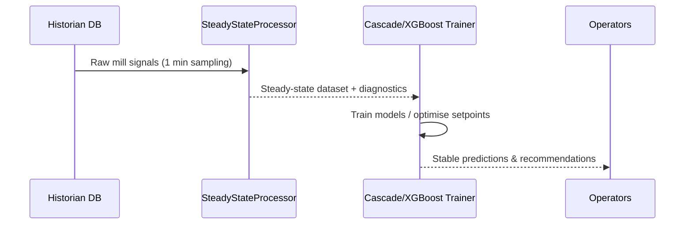
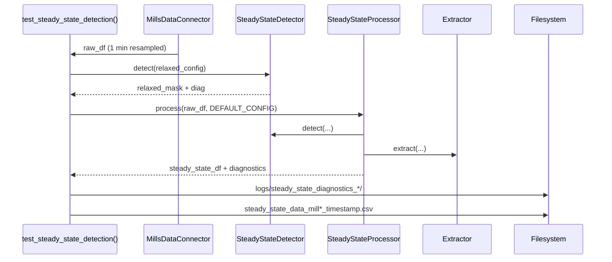
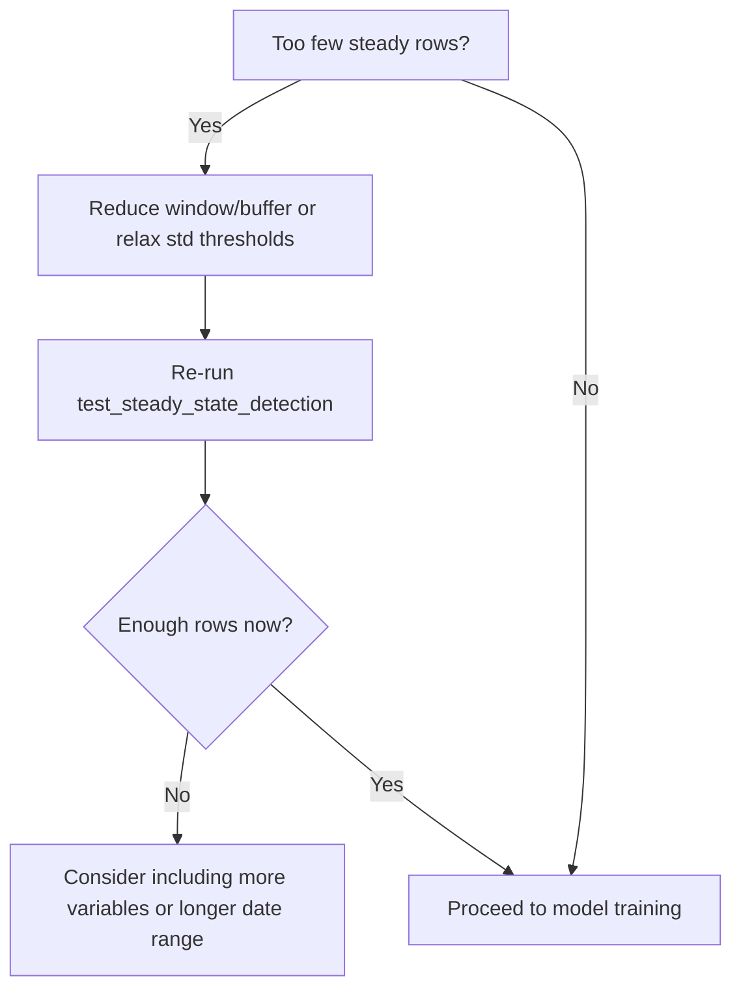

# Steady-State Data Transformation Pipeline

This guide explains, in simple language, how the steady-state pipeline turns raw mill historian data into the stable samples we use for machine learning. If you are new to the project, read the **Quick Start** first, then dive into the details.

## Quick Start (TL;DR)
- **Input**: A `pandas.DataFrame` indexed by timestamps containing mill signals.
- **Process**: `SteadyStateProcessor.process()` calls a detector (finds stable periods) and an extractor (pulls stable samples).
- **Output**: A curated dataset with only steady operating points + a diagnostics report describing the filtering decisions.
- **Why**: Models trained on steady-state data behave better in production, because they see less noise and fewer transient spikes.

```python
from app.database.steady_state_processor import process_to_steady_state
from app.database.steady_state_config import DEFAULT_CONFIG

steady_df = process_to_steady_state(raw_df, config=DEFAULT_CONFIG)
print(steady_df.head())
```

## Why a Steady-State Filter Exists
- **Model reliability**. XGBoost and cascade optimizers assume the training samples represent equilibrium operating points. `process_to_steady_state()` in `python/mills-xgboost/app/database/steady_state_processor.py` enforces that assumption by filtering out transients before model fitting.
- **Noise suppression**. By rejecting regions with large variance or fast changes, the pipeline raises the signal-to-noise ratio for manipulated variables (MVs), controlled variables (CVs), disturbance variables (DVs), and targets.
- **Operational insight**. The generated diagnostics quantify how often the plant is truly stable, highlighting both data quality issues and production behaviours.

```mermaid
flowchart LR
    A[Raw historian dataframe
       (DatetimeIndex + process columns)] --> B{SteadyStateDetector.detect}
    B -->|Boolean mask
       (stable timestamps)| C[SteadyStateExtractor.extract]
    C --> D[(Curated steady-state samples)]
    B --> E[Detection diagnostics]
    C --> F[Extraction diagnostics]
    D --> G[Model training
             & optimization]
```

## Source Files and Responsibilities
- **`python/mills-xgboost/app/database/steady_state_config.py`** — configuration of rolling-window length, buffers, and per-variable thresholds (`SteadyStateConfig`, `VariableStabilityCriteria`).
- **`python/mills-xgboost/app/database/steady_state_detector.py`** — Phase 1 detection logic (`SteadyStateDetector`).
- **`python/mills-xgboost/app/database/steady_state_extractor.py`** — Phase 2 extraction logic (`SteadyStateExtractor`).
- **`python/mills-xgboost/app/database/steady_state_processor.py`** — orchestrates detection + extraction and persists diagnostics (`SteadyStateProcessor`).
- **`python/mills-xgboost/test_steady_state.py`** — executable test harness that exercises the full pipeline against real mill data.
- **`python/mills-xgboost/app/optimization_cascade/cascade_models.py`** — consumes the curated steady-state data when training cascade models.

### Where the Pipeline Fits in the Bigger Picture



## Stage 0 — Configuration & Criteria
`SteadyStateConfig` aggregates domain knowledge about acceptable variability per signal type. The default instance (`DEFAULT_CONFIG`) uses a strict 90 min rolling window with a 45 min buffer (`total_window_minutes = 135`).

```python
from app.database.steady_state_config import VariableStabilityCriteria, SteadyStateConfig

config = SteadyStateConfig(
    window_minutes=90,
    buffer_minutes=45,
    min_samples_per_window=60,
    enable_quality_filters=True,
)
ore_limits = config.mv_criteria["Ore"]  # VariableStabilityCriteria(...)
```

Each `VariableStabilityCriteria` allows mixing rules:
- **`rolling_std_threshold_pct` or `rolling_std_threshold_abs`**: “How much is the signal allowed to wiggle inside the window?”
- **`max_step_change_pct`**: “Did the signal jump too far inside the window?”
- **`max_rate_of_change`**: “Is the signal moving too quickly minute to minute?”

> **Plain English**: We mark a period as stable if the signal is mostly flat, does not jump suddenly, and does not slope too much.

Targets and DVs inherit looser thresholds than MVs/CVs, mirroring real mill behaviour where setpoints must be steady while lab assays drift slowly.

### Seeing the Criteria in Action

```python
criteria = config.get_criteria("Ore")
print(criteria)

# Simple check for a single series
rolling = raw_df["Ore"].rolling(window=config.get_window_size(as_timedelta=False))
std_ok = rolling.std() <= rolling.mean() * (criteria.rolling_std_threshold_pct / 100)
print(f"Stable points for Ore: {std_ok.sum()} out of {len(std_ok)}")
```

### Configuration Cheat Sheet

| Variable type | Example columns | Typical use | Threshold style |
| --- | --- | --- | --- |
| MVs | `Ore`, `WaterMill`, `WaterZumpf`, `MotorAmp` | What we control | Strict % std + step change |
| CVs | `DensityHC`, `PressureHC`, `PulpHC` | Process response | Mix of absolute + % std |
| DVs | `Shisti`, `Daiki`, `Grano`, `Class_12`, `Class_15`, `FE` | External ore quality | Loose % std |
| Targets | `PSI80`, `PSI200` | Quality goal | Loose % std + step change |

## Stage 1 — Detection (`SteadyStateDetector`)
`SteadyStateDetector.detect(df, variables_to_check)` returns a boolean mask with `True` for timestamps that meet every configured criterion, plus structured diagnostics.

```python
from app.database.steady_state_detector import SteadyStateDetector

mask, diag = SteadyStateDetector(config).detect(raw_df, variables_to_check=[
    "Ore", "WaterMill", "WaterZumpf", "MotorAmp",
    "DensityHC", "PressureHC", "PulpHC",
])
```

### Detection Pipeline
1. **Multi-variable stability** via `check_variable_stability()` on each signal:
   ```python
   rolling = series.rolling(window="90min", min_periods=config.min_samples_per_window)
   std_stable = rolling.std() <= rolling.mean() * (criteria.rolling_std_threshold_pct / 100)
   overall_mask &= std_stable
   ```
2. **Temporal continuity** uses `check_temporal_continuity()` to insist the preceding buffer window is stable (`rolling(...).min()` logic). Think of it as “Has the mill been calm for long enough before this timestamp?”
3. **Quality filters** inside `filter_quality_issues()` remove NaNs/outliers from the monitored variables only when `enable_quality_filters` is `True`.

### Common Questions
- **Do we check every column?** No. We pass `variables_to_check`, typically just MVs and CVs. DVs and targets are optional.
- **Why `min_periods`?** We require at least `min_samples_per_window` rows to make the rolling statistics meaningful.
- **Can I inspect intermediate masks?** Yes—call `detect_steady_state_periods()`, `check_temporal_continuity()`, and `filter_quality_issues()` separately as done in the test harness.

```python
detector = SteadyStateDetector(config)
initial_mask = detector.detect_steady_state_periods(raw_df, available_vars)
continuous_mask = detector.check_temporal_continuity(raw_df, initial_mask)
final_mask = detector.filter_quality_issues(raw_df, continuous_mask, available_vars)
```

```mermaid
flowchart TD
    subgraph Detector
        A[Start mask = True] --> B[For each variable
check_variable_stability]
        B --> C[Combine (AND) results]
        C --> D[check_temporal_continuity]
        D --> E[filter_quality_issues]
    end
    E --> F[Final stability mask]
    E --> G[Diagnostics
(total rows, losses per phase,
variables checked)]
```

The diagnostics dictionary records counts after each phase (`after_stability_check`, `after_continuity_check`, `after_quality_filter`) to help tune thresholds.

## Stage 2 — Extraction (`SteadyStateExtractor`)
Using the stability mask, the extractor collapses each stable window into usable samples.

```python
from app.database.steady_state_extractor import SteadyStateExtractor

steady_df, extraction_diag = SteadyStateExtractor(config).extract(
    df=raw_df,
    stability_mask=mask,
    variable_classification=config.get_required_variables(),
    keep_individual_timestamps=True,
)
```

### Window Identification
`identify_steady_state_windows()` groups consecutive `True` timestamps, enforces a minimum duration (`window_minutes`), and splits long spans into multiple non-overlapping windows. Long windows are chopped into chunks so each chunk behaves like an independent steady operating point.

```python
windows = extractor.identify_steady_state_windows(raw_df, mask)
for start, end in windows[:3]:
    print(f"Window from {start} to {end} lasting {(end-start).total_seconds()/60:.1f} minutes")
```

### Aggregation Logic
- **MVs** (`aggregate_mv_values`) → time-weighted mean.
- **CVs** (`aggregate_cv_values`) → mean + `*_std` columns for stability diagnostics.
- **DVs** (`aggregate_dv_values`) → mean.
- **Targets** (`aggregate_target_values`) → median (robust to lab spikes).
- Each sample also carries `stability_score`, `window_duration_min`, `window_id` (when `keep_individual_timestamps=True`).

```python
sample = {
    **extractor.aggregate_mv_values(raw_df, mv_cols, start, end),
    **extractor.aggregate_cv_values(raw_df, cv_cols, start, end),
    **extractor.aggregate_dv_values(raw_df, dv_cols, start, end),
    **extractor.aggregate_target_values(raw_df, target_cols, start, end),
}
print(sample)
```

```mermaid
flowchart LR
    M[Stability mask] --> N[identify_steady_state_windows]
    N --> O{keep_individual_timestamps?}
    O -->|Yes| P[Filter df[mask]
reset index → TimeStamp]
    O -->|No| Q[Aggregate per window
(MV mean, CV mean+std,
DV mean, target median)]
    P --> R[(Steady-state rows)]
    Q --> R
    R --> S[Extraction diagnostics
(mean stability score,
window duration,
mode)]
    - **mean stability score**: average of the rolling standard deviation of each signal within the window.
    - **window duration**: length of the window in minutes.
    - **mode**: whether the window is a single timestamp or an aggregated window.
```
### Stage 3 — Orchestration & Diagnostics (`SteadyStateProcessor`)
`SteadyStateProcessor` binds the two phases and produces a full diagnostics bundle.

```python
from app.database.steady_state_processor import SteadyStateProcessor
processor = SteadyStateProcessor(config)
steady_df, diagnostics = processor.process(raw_df)
print(diagnostics["extraction"])    # stability score, window duration
# Example: {'mean_stability_score': 0.56, 'mean_window_duration_min': 88.3, 'mode': 'individual_timestamps'}
```

```python
def test_steady_state_detection():
    mill_number = 6
    start_date = (datetime.now() - timedelta(days=105)).strftime("%Y-%m-%d")
    end_date = datetime.now().strftime("%Y-%m-%d")

    raw_df = MillsDataConnector(...).get_combined_data(
        mill_number=mill_number,
        start_date=start_date,
        end_date=end_date,
        resample_freq="1min",
    )

    relaxed_mask, relaxed_diag = SteadyStateDetector(relaxed_config).detect(raw_df, ...)
    steady_df, diagnostics = process_to_steady_state_with_diagnostics(
        df=raw_df,
        config=DEFAULT_CONFIG,
        variables_to_check=available_vars,
        save_diagnostics=True,
    )

    steady_df.to_csv(f"steady_state_data_mill{mill_number}_{timestamp}.csv", index=False)
```

Key behaviours validated by the test:
- **Database integration** using `MillsDataConnector.get_combined_data()`.
- **Relaxed vs strict criteria comparison** to isolate bottlenecks.
- **Per-phase loss reporting** showing where samples are discarded.
- **Window enumeration** via `SteadyStateExtractor.identify_steady_state_windows()`.
- **End-to-end export** for downstream model training.

### Running the Test Script

```bash
cd python/mills-xgboost
python test_steady_state.py
```

Expected console output snippets:

```
STEP 1: LOADING DATA FROM DATABASE
✅ Data loaded successfully: Rows: 45,000

STEP 2: STEADY-STATE PROCESSING
  ℹ️ Using adjusted default configuration based on your process data
  Variables for stability check (MVs + CVs only): [...]

STEP 3: RESULTS ANALYSIS
📊 Data Transformation: Input rows 45,000 → Output samples 1,150 (2.56%)
```

The script saves steady-state samples and diagnostics to disk, making it easy to compare different configurations by simply re-running the file.



## Practical Tuning Guidelines
- **Too few samples**: decrease `window_minutes` or `buffer_minutes`, or relax `rolling_std_threshold_pct` for specific signals.
- **Quality filters removing everything**: set `enable_quality_filters=False` temporarily to diagnose NaNs/outliers.
- **Transient spikes remaining**: tighten `max_step_change_pct` or `max_rate_of_change` for responsible variables.
- **Model training readiness**: aim for ≥ 200 steady-state rows (`pipeline['output_samples']`) before fitting cascade/XGBoost models.

### Troubleshooting Workflow



### Example: Relaxing Configuration Safely

```python
relaxed_config = SteadyStateConfig(
    window_minutes=45,
    buffer_minutes=15,
    min_samples_per_window=30,
    enable_quality_filters=True,
)

relaxed_df, relaxed_diag = SteadyStateProcessor(relaxed_config).process(raw_df)
print(relaxed_diag["pipeline"]["output_samples"])  # Did we gain enough samples?
```

## Summary of Data Transformation
1. Historian data (potentially unstable) → strict multi-variable stability mask.
2. Mask + buffer continuity → continuous steady windows.
3. Windows → timestamp-preserving or aggregated steady samples with stability metadata.
4. Diagnostics quantify each stage, enabling controlled adjustments.

Armed with this understanding, new team members can both interpret the existing steady-state artefacts and adjust the configuration to suit future metallurgical campaigns. Use the snippets and diagrams above as a reference when tuning the pipeline for new mills or ore regimes.
