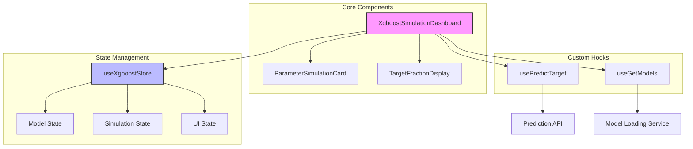
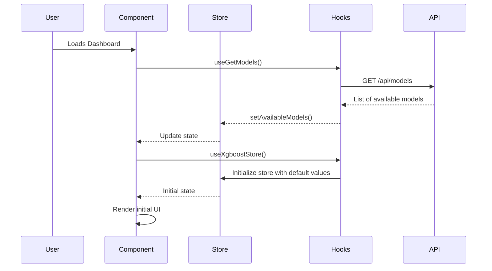
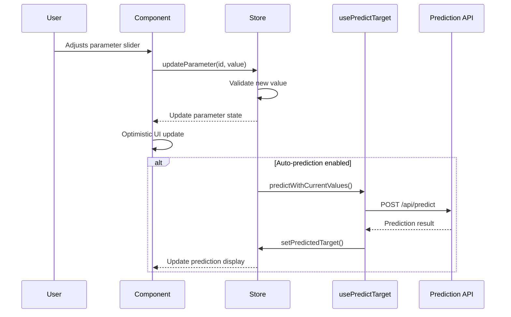
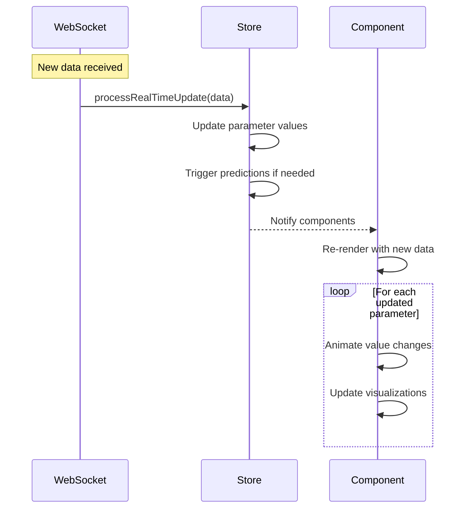

# XGBoost Simulation Dashboard

## Overview

The XGBoost Simulation Dashboard is an advanced React-based interface designed for real-time monitoring and simulation of industrial mill operations. It leverages XGBoost machine learning models to provide operators with powerful tools for process optimization. The dashboard enables:

- **Real-time Monitoring**: Continuous tracking of process variables and model predictions
- **Interactive Simulation**: What-if analysis by adjusting process parameters
- **Performance Visualization**: Clear display of model predictions versus actual values
- **Process Optimization**: Tools to identify optimal parameter configurations

The system is built with a modular architecture that separates concerns between data management, model interaction, and user interface components, ensuring maintainability and scalability.

## Component Architecture

The dashboard follows a hierarchical component structure with clear separation of concerns:



### Component Responsibilities:

1. **XgboostSimulationDashboard (Root Component)**
   - Orchestrates data flow between components
   - Manages component lifecycle
   - Handles error boundaries

2. **useXgboostStore (State Management)**
   - Centralized state management using Zustand
   - Handles all application state including:
     - Model configuration and metadata
     - Current parameter values and validation
     - Simulation status and history
     - UI preferences and settings

3. **usePredictTarget (Custom Hook)**
   - Manages prediction API calls
   - Handles prediction state (loading/error/success)
   - Processes and validates prediction responses

4. **useGetModels (Custom Hook)**
   - Fetches available models from the backend
   - Handles model selection and loading
   - Manages model metadata and feature sets

5. **ParameterSimulationCard (UI Component)**
   - Renders interactive parameter controls
   - Validates user inputs against boundaries
   - Provides visual feedback for parameter states

6. **TargetFractionDisplay (UI Component)**
   - Visualizes prediction results
   - Shows historical performance
   - Highlights deviations from targets

## Key Features

1. **Model Management**
   - Dynamic model loading and selection
   - Real-time model performance monitoring
   - Feature and target visualization

2. **Parameter Simulation**
   - Interactive sliders for parameter adjustment
   - Real-time prediction updates
   - Parameter boundary validation

3. **Data Visualization**
   - Historical data tracking
   - Target vs. actual comparison
   - Parameter range indicators

## Core Components

### 1. Main Dashboard (`XgboostSimulationDashboard`)

The main container component that orchestrates all functionality.

**Key Props & State:**
- `parameters`: Current parameter values and states
- `parameterBounds`: Valid ranges for each parameter
- `currentTarget`: Current target value
- `currentPV`: Current process variable value
- `targetData`: Historical target data points
- `simulationActive`: Boolean indicating if simulation is running
- `modelName`: Currently selected model
- `availableModels`: List of loadable models

### 2. Parameter Simulation Card

Handles individual parameter adjustment and visualization.

**Features:**
- Interactive slider for value adjustment
- Visual indication of value within valid range
- Real-time updates to prediction model

### 3. Target Fraction Display

Visualizes the relationship between target and current values.

**Features:**
- Gauge visualization
- Color-coded status indicators
- Historical trend display

## Data Flow

The application follows a unidirectional data flow pattern with the following key processes:

### 1. Initialization Flow


### 2. Parameter Adjustment Flow


### 3. Real-time Update Flow


### Data Transformation Pipeline
1. **Input Validation**
   - Type checking with TypeScript
   - Range validation for numeric parameters
   - Required field verification

2. **State Updates**
   - Immutable state updates
   - Batched updates for performance
   - Change detection for minimal re-renders

3. **Prediction Processing**
   - Request formatting
   - Response normalization
   - Error handling and fallbacks

4. **UI Updates**
   - Smooth animations for value changes
   - Loading states
   - Error states with recovery options

## State Management Architecture

The application uses Zustand for state management, providing a centralized store with the following structure:

### Store Structure
```typescript
interface XGBoostStore {
  // Model State
  modelName: string;
  availableModels: string[];
  modelFeatures: string[];
  modelTarget: string;
  lastTrained: string | null;
  
  // Simulation State
  parameters: Parameter[];
  parameterBounds: Record<string, [number, number]>;
  currentTarget: number | null;
  currentPV: number | null;
  targetData: DataPoint[];
  simulationActive: boolean;
  
  // UI State
  isLoading: boolean;
  error: string | null;
  sliderValues: Record<string, number>;
  isSimulationMode: boolean;
  
  // Actions
  updateParameter: (id: string, value: number) => void;
  setSimulationMode: (active: boolean) => void;
  predictWithCurrentValues: () => Promise<void>;
  // ... other actions
}
```

### State Management Patterns

1. **Immutable Updates**
   - All state updates use immutable patterns
   - Immer is used under the hood for simpler immutable updates
   - State is normalized to prevent duplication

2. **Selective Re-rendering**
   - Components subscribe only to the state they need
   - Memoization is used to prevent unnecessary re-renders
   - Computed values are derived using selectors

3. **Side Effects**
   - Side effects are managed through dedicated hooks
   - Cleanup is handled properly for all effects
   - Error boundaries catch and handle runtime errors

### Performance Considerations
- State is structured to minimize re-renders
- Heavy computations are memoized
- Batch updates are used when multiple state changes occur together
- Selective subscription prevents unnecessary updates

### State Persistence
- Critical state can be persisted to localStorage
- User preferences are saved across sessions
- Large state objects are normalized for performance

## Key Functions and Hooks

### `handlePrediction()`

```typescript
const handlePrediction = async () => {
  // Uses the Zustand store's predictWithCurrentValues method
  // which handles the entire prediction flow:
  // 1. Collects current parameter values
  // 2. Validates inputs
  // 3. Makes API request
  // 4. Updates UI with results
  await predictWithCurrentValues();
};
```

**Flow Details:**
1. Collects current parameter values from the store
2. Validates all required parameters are within acceptable ranges
3. Shows loading state in the UI
4. Makes an asynchronous API call to the prediction endpoint
5. Processes the response and updates the store
6. Triggers UI updates through React's reactive system

### `getTagId(targetKey: string, millNumber: number)`

```typescript
const getTagId = (targetKey: string, millNumber: number): number | null => {
  // Looks up the tag ID from the millsTags configuration
  // based on the target key and mill number
  // Returns null if the tag is not found
  const tags = millsTags[targetKey as TagKey] as TagInfo[];
  const millName = `Mill${String(millNumber).padStart(2, '0')}`;
  return tags.find(tag => tag.name === millName)?.id || null;
};
```

**Usage Context:**
- Maps between human-readable parameter names and backend tag IDs
- Handles mill-specific parameter configurations
- Provides type safety through TypeScript interfaces

### `useEffect` Hooks

1. **Model Loading and Initialization**
   ```typescript
   useEffect(() => {
     // Loads and initializes the selected model
     // Sets up default parameters and validation rules
     // Handles errors during model loading
   }, [models, modelName, /* other deps */]);
   ```

2. **Real-time Data Subscription**
   ```typescript
   useEffect(() => {
     // Sets up WebSocket connection for real-time updates
     // Handles reconnection logic
     // Processes incoming data and updates UI
     
     return () => {
       // Cleanup WebSocket on unmount
     };
   }, [modelFeatures, /* other deps */]);
   ```

3. **Prediction Trigger**
   ```typescript
   useEffect(() => {
     // Watches for parameter changes
     // Triggers predictions when needed
     // Implements debouncing for performance
   }, [parameters, autoPredict, /* other deps */]);
   ```

### `useEffect` Hooks

1. **Model Loading**
   - Fetches available models on component mount
   - Initializes default model selection
   - Sets up model metadata

2. **Real-time Updates**
   - Manages subscription to real-time data
   - Handles cleanup on component unmount
   - Processes incoming data updates

## Error Handling

The component includes comprehensive error handling for:
- Model loading failures
- Prediction errors
- Invalid parameter values
- Network issues

## Best Practices

1. **Performance**
   - Memoized callbacks with `useCallback`
   - Optimized re-renders with `React.memo`
   - Efficient data fetching with `useEffect`

2. **Code Organization**
   - Clear separation of concerns
   - Reusable components
   - Type-safe with TypeScript

## Dependencies

- React 18+
- XGBoost (backend)
- UI Component Library (custom components)
- State Management (Zustand)

## Getting Started

1. Ensure all dependencies are installed
2. Start the development server
3. Navigate to the dashboard
4. Select a model and begin simulation

## Troubleshooting

Common issues and solutions:

1. **No Models Available**
   - Verify backend service is running
   - Check network connectivity
   - Verify model files exist

2. **Prediction Failures**
   - Validate input parameters
   - Check model compatibility
   - Review server logs

## Future Enhancements

- Support for custom model uploads
- Advanced visualization options
- Multi-model comparison
- Automated optimization suggestions
