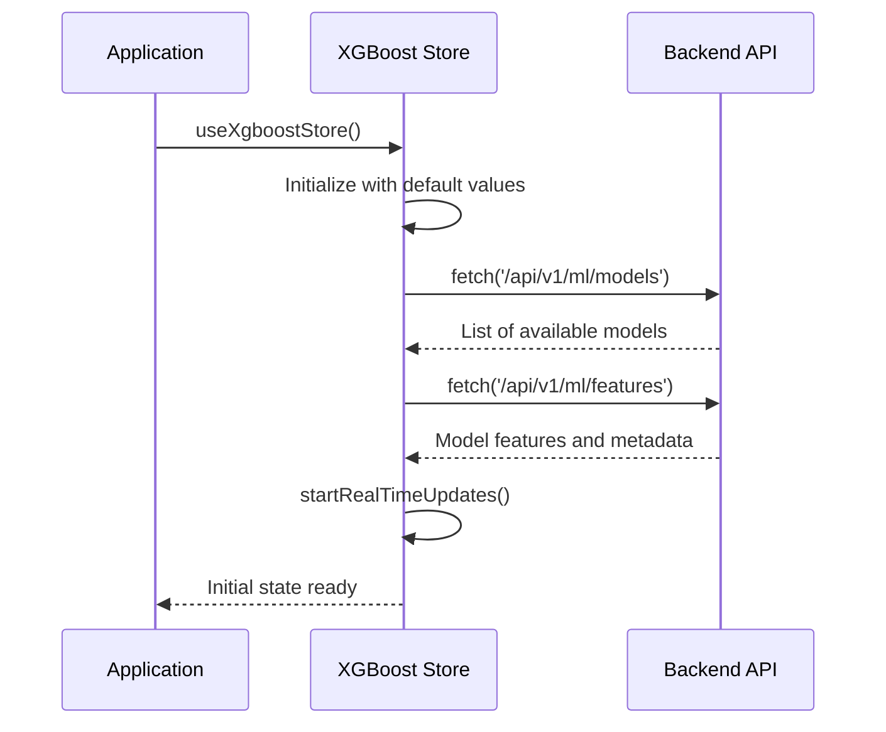
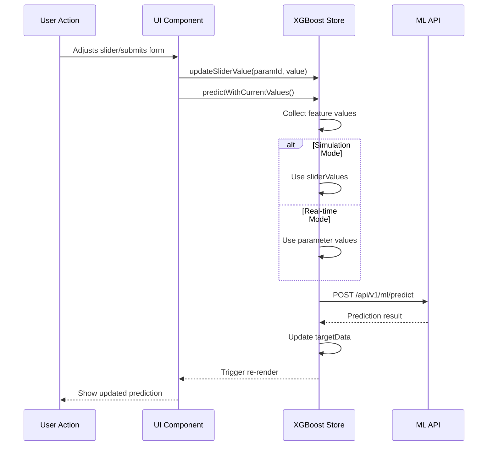
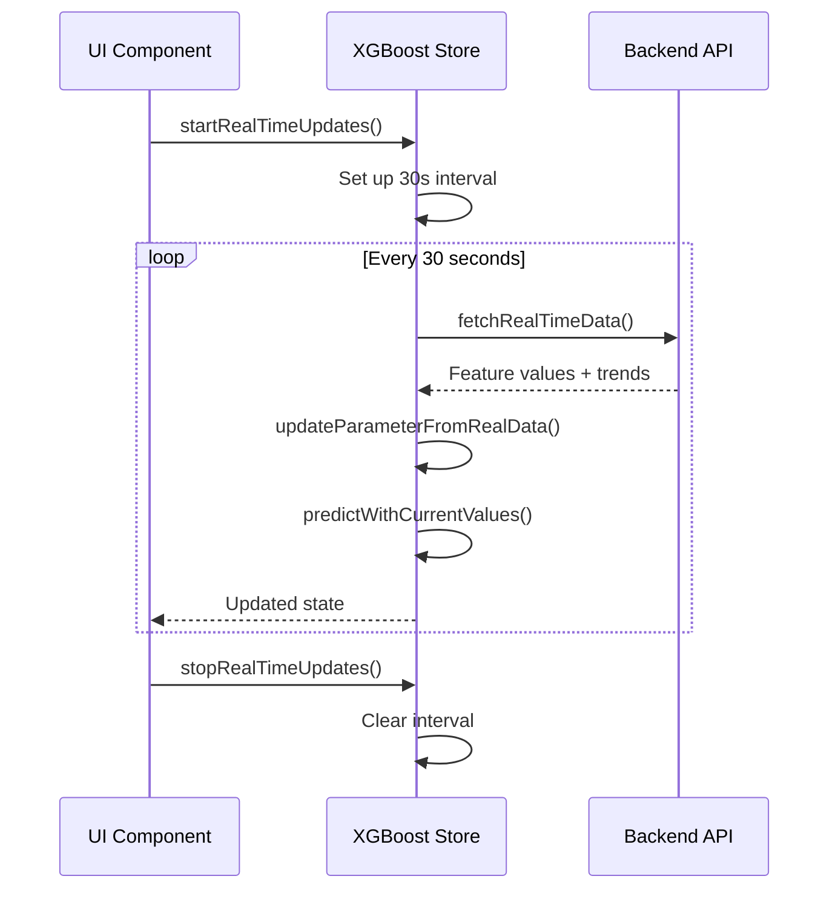

# XGBoost Store Documentation

## Overview

The `xgboost-store.ts` is the central state management module for the XGBoost Simulation Dashboard, built using [Zustand](https://github.com/pmndrs/zustand). It serves as the single source of truth for the application's state and business logic.

### Key Responsibilities

1. **State Management**: Manages application state including parameters, predictions, and UI states
2. **Data Flow**: Handles data fetching, transformation, and propagation
3. **Business Logic**: Implements core functionality like predictions and simulations
4. **Integration**: Connects with ML APIs and real-time data sources
5. **Performance**: Optimizes rendering through selective state subscriptions

### Technical Stack

- **Framework**: Next.js with TypeScript
- **State Management**: Zustand
- **Data Fetching**: Custom hooks (`useTagValue`, `useTagTrend`)
- **Styling**: Tailwind CSS
- **Visualization**: Recharts
- **API**: Custom ML API endpoints

## Table of Contents

1. [Core Concepts](#core-concepts)
2. [State Structure](#state-structure)
3. [Data Flow](#data-flow)
4. [Key Functions](#key-functions)
5. [Zustand Integration](#zustand-integration)
6. [Real-time Data Flow](#real-time-data-flow)
7. [Simulation Mode](#simulation-mode)
8. [Error Handling](#error-handling)
9. [Performance Considerations](#performance-considerations)
10. [Integration with Other Components](#integration-with-other-components)
11. [Advanced Usage](#advanced-usage)
12. [Testing Strategy](#testing-strategy)
13. [Debugging Guide](#debugging-guide)
14. [Future Improvements](#future-improvements)

The `xgboost-store.ts` is a state management module built with Zustand that handles the core logic for the XGBoost Simulation Dashboard. It manages the application state, including real-time data fetching, simulation mode, and prediction functionality.

## Table of Contents

1. [Core Concepts](#core-concepts)
2. [State Structure](#state-structure)
3. [Data Flow](#data-flow)
4. [Key Functions](#key-functions)
5. [Zustand Integration](#zustand-integration)
6. [Real-time Data Flow](#real-time-data-flow)
7. [Simulation Mode](#simulation-mode)
8. [Error Handling](#error-handling)
9. [Performance Considerations](#performance-considerations)

## Core Concepts

### Dual Data Source Architecture

The store implements a sophisticated dual data source pattern that enables seamless switching between real-time and simulation modes:

```typescript
// Simplified example of the dual data source pattern
const getParameterValue = (parameter: Parameter, state: XgboostState) => {
  return state.isSimulationMode
    ? state.sliderValues[parameter.id] ?? parameter.value
    : parameter.value;
};
```

**Real-time Mode**:

- Connects to the mill's data acquisition system
- Fetches live process values (PV) at regular intervals
- Updates the UI in real-time with current process conditions
- Used for monitoring and operational decision-making

**Simulation Mode**:

- Uses user-adjustable slider values for what-if analysis
- Enables testing different scenarios without affecting live processes
- Maintains separate state for slider values to preserve real-time data
- Allows for predictive analysis and optimization

### State Management with Zustand

The store leverages Zustand's powerful capabilities:

```typescript
// Store creation with middleware
const useXgboostStore = create<XgboostState>()(
  devtools((set, get) => ({
    // State and actions...
  }))
);
```

**Key Features**:

- **Type Safety**: Full TypeScript support for all state and actions
- **Middleware**: Extensible with devtools and persistence
- **Reactivity**: Components only re-render when their subscribed state changes
- **Simplicity**: No need for context providers or wrapping components

## State Structure

### Main State Interface

The `XgboostState` interface defines the complete shape of the store's state. Here's a detailed breakdown of each property:

```typescript
interface XgboostState {
  // Core Parameters
  parameters: Parameter[]; // Array of all process parameters
  parameterBounds: ParameterBounds; // Min/max bounds for parameters

  // Simulation State
  sliderValues: Record<string, number>; // User-adjusted values in simulation mode
  isSimulationMode: boolean; // Tracks the current mode
  simulationActive: boolean; // Whether simulation is actively running

  // Process Values
  currentTarget: number | null; // Current target value (SP)
  currentPV: number | null; // Current process value (PV)
  targetData: TargetData[]; // Historical data for trending

  // Model Configuration
  modelName: string; // Currently selected model
  availableModels: string[]; // List of available models
  modelFeatures: string[] | null; // Features used by current model
  modelTarget: string | null; // Target variable name
  lastTrained: string | null; // Timestamp of last model training

  // Real-time Data
  currentMill: number; // Currently selected mill (1-12)
  dataUpdateInterval: NodeJS.Timeout | null; // Interval for real-time updates

  // Actions and Methods
  updateParameter: (id: string, value: number) => void;
  fetchRealTimeData: () => Promise<void>;
  predictWithCurrentValues: () => Promise<void>;
  // ... other actions
}
```

### State Initialization

The store's initial state is defined when the store is created:

```typescript
const initialState = {
  parameters: [
    {
      id: "Ore",
      name: "Ore Feed",
      unit: "t/h",
      value: 0,
      trend: [],
      color: "#3b82f6", // blue-500
      icon: "⛏️",
    },
    // ... other parameters
  ],
  // ... other initial state
};
```

```typescript
interface XgboostState {
  // Parameters and their current values
  parameters: Parameter[];
  parameterBounds: ParameterBounds;

  // Slider values (separate from PV values)
  sliderValues: Record<string, number>;

  // Mode control
  isSimulationMode: boolean;

  // Target and prediction data
  currentTarget: number | null;
  currentPV: number | null;
  targetData: TargetData[];

  // Model configuration
  modelName: string;
  availableModels: string[];
  modelFeatures: string[] | null;
  modelTarget: string | null;
  lastTrained: string | null;

  // Real-time data settings
  currentMill: number;
  dataUpdateInterval: NodeJS.Timeout | null;

  // Actions and methods...
}
```

### Parameter Structure

```typescript
interface Parameter {
  id: string;
  name: string;
  unit: string;
  value: number;
  trend: Array<{ timestamp: number; value: number }>;
  color: string;
  icon: string;
}
```

### Target Data Structure

```typescript
interface TargetData {
  timestamp: number;
  value: number;
  target: number;
  pv: number;
  sp?: number | null; // Setpoint value
}
```

## Data Flow

### Initialization Flow

When the application starts, the store initializes with this sequence:



### Real-time Data Flow

The real-time data flow is the backbone of the application's live monitoring capabilities:

1. **Initialization**:

   ```typescript
   // In a React component:
   useEffect(() => {
     startRealTimeUpdates();
     return () => stopRealTimeUpdates();
   }, [startRealTimeUpdates]);
   ```

2. **Update Cycle**:
   - `startRealTimeUpdates()` sets up a 30-second interval
   - On each interval, `fetchRealTimeData()` is called
   - For each parameter, the store fetches current values and trends
   - State is updated with new values
   - UI components re-render with updated data

### Prediction Flow

The prediction flow is triggered by user interactions or real-time updates:



## Key Functions

### `fetchRealTimeData()`

This is the workhorse function that handles real-time data updates:

```typescript
const fetchRealTimeData = async () => {
  const state = get();
  const { currentMill, parameters, isSimulationMode } = state;
  const timestamp = Date.now();

  try {
    // Process each parameter in parallel
    await Promise.all(
      parameters.map(async (param) => {
        const tagId = getTagId(param.id, currentMill);
        if (!tagId) return;

        try {
          // Fetch current value
          const value = await fetchTagValue(tagId);

          // Fetch trend data (last hour)
          const trend = await fetchTagTrend(tagId, "1h");

          // Update parameter with new data
          updateParameterFromRealData(param.id, value, timestamp, trend);
        } catch (error) {
          console.error(`Error updating parameter ${param.id}:`, error);
        }
      })
    );

    // If in real-time mode, make a prediction with current values
    if (!isSimulationMode) {
      await predictWithCurrentValues();
    }
  } catch (error) {
    console.error("Error in fetchRealTimeData:", error);
  }
};
```

### `predictWithCurrentValues()`

Handles the prediction logic for both simulation and real-time modes:

```typescript
const predictWithCurrentValues = async () => {
  const state = get();
  const { parameters, isSimulationMode, sliderValues, modelName, currentMill } =
    state;

  try {
    // Prepare feature data based on current mode
    const features: Record<string, number> = {};
    parameters.forEach((param) => {
      features[param.id] = isSimulationMode
        ? sliderValues[param.id] ?? param.value
        : param.value;
    });

    // Make prediction API call
    const response = await mlApiClient.post<PredictionResponse>(
      "/api/v1/ml/predict",
      {
        model_id: modelName,
        mill_id: currentMill,
        features,
      }
    );

    // Process successful prediction
    if (response.data?.prediction !== undefined) {
      const prediction = response.data.prediction;
      const timestamp = Date.now();

      // Update state with new prediction
      set((prev) => ({
        currentTarget: prediction,
        targetData: [
          ...prev.targetData,
          {
            timestamp,
            value: prediction,
            target: prediction,
            sp: prediction,
            pv: prev.currentPV || 0,
          },
        ].slice(-50), // Keep last 50 data points
      }));
    }
  } catch (error) {
    console.error("Prediction failed:", error);
  }
};
```

### `updateParameterFromRealData()`

Updates parameter values while respecting simulation mode:

```typescript
const updateParameterFromRealData = (
  featureName: string,
  value: number,
  timestamp: number,
  trend: Array<{ timestamp: number; value: number }> = []
) => {
  set((state) => {
    // Find the parameter to update
    const paramIndex = state.parameters.findIndex((p) => p.id === featureName);
    if (paramIndex === -1) return state;

    const param = state.parameters[paramIndex];

    // Create updated parameter with new trend data
    const updatedParam: Parameter = {
      ...param,
      trend: [
        ...(trend.length > 0
          ? trend
          : [...param.trend, { timestamp, value }].slice(-50)), // Keep last 50 data points
      ],
    };

    // Only update the value if not in simulation mode
    if (!state.isSimulationMode) {
      updatedParam.value = value;
    }

    // Create new parameters array with updated parameter
    const newParameters = [...state.parameters];
    newParameters[paramIndex] = updatedParam;

    return { parameters: newParameters };
  });
};
```

### `resetFeatures()`

Resets all parameters to their default values while preserving the current mode:

```typescript
const resetFeatures = () => {
  set((state) => {
    // Reset parameters to their default values (middle of min/max range)
    const updatedParameters = state.parameters.map((param) => {
      const bounds = state.parameterBounds[param.id];
      const defaultValue = bounds ? (bounds.min + bounds.max) / 2 : 0;

      return {
        ...param,
        value: defaultValue,
        // Preserve trend data
        trend:
          param.trend.length > 0
            ? [...param.trend]
            : [{ timestamp: Date.now(), value: defaultValue }],
      };
    });

    // Reset slider values to match new parameter values
    const updatedSliderValues = { ...state.sliderValues };
    updatedParameters.forEach((param) => {
      updatedSliderValues[param.id] = param.value;
    });

    return {
      parameters: updatedParameters,
      sliderValues: updatedSliderValues,
    };
  });
};
```

### `startRealTimeUpdates()` and `stopRealTimeUpdates()`

Manages the real-time update interval:

```typescript
const startRealTimeUpdates = () => {
  // Clear any existing interval
  const state = get();
  if (state.dataUpdateInterval) {
    clearInterval(state.dataUpdateInterval);
  }

  // Initial data fetch
  fetchRealTimeData().catch(console.error);

  // Set up new interval (30 seconds)
  const interval = setInterval(() => {
    fetchRealTimeData().catch(console.error);
  }, 30000);

  // Store interval ID in state
  set({ dataUpdateInterval: interval });
};

const stopRealTimeUpdates = () => {
  const state = get();
  if (state.dataUpdateInterval) {
    clearInterval(state.dataUpdateInterval);
    set({ dataUpdateInterval: null });
  }
};
```

## Zustand Integration

The store leverages Zustand's powerful features for efficient state management. Here's a detailed look at how Zustand is integrated:

### Store Creation

```typescript
export const useXgboostStore = create<XgboostState>()(
  devtools(
    // persist(
    (set, get) => ({
      // State and actions...
    })
    // { name: "xgboost-simulation-storage" }
    // )
  )
);
```

### Middleware Usage

1. **DevTools Middleware**

   - Enables Redux DevTools integration for debugging
   - Provides time-travel debugging capabilities
   - Logs all state changes for inspection

2. **Persistence Middleware** (Commented out)
   - Can be enabled to persist state to localStorage
   - Supports custom serialization/deserialization
   - Useful for maintaining state across page refreshes

### State Management Patterns

1. **Immutable Updates**

   ```typescript
   // Using immer-like syntax with set
   set((state) => ({
     parameters: state.parameters.map((p) =>
       p.id === id ? { ...p, value } : p
     ),
   }));
   ```

2. **Batched Updates**

   ```typescript
   // Multiple state updates in a single set
   set({
     currentTarget: prediction,
     targetData: [...state.targetData, newData],
     // ...
   });
   ```

3. **Selectors for Performance**

   ```typescript
   // In component:
   const currentMill = useXgboostStore((state) => state.currentMill);

   // Memoized selector
   const getParameter = (id: string) =>
     useXgboostStore(
       useCallback((state) => state.parameters.find((p) => p.id === id), [id])
     );
   ```

## Real-time Data Flow



## Simulation Mode

### Key Behaviors

- Toggled via `setSimulationMode()`
- In simulation mode:
  - Slider values are used for predictions
  - Real-time data continues to update trends
  - User adjustments are preserved
- In real-time mode:
  - Process values (PVs) are used for predictions
  - Sliders are updated to reflect current PVs

### Implementation Details

- `isSimulationMode` state controls data source
- `sliderValues` object stores user adjustments
- `updateParameterFromRealData` respects simulation mode

## Error Handling

### API Errors

- Failed API calls are caught and logged
- State remains consistent on errors
- User receives feedback via console warnings

### Data Validation

- Validates model features before prediction
- Handles missing or invalid data gracefully
- TypeScript ensures type safety

## Performance Considerations

### Optimization Techniques

- Batched state updates
- Debounced predictions in simulation mode
- Limited trend history (last 50 points)
- Selective re-renders with Zustand selectors

### Memory Management

- Automatic cleanup of intervals
- Limited history size for trend data
- Efficient data structures for state

## Troubleshooting

### Common Issues

1. **Missing Data**

   - Verify model features are loaded
   - Check API connectivity
   - Validate tag mappings

2. **Stale State**

   - Ensure proper cleanup of intervals
   - Check for race conditions
   - Verify Zustand middleware setup

3. **Performance Problems**
   - Limit re-renders with selectors
   - Optimize data structures
   - Profile component updates

## Future Improvements

1. **State Persistence**

   - Enable Zustand persistence
   - Add versioning for state migrations

2. **Enhanced Error Handling**

   - User-facing error messages
   - Retry mechanisms
   - Fallback behaviors

3. **Performance Optimizations**
   - Virtualized lists for trend data
   - WebSocket for real-time updates
   - Selective data subscriptions
