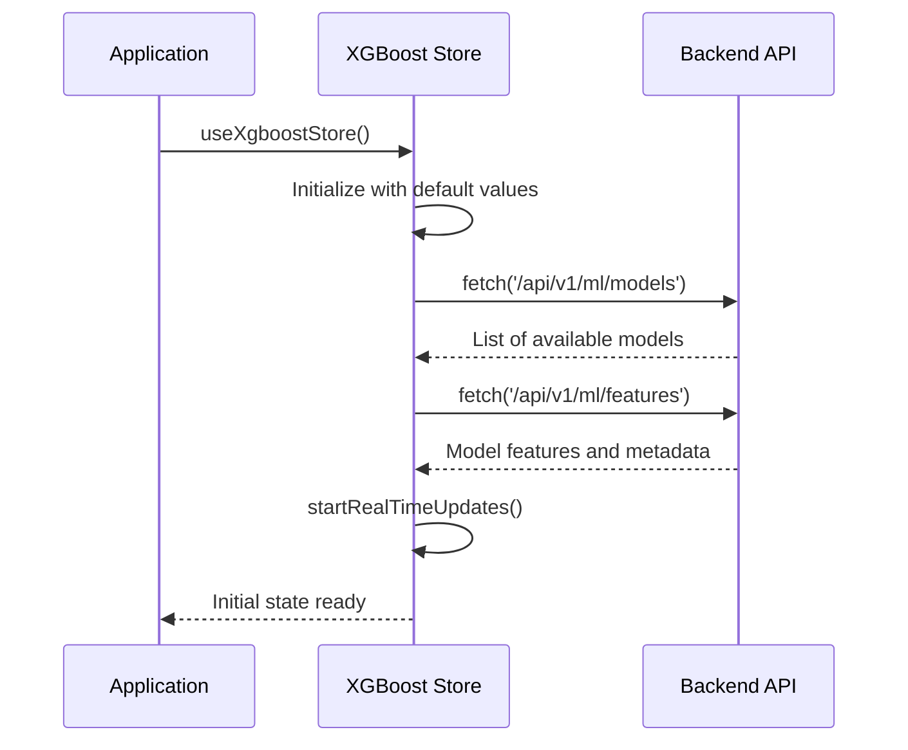
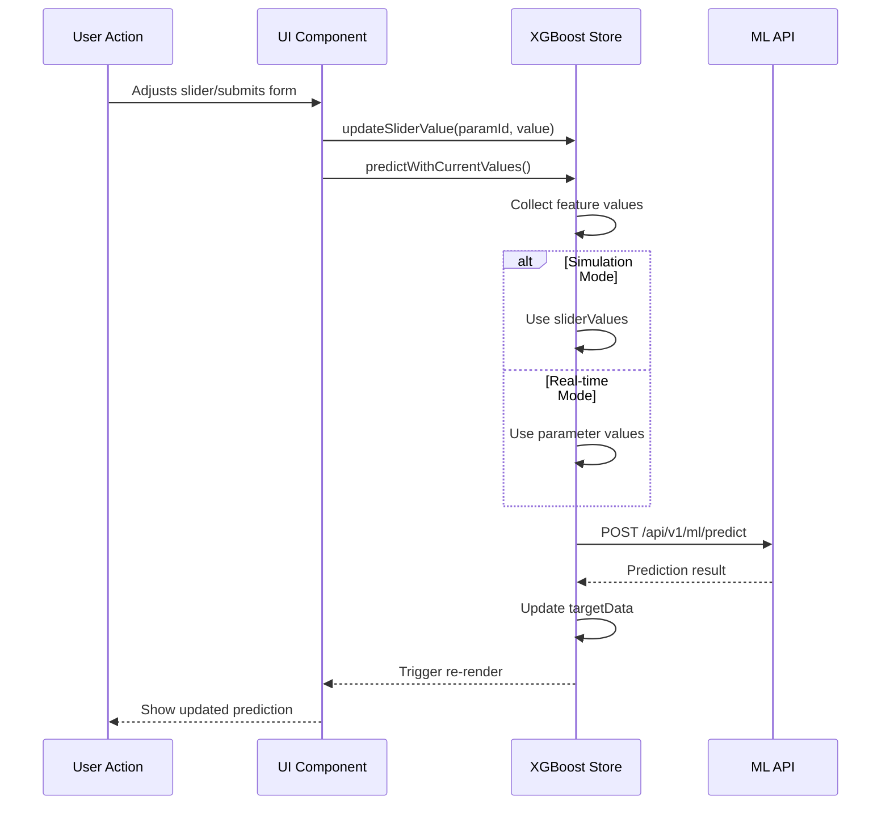
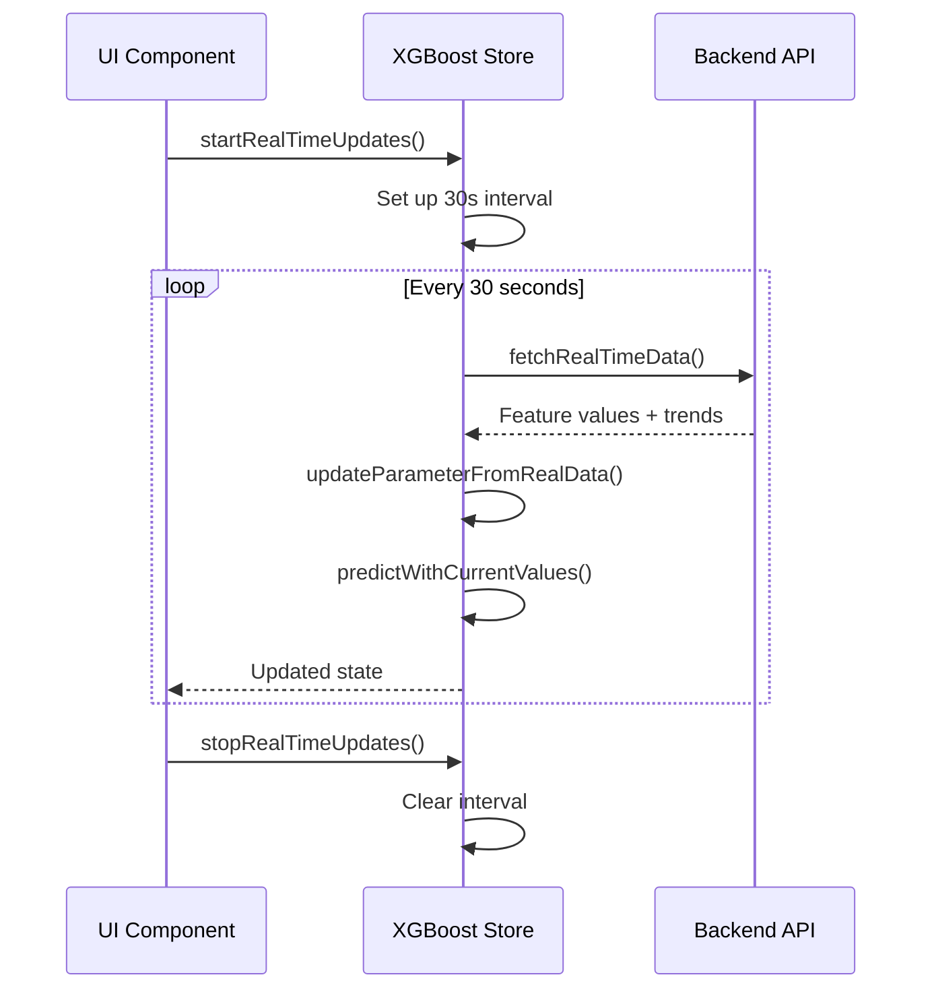
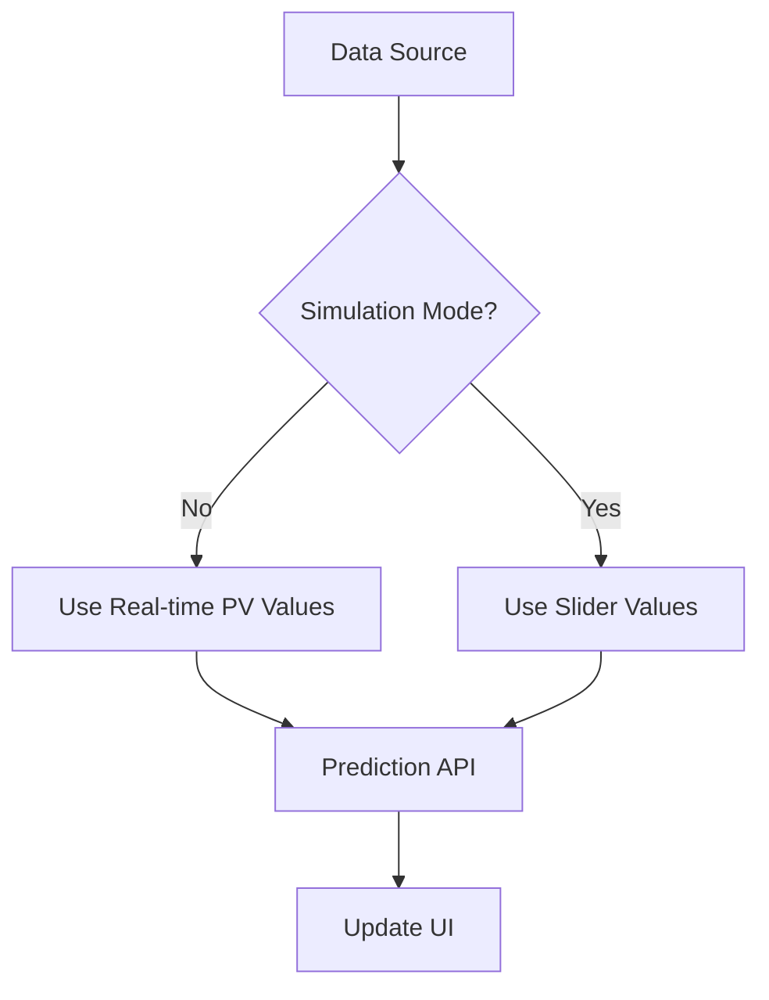

# XGBoost Store Documentation

## Overview

The `xgboost-store.ts` is the central state management module for the XGBoost Simulation Dashboard, built using [Zustand](https://github.com/pmndrs/zustand). It serves as the single source of truth for the application's state and business logic.

### Key Responsibilities

1. **State Management**: Manages application state including parameters, predictions, and UI states
2. **Data Flow**: Handles data fetching, transformation, and propagation
3. **Business Logic**: Implements core functionality like predictions and simulations
4. **Integration**: Connects with ML APIs and real-time data sources
5. **Performance**: Optimizes rendering through selective state subscriptions

### Technical Stack

- **Framework**: Next.js with TypeScript
- **State Management**: Zustand
- **Data Fetching**: Custom hooks (`useTagValue`, `useTagTrend`)
- **Styling**: Tailwind CSS
- **Visualization**: Recharts
- **API**: Custom ML API endpoints

## Table of Contents

1. [Core Concepts](#core-concepts)
2. [State Structure](#state-structure)
3. [Data Flow](#data-flow)
4. [Key Functions](#key-functions)
5. [Zustand Integration](#zustand-integration)
6. [Real-time Data Flow](#real-time-data-flow)
7. [Simulation Mode](#simulation-mode)
8. [Error Handling](#error-handling)
9. [Performance Considerations](#performance-considerations)
10. [Integration with Other Components](#integration-with-other-components)
11. [Advanced Usage](#advanced-usage)
12. [Testing Strategy](#testing-strategy)
13. [Debugging Guide](#debugging-guide)
14. [Future Improvements](#future-improvements)

The `xgboost-store.ts` is a state management module built with Zustand that handles the core logic for the XGBoost Simulation Dashboard. It manages the application state, including real-time data fetching, simulation mode, and prediction functionality.

## Table of Contents

1. [Core Concepts](#core-concepts)
2. [State Structure](#state-structure)
3. [Data Flow](#data-flow)
4. [Key Functions](#key-functions)
5. [Zustand Integration](#zustand-integration)
6. [Real-time Data Flow](#real-time-data-flow)
7. [Simulation Mode](#simulation-mode)
8. [Error Handling](#error-handling)
9. [Performance Considerations](#performance-considerations)

## Core Concepts

### Dual Data Source Architecture

The store implements a sophisticated dual data source pattern that enables seamless switching between real-time and simulation modes:

```typescript
// Simplified example of the dual data source pattern
const getParameterValue = (parameter: Parameter, state: XgboostState) => {
  return state.isSimulationMode
    ? state.sliderValues[parameter.id] ?? parameter.value
    : parameter.value;
};
```

**Real-time Mode**:

- Connects to the mill's data acquisition system
- Fetches live process values (PV) at regular intervals
- Updates the UI in real-time with current process conditions
- Used for monitoring and operational decision-making

**Simulation Mode**:

- Uses user-adjustable slider values for what-if analysis
- Enables testing different scenarios without affecting live processes
- Maintains separate state for slider values to preserve real-time data
- Allows for predictive analysis and optimization

### State Management with Zustand

The store leverages Zustand's powerful capabilities:

```typescript
// Store creation with middleware
const useXgboostStore = create<XgboostState>()(
  devtools((set, get) => ({
    // State and actions...
  }))
);
```

**Key Features**:

- **Type Safety**: Full TypeScript support for all state and actions
- **Middleware**: Extensible with devtools and persistence
- **Reactivity**: Components only re-render when their subscribed state changes
- **Simplicity**: No need for context providers or wrapping components

## State Structure

### Main State Interface

The `XgboostState` interface defines the complete shape of the store's state. Here's a detailed breakdown of each property:

```typescript
interface XgboostState {
  // Core Parameters
  parameters: Parameter[]; // Array of all process parameters
  parameterBounds: ParameterBounds; // Min/max bounds for parameters

  // Simulation State
  sliderValues: Record<string, number>; // User-adjusted values in simulation mode
  isSimulationMode: boolean; // Tracks the current mode
  simulationActive: boolean; // Whether simulation is actively running

  // Process Values
  currentTarget: number | null; // Current target value (SP)
  currentPV: number | null; // Current process value (PV)
  targetData: TargetData[]; // Historical data for trending

  // Model Configuration
  modelName: string; // Currently selected model
  availableModels: string[]; // List of available models
  modelFeatures: string[] | null; // Features used by current model
  modelTarget: string | null; // Target variable name
  lastTrained: string | null; // Timestamp of last model training

  // Real-time Data
  currentMill: number; // Currently selected mill (1-12)
  dataUpdateInterval: NodeJS.Timeout | null; // Interval for real-time updates

  // Actions and Methods
  updateParameter: (id: string, value: number) => void;
  fetchRealTimeData: () => Promise<void>;
  predictWithCurrentValues: () => Promise<void>;
  // ... other actions
}
```

### State Initialization

The store's initial state is defined when the store is created:

```typescript
const initialState = {
  parameters: [
    {
      id: "Ore",
      name: "Ore Feed",
      unit: "t/h",
      value: 0,
      trend: [],
      color: "#3b82f6", // blue-500
      icon: "⛏️",
    },
    // ... other parameters
  ],
  // ... other initial state
};
```

```typescript
interface XgboostState {
  // Parameters and their current values
  parameters: Parameter[];
  parameterBounds: ParameterBounds;

  // Slider values (separate from PV values)
  sliderValues: Record<string, number>;

  // Mode control
  isSimulationMode: boolean;

  // Target and prediction data
  currentTarget: number | null;
  currentPV: number | null;
  targetData: TargetData[];

  // Model configuration
  modelName: string;
  availableModels: string[];
  modelFeatures: string[] | null;
  modelTarget: string | null;
  lastTrained: string | null;

  // Real-time data settings
  currentMill: number;
  dataUpdateInterval: NodeJS.Timeout | null;

  // Actions and methods...
}
```

### Parameter Structure

```typescript
interface Parameter {
  id: string;
  name: string;
  unit: string;
  value: number;
  trend: Array<{ timestamp: number; value: number }>;
  color: string;
  icon: string;
}
```

### Target Data Structure

```typescript
interface TargetData {
  timestamp: number;
  value: number;
  target: number;
  pv: number;
  sp?: number | null; // Setpoint value
}
```

## Data Flow

### Initialization Flow

When the application starts, the store initializes with this sequence:



### Real-time Data Flow

The real-time data flow is the backbone of the application's live monitoring capabilities:

1. **Initialization**:

   ```typescript
   // In a React component:
   useEffect(() => {
     startRealTimeUpdates();
     return () => stopRealTimeUpdates();
   }, [startRealTimeUpdates]);
   ```

2. **Update Cycle**:
   - `startRealTimeUpdates()` sets up a 30-second interval
   - On each interval, `fetchRealTimeData()` is called
   - For each parameter, the store fetches current values and trends
   - State is updated with new values
   - UI components re-render with updated data

### Prediction Flow

The prediction flow is triggered by user interactions or real-time updates:



## Key Functions

### `fetchRealTimeData()`

This is the workhorse function that handles real-time data updates:

```typescript
const fetchRealTimeData = async () => {
  const state = get();
  const { currentMill, parameters, isSimulationMode } = state;
  const timestamp = Date.now();

  try {
    // Process each parameter in parallel
    await Promise.all(
      parameters.map(async (param) => {
        const tagId = getTagId(param.id, currentMill);
        if (!tagId) return;

        try {
          // Fetch current value
          const value = await fetchTagValue(tagId);

          // Fetch trend data (last hour)
          const trend = await fetchTagTrend(tagId, "1h");

          // Update parameter with new data
          updateParameterFromRealData(param.id, value, timestamp, trend);
        } catch (error) {
          console.error(`Error updating parameter ${param.id}:`, error);
        }
      })
    );

    // If in real-time mode, make a prediction with current values
    if (!isSimulationMode) {
      await predictWithCurrentValues();
    }
  } catch (error) {
    console.error("Error in fetchRealTimeData:", error);
  }
};
```

### `predictWithCurrentValues()`

Handles the prediction logic for both simulation and real-time modes:

```typescript
const predictWithCurrentValues = async () => {
  const state = get();
  const { parameters, isSimulationMode, sliderValues, modelName, currentMill } =
    state;

  try {
    // Prepare feature data based on current mode
    const features: Record<string, number> = {};
    parameters.forEach((param) => {
      features[param.id] = isSimulationMode
        ? sliderValues[param.id] ?? param.value
        : param.value;
    });

    // Make prediction API call
    const response = await mlApiClient.post<PredictionResponse>(
      "/api/v1/ml/predict",
      {
        model_id: modelName,
        mill_id: currentMill,
        features,
      }
    );

    // Process successful prediction
    if (response.data?.prediction !== undefined) {
      const prediction = response.data.prediction;
      const timestamp = Date.now();

      // Update state with new prediction
      set((prev) => ({
        currentTarget: prediction,
        targetData: [
          ...prev.targetData,
          {
            timestamp,
            value: prediction,
            target: prediction,
            sp: prediction,
            pv: prev.currentPV || 0,
          },
        ].slice(-50), // Keep last 50 data points
      }));
    }
  } catch (error) {
    console.error("Prediction failed:", error);
  }
};
```

### `updateParameterFromRealData()`

Updates parameter values while respecting simulation mode:

```typescript
const updateParameterFromRealData = (
  featureName: string,
  value: number,
  timestamp: number,
  trend: Array<{ timestamp: number; value: number }> = []
) => {
  set((state) => {
    // Find the parameter to update
    const paramIndex = state.parameters.findIndex((p) => p.id === featureName);
    if (paramIndex === -1) return state;

    const param = state.parameters[paramIndex];

    // Create updated parameter with new trend data
    const updatedParam: Parameter = {
      ...param,
      trend: [
        ...(trend.length > 0
          ? trend
          : [...param.trend, { timestamp, value }].slice(-50)), // Keep last 50 data points
      ],
    };

    // Only update the value if not in simulation mode
    if (!state.isSimulationMode) {
      updatedParam.value = value;
    }

    // Create new parameters array with updated parameter
    const newParameters = [...state.parameters];
    newParameters[paramIndex] = updatedParam;

    return { parameters: newParameters };
  });
};
```

### `resetFeatures()`

Resets all parameters to their default values while preserving the current mode:

```typescript
const resetFeatures = () => {
  set((state) => {
    // Reset parameters to their default values (middle of min/max range)
    const updatedParameters = state.parameters.map((param) => {
      const bounds = state.parameterBounds[param.id];
      const defaultValue = bounds ? (bounds.min + bounds.max) / 2 : 0;

      return {
        ...param,
        value: defaultValue,
        // Preserve trend data
        trend:
          param.trend.length > 0
            ? [...param.trend]
            : [{ timestamp: Date.now(), value: defaultValue }],
      };
    });

    // Reset slider values to match new parameter values
    const updatedSliderValues = { ...state.sliderValues };
    updatedParameters.forEach((param) => {
      updatedSliderValues[param.id] = param.value;
    });

    return {
      parameters: updatedParameters,
      sliderValues: updatedSliderValues,
    };
  });
};
```

### `startRealTimeUpdates()` and `stopRealTimeUpdates()`

Manages the real-time update interval:

```typescript
const startRealTimeUpdates = () => {
  // Clear any existing interval
  const state = get();
  if (state.dataUpdateInterval) {
    clearInterval(state.dataUpdateInterval);
  }

  // Initial data fetch
  fetchRealTimeData().catch(console.error);

  // Set up new interval (30 seconds)
  const interval = setInterval(() => {
    fetchRealTimeData().catch(console.error);
  }, 30000);

  // Store interval ID in state
  set({ dataUpdateInterval: interval });
};

const stopRealTimeUpdates = () => {
  const state = get();
  if (state.dataUpdateInterval) {
    clearInterval(state.dataUpdateInterval);
    set({ dataUpdateInterval: null });
  }
};
```

## Zustand Integration

The store leverages Zustand's powerful features for efficient state management. Here's a detailed look at how Zustand is integrated:

### Store Creation

```typescript
export const useXgboostStore = create<XgboostState>()(
  devtools(
    // persist(
    (set, get) => ({
      // State and actions...
    })
    // { name: "xgboost-simulation-storage" }
    // )
  )
);
```

### Middleware Usage

1. **DevTools Middleware**

   - Enables Redux DevTools integration for debugging
   - Provides time-travel debugging capabilities
   - Logs all state changes for inspection

2. **Persistence Middleware** (Commented out)
   - Can be enabled to persist state to localStorage
   - Supports custom serialization/deserialization
   - Useful for maintaining state across page refreshes

### State Management Patterns

1. **Immutable Updates**

   ```typescript
   // Using immer-like syntax with set
   set((state) => ({
     parameters: state.parameters.map((p) =>
       p.id === id ? { ...p, value } : p
     ),
   }));
   ```

2. **Batched Updates**

   ```typescript
   // Multiple state updates in a single set
   set({
     currentTarget: prediction,
     targetData: [...state.targetData, newData],
     // ...
   });
   ```

3. **Selectors for Performance**

   ```typescript
   // In component:
   const currentMill = useXgboostStore((state) => state.currentMill);

   // Memoized selector
   const getParameter = (id: string) =>
     useXgboostStore(
       useCallback((state) => state.parameters.find((p) => p.id === id), [id])
     );
   ```

## Real-time Data Flow



## Simulation Mode

### Key Behaviors

- Toggled via `setSimulationMode()`
- In simulation mode:
  - Slider values are used for predictions
  - Real-time data continues to update trends
  - User adjustments are preserved
- In real-time mode:
  - Process values (PVs) are used for predictions
  - Sliders are updated to reflect current PVs

### Architecture Overview



### Key Components

1. **State Management**
   ```typescript
   interface XgboostState {
     // Core state
     isSimulationMode: boolean;
     sliderValues: Record<string, number>;
     parameters: Parameter[];
     
     // Actions
     setSimulationMode: (isSimulation: boolean) => void;
     updateSliderValue: (id: string, value: number) => void;
     // ... other actions
   }
   ```

2. **Mode Switching**
   ```typescript
   // Toggle between real-time and simulation modes
   const toggleSimulationMode = () => {
     useXgboostStore.setState(prev => ({
       isSimulationMode: !prev.isSimulationMode
     }));   
   };
   ```

### Data Flow

1. **Real-time Mode**
   - Fetches live process values from OPC UA server
   - Updates parameter trends with real-time data
   - Uses actual PV values for predictions

2. **Simulation Mode**
   - Uses user-adjustable slider values
   - Preserves real-time data in read-only format
   - Enables what-if analysis without affecting live process

### Implementation Details

- `isSimulationMode` state controls data source
- `sliderValues` object stores user adjustments
- `updateParameterFromRealData` respects simulation mode

## Error Handling

Robust error handling is crucial for maintaining application stability and providing a good user experience. The XGBoost store implements a comprehensive error handling strategy that covers various scenarios.

### Error Types

1. **API Errors**
   - Failed network requests
   - Invalid responses
   - Authentication/authorization issues

2. **Data Validation Errors**
   - Invalid parameter values
   - Missing required fields
   - Type mismatches

3. **State Errors**
   - Inconsistent state
   - Race conditions
   - Invalid state transitions

### Error Handling Implementation

#### 1. API Error Handling

```typescript
// In xgboost-store.ts
const fetchRealTimeData = async () => {
  const state = get();
  
  try {
    // Set loading state
    set({ isLoading: true, error: null });
    
    // Fetch data
    const response = await fetchWithRetry(
      () => fetchDataFromAPI(),
      3, // max retries
      1000 // delay between retries
    );
    
    // Process successful response
    set({
      data: processResponse(response),
      lastUpdated: Date.now(),
      isLoading: false
    });
    
  } catch (error) {
    // Handle error
    console.error('Failed to fetch real-time data:', error);
    set({
      error: {
        message: 'Failed to load data. Please try again.',
        timestamp: Date.now(),
        details: error.message
      },
      isLoading: false
    });
    
    // Notify monitoring service
    logErrorToService(error, {
      context: 'fetchRealTimeData',
      state: getRelevantState()
    });
  }
};
```

#### 2. Error Boundary Component

```tsx
// ErrorBoundary.tsx
class ErrorBoundary extends React.Component<ErrorBoundaryProps, ErrorBoundaryState> {
  constructor(props: ErrorBoundaryProps) {
    super(props);
    this.state = { hasError: false, error: null };
  }

  static getDerivedStateFromError(error: Error) {
    return { hasError: true, error };
  }

  componentDidCatch(error: Error, errorInfo: React.ErrorInfo) {
    logErrorToService(error, { errorInfo });
  }

  render() {
    if (this.state.hasError) {
      return (
        <div className="error-boundary">
          <h2>Something went wrong</h2>
          <pre>{this.state.error?.toString()}</pre>
          <button onClick={() => window.location.reload()}>
            Reload Application
          </button>
        </div>
      );
    }

    return this.props.children;
  }
}

// Usage
<ErrorBoundary>
  <XgboostSimulationDashboard />
</ErrorBoundary>
```

### Error Recovery Strategies

1. **Automatic Retries**
   ```typescript
   const fetchWithRetry = async <T>(
     fn: () => Promise<T>,
     maxRetries = 3,
     delay = 1000
   ): Promise<T> => {
     let lastError: Error;
     
     for (let i = 0; i < maxRetries; i++) {
       try {
         return await fn();
       } catch (error) {
         lastError = error;
         if (i < maxRetries - 1) {
           await new Promise(resolve => setTimeout(resolve, delay * (i + 1)));
         }
       }
     }
     
     throw lastError!;
   };
   ```

2. **Fallback Values**
   ```typescript
   const getParameterValue = (id: string): number => {
     try {
       const param = get().parameters.find(p => p.id === id);
       if (!param) throw new Error(`Parameter ${id} not found`);
       return param.value;
     } catch (error) {
       console.error('Error getting parameter value:', error);
       return getDefaultParameterValue(id);
     }
   };
   ```

### Error Logging

1. **Client-Side Logging**
   ```typescript
   const logErrorToService = (
     error: Error,
     context: Record<string, any> = {}
   ) => {
     const errorInfo = {
       timestamp: new Date().toISOString(),
       message: error.message,
       stack: error.stack,
       context: {
         ...context,
         userAgent: navigator.userAgent,
         url: window.location.href,
         state: getRelevantState()
       }
     };
     
     // Send to error tracking service
     fetch('/api/log-error', {
       method: 'POST',
       headers: { 'Content-Type': 'application/json' },
       body: JSON.stringify(errorInfo)
     }).catch(console.error);
     
     console.error('Logged error:', errorInfo);
   };
   ```

2. **Error Boundaries with Context**
   ```tsx
   const ErrorBoundaryWithContext: React.FC<ErrorBoundaryProps> = ({
     children,
     context = {}
   }) => {
     return (
       <ErrorBoundary
         onError={(error, errorInfo) => {
           logErrorToService(error, { ...context, errorInfo });
         }}
       >
         {children}
       </ErrorBoundary>
     );
   };
   ```

### User Feedback

1. **Error Toast Notifications**
   ```tsx
   const showErrorToast = (message: string, options = {}) => {
     toast.error(message, {
       position: 'top-right',
       autoClose: 5000,
       hideProgressBar: false,
       closeOnClick: true,
       pauseOnHover: true,
       draggable: true,
       ...options
     });
   };
   
   // Usage
   try {
     await someAsyncOperation();
   } catch (error) {
     showErrorToast('Operation failed. Please try again.');
     throw error; // Re-throw for error boundaries
   }
   ```

2. **Error Recovery UI**
   ```tsx
   const DataDisplay = () => {
     const { data, error, isLoading, retry } = useData();
     
     if (isLoading) return <LoadingSpinner />;
     if (error) {
       return (
         <div className="error-state">
           <Alert variant="error">
             Failed to load data: {error.message}
           </Alert>
           <Button onClick={retry}>
             Retry
           </Button>
         </div>
       );
     }
     
     return <DataVisualization data={data} />;
   };
   ```

### Best Practices

1. **Error Boundaries**
   - Wrap component trees with error boundaries
   - Provide helpful error UIs
   - Log errors to monitoring services

2. **Graceful Degradation**
   - Show fallback UIs when features fail
   - Disable non-critical features that depend on failed operations
   - Provide clear recovery paths

3. **Monitoring and Alerting**
   - Track error rates and patterns
   - Set up alerts for critical errors
   - Monitor user impact

4. **Testing**
   - Test error scenarios
   - Verify error boundaries
   - Check error recovery flows
- TypeScript ensures type safety

## Performance Considerations

Optimizing performance is critical for a responsive user experience, especially when dealing with real-time data and complex state management. This section covers the key performance optimizations implemented in the XGBoost store.

### State Management Optimizations

1. **Selective State Subscriptions**
   ```typescript
   // Good: Component only re-renders when specific state changes
   const parameter = useXgboostStore(state => 
     state.parameters.find(p => p.id === 'Ore')
   );
   
   // Better: Memoize selector for complex computations
   const getFilteredParameters = useCallback(
     (filter) => useXgboostStore(
       state => state.parameters.filter(p => p.status === filter)
     ),
     [filter]
   );
   ```

2. **Batched Updates**
   ```typescript
   // Instead of multiple set calls
   set({ loading: true });
   set({ data: newData });
   set({ loading: false });
   
   // Batch updates in a single set
   set({
     loading: true,
     data: newData,
     loading: false
   });
   ```

3. **Throttling and Debouncing**
   ```typescript
   // Debounce rapid slider updates
   const updateParameterDebounced = useMemo(
     () => debounce((id: string, value: number) => {
       set(state => ({
         parameters: state.parameters.map(p => 
           p.id === id ? { ...p, value } : p
         )
       }));
     }, 300),
     []
   );
   ```

### Data Management

1. **Trend Data Limitation**
   ```typescript
   // Keep only the last 50 data points
   const addDataPoint = (newPoint) => {
     set(state => ({
       trendData: [...state.trendData.slice(-49), newPoint]
     }));
   };
   ```

2. **Efficient Data Structures**
   ```typescript
   // Use Maps for fast lookups
   const parameterMap = useMemo(
     () => new Map(parameters.map(p => [p.id, p])),
     [parameters]
   );
   
   // Use Sets for membership checks
   const activeParameterIds = useMemo(
     () => new Set(parameters.filter(p => p.isActive).map(p => p.id)),
     [parameters]
   );
   ```

### Rendering Optimizations

1. **Memoization**
   ```tsx
   // Memoize expensive calculations
   const processedData = useMemo(() => {
     return parameters.map(processParameter);
   }, [parameters]);
   
   // Memoize components
   const ParameterList = React.memo(({ parameters }) => (
     <div>
       {parameters.map(param => (
         <ParameterItem key={param.id} parameter={param} />
       ))}
     </div>
   ));
   ```

2. **Virtualized Lists**
   ```tsx
   // For long lists, use virtualization
   import { FixedSizeList as List } from 'react-window';
   
   const VirtualizedList = ({ items }) => (
     <List
       height={400}
       itemCount={items.length}
       itemSize={50}
       width="100%"
     >
       {({ index, style }) => (
         <div style={style}>
           {items[index].name}
         </div>
       )}
     </List>
   );
   ```

### Network Optimizations

1. **Request Deduplication**
   ```typescript
   // Cache in-flight requests
   const requestCache = new Map();
   
   async function fetchWithCache(url) {
     if (requestCache.has(url)) {
       return requestCache.get(url);
     }
     
     const promise = fetch(url).then(res => res.json());
     requestCache.set(url, promise);
     
     try {
       return await promise;
     } finally {
       requestCache.delete(url);
     }
   }
   ```

2. **Request Prioritization**
   ```typescript
   // Critical data first
   const fetchCriticalData = async () => {
     const [userPrefs, initialData] = await Promise.all([
       fetchUserPreferences(),
       fetchInitialData(),
     ]);
     
     // Load non-critical data after initial render
     requestIdleCallback(() => {
       fetchSecondaryData();
     });
     
     return { userPrefs, initialData };
   };
   ```

### Memory Management

1. **Cleanup Effects**
   ```typescript
   useEffect(() => {
     const interval = setInterval(updateData, 30000);
     
     // Cleanup function
     return () => {
       clearInterval(interval);
     };
   }, []);
   ```

2. **Event Listener Optimization**
   ```typescript
   useEffect(() => {
     const handleResize = debounce(() => {
       setDimensions({
         width: window.innerWidth,
         height: window.innerHeight,
       });
     }, 250);
     
     window.addEventListener('resize', handleResize);
     return () => window.removeEventListener('resize', handleResize);
   }, []);
   ```

### Performance Monitoring

1. **React DevTools Profiler**
   ```tsx
   import { Profiler } from 'react';
   
   const onRender = (id, phase, actualDuration) => {
     if (actualDuration > 100) {
       console.warn(`Slow render (${actualDuration}ms) in ${id}`);
     }
   };
   
   <Profiler id="Dashboard" onRender={onRender}>
     <Dashboard />
   </Profiler>
   ```

2. **Performance Metrics**
   ```typescript
   // Measure critical operations
   const measure = (label, fn) => {
     performance.mark(`${label}-start`);
     const result = fn();
     performance.mark(`${label}-end`);
     
     performance.measure(
       label,
       `${label}-start`,
       `${label}-end`
     );
     
     const measures = performance.getEntriesByName(label);
     console.log(`${label} took ${measures[0].duration}ms`);
     
     return result;
   };
   ```

### Best Practices

1. **Code Splitting**
   ```tsx
   // Lazy load non-critical components
   const HeavyComponent = React.lazy(() => import('./HeavyComponent'));
   
   function App() {
     return (
       <Suspense fallback={<div>Loading...</div>}>
         <HeavyComponent />
       </Suspense>
     );
   }
   ```

2. **Web Workers**
   ```typescript
   // Offload heavy computations to a web worker
   const worker = new Worker('worker.js');
   
   worker.postMessage({ type: 'COMPUTE', data: largeDataSet });
   
   worker.onmessage = (event) => {
     if (event.data.type === 'RESULT') {
       setResult(event.data.result);
     }
   };
   ```

3. **React.memo and useMemo**
   ```tsx
   // Only re-render when props change
   const ExpensiveComponent = React.memo(({ data }) => {
     // Component implementation
   }, (prevProps, nextProps) => {
     // Custom comparison function
     return prevProps.data.id === nextProps.data.id;
   });
   
   // Memoize expensive calculations
   const processedData = useMemo(() => {
     return processLargeDataset(data);
   }, [data]);
   ```

4. **Avoid Inline Functions**
   ```tsx
   // Bad: Creates new function on every render
   <button onClick={() => handleClick(id)}>Click me</button>
   
   // Good: Memoize callback
   const handleClick = useCallback((id) => {
     // Handle click
   }, []);
   
   <button onClick={handleClick}>Click me</button>
   ```

These performance optimizations ensure that the XGBoost dashboard remains responsive and efficient, even when dealing with large datasets and frequent updates.

## Troubleshooting

### Common Issues

1. **Missing Data**

   - Verify model features are loaded
   - Check API connectivity
   - Validate tag mappings

2. **Stale State**

   - Ensure proper cleanup of intervals
   - Check for race conditions
   - Verify Zustand middleware setup

3. **Performance Problems**
   - Limit re-renders with selectors
   - Optimize data structures
   - Profile component updates

## Future Improvements

1. **State Persistence**

   - Enable Zustand persistence
   - Add versioning for state migrations

2. **Enhanced Error Handling**

   - User-facing error messages
   - Retry mechanisms
   - Fallback behaviors

3. **Performance Optimizations**
   - Virtualized lists for trend data
   - WebSocket for real-time updates
   - Selective data subscriptions
