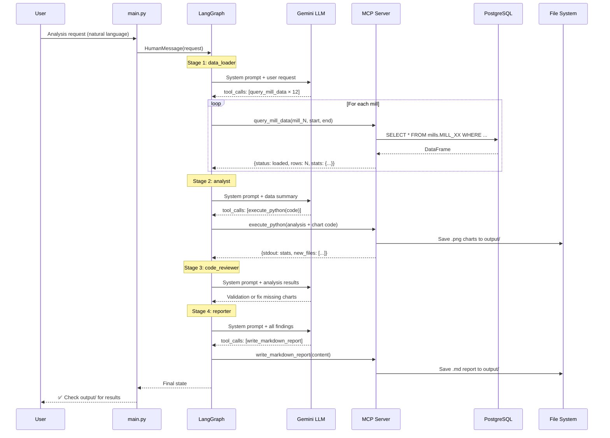

# Architecture Overview

## System Purpose

The **Agentic Data Analysis System** is a multi-agent pipeline that autonomously analyzes process data from an ore dressing factory with **12 ball mills**. Given a natural-language request (e.g. _"Compare average ore load across all mills for the last 72 hours"_), the system:

1. Loads the relevant data from PostgreSQL
2. Performs statistical analysis and generates charts
3. Reviews the output for quality
4. Writes a comprehensive Markdown report with embedded charts

The system is built on two core technologies:

- **MCP (Model Context Protocol)** — for tool communication between the LLM agents and the server-side capabilities (database queries, Python execution, file I/O)
- **LangGraph** — for orchestrating the multi-agent workflow with deterministic stage progression and quality assurance loops

---

## High-Level Architecture

```
┌─────────────────────────────────────────────────────────────────────┐
│                          main.py (Entry Point)                      │
│  • Loads API key from .env                                          │
│  • Opens MCP session to server on :8003                             │
│  • Fetches tool descriptors via client.py                           │
│  • Builds LangGraph and runs analysis requests                      │
└──────────────────────────────┬──────────────────────────────────────┘
                               │
            ┌──────────────────┴──────────────────┐
            │                                     │
            ▼                                     ▼
┌───────────────────────┐            ┌────────────────────────────┐
│   LangGraph Pipeline  │            │    MCP Server (:8003)      │
│   (graph_v2.py)       │◄──HTTP────►│    (server.py)             │
│                       │            │                            │
│  ┌─────────────────┐  │            │  ┌──────────────────────┐  │
│  │  data_loader     │  │            │  │  tools/db_tools.py   │  │
│  │  analyst         │  │            │  │  • get_db_schema     │  │
│  │  code_reviewer   │  │            │  │  • query_mill_data   │  │
│  │  reporter        │  │            │  │  • query_combined    │  │
│  │  manager (QA)    │  │            │  ├──────────────────────┤  │
│  └─────────────────┘  │            │  │  tools/python_exec.  │  │
│                       │            │  │  • execute_python     │  │
│  State: messages,     │            │  ├──────────────────────┤  │
│  current_stage,       │            │  │  tools/report_tools  │  │
│  stage_attempts       │            │  │  • list_output_files  │  │
└───────────────────────┘            │  │  • write_markdown_rpt│  │
                                     │  └──────────────────────┘  │
                                     │                            │
                                     │  In-Memory Store:          │
                                     │  _dataframes dict          │
                                     │  (mill_data_1 ... _12)     │
                                     └────────────┬───────────────┘
                                                  │
                                                  ▼
                                     ┌────────────────────────────┐
                                     │  PostgreSQL                │
                                     │  em_pulse_data database    │
                                     │                            │
                                     │  mills.MILL_01 ... _12     │
                                     │  mills.ore_quality         │
                                     └────────────────────────────┘
```

---

## Component Roles

### 1. `main.py` — Orchestrator Entry Point

The glue that wires everything together:

- Reads `GOOGLE_API_KEY` from `.env`
- Connects to the MCP server via `streamable_http_client`
- Calls `client.get_mcp_tools()` to fetch LangChain-compatible tool wrappers
- Calls `graph_v2.build_graph()` to construct the LangGraph state machine
- Runs demo analysis requests through `graph.ainvoke()`

### 2. `client.py` — MCP-to-LangChain Bridge

Converts MCP tool descriptors into LangChain `StructuredTool` objects:

- Fetches tool list from the MCP server session
- Converts each tool's JSON Schema into a Pydantic model (`args_schema`)
- Wraps each tool call in an async closure that calls `session.call_tool()`
- Returns a `list[BaseTool]` ready for LangGraph's tool binding

### 3. `server.py` — MCP Server

A low-level MCP server running on **port 8003** using Starlette + uvicorn:

- Registers `list_tools` and `call_tool` handlers
- Uses `StreamableHTTPSessionManager` for HTTP-based MCP transport
- Dispatches tool calls to handlers registered in `tools/__init__.py`
- Stateless — all state lives in the in-memory DataFrame store

### 4. `graph_v2.py` — LangGraph Multi-Agent Pipeline

The core intelligence — a hybrid deterministic + QA workflow:

- **4 specialist agents**: data_loader, analyst, code_reviewer, reporter
- **1 manager agent**: reviews output after each stage, can request rework
- Each specialist has **bound tools** (only the tools it needs)
- **Focused context builder** prevents token overflow between stages
- Uses **Google Gemini** (gemini-3.1-flash-lite-preview) as the LLM

### 5. `tools/` — Server-Side Tool Implementations

| Tool                    | File                 | Purpose                                |
| ----------------------- | -------------------- | -------------------------------------- |
| `get_db_schema`         | `db_tools.py`        | Inspect database tables and columns    |
| `query_mill_data`       | `db_tools.py`        | Load mill sensor data into memory      |
| `query_combined_data`   | `db_tools.py`        | Load mill + ore quality data (joined)  |
| `execute_python`        | `python_executor.py` | Run Python code with pandas/matplotlib |
| `list_output_files`     | `report_tools.py`    | List generated charts and reports      |
| `write_markdown_report` | `report_tools.py`    | Write final .md report to disk         |

### 6. `api_endpoint.py` — FastAPI REST Integration (Future)

Exposes the system as a REST API for UI integration:

- `POST /api/v1/agentic/analyze` — submit analysis request
- `GET /api/v1/agentic/status/{id}` — check progress
- `GET /api/v1/agentic/reports` — list generated files
- `GET /api/v1/agentic/reports/{filename}` — download file

---

## Data Flow



---

## Key Design Decisions

### Why MCP?

The **Model Context Protocol** separates tool execution from agent logic:

- The LLM agents in LangGraph never touch the database or filesystem directly
- All side effects go through the MCP server, which can be secured, rate-limited, and monitored independently
- Tools can be developed and tested in isolation from the agent logic
- The same MCP server can serve multiple clients (CLI, API, future UI)

### Why LangGraph over CrewAI / AutoGen?

- **Deterministic stage order** — the pipeline always runs data_loader → analyst → code_reviewer → reporter (no LLM deciding the order)
- **Fine-grained control** — per-specialist tool binding, custom routing, state management
- **Rework loops** — the manager can send a specialist back exactly once without risking infinite loops
- **Message control** — focused context building prevents token overflow from 12 parallel tool results

### Why Per-Specialist Tool Binding?

Each agent only sees the tools relevant to its role:

| Agent         | Bound Tools                                               |
| ------------- | --------------------------------------------------------- |
| data_loader   | `query_mill_data`, `query_combined_data`, `get_db_schema` |
| analyst       | `execute_python`, `list_output_files`                     |
| code_reviewer | `execute_python`, `list_output_files`                     |
| reporter      | `list_output_files`, `write_markdown_report`              |

This prevents the LLM from calling wrong tools (e.g. reporter trying to load data) and simplifies the decision space for more reliable tool calling.

### Why Focused Context?

Without context management, loading 12 mills produces ~12 large JSON tool results that flood the analyst's context window. The `build_focused_context` function:

1. Always includes the original user request
2. Summarizes prior stages compactly (data loaded, stats, chart files)
3. Keeps only current stage's own messages and tool results intact
4. Applies message compression (truncation + windowing)

---

## Database Schema

The system works with the **em_pulse_data** PostgreSQL database:

### `mills.MILL_XX` (XX = 01..12)

Minute-level time-series sensor data from each ball mill:

| Column     | Type      | Unit  | Description                    |
| ---------- | --------- | ----- | ------------------------------ |
| TimeStamp  | timestamp | —     | Primary key / index            |
| Ore        | float     | t/h   | Ore feed rate                  |
| WaterMill  | float     | m³/h  | Water feed to mill             |
| WaterZumpf | float     | m³/h  | Water to sump                  |
| Power      | float     | kW    | Mill motor power               |
| ZumpfLevel | float     | %     | Sump level                     |
| PressureHC | float     | bar   | Hydrocyclone pressure          |
| DensityHC  | float     | g/cm³ | Hydrocyclone density           |
| FE         | float     | %     | Iron content                   |
| PulpHC     | float     | %     | Pulp density at HC             |
| PumpRPM    | float     | RPM   | Pump speed                     |
| MotorAmp   | float     | A     | Motor current                  |
| PSI80      | float     | μm    | 80th percentile particle size  |
| PSI200     | float     | μm    | 200th percentile particle size |

### `mills.ore_quality`

Lab-measured ore quality data (lower frequency):

| Column    | Type      | Description            |
| --------- | --------- | ---------------------- |
| TimeStamp | timestamp | Measurement time       |
| Shift     | text      | Shift identifier       |
| Class_15  | float     | +15mm class percentage |
| Class_12  | float     | +12mm class percentage |
| Grano     | float     | Granodiorite content   |
| Daiki     | float     | Dacite content         |
| Shisti    | float     | Schist content         |

---

## File Structure

```
python/agentic/
├── .env                    # API keys and DB credentials
├── main.py                 # Entry point — wires MCP + LangGraph
├── client.py               # MCP → LangChain tool bridge
├── server.py               # MCP server on :8003
├── graph_v2.py             # LangGraph multi-agent pipeline (v2)
├── graph.py                # Original graph (v1, deprecated)
├── api_endpoint.py         # FastAPI REST endpoint (future UI)
├── requirements.txt        # Python dependencies
├── README.md               # Quick-start guide
├── tools/
│   ├── __init__.py         # Tool registry
│   ├── db_tools.py         # Database query tools
│   ├── python_executor.py  # Python code execution tool
│   └── report_tools.py     # File listing + report writing tools
├── output/                 # Generated charts (.png) and reports (.md)
└── docs/                   # This documentation
    ├── 01-architecture.md  # System overview (this file)
    ├── 02-graph-pipeline.md
    ├── 03-tools-reference.md
    ├── 04-prompts-and-agents.md
    └── 05-deployment-and-usage.md
```
