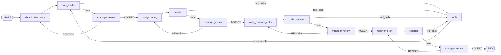

# LangGraph Pipeline — Stages, Routing & State

## Overview

The pipeline in `graph_v2.py` implements a **hybrid deterministic + QA** workflow. The stage order is fixed (no LLM decides "who goes next"), but after each stage a **manager agent** reviews the output and can send the specialist back for one rework attempt.

---

## Pipeline Stages



### Stage Descriptions

| #   | Stage             | Role                                                | Tools Available                                           |
| --- | ----------------- | --------------------------------------------------- | --------------------------------------------------------- |
| 1   | **data_loader**   | Load data from PostgreSQL into in-memory DataFrames | `query_mill_data`, `query_combined_data`, `get_db_schema` |
| 2   | **analyst**       | Perform statistical analysis, generate charts       | `execute_python`, `list_output_files`                     |
| 3   | **code_reviewer** | Validate outputs, fix missing charts                | `execute_python`, `list_output_files`                     |
| 4   | **reporter**      | Write comprehensive Markdown report                 | `list_output_files`, `write_markdown_report`              |

---

## Graph State

The graph uses a custom state type extending LangGraph's `MessagesState`:

```python
class AnalysisState(MessagesState):
    current_stage: str          # Which stage is currently active
    stage_attempts: dict        # {stage_name: attempt_count} for rework tracking
```

- **`messages`** (inherited) — the full conversation history. LangGraph uses an **append-only reducer**, meaning you return new messages and they get appended; you cannot delete or replace messages.
- **`current_stage`** — set by `stage_entry` nodes (e.g. `"analyst"`). Used by routing functions to determine which specialist is active.
- **`stage_attempts`** — dictionary tracking how many times each stage has been reviewed. Prevents infinite rework loops.

---

## Node Types

The graph contains **four types of nodes**:

### 1. Stage Entry Nodes

```
data_loader_entry, analyst_entry, code_reviewer_entry, reporter_entry
```

Simple nodes that set `current_stage` in the state. Created by `make_stage_entry(stage_name)`.

```python
def make_stage_entry(stage_name: str):
    def entry_node(state: AnalysisState) -> dict:
        return {"current_stage": stage_name}
    return entry_node
```

### 2. Specialist Nodes

```
data_loader, analyst, code_reviewer, reporter
```

Created by `make_specialist_node(name)`. Each specialist:

1. Counts its own iterations (capped at `MAX_SPECIALIST_ITERS = 5`)
2. Builds **focused context** — filters messages to only what this stage needs
3. Calls the LLM with its system prompt + focused context
4. Normalizes Gemini's response format (list → string)
5. Returns the LLM response as a named `AIMessage`

The specialist may return:

- **With `tool_calls`** → routes to the `tools` node
- **Without `tool_calls`** → routes to `manager_review`

### 3. Tools Node

A single shared `tool_node` that dispatches tool calls:

1. Reads `tool_calls` from the last `AIMessage`
2. Looks up each tool by name in the tool registry
3. Calls `tool.ainvoke(args)` asynchronously
4. Returns `ToolMessage` results

After tool execution, control returns to whichever specialist initiated the call (determined by `after_tools` router).

### 4. Manager Review Node

The `manager_review_node` evaluates the specialist's output:

- **data_loader** → auto-accepted (always `ACCEPT: Data loaded successfully`)
- **Other stages** → LLM-based review using `MANAGER_REVIEW_PROMPT`
- **Max reworks reached** → auto-accepted (`ACCEPT: Max reworks reached`)

The manager response is stamped with either `ACCEPT:` or `REWORK:` prefix for deterministic routing.

---

## Routing Functions

### `specialist_router(state) → "tools" | "manager_review"`

After a specialist produces output:

- If the last message has `tool_calls` → go to `"tools"`
- Otherwise → go to `"manager_review"`

### `after_tools(state) → stage_name`

After tool execution, finds the specialist that made the tool call by walking backward through messages. Returns control to that specialist (e.g. `"analyst"`).

### `manager_router(state) → "{stage}_entry" | "end"`

After manager review:

- If content starts with `"REWORK:"` → route to `"{current_stage}_entry"` for another attempt
- Otherwise → advance to next stage's entry, or `END` if all stages complete

---

## Tool-Call Loop

Each specialist can make **multiple tool calls** across iterations:

```
specialist (iter 1) → tool_calls → tools → specialist (iter 2) → tool_calls → tools → specialist (iter 3) → done → manager_review
```

The iteration counter prevents runaway loops:

```python
iteration = sum(1 for m in state["messages"] if getattr(m, "name", None) == name) + 1
if iteration > MAX_SPECIALIST_ITERS:  # MAX = 5
    return AIMessage(content=f"[{name}] Done (iteration cap). Moving on.")
```

---

## Rework Loop

The manager can send a specialist back **at most once** (`MAX_REWORKS_PER_STAGE = 1`):

```
specialist → manager_review → REWORK → specialist_entry → specialist → manager_review → ACCEPT (or force-accept)
```

The `stage_attempts` dictionary tracks this:

```python
if attempt_count >= MAX_REWORKS_PER_STAGE:
    return AIMessage(content=f"ACCEPT: Max reworks reached for {current}.")
```

---

## Focused Context Builder

The `build_focused_context(all_msgs, stage_name)` function is critical for preventing **context overflow**. When loading 12 mills, the data_loader produces ~12 large JSON tool results. Without filtering, these would flood the analyst's context window and cause the LLM to fail.

### What each specialist receives:

```
┌─────────────────────────────────────────────┐
│  Messages sent to LLM                       │
│                                             │
│  1. SystemMessage(specialist_prompt)        │
│  2. HumanMessage(original user request)     │
│  3. HumanMessage(prior stage summary)  *    │
│  4. This stage's own AIMessages             │
│  5. This stage's own ToolMessages           │
│                                             │
│  * Only if prior stages exist               │
└─────────────────────────────────────────────┘
```

### How it works:

1. **Identify own tool calls** — scan messages for AIMessages with `name == stage_name` that have `tool_calls`, collect their `tool_call_id`s
2. **User request** — always the first `HumanMessage` in the conversation
3. **Own messages** — any `AIMessage` or `ToolMessage` belonging to this stage
4. **Prior stages** — summarized compactly:
   - `query_mill_data` results → first 150 chars each
   - `execute_python` results → first 800 chars each
   - Other agent text → first 300 chars each
   - Manager REWORK feedback for this stage → kept in full
5. **Compression** — `compress_messages()` truncates tool outputs to `MAX_TOOL_OUTPUT_CHARS=2000` and AI messages to `MAX_AI_MSG_CHARS=3000`, keeps last `MAX_MESSAGES_WINDOW=14` messages

---

## Message Helpers

### `normalize_content(content) → str`

Gemini sometimes returns content as a list of dicts instead of a string:

```python
# Input:  [{"type": "text", "text": "Hello"}]
# Output: "Hello"
```

### `compress_messages(messages) → messages`

Applies three transformations:

1. **Windowing** — keeps first message + last N messages
2. **Tool output truncation** — caps at `MAX_TOOL_OUTPUT_CHARS`
3. **AI message truncation** — caps at `MAX_AI_MSG_CHARS`

### `strip_tool_messages(messages) → messages`

Used only for the **manager review** (which has no tools bound):

- Converts `ToolMessage` → `AIMessage` with `[Tool result from ...]` prefix
- Strips `tool_calls` from `AIMessage`s (keeps only text content)

---

## Configuration Constants

```python
GEMINI_MODEL = "gemini-3.1-flash-lite-preview"

MAX_TOOL_OUTPUT_CHARS = 2000   # Truncate tool results
MAX_AI_MSG_CHARS = 3000        # Truncate AI responses
MAX_MESSAGES_WINDOW = 14       # Keep last N messages in context
MAX_SPECIALIST_ITERS = 5       # Max tool-call loops per specialist
MAX_REWORKS_PER_STAGE = 1      # Manager can rework each stage once
```

---

## Complete Execution Trace (Example)

For the request _"Compare ore load across all mills for the last 72 hours"_:

```
1.  data_loader_entry     → set current_stage = "data_loader"
2.  data_loader (iter 1)  → LLM returns 12× query_mill_data tool calls
3.  tools                 → executes 12 queries, stores mill_data_1..12
4.  data_loader (iter 2)  → LLM summarizes: "Loaded 10 mills, 1440 rows each"
5.  manager_review        → auto-ACCEPT for data_loader
6.  analyst_entry         → set current_stage = "analyst"
7.  analyst (iter 1)      → LLM calls execute_python with comparison code
8.  tools                 → runs code, saves bar_chart.png, prints stats
9.  analyst (iter 2)      → LLM calls execute_python for histograms
10. tools                 → runs code, saves histograms.png
11. analyst (iter 3)      → "Analysis complete. Stats: ..."
12. manager_review        → ACCEPT (charts exist, stats present)
13. code_reviewer_entry   → set current_stage = "code_reviewer"
14. code_reviewer (iter 1)→ calls list_output_files, sees charts
15. code_reviewer (iter 2)→ "All outputs validated."
16. manager_review        → ACCEPT
17. reporter_entry        → set current_stage = "reporter"
18. reporter (iter 1)     → calls list_output_files
19. reporter (iter 2)     → calls write_markdown_report with full report
20. reporter (iter 3)     → "Report written."
21. manager_review        → ACCEPT
22. END
```

Total graph steps: ~22 nodes visited, within the `recursion_limit=100`.
