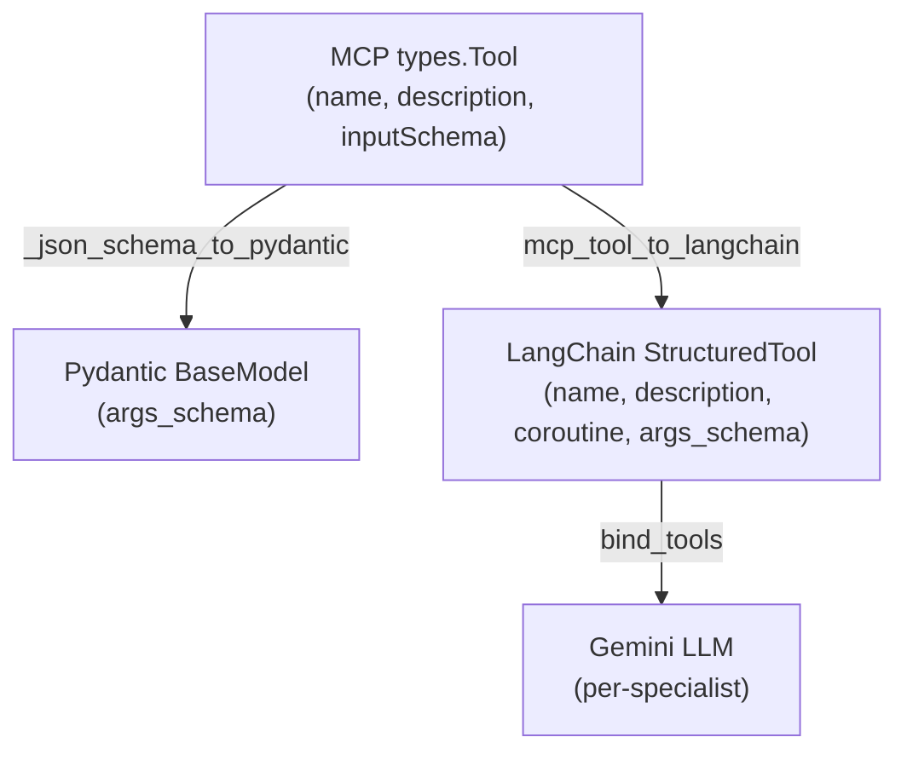

# Tools Reference

## Overview

All tools are registered on the **MCP server** (`server.py`, port 8003) and exposed to LangGraph agents via the MCP client bridge (`client.py`). Tools live in the `tools/` directory and follow a consistent pattern:

1. **Tool descriptor** (`types.Tool`) — name, description, JSON Schema for inputs
2. **Handler function** (`async def`) — executes the tool and returns `list[types.TextContent]`
3. **Registry entry** in `tools/__init__.py` — maps name → {tool, handler}


---

## Tool 1: `get_db_schema`

**File:** `tools/db_tools.py`
**Purpose:** Inspect the database schema to understand available tables and columns.
**Bound to:** `data_loader`

### Input Schema

| Parameter     | Type   | Required | Description                                    |
| ------------- | ------ | -------- | ---------------------------------------------- |
| `schema_name` | string | No       | Database schema to inspect. Default: `"mills"` |

### Output

Returns a JSON object with:

```json
{
  "schema": "mills",
  "tables": ["MILL_01", "MILL_02", ..., "ore_quality", ...],
  "table_count": 37,
  "column_details": {
    "MILL_01": ["TimeStamp", "Ore", "WaterMill", ...],
    "MILL_02": "same columns as MILL_01",
    "ore_quality": ["TimeStamp", "Shift", "Class_15", ...]
  },
  "usage_hint": "Use query_mill_data(mill_number=N) to load data."
}
```

### Notes

- Uses SQLAlchemy `inspect()` for introspection
- Only shows full column list for one sample MILL table (compact output)
- MOTIFS tables are noted as "ML training data" and not expanded

---

## Tool 2: `query_mill_data`

**File:** `tools/db_tools.py`
**Purpose:** Load time-series sensor data for a specific mill into the in-memory DataFrame store.
**Bound to:** `data_loader`

### Input Schema

| Parameter     | Type    | Required | Description                                                |
| ------------- | ------- | -------- | ---------------------------------------------------------- |
| `mill_number` | integer | **Yes**  | Mill number (1–12)                                         |
| `start_date`  | string  | No       | Start date in ISO format (e.g. `"2026-03-08"`)             |
| `end_date`    | string  | No       | End date in ISO format (e.g. `"2026-03-11"`)               |
| `store_name`  | string  | No       | DataFrame store name. Default: `"mill_data_{mill_number}"` |

### SQL Query Generated

```sql
SELECT * FROM mills."MILL_08"
WHERE "TimeStamp" >= '2026-03-08'
  AND "TimeStamp" <= '2026-03-11'
ORDER BY "TimeStamp"
```

### Output

```json
{
  "status": "loaded",
  "store_name": "mill_data_8",
  "mill_number": 8,
  "rows": 4320,
  "columns": ["Ore", "WaterMill", "WaterZumpf", ...],
  "date_range": {"start": "2026-03-08 00:00:00", "end": "2026-03-10 23:59:00"},
  "key_stats": {
    "Ore": {"mean": 185.42, "std": 32.17},
    "PSI80": {"mean": 72.31, "std": 8.45}
  }
}
```

### Data Flow

```
PostgreSQL → pd.read_sql_query() → df.set_index("TimeStamp") → _dataframes["mill_data_8"]
```

### Important Details

- **Auto-naming:** If `store_name` is not provided, defaults to `mill_data_{mill_number}` — this prevents overwriting when loading multiple mills
- **SQL-level filtering:** The `start_date` and `end_date` are pushed into the SQL WHERE clause for efficient queries (no full-table scans)
- **TimeStamp as index:** The DataFrame uses `TimeStamp` as its index for time-series operations
- **Compact return:** Only key statistics are returned to the LLM, not the full DataFrame
- **Empty handling:** Returns `{"status": "empty", "message": "..."}` if no data matches the filter

---

## Tool 3: `query_combined_data`

**File:** `tools/db_tools.py`
**Purpose:** Load mill sensor data joined with ore quality lab data.
**Bound to:** `data_loader`

### Input Schema

| Parameter     | Type    | Required | Description                                      |
| ------------- | ------- | -------- | ------------------------------------------------ |
| `mill_number` | integer | **Yes**  | Mill number (1–12)                               |
| `start_date`  | string  | No       | Start date ISO format                            |
| `end_date`    | string  | No       | End date ISO format                              |
| `store_name`  | string  | No       | DataFrame store name. Default: `"combined_data"` |

### How the Join Works

```
MILL_XX (minute-level)  ←─ LEFT JOIN ─→  ore_quality (lab data)
                              ON TimeStamp index
```

- Mill data is loaded first, then ore quality data is loaded separately
- Join is a **left join** on the TimeStamp index
- Ore quality columns added: `Shisti`, `Daiki`, `Grano`, `Class_12`, `Class_15`
- Duplicated timestamps in ore_quality are deduplicated (keep first)

### Output

Same format as `query_mill_data`, plus:

```json
{
  "ore_quality_joined": true
}
```

---

## Tool 4: `execute_python`

**File:** `tools/python_executor.py`
**Purpose:** Execute arbitrary Python code for data analysis with access to loaded DataFrames.
**Bound to:** `analyst`, `code_reviewer`

### Input Schema

| Parameter | Type   | Required | Description            |
| --------- | ------ | -------- | ---------------------- |
| `code`    | string | **Yes**  | Python code to execute |

### Execution Namespace

The code runs in a sandboxed namespace with these pre-injected variables:

| Variable       | Type      | Description                                              |
| -------------- | --------- | -------------------------------------------------------- |
| `df`           | DataFrame | The first loaded DataFrame (convenience alias)           |
| `get_df(name)` | function  | Get any named DataFrame: `get_df("mill_data_8")`         |
| `list_dfs()`   | function  | Returns `{name: (rows, cols)}` for all loaded DataFrames |
| `pd`           | module    | pandas                                                   |
| `np`           | module    | numpy                                                    |
| `plt`          | module    | matplotlib.pyplot                                        |
| `sns`          | module    | seaborn                                                  |
| `scipy_stats`  | module    | scipy.stats                                              |
| `os`           | module    | os                                                       |
| `json`         | module    | json                                                     |
| `OUTPUT_DIR`   | str       | Path to `agentic/output/` for saving charts              |

### Example Code (sent by analyst)

```python
print("Loaded DataFrames:", list_dfs())

sns.set_theme(style='whitegrid', font_scale=1.2)

# Build comparison data
stats = {}
for i in range(1, 13):
    df_mill = get_df(f'mill_data_{i}')
    if df_mill is not None:
        ore = df_mill['Ore']
        ore_active = ore[ore >= 50]  # exclude downtime
        stats[f'Mill {i}'] = {
            'mean': ore_active.mean(),
            'std': ore_active.std()
        }

summary = pd.DataFrame(stats).T
print(summary.to_string())

# Bar chart
fig, ax = plt.subplots(figsize=(14, 7))
summary['mean'].plot(kind='bar', ax=ax, color='steelblue')
ax.set_ylabel('Ore Feed Rate (t/h)')
ax.set_title('Average Ore Load by Mill (Last 72h, Excl. Downtime)')
plt.savefig(os.path.join(OUTPUT_DIR, 'ore_comparison.png'), dpi=150, bbox_inches='tight')
plt.close()
```

### Output

```json
{
  "stdout": "Loaded DataFrames: {'mill_data_1': (4320, 13), ...}\n         mean    std\nMill 1   185.42  32.17\n...",
  "new_files": ["ore_comparison.png"],
  "loaded_dataframes": {"mill_data_1": [4320, 13], "mill_data_2": [4320, 13], ...}
}
```

### Important Details

- **matplotlib backend:** Uses `Agg` (non-interactive) — no display windows
- **stdout capture:** All `print()` output is captured and returned (capped at 8000 chars)
- **New file detection:** Compares output directory before/after execution to detect new files
- **Error handling:** Python exceptions are caught and returned in `result["error"]` (capped at 4000 chars)
- **Figure cleanup:** `plt.close("all")` is called in `finally` block to prevent memory leaks
- **Security note:** This is for internal use — code runs with full Python access

---

## Tool 5: `list_output_files`

**File:** `tools/report_tools.py`
**Purpose:** List all generated files in the `output/` directory.
**Bound to:** `analyst`, `code_reviewer`, `reporter`

### Input Schema

| Parameter          | Type   | Required | Description                                |
| ------------------ | ------ | -------- | ------------------------------------------ |
| `extension_filter` | string | No       | Filter by extension: `"png"`, `"md"`, etc. |

### Output

```json
{
  "count": 3,
  "files": [
    { "name": "ore_comparison.png", "size_kb": 145.2 },
    { "name": "ore_histograms.png", "size_kb": 198.7 },
    { "name": "mill_analysis_report.md", "size_kb": 12.3 }
  ]
}
```

---

## Tool 6: `write_markdown_report`

**File:** `tools/report_tools.py`
**Purpose:** Write a Markdown report file to the `output/` directory.
**Bound to:** `reporter`

### Input Schema

| Parameter  | Type   | Required | Description                                          |
| ---------- | ------ | -------- | ---------------------------------------------------- |
| `filename` | string | **Yes**  | Report filename (e.g. `"mill_comparison_report.md"`) |
| `content`  | string | **Yes**  | Full Markdown content                                |

### Output

```json
{
  "status": "written",
  "file": "mill_comparison_report.md",
  "path": "/path/to/agentic/output/mill_comparison_report.md",
  "size_kb": 12.3,
  "lines": 185
}
```

### Notes

- Automatically appends `.md` extension if missing
- Images in the report should be referenced as `` — same directory

---

## In-Memory DataFrame Store

All data tools share a global dictionary `_dataframes` in `db_tools.py`:

```python
_dataframes: dict[str, pd.DataFrame] = {}
```

### Store API

| Function                  | Description                                                |
| ------------------------- | ---------------------------------------------------------- |
| `set_dataframe(df, name)` | Store a DataFrame under a name                             |
| `get_dataframe(name)`     | Retrieve a DataFrame by name (returns `None` if not found) |
| `list_dataframes()`       | Returns `{name: (rows, cols)}` for all stored DataFrames   |

### Naming Convention

When loading multiple mills, each gets a unique name:

```
mill_data_1, mill_data_2, ..., mill_data_12
```

The `execute_python` tool accesses these via:

```python
df = get_df("mill_data_8")     # specific mill
all_dfs = list_dfs()            # see what's available
```

### Lifecycle

- DataFrames persist for the **duration of the server process**
- They are **not cleared** between analysis runs (restart server for fresh state)
- The `df` variable in `execute_python` auto-points to the first available DataFrame

---

## MCP-to-LangChain Bridge (`client.py`)

The bridge converts MCP tool descriptors to LangChain `StructuredTool` objects:



### Key Implementation Details

1. **JSON Schema → Pydantic:** Converts `inputSchema` properties to Pydantic fields with correct Python types (`integer→int`, `number→float`, `boolean→bool`, default `str`)
2. **Required fields:** Schema `required` list determines which fields use `...` (required) vs `None` (optional)
3. **Async closure:** Each tool's call function captures the MCP `session` object, calling `session.call_tool()` at invocation time
4. **None filtering:** `clean_kwargs = {k: v for k, v in kwargs.items() if v is not None}` removes optional params that weren't provided
