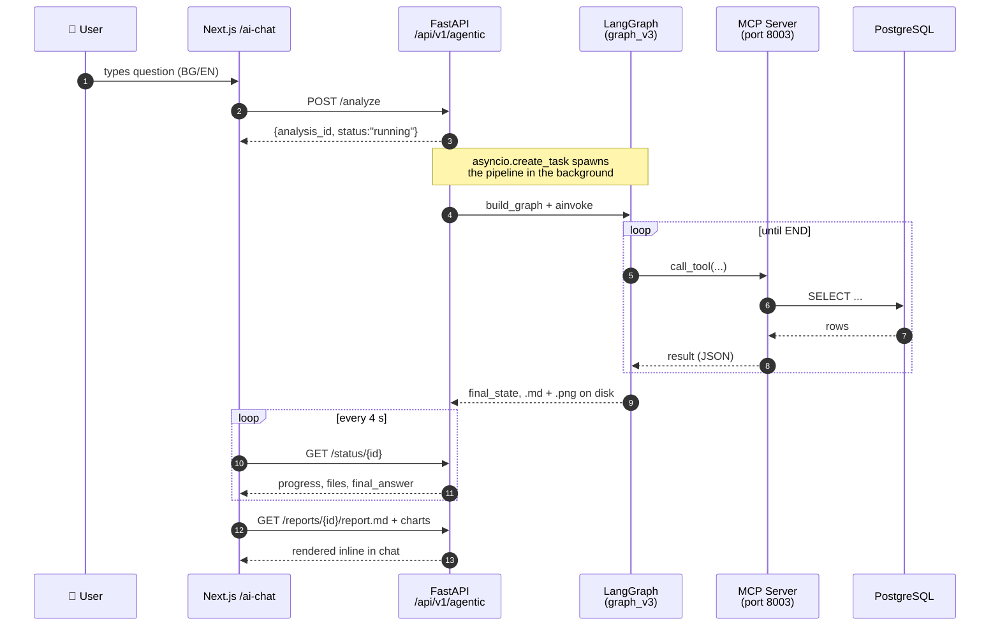

# 01 — Overview

## TL;DR — what is this?

Imagine a junior data scientist who never sleeps, knows the plant by heart, can
write Python on demand, and produces a polished Markdown report with charts in
2–5 minutes. That's what this subsystem is. Under the hood it is **not one** AI
agent but a **team** of six specialised ones, coordinated by a planner and
reviewed by a manager.

## What the system does

The agentic subproject turns a **free-form Bulgarian/English question** from a plant
operator or process engineer into a **full Markdown report** with embedded charts,
statistics, anomalies and recommendations.

Typical requests:

- _"Направи пълен анализ на мелница 8 за последните 72 часа."_
- _"Сравни натоварването по руда на всички 12 мелници за изминалата седмица."_
- _"Има ли аномалии в PSI200 и каква е причината?"_
- _"Прогнозирай PSI80 за следващите 8 часа."_

Under the hood a **planner** LLM decides which of six specialist agents should run,
each specialist produces charts + statistics, a **manager** reviews each stage,
and a **reporter** writes the final `.md` report.

## High-level user flow

**Reading the diagram:** numbered steps run top-to-bottom. The user only sees
the green "polls every 4 seconds" loop on the right; everything else happens
asynchronously on the server.

## Major concepts

| Concept            | Where it lives                  | In one sentence                                                                                                        |
| ------------------ | ------------------------------- | ---------------------------------------------------------------------------------------------------------------------- |
| **MCP tool**       | `tools/*.py`                    | A server-side function (DB query, Python exec, report write) exposed to any MCP client.                                |
| **LangChain tool** | built at startup by `client.py` | The same MCP tool wrapped so LangGraph's LLMs can call it.                                                             |
| **Specialist**     | `graph_v3.py` nodes             | An LLM persona (analyst, forecaster, anomaly_detective, …) with its own system prompt and tool set.                    |
| **Skill**          | `skills/*.py`                   | A pure-Python helper (e.g. `skills.spc.xbar_chart`) used inside `execute_python` so agents don't re-write boilerplate. |
| **Template**       | `analysis_templates.py`         | A fixed specialist sequence that bypasses the planner for common intents.                                              |
| **Analysis ID**    | `api_endpoint.py`               | 8-char UUID; drives the per-analysis output subfolder `output/{id}/`.                                                  |

## What the user sees

1. **Progress messages** (Bulgarian) — streamed via the `progress[]` array on the
   status endpoint: "Зареждане на данни...", "Анализатор: Статистически анализ...",
   "✓ Генериране на отчет завърши."
2. **Chart gallery** — every `.png` saved to `output/{id}/` is served back.
3. **Markdown report** — rendered inline in the chat bubble with `react-markdown`;
   image references are rewritten so they go through the `/reports/{id}/{file}` proxy.
4. **Follow-up** — user can ask a follow-up on any completed analysis; the follow-up
   graph has access to the same dataframes and output folder.

## What the system is _not_

- It is not a production-grade Python sandbox. `execute_python` runs agent-generated
  code in-process with full builtins. Only operate it inside a trusted network.
- It is not real-time. A typical comprehensive analysis takes 2–5 minutes end-to-end,
  dominated by LLM latency.
- It does not train ML models. Use `python/mills-xgboost/` for that; the agentic
  system only **loads** data and analyses it statistically.
