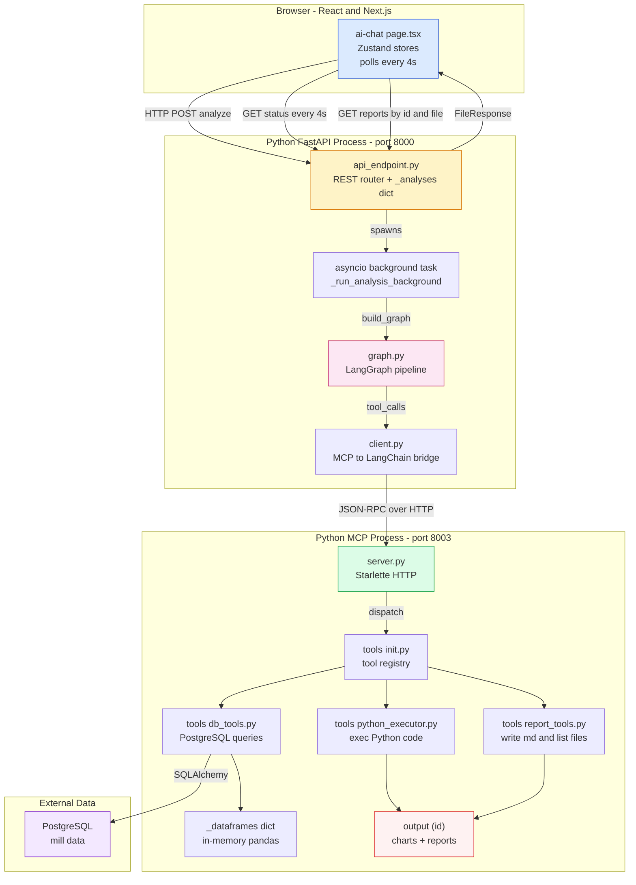
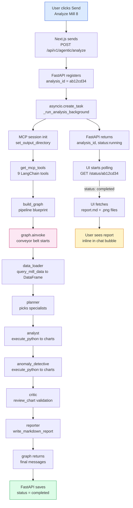

# 02 — Architecture (Beginner Edition)

> **Goal:** You will know which process runs which code, where data lives, and why the system is split into two Python programs.

---

## One diagram, three boxes

**How to read it:**

- **Browser** = the React app the user clicks and types in.
- **FastAPI Process** = the web server. It receives HTTP requests, spawns background tasks, and serves files back.
- **MCP Process** = the tool server. It never talks to the browser directly. It only talks to the FastAPI process via a private HTTP connection.
- **PostgreSQL** = the plant database with years of mill sensor data.

## Why two Python processes?

Imagine a restaurant kitchen with two rooms:

| Room                        | Job                                                                 | Who works there    |
| --------------------------- | ------------------------------------------------------------------- | ------------------ |
| **Front kitchen** (FastAPI) | Takes orders, tells customers when food is ready, handles payments. | Waiters, cashier.  |
| **Back kitchen** (MCP)      | Actually cooks the food, stores ingredients, writes recipes.        | Chefs, prep cooks. |

The front kitchen does not know how to cook. It just passes notes to the back kitchen through a small window (the MCP connection).

**In our code:**

- **Front kitchen** = `api_endpoint.py` + `graph.py`. It decides what analysis to run and in what order.
- **Back kitchen** = `server.py` + `tools/*.py`. It loads data from PostgreSQL, runs Python code, and writes chart files.

**Why not one big program?**

1. **Memory isolation.** The MCP server loads huge pandas DataFrames. If it crashes, the FastAPI process stays alive and can tell the user "Something went wrong, please retry."
2. **Tool reuse.** The MCP server speaks a standard protocol (MCP). We could connect Claude Desktop, a CLI tool, or another LangChain app to the same server without writing new code.
3. **State management.** The MCP server is **stateful** (DataFrames stay in memory between tool calls). The FastAPI process is **stateless** (each request is independent, except for the `_analyses` cache).

## Data flow: a single request

**The key insight:** The UI and the analysis run in parallel. The UI does not wait. It gets an ID immediately, then checks back every 4 seconds.

## Where does each piece of data live?

| Data                       | Lives in        | Format                    | Who owns it             | Survives restart? |
| -------------------------- | --------------- | ------------------------- | ----------------------- | ----------------- |
| Raw mill sensor rows       | PostgreSQL      | SQL tables                | Database server         | Yes               |
| Loaded DataFrames          | MCP process     | pandas DataFrame (memory) | `tools/db_tools.py`     | No                |
| `_dataframes` dict         | MCP process     | Python dict of DataFrames | `tools/db_tools.py`     | No                |
| `_current_output_dir`      | MCP process     | string path               | `tools/output_dir.py`   | No                |
| Analysis status + progress | FastAPI process | `_analyses` dict          | `api_endpoint.py`       | No                |
| Analysis status + history  | SQLite file     | SQL tables                | `analyses_db` (db.py)   | Yes               |
| Charts and reports         | Disk            | `.png` / `.md` files      | `tools/report_tools.py` | Yes               |
| Conversation list cache    | Browser         | localStorage JSON         | `chat-store.ts`         | Yes (per browser) |

> ⚠️ **Important:** Because `_dataframes` and `_current_output_dir` are global variables in the MCP process, running two analyses at the same time on the same MCP server would overwrite each other's data. The current design assumes one analysis at a time per MCP server.

## The three protocols

The system uses three different communication styles:

| Protocol                     | Used between            | What it carries                         |
| ---------------------------- | ----------------------- | --------------------------------------- |
| **HTTP REST**                | Browser ↔ FastAPI       | JSON requests/responses, file downloads |
| **MCP (JSON-RPC over HTTP)** | FastAPI ↔ MCP server    | Tool calls and results                  |
| **SQL (SQLAlchemy)**         | MCP server ↔ PostgreSQL | Raw mill data queries                   |

**Why not just one protocol?**

- REST is perfect for browser-to-server request/response.
- MCP is perfect for "I have a set of tools, please discover and run them."
- SQL is perfect for asking the database for 100,000 rows.

Each layer uses the tool best suited to its job.

---

## Why LangGraph instead of one big AI prompt?

You might think: "Why not just send the user's question to Gemini and ask for a full report?"

Three reasons:

1. **Context window is too small.** A full analysis might generate 50,000 words of intermediate output. Gemini can only read ~20 messages at a time. LangGraph breaks the work into stages and only shows each specialist the relevant context.
2. **One specialist cannot do everything.** A forecaster needs time-series math. An anomaly detective needs isolation forests. A shift reporter needs shift schedules. Each specialist has a different system prompt and a different set of allowed tools.
3. **Quality control.** The manager review node acts like a senior engineer checking a junior's work. If the chart is wrong, the specialist reworks it before the reporter writes the final report.

---

## Summary: one sentence per file

| File                       | One-sentence job                                         |
| -------------------------- | -------------------------------------------------------- |
| `server.py`                | Runs the tool server on port 8003.                       |
| `client.py`                | Translates MCP tools into LangChain tools.               |
| `tools/__init__.py`        | The registry: name → handler.                            |
| `tools/db_tools.py`        | Fetches mill data from PostgreSQL into DataFrames.       |
| `tools/python_executor.py` | Runs AI-generated Python code in a persistent namespace. |
| `tools/report_tools.py`    | Writes `.md` reports and lists output files.             |
| `graph.py`                 | Builds the multi-agent pipeline with dynamic routing.    |
| `api_endpoint.py`          | FastAPI router: HTTP in, background tasks out.           |
| `page.tsx`                 | React chat page: sidebar, messages, input.               |
| `chat-store.ts`            | Zustand store: conversations, polling, message updates.  |

---

> **Next step:** `03_mcp_deep_dive.md` to see the exact code inside `server.py` and `client.py`, or `07_request_lifecycle.md` to trace one real request from button-click to chart.
