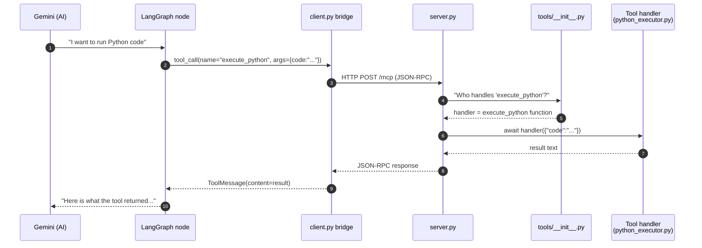
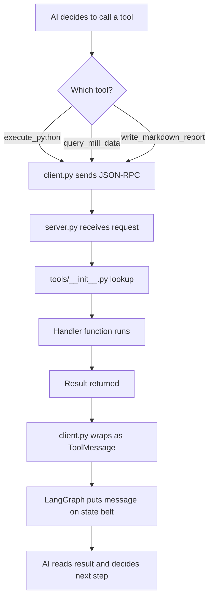

# 03 — MCP Deep Dive: server.py, client.py, and the Tool Registry

> **Goal:** You will understand exactly how a tool call travels from the AI brain to the Python function that executes it, line by line.

---

## The journey of one tool call



Every number above is a real line of code. Let's walk through them.

---

## Part 1: The MCP Server — `server.py`

`server.py` is a tiny Starlette web app. Its only job is to say "I have these tools" and "I will run the one you ask for."

### Lines 23–31: imports and the tool registry

```python
from mcp.server.lowlevel import Server
from mcp.server.streamable_http_manager import StreamableHTTPSessionManager
from starlette.applications import Starlette
from starlette.routing import Mount
import uvicorn

from tools import tools   # <-- this is the registry from tools/__init__.py
```

- `Server` = the MCP library's base server class.
- `StreamableHTTPSessionManager` = wraps that server so it speaks HTTP instead of stdio.
- `tools` = a plain Python dictionary: `{ "execute_python": {"tool": ..., "handler": ...}, ... }`

### Lines 35–42: lifespan hook

```python
@asynccontextmanager
async def server_lifespan(server: Server) -> AsyncIterator[dict]:
    print("🏭 Agentic Data Analysis MCP Server starting...")
    print(f"   Tools registered: {list(tools.keys())}")
    try:
        yield {}
    finally:
        print("🏭 Agentic Data Analysis MCP Server shutting down.")
```

This is just startup/shutdown logging. When you run `python server.py`, you see the list of available tools printed to the console.

### Lines 47–62: the two heartbeats of MCP

Every MCP server must answer exactly two questions:

1. **What tools do you have?** → `@server.list_tools()`
2. **Run this tool for me.** → `@server.call_tool()`

```python
server = Server("agentic-data-analysis-server", lifespan=server_lifespan)

@server.list_tools()
async def handle_list_tools() -> list[types.Tool]:
    return [entry["tool"] for entry in tools.values()]

@server.call_tool()
async def handle_call_tool(name: str, arguments: dict[str, Any]) -> list[types.TextContent]:
    if name not in tools:
        raise ValueError(f"Unknown tool: {name}")
    handler = tools[name]["handler"]
    return await handler(arguments)
```

**How to read this:**
- `handle_list_tools` builds a list of tool **descriptors** (name, description, JSON schema for arguments). It does NOT run anything.
- `handle_call_tool` looks up the tool name in the dictionary, grabs the `handler` function, and calls it with the arguments the AI provided.

**There is zero domain logic here.** If you add a new tool tomorrow, you only edit `tools/__init__.py`; `server.py` never changes. That is the whole point of MCP.

### Lines 67–88: HTTP transport

```python
session_manager = StreamableHTTPSessionManager(server)

@asynccontextmanager
async def app_lifespan(app: Starlette):
    async with session_manager.run():
        print("🚀 MCP Server is running on port 8003 (/mcp)")
        yield

app = Starlette(
    routes=[Mount("/mcp", app=session_manager.handle_request)],
    lifespan=app_lifespan,
)

if __name__ == "__main__":
    uvicorn.run(app, host="0.0.0.0", port=8003)
```

- `StreamableHTTPSessionManager` creates a long-lived HTTP connection at `http://localhost:8003/mcp`.
- Both tool-list requests and tool-call requests travel over this single connection as JSON-RPC frames.
- `uvicorn` is the web server that actually listens on port 8003.

---

## Part 2: The Tool Registry — `tools/__init__.py`

This is the simplest file in the system and also the most important.

```python
from tools.db_tools import (
    get_db_schema_tool, get_db_schema,
    query_mill_data_tool, query_mill_data,
    ...
)
from tools.python_executor import (
    execute_python_tool, execute_python,
)
...

tools = {
    get_db_schema_tool.name:            {"tool": get_db_schema_tool,            "handler": get_db_schema},
    query_mill_data_tool.name:          {"tool": query_mill_data_tool,          "handler": query_mill_data},
    execute_python_tool.name:           {"tool": execute_python_tool,           "handler": execute_python},
    list_output_files_tool.name:        {"tool": list_output_files_tool,        "handler": list_output_files},
    write_markdown_report_tool.name:    {"tool": write_markdown_report_tool,    "handler": write_markdown_report},
    set_output_directory_tool.name:     {"tool": set_output_directory_tool,     "handler": set_output_directory},
    get_domain_knowledge_tool.name:     {"tool": get_domain_knowledge_tool,     "handler": get_domain_knowledge},
    list_skills_tool.name:              {"tool": list_skills_tool,              "handler": list_skills},
    run_skill_tool.name:                {"tool": run_skill_tool,                "handler": run_skill},
    review_chart_tool.name:             {"tool": review_chart_tool,             "handler": review_chart},
}
```

**Pattern:** For every tool there are **two objects**:
1. **`xxx_tool`** — a `types.Tool` descriptor (name, description, JSON schema). Used by `handle_list_tools`.
2. **`xxx`** — the actual async Python function that does the work. Used by `handle_call_tool`.

Both are imported from the same module, but they are separate objects.

---

## Part 3: The Bridge — `client.py`

LangGraph does not speak MCP natively. It speaks **LangChain**, which expects tools to be `StructuredTool` objects with Pydantic argument schemas.

`client.py` is a translator: MCP → LangChain.

### Lines 22–23: connection address

```python
SERVER_URL = os.getenv("MCP_SERVER_URL", "http://localhost:8003/mcp")
```

The FastAPI process looks for an environment variable; if missing, it assumes the MCP server is on the same machine at port 8003.

### Lines 27–47: JSON Schema → Pydantic

```python
def _json_schema_to_pydantic(schema: dict, model_name: str) -> Type[BaseModel]:
    properties = schema.get("properties", {})
    required = set(schema.get("required", []))

    field_definitions: dict[str, Any] = {}
    for prop_name, prop_meta in properties.items():
        json_type = prop_meta.get("type", "string")
        python_type = {"integer": int, "number": float, "boolean": bool}.get(json_type, str)
        if prop_name in required:
            field_definitions[prop_name] = (python_type, ...)
        else:
            field_definitions[prop_name] = (Optional[python_type], None)

    return create_model(model_name, **field_definitions)
```

**What this does:**
- MCP tools describe their arguments as JSON Schema (e.g., `"code": {"type": "string"}`).
- LangChain needs a Pydantic class (e.g., `class ExecutePythonInput(BaseModel): code: str`).
- This function builds that class dynamically at runtime.

### Lines 50–73: wrapping one tool

```python
def mcp_tool_to_langchain(tool: mcp_types.Tool, session: ClientSession) -> BaseTool:
    args_schema = _json_schema_to_pydantic(tool.inputSchema, model_name=tool.name)

    async def _call(**kwargs: Any) -> str:
        clean_kwargs = {k: v for k, v in kwargs.items() if v is not None}
        result = await session.call_tool(name=tool.name, arguments=clean_kwargs)
        if result.isError:
            error_text = result.content[0].text if result.content else "Unknown error"
            return f"Error: {error_text}"
        return result.content[0].text

    return StructuredTool.from_function(
        coroutine=_call,
        name=tool.name,
        description=tool.description,
        args_schema=args_schema,
    )
```

**Step by step:**
1. Build the Pydantic schema from the tool's JSON schema.
2. Create a `_call` closure that captures the live `session`.
3. Inside `_call`, strip out any `None` values (LLMs sometimes send nulls for optional args).
4. Call `session.call_tool` — this sends the JSON-RPC request over HTTP to `server.py`.
5. If the MCP server returns an error, prefix it with `"Error:"` so the AI knows something broke.
6. Otherwise return the text result.
7. Wrap `_call` as a `StructuredTool` so LangGraph can hand it to Gemini.

### Lines 78–93: the public API

```python
async def get_mcp_tools(session: ClientSession) -> list[BaseTool]:
    tools_result = await session.list_tools()
    langchain_tools = [mcp_tool_to_langchain(t, session) for t in tools_result.tools]
    print("Tools loaded from MCP server:")
    for t in langchain_tools:
        print(f"  - {t.name}: {t.description[:80]}...")
    return langchain_tools
```

Called once at the start of every analysis. It asks the MCP server "what do you have?", then wraps every tool.

---

## Part 4: The most important tool — `python_executor.py`

When the AI says "I want to analyze this data," it does not analyze it itself. It writes a Python script and asks `execute_python` to run it.

### Lines 27–94: the scientific kitchen

```python
import matplotlib.pyplot as plt
import numpy as np
import pandas as pd
import seaborn as sns
from scipy import stats as scipy_stats

_ADVANCED_LIBS = {}

try:
    from prophet import Prophet
    _ADVANCED_LIBS["Prophet"] = Prophet
except ImportError:
    pass

try:
    import statsmodels.api as _sm
    _ADVANCED_LIBS["sm"] = _sm
except ImportError:
    pass
...
```

The module tries to import many scientific libraries. If a library is missing, it is simply skipped. This means the AI can generate code using Prophet, statsmodels, scikit-learn, SHAP, etc., and as long as the library is installed, it works.

### Lines 102–129: REPL-style namespaces

```python
_PERSISTENT_NAMESPACES: dict[str, dict] = {}

_STD_INJECTED_NAMES = {
    "df", "get_df", "list_dfs", "list_skills",
    "pd", "np", "plt", "sns", "scipy_stats", "os", "json",
    "OUTPUT_DIR", "PLANT_SPECS", "SHIFTS", "MILL_NAMES", "OEE_CONFIG",
    "get_spec_limits", "__builtins__",
}

def _get_persistent_namespace(analysis_id: str) -> dict:
    ns = _PERSISTENT_NAMESPACES.get(analysis_id)
    if ns is None:
        ns = {}
        _PERSISTENT_NAMESPACES[analysis_id] = ns
    return ns
```

**What is a namespace?** In Python, a namespace is just a dictionary of variable names → values. When you run `x = 5`, Python stores `"x": 5` in the current namespace.

**Why persist it?** Imagine the AI runs two tool calls:
1. `df = get_df("mill_8")`  — loads data
2. `result = df.describe()` — analyzes it

Call 2 needs the variable `df` created in Call 1. By keeping a persistent namespace per `analysis_id`, the executor behaves like a Jupyter notebook: variables survive between calls.

**Why `_STD_INJECTED_NAMES`?** These are the "sacred" names we always re-inject fresh (pandas, numpy, etc.). User code is allowed to create any other variable name.

### Lines 142–200: the tool descriptor

```python
execute_python_input_schema = {
    "type": "object",
    "properties": {
        "code": {
            "type": "string",
            "description": (
                "Python code to execute...\n"
                "  - df: the default loaded DataFrame\n"
                "  - get_df(name): get any named DataFrame\n"
                "  - list_dfs(): list all loaded DataFrames\n"
                ...
            ),
        },
        "analysis_id": {"type": "string", "description": "..."},
    },
    "required": ["code"],
}
```

This schema is what the AI sees when it decides whether to call `execute_python`. It tells the AI: "You must give me a `code` string. Optionally, give me an `analysis_id` so I know which namespace to use."

### Lines 200+ (handler): executing the code

```python
async def execute_python(arguments: dict) -> list[types.TextContent]:
    code = arguments.get("code", "")
    analysis_id = arguments.get("analysis_id", "default")

    # 1. Get (or create) the persistent namespace for this analysis
    user_ns = _get_persistent_namespace(analysis_id)

    # 2. Build a fresh namespace that merges user vars + injected libs
    exec_ns = dict(user_ns)
    exec_ns.update(_ADVANCED_LIBS)
    exec_ns.update({
        "df": get_dataframe("default"),
        "get_df": get_dataframe,
        "list_dfs": list_dataframes,
        ...
    })

    # 3. Capture stdout
    old_stdout = sys.stdout
    sys.stdout = buffer = io.StringIO()

    try:
        exec(code, exec_ns)          # <-- THE ACTUAL EXECUTION
    except Exception:
        buffer.write(traceback.format_exc())
    finally:
        sys.stdout = old_stdout

    output = buffer.getvalue()

    # 4. Save any new user variables back to persistent namespace
    for name, value in exec_ns.items():
        if name not in _STD_INJECTED_NAMES:
            user_ns[name] = value

    # 5. Return stdout + new_files list
    ...
```

**Step by step:**
1. Look up the analysis ID. If this is the first call, create an empty namespace.
2. Build a temporary execution namespace that contains:
   - All user variables from previous calls
   - All injected libraries (pandas, numpy, etc.)
   - Convenience aliases (`df`, `get_df`, `list_dfs`)
3. Redirect `print()` output into a memory buffer (`io.StringIO`).
4. Run the code with `exec(code, exec_ns)`. If it crashes, capture the traceback.
5. Copy any new variables the user code created back into the persistent namespace.
6. Return the captured stdout as a text message.

**Security note:** `exec` runs with full Python builtins. This is safe inside a trusted network but should be sandboxed if exposed publicly.

---

## Part 5: Database tools — `tools/db_tools.py`

The AI cannot talk to PostgreSQL directly. It talks to `query_mill_data`, which is a tool handler that:

1. Builds a SQL query using SQLAlchemy
2. Runs `pd.read_sql_query`
3. Stores the resulting DataFrame in `_dataframes[alias]`
4. Returns a compact summary (shape, columns, date range, key stats)

The summary is what the AI actually reads. The full DataFrame stays in memory on the MCP server and is used by `execute_python` via `get_df(alias)`.

---

## Summary flowchart



---

> **Next step:** `04_langgraph_deep_dive.md` — learn how the conveyor belt moves and how the factory controller decides which station comes next.
