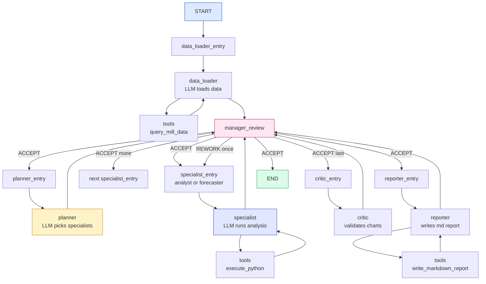
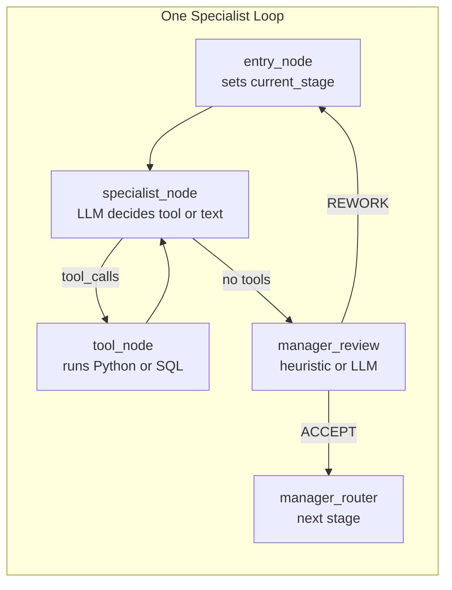

# 04 — LangGraph Deep Dive: `graph.py` Line by Line

> **Goal:** You will understand how the multi-agent pipeline is assembled, how the conveyor belt (state) moves, and how the factory controller (router) decides which specialist runs next.

---

## The big picture: a flowchart you can actually read



**How to read the diagram:**

- Every box is a **node** (a Python function).
- Every arrow is an **edge** (a routing decision).
- `manager_review` is the quality gate. Nothing passes without its approval.
- `tools` means the AI called a tool. The result goes back to the same specialist.

---

## 1. What is `StateGraph`?

LangGraph is a library from the makers of LangChain. Its core idea is:

> Give the AI a **shared notebook** (state). Let it write messages in that notebook. After each message, a **router** decides who gets the notebook next.

In code:

```python
from langgraph.graph import StateGraph, MessagesState, END, START

class AnalysisState(MessagesState):
    current_stage: str       # who is speaking right now
    stages_to_run: list[str] # the full pipeline list
    stage_attempts: dict     # how many times we tried to rework each stage
    parallel_mode: bool      # are we running specialists in parallel?
    extensions_used: int      # how many times the critic extended the pipeline
```

- `MessagesState` is a built-in LangGraph class that adds a `messages: list[BaseMessage]` field.
- Our `AnalysisState` extends it with extra fields the router needs.

---

## 2. Building the graph — `build_graph()`

`build_graph` is a factory function. It takes a list of LangChain tools and returns a `StateGraph` ready to run.

### Lines 182–221: setup

```python
def build_graph(
    tools: list[BaseTool],
    api_key: str,
    on_progress: Optional[Callable[[str, str], None]] = None,
    settings: dict | None = None,
    template_id: str | None = None,
    checkpointer=None,
    role: str | None = None,
    user_question: str | None = None,
) -> StateGraph:
```

**Parameters explained:**

- `tools` — the ~9 LangChain tools from `client.py`.
- `api_key` — the Gemini API key.
- `on_progress` — a callback function. Every time a stage starts or finishes, this function is called so the UI can show a progress message.
- `settings` — user-tunable limits (max message size, max iterations, etc.).
- `template_id` — if the user picked a template (e.g., "comprehensive"), skip the planner and use a fixed pipeline.
- `role` / `user_question` — used to look up similar past analyses for the planner's memory hint.

### Lines 210–249: tool binding per specialist

```python
llm = ChatGoogleGenerativeAI(model=GEMINI_MODEL, google_api_key=api_key)

tools_by_name = {t.name: t for t in tools}

ANALYSIS_TOOLS = ["execute_python", "run_skill", "list_output_files", "list_skills"]
DATA_TOOLS = ["query_mill_data", "query_combined_data", "get_db_schema"]
REPORT_TOOLS = ["list_output_files", "write_markdown_report"]
CRITIC_TOOLS = ANALYSIS_TOOLS + ["review_chart"]

TOOL_SETS = {
    "data_loader":       DATA_TOOLS,
    "analyst":           ANALYSIS_TOOLS,
    "forecaster":        ANALYSIS_TOOLS,
    "anomaly_detective": ANALYSIS_TOOLS,
    "bayesian_analyst":  ANALYSIS_TOOLS,
    "optimizer":         ANALYSIS_TOOLS,
    "shift_reporter":    ANALYSIS_TOOLS,
    "critic":            CRITIC_TOOLS,
    "reporter":          REPORT_TOOLS,
}

specialist_llms = {}
for stage_name, tool_names in TOOL_SETS.items():
    stage_tools = [tools_by_name[n] for n in tool_names if n in tools_by_name]
    base_llm = reporter_llm if stage_name == "reporter" else llm
    specialist_llms[stage_name] = base_llm.bind_tools(stage_tools)
```

**This is the security model.**

Each specialist gets a **different set of tools**:

- `data_loader` can only query the database. It cannot run Python.
- `reporter` can only list files and write reports. It cannot run new analysis code.
- `analyst`, `forecaster`, etc. can run Python and skills.
- `critic` gets a special `review_chart` tool so it can literally look at the PNG files.

`.bind_tools(stage_tools)` tells Gemini: "Here are the functions you are allowed to call. If you want to do something else, write text instead."

---

## 3. The specialist node factory — `make_specialist_node()`

### Lines 449–501: how one specialist works

```python
def make_specialist_node(name: str):
    system_prompt = ALL_PROMPTS[name]
    stage_llm = specialist_llms[name]

    def specialist_node(state: AnalysisState) -> dict:
        iteration = sum(1 for m in state["messages"] if getattr(m, "name", None) == name) + 1
        print(f"\n  [{name}] iteration {iteration}/{_MAX_SPECIALIST_ITERS} — processing...")

        if iteration == 1:
            desc = _desc(name)
            _progress(name, f"{_label(name)}: {desc}" if desc else f"{_label(name)}...")

        if iteration > _MAX_SPECIALIST_ITERS:
            print(f"  [{name}] Iteration cap reached, advancing.")
            return {
                "messages": [AIMessage(content=f"[{name}] Done (iteration cap). Moving on.", name=name)],
            }

        raw_msgs = state["messages"]
        focused = build_focused_context(raw_msgs, name)
        messages = [SystemMessage(content=system_prompt)] + focused

        print(f"  [{name}] Context: {len(focused)} msgs, types: {[type(m).__name__ for m in focused]}")

        try:
            response = stage_llm.invoke(messages)
        except Exception as e:
            error_str = str(e)
            print(f"  [{name}] LLM error: {error_str[:200]}")
            return {
                "messages": [AIMessage(content=f"[{name}] Error: {error_str[:150]}. Moving on.", name=name)],
            }

        response.content = normalize_content(response.content)

        if response.tool_calls:
            tool_names = [tc["name"] for tc in response.tool_calls]
            print(f"  [{name}] Calling tools: {tool_names}")
        else:
            preview = (response.content[:120] + "...") if response.content and len(response.content) > 120 else response.content
            print(f"  [{name}] Done: \"{preview}\"")
            _progress(name, f"✓ {_label(name)} завърши.")

        response.name = name
        return {"messages": [response]}

    return specialist_node
```

**Step by step:**

1. **Count iterations.** If the specialist has already run 5 times, force it to stop. This prevents infinite loops.
2. **Build focused context.** Instead of sending the AI the entire conversation (which could be 50+ messages), `build_focused_context` creates a mini-conversation with only the relevant parts.
3. **Prepend the system prompt.** Every specialist has a different personality. The prompt tells it what its job is, what data is available, and what output format to use.
4. **Call the LLM.** `stage_llm.invoke(messages)` sends the mini-conversation to Gemini.
5. **Check for tool calls.** If Gemini decided to use a tool, `response.tool_calls` will be a list like `[{"name": "execute_python", "args": {"code": "..."}}]`.
6. **Return the message.** The message is added to `state["messages"]`. LangGraph then routes to the next node based on whether tool calls exist.

---

## 4. Context compression — `build_focused_context()`

This is the secret sauce that keeps the system from exploding.

```python
def build_focused_context(all_msgs: list[BaseMessage], stage_name: str) -> list[BaseMessage]:
    user_msg = None
    prior_summary_parts = []
    current_stage_msgs = []
    my_tool_call_ids = set()

    # Step 1: find every tool-call ID that belongs to THIS specialist
    for msg in all_msgs:
        if isinstance(msg, AIMessage) and getattr(msg, "name", None) == stage_name and msg.tool_calls:
            for tc in msg.tool_calls:
                my_tool_call_ids.add(tc.get("id"))

    # Step 2: scan the full history and categorize each message
    for msg in all_msgs:
        if isinstance(msg, HumanMessage) and user_msg is None:
            user_msg = msg
            continue

        msg_name = getattr(msg, "name", None)

        # Keep this specialist's own messages
        if msg_name == stage_name:
            current_stage_msgs.append(msg)
            continue

        # Keep tool results that belong to this specialist's tool calls
        if isinstance(msg, ToolMessage) and msg.tool_call_id in my_tool_call_ids:
            current_stage_msgs.append(msg)
            continue

        # Summarize everything else into short lines
        if isinstance(msg, ToolMessage) and msg.name == "execute_python":
            structured = _extract_structured_output(content)
            if structured:
                prior_summary_parts.append(f"[structured data]: {structured}")
            else:
                prior_summary_parts.append(f"[python output]: {truncate(content, 1200)}")
        elif isinstance(msg, AIMessage) and msg_name and msg_name not in ("manager", "planner"):
            cap = 1500 if msg_name == "critic" else 400
            prior_summary_parts.append(f"[{msg_name}]: {truncate(content, cap)}")
        elif msg_name == "manager" and isinstance(msg, AIMessage):
            if "REWORK" in content and stage_name in content:
                current_stage_msgs.append(msg)  # keep rework instructions

    # Step 3: assemble the final mini-conversation
    result = []
    if user_msg:
        result.append(user_msg)
    if prior_summary_parts:
        summary = "[Prior analysis context]:\n" + "\n".join(prior_summary_parts[-8:])
        result.append(HumanMessage(content=summary))
    result.extend(compress_messages(current_stage_msgs))
    return result
```

**What this does in plain English:**

Suppose the conversation history is 40 messages long. The `analyst` is about to run for the second time. We do NOT send all 40 messages to Gemini. Instead:

1. Keep the original user question.
2. Replace everything the `forecaster` said with a one-line summary.
3. Keep the `analyst`'s own prior messages and tool results (so it remembers what it already did).
4. Extract any `STRUCTURED_OUTPUT:` lines so the next specialist sees clean numbers instead of 8,000 characters of stdout.

Result: Gemini sees ~7 messages instead of 40. Faster, cheaper, and less confusing.

---

## 5. The planner — dynamic pipeline selection

### Lines 528–587: `planner_node()`

The planner is an LLM node with a special prompt: "Given the user's question and the data summary, which specialists should we run?"

It can return two formats:

1. **JSON:** `{"specialists": ["analyst", "anomaly_detective"], "rationale": "..."}`
2. **Legacy line:** `SPECIALISTS: analyst, anomaly_detective`

The parser (`_parse_planner_specialists`) tries JSON first, falls back to the line format, and if both fail, defaults to `["analyst"]`.

If a `template_id` was provided by the UI, the planner is **skipped entirely** and a fixed pipeline is used instead. This makes common requests faster and more deterministic.

The final `stages_to_run` list always looks like this:

```
["data_loader", "planner", "analyst", "anomaly_detective", "critic", "reporter"]
```

- `FIXED_PREFIX` = `["data_loader", "planner"]`
- Selected specialists = planner's choice
- `FIXED_SUFFIX` = `["critic", "reporter"]`

---

## 6. The manager — quality gate

### Lines 589–733: `manager_review_node()`

The manager is not an LLM most of the time. It is a **heuristic function** that checks three things:

1. Did the specialist produce new files? (`"new_files": [...]` in the tool output)
2. Did the specialist emit `STRUCTURED_OUTPUT:`? (clean data for downstream agents)
3. Are there any errors in the output? (`Traceback`, `Error:`)

If all three are green → **auto-accept**. No LLM call needed. This saves time and money.

If the heuristic is inconclusive → the manager falls back to an LLM review with `MANAGER_REVIEW_PROMPT`.

The manager can say two things:

- **"ACCEPT"** → conveyor belt moves to the next stage.
- **"REWORK"** → conveyor belt moves back to the same stage's entry node (once only).

### Auto-accept infrastructure stages

```python
_AUTO_ACCEPT_STAGES = {"data_loader", "planner", "critic", "reporter"}
```

These stages never need deep review. The data loader either loaded data or it didn't. The planner either produced a list or it defaulted. The critic and reporter are validation/writing stages; arguing with them is usually counter-productive.

---

## 7. Routing logic — the factory controller

### `specialist_router()` (lines 775–789)

After a specialist finishes, this function decides where to go:

```python
def specialist_router(state: AnalysisState) -> str:
    last = state["messages"][-1]
    if hasattr(last, "tool_calls") and last.tool_calls:
        return "tools"           # <-- the AI wants to run a tool
    if state.get("parallel_mode"):
        return "critic_entry"  # <-- parallel mode: all specialists converge here
    stages = state.get("stages_to_run") or []
    current = state.get("current_stage")
    if stages and current == stages[-1]:
        return "end"           # <-- reporter finished, we are done
    return "manager_review"    # <-- normal path: go to quality gate
```

**Three paths:**

1. **Tool calls exist** → go to `tools` node. After tools finish, `after_tools()` sends control back to the same specialist.
2. **Parallel mode** → skip manager review and go straight to `critic_entry`. All specialists ran at the same time; we only need one review at the end.
3. **Normal path** → go to `manager_review`. The manager decides ACCEPT or REWORK.

### `manager_router()` (lines 818–855)

After the manager speaks, this function decides where to go:

```python
def manager_router(state: AnalysisState):
    last = state["messages"][-1]
    content = last.content if isinstance(last.content, str) else str(last.content)
    current = state.get("current_stage", "data_loader")
    stages = list(state.get("stages_to_run", FIXED_PREFIX + ["analyst"] + FIXED_SUFFIX))

    # REWORK → send back to current stage
    if content.startswith("REWORK:"):
        return f"{current}_entry"

    # PARALLEL FAN-OUT
    if _ENABLE_PARALLEL and current == "planner":
        specialists = [s for s in stages if s in SPECIALIST_POOL]
        base = dict(state)
        base["parallel_mode"] = True
        return [Send(f"{s}_entry", base) for s in specialists]

    # ACCEPT → advance to next stage
    if current in stages:
        idx = stages.index(current)
        if idx + 1 < len(stages):
            return f"{stages[idx + 1]}_entry"

    return "end"
```

**The `Send` object (parallel fan-out):**

Normally, LangGraph moves from one node to the next. `Send` is special: it says "create a **copy** of the state and start this node with that copy." If we send to `["analyst_entry", "forecaster_entry"]`, both specialists run at the same time with identical starting state.

When they all finish, they converge at `critic_entry` because `specialist_router` returns `"critic_entry"` when `parallel_mode` is True.

---

## 8. Graph assembly — putting it all together

### Lines 868–898: wiring the nodes and edges

```python
graph = StateGraph(AnalysisState)

# Register entry + specialist nodes for ALL possible stages
for stage in ALL_STAGES:
    graph.add_node(f"{stage}_entry", make_stage_entry(stage))
    graph.add_node(stage, make_specialist_node(stage))

# Planner is special — not a specialist, no tools
graph.add_node("planner_entry", make_stage_entry("planner"))
graph.add_node("planner", planner_node)

graph.add_node("tools", tool_node)
graph.add_node("manager_review", manager_review_node)

# Entry point
graph.set_entry_point("data_loader_entry")

# Wire: entry → node (for all stages + planner)
for stage in ALL_STAGES:
    graph.add_edge(f"{stage}_entry", stage)
graph.add_edge("planner_entry", "planner")

# Wire: planner → manager_review (planner doesn't use tools)
graph.add_edge("planner", "manager_review")

# Wire: specialist → tools / manager_review / critic_entry / END
for stage in ALL_STAGES:
    graph.add_conditional_edges(stage, specialist_router)

# Wire: tools → back to the specialist who called them
graph.add_conditional_edges("tools", after_tools)

# Wire: manager_review → next stage, rework, or end
graph.add_conditional_edges("manager_review", manager_router)

return graph.compile()
```

**How to read it:**

- `add_node(name, function)` — registers a station on the assembly line.
- `add_edge(from, to)` — always go from A to B.
- `add_conditional_edges(from, router_function)` — let the router function decide where to go next.
- `set_entry_point("data_loader_entry")` — when the graph starts, hand the notebook to the data loader first.
- `graph.compile()` — freeze the blueprint into an executable object.

---

## 9. Why entry nodes exist

You might wonder: why is there a `data_loader_entry` node AND a `data_loader` node? Why not just one?

Because of **REWORK**.

When the manager says "REWORK", it sends the notebook back to `data_loader_entry`. That entry node does one thing only:

```python
def make_stage_entry(stage_name: str):
    def entry_node(state: AnalysisState) -> dict:
        update = {"current_stage": stage_name}
        if stage_name == "critic":
            update["parallel_mode"] = False
        return update
    return entry_node
```

It updates `state["current_stage"]` so the manager_review node knows whose work it is inspecting. Without this, the manager would have to guess by scanning messages, which is fragile.

---

## Summary



This loop repeats for every specialist in the pipeline. The only thing that changes is the system prompt and the allowed tools.

---

> **Next step:** `05_api_deep_dive.md` — see how the FastAPI layer translates HTTP requests into `graph.ainvoke()` calls.
