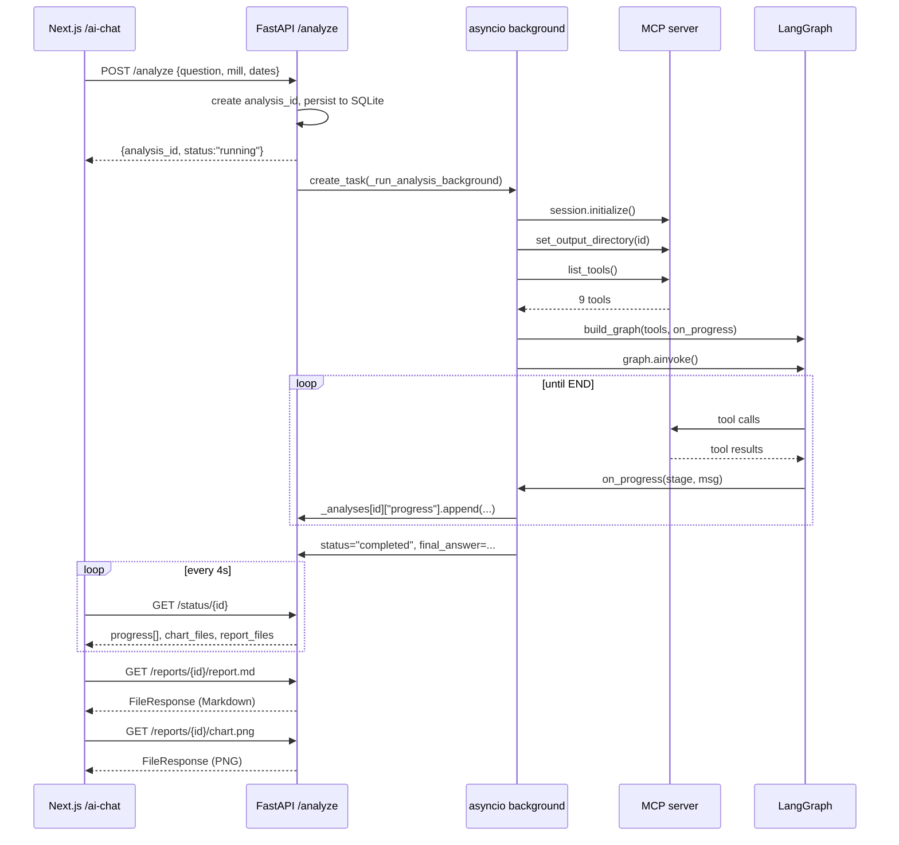

# 05 — API Deep Dive: `api_endpoint.py` Line by Line

> **Goal:** You will understand every FastAPI endpoint, how background tasks work, how role-based access control works, and how the frontend talks to the backend.

---

## The public surface

`api_endpoint.py` is a FastAPI `APIRouter`. It is mounted in `python/api.py` under the prefix `/api/v1/agentic`.

That means every route in this file automatically gets that prefix:

```
POST /analyze          →  POST /api/v1/agentic/analyze
GET  /status/{id}      →  GET /api/v1/agentic/status/{id}
GET  /reports/{id}/{f} →  GET /api/v1/agentic/reports/{id}/{f}
```

---

## 1. Imports and setup

```python
from fastapi import APIRouter, Depends, Header, HTTPException, Request
from fastapi.responses import FileResponse, StreamingResponse
from pydantic import BaseModel, Field
from langchain_core.messages import HumanMessage, SystemMessage
from mcp import ClientSession
from mcp.client.streamable_http import streamable_http_client
from client import get_mcp_tools
from graph import build_graph, build_followup_graph
import db as analyses_db
```

**What each import does:**
- `APIRouter` — FastAPI's way of grouping routes into a reusable module.
- `Depends` — dependency injection. We use it for the `require_role` check.
- `Header` — reads custom HTTP headers like `X-User-Role`.
- `FileResponse` / `StreamingResponse` — used to send PNG charts and SSE streams.
- `BaseModel` — Pydantic data validation for JSON request/response bodies.
- `streamable_http_client` — opens the long-lived MCP connection.
- `get_mcp_tools` — converts MCP tools into LangChain tools.
- `build_graph` / `build_followup_graph` — the LangGraph pipeline factories from `graph.py`.
- `analyses_db` — SQLite persistence for conversation history and role scoping.

---

## 2. Role-based access control

### Lines 52–78: `require_role`

```python
ALLOWED_ROLES = {"mechanic", "technologist", "manager"}

def require_role(
    x_user_role: Optional[str] = Header(None, alias="X-User-Role"),
    role: Optional[str] = None,
) -> str:
    raw = (x_user_role or role or "").strip().lower()
    if not raw:
        raise HTTPException(status_code=400, detail="Missing role")
    if raw not in ALLOWED_ROLES:
        raise HTTPException(status_code=400, detail=f"Invalid role '{raw}'")
    return raw
```

**How it works:**
- The frontend sends `X-User-Role: technologist` in every request header.
- If the header is missing, the backend also accepts a `?role=technologist` query parameter (useful for `` tags that cannot set custom headers).
- If the role is invalid or missing, FastAPI returns a 400 error immediately.

### Lines 81–89: `_ensure_role_match`

```python
def _ensure_role_match(analysis_id: str, role: str) -> str:
    persisted = analyses_db.get_role(analysis_id)
    if persisted is None:
        raise HTTPException(status_code=404, detail=f"Analysis {analysis_id} not found")
    if persisted != role:
        raise HTTPException(status_code=403, detail="Analysis belongs to another role")
    return persisted
```

Every analysis is tagged with a role when created. This function prevents a "mechanic" from reading a "manager"'s analysis.

---

## 3. In-memory tracking — `_analyses`

```python
_analyses: dict[str, dict] = {}
```

This is a plain Python dictionary that lives in the FastAPI process memory. It is **not** the database; it is a fast cache.

What it stores for each running analysis:

```python
{
    "status": "running",           # running | completed | failed | cancelled
    "question": "Analyze mill 8",
    "role": "technologist",
    "started_at": "2025-07-01T09:44:00",
    "final_answer": None,
    "error": None,
    "completed_at": None,
    "progress": [],               # list of {timestamp, stage, message}
    "task": <asyncio.Task>,       # handle for cancellation
}
```

**Why two sources of truth?**
- SQLite (`analyses_db`) = persistent across server restarts.
- `_analyses` dict = fast in-memory access for polling and SSE.

When the server restarts, `_analyses` is empty. The first time someone polls for an old analysis, `_hydrate_entry()` copies the row from SQLite into `_analyses`.

---

## 4. POST /analyze — starting an analysis

### Request model

```python
class AnalysisRequest(BaseModel):
    question: str
    mill_number: Optional[int] = None
    start_date: Optional[str] = None
    end_date: Optional[str] = None
    settings: Optional[AnalysisSettings] = None
    template_id: Optional[str] = None
```

### The endpoint (lines 175–242)

```python
@router.post("/analyze", response_model=AnalysisResponse)
async def start_analysis(request: AnalysisRequest, role: str = Depends(require_role)):
    analysis_id = str(uuid.uuid4())[:8]

    # Build the full prompt
    prompt_parts = [request.question]
    if request.mill_number:
        prompt_parts.append(f"Focus on Mill {request.mill_number}.")
    if request.start_date:
        prompt_parts.append(f"Start date: {request.start_date}.")
    if request.end_date:
        prompt_parts.append(f"End date: {request.end_date}.")
    full_prompt = " ".join(prompt_parts)

    # Persist to SQLite
    analyses_db.create_analysis(analysis_id, role, question=full_prompt, started_at=..., status="running")

    # Merge template defaults + user overrides
    settings_dict = {}
    if request.template_id:
        from analysis_templates import get_template_budgets
        settings_dict.update(get_template_budgets(request.template_id))
    if request.settings:
        settings_dict.update(request.settings.model_dump(exclude_unset=True))

    # Fire-and-forget background task
    task = asyncio.create_task(_run_analysis_background(
        analysis_id, full_prompt,
        settings=settings_dict or None,
        template_id=request.template_id,
        role=role,
    ))
    _analyses[analysis_id]["task"] = task

    return AnalysisResponse(analysis_id=analysis_id, status="running", ...)
```

**Key concepts:**

1. **`response_model=AnalysisResponse`** — FastAPI automatically validates the output JSON against this Pydantic model.
2. **`Depends(require_role)`** — before entering the function, FastAPI calls `require_role`. If it raises `HTTPException`, the endpoint never runs.
3. **`asyncio.create_task(...)`** — this is the "fire-and-forget" pattern. The endpoint returns immediately; the heavy work runs in a background `asyncio` task.
4. **`analysis_id = str(uuid.uuid4())[:8]`** — a short random ID like `ab12cd34`. It is used for the output folder name and for polling.

---

## 5. Background runner — `_run_analysis_background()`

This is where the real work happens. It is not an HTTP endpoint; it is a plain async function.

```python
async def _run_analysis_background(analysis_id, prompt, settings, template_id, role):
    # 1. Open MCP session
    async with streamable_http_client(SERVER_URL) as (read, write, _):
        async with ClientSession(read, write) as session:
            await session.initialize()

            # 2. Scope the output directory
            await session.call_tool("set_output_directory", {"analysis_id": analysis_id})

            # 3. Fetch tools
            langchain_tools = await get_mcp_tools(session)

            # 4. Build graph
            graph = build_graph(
                langchain_tools, api_key,
                on_progress=_make_progress_callback(analysis_id),
                settings=settings,
                template_id=template_id,
                role=role,
                user_question=prompt,
            )

            # 5. Run pipeline
            final_state = await graph.ainvoke(
                {"messages": [HumanMessage(content=prompt)]},
                config={
                    "configurable": {"thread_id": analysis_id},
                    "recursion_limit": 150,
                },
            )

            # 6. Save results
            _analyses[analysis_id]["status"] = "completed"
            _analyses[analysis_id]["final_answer"] = _extract_final_answer(final_state["messages"])
            _analyses[analysis_id]["conversation_history"] = _serialize_messages(final_state["messages"])
```

**Step by step:**

1. **Open MCP session.** `streamable_http_client` creates a long-lived HTTP connection to `server.py`. `ClientSession` wraps it with JSON-RPC logic.
2. **Set output directory.** Tells the MCP server: "From now on, write all files to `output/ab12cd34/`.
3. **Fetch tools.** Calls `client.py` to convert MCP tools into LangChain tools.
4. **Build graph.** Calls `graph.py` to create the specialist pipeline. The `_make_progress_callback` is injected here so the graph can shout updates to the UI.
5. **Run graph.** `graph.ainvoke()` starts the conveyor belt with one initial message: the user's question.
6. **Save results.** Extract the final answer, serialize the message history for follow-ups, and mark the status as completed.

### Error handling (broad try/except)

If anything crashes inside `_run_analysis_background`:
- Print the full traceback to server stdout.
- If it is an `ExceptionGroup` (LangGraph sometimes raises these), iterate and log each sub-exception.
- Set `_analyses[id]["status"] = "failed"`.
- Store the error text so the UI can show it.

---

## 6. GET /status/{id} — polling

```python
@router.get("/status/{analysis_id}", response_model=AnalysisResult)
async def get_analysis_status(analysis_id: str, role: str = Depends(require_role)):
    _ensure_role_match(analysis_id, role)
    _hydrate_entry(analysis_id)
    return _build_analysis_result(analysis_id)
```

**What happens on every poll:**

1. `_ensure_role_match` — 403 if the analysis belongs to a different role.
2. `_hydrate_entry` — if the server was restarted and `_analyses` is empty, copy the row from SQLite into memory.
3. `_build_analysis_result` — scan `output/{id}/` for `.md` and `.png` files and return a JSON object.

The UI calls this every **4 seconds** until `status` is `completed` or `failed`.

---

## 7. GET /stream/{id} — Server-Sent Events (SSE)

```python
@router.get("/stream/{analysis_id}")
async def stream_analysis(analysis_id: str, request: Request, role: str = Depends(require_role)):
    _ensure_role_match(analysis_id, role)
    _hydrate_entry(analysis_id)

    def _sse(event: str, data: dict) -> str:
        return f"event: {event}\ndata: {json.dumps(data)}\n\n"

    async def event_generator():
        queue = asyncio.Queue(maxsize=256)
        _event_queues.setdefault(analysis_id, []).append(queue)
        sent = 0
        try:
            while True:
                if await request.is_disconnected():
                    break

                entry = _analyses.get(analysis_id, {})
                progress = entry.get("progress", [])
                while sent < len(progress):
                    yield _sse("progress", progress[sent])
                    sent += 1

                if entry.get("status") != "running":
                    yield _sse("done", _build_analysis_result(analysis_id).model_dump())
                    break

                try:
                    await asyncio.wait_for(queue.get(), timeout=15.0)
                except asyncio.TimeoutError:
                    yield ": heartbeat\n\n"
        finally:
            # Unsubscribe
            ...

    return StreamingResponse(event_generator(), media_type="text/event-stream")
```

**What is SSE?**

Instead of the UI asking "Are we there yet?" every 4 seconds, the UI opens one long-lived HTTP connection and the server **pushes** updates as they happen.

**How the push works:**
- The background runner calls `_notify_subscribers(analysis_id)` every time a progress message is added.
- That puts a `None` into every queue registered for that analysis.
- The SSE loop wakes up, reads the latest progress array, and sends any unsent items.
- If 15 seconds pass with no updates, a heartbeat comment keeps the connection alive.

**Why polling is the fallback:**

In production, nginx buffers SSE streams unless configured otherwise. The UI currently uses polling because it is more reliable behind proxies.

---

## 8. POST /followup/{id} — continuing a conversation

```python
@router.post("/followup/{analysis_id}")
async def send_followup(analysis_id: str, request: FollowUpRequest, role: str = Depends(require_role)):
    _ensure_role_match(analysis_id, role)

    # Must be completed or failed
    if original["status"] not in ("completed", "failed"):
        raise HTTPException(status_code=400, detail="Analysis is still running")

    followup_id = f"{analysis_id}-f{uuid.uuid4()[:4]}"

    # Persist follow-up row (links to parent)
    analyses_db.create_analysis(followup_id, role, question=request.question, parent_id=analysis_id, status="running")

    # Start background task
    task = asyncio.create_task(_run_followup_background(analysis_id, followup_id, request.question))
```

**How follow-ups work:**
1. The parent analysis must be finished.
2. A new ID is generated (e.g., `ab12cd34-fa1b`).
3. `_run_followup_background` loads the parent's message history from SQLite.
4. It rebuilds the messages, appends the new user question, and runs a shorter graph (`build_followup_graph`).
5. The follow-up shares the parent's output folder, so new charts and reports appear alongside the originals.

---

## 9. DELETE /analysis/{id} — cleanup

```python
@router.delete("/analysis/{analysis_id}")
async def delete_analysis(analysis_id: str, role: str = Depends(require_role)):
    _ensure_role_match(analysis_id, role)

    # Remove output folder
    shutil.rmtree(os.path.join(OUTPUT_DIR, analysis_id), ignore_errors=True)

    # Remove from SQLite (cascades to follow-ups and messages)
    analyses_db.delete_analysis(analysis_id)

    # Remove from in-memory dict
    for fid in followup_ids:
        _analyses.pop(fid, None)
```

**Why three cleanups?**
1. Disk — delete charts and reports.
2. SQLite — delete the persistent record.
3. Memory — remove from `_analyses` so future polls return 404.

---

## 10. Progress callback wiring

```python
def _make_progress_callback(analysis_id: str):
    def on_progress(stage: str, message: str):
        entry = _analyses.get(analysis_id)
        if entry is not None:
            entry["progress"].append({
                "timestamp": datetime.now().isoformat(),
                "stage": stage,
                "message": message,
            })
        _notify_subscribers(analysis_id)
    return on_progress
```

This closure is passed into `build_graph`. Every specialist calls it like this:

```python
_progress("analyst", "Анализатор: Статистически анализ, разпределения и SPC диаграми...")
```

The UI renders the `progress[]` array as a checklist with timestamps.

---

## Summary diagram



---

> **Next step:** `06_ui_deep_dive.md` — learn how the React frontend turns button clicks into HTTP requests and renders the final report.
