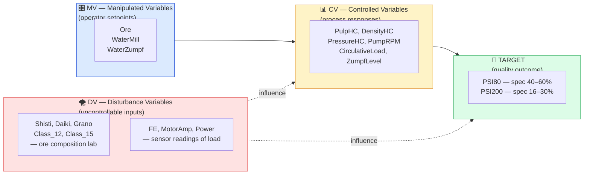

# 05 — Domain Knowledge

`tools/domain_knowledge.py` encodes everything the agents need to know about
the plant: variable ranges, units, types, spec limits, shift schedules, and
mill names. It is the single source of truth — no magic numbers scattered
across prompts or skills.

## Variable taxonomy

Each process variable is classified into one of four types. This mirrors the
control-engineering view of the plant — what the operator can change, what the
process does in response, what disturbs it from the outside, and what we're
ultimately trying to optimise.



- **MV** — _Manipulated Variable_: operator setpoint, directly controllable.
- **CV** — _Controlled Variable_: depends on MVs + disturbances, regulated by
  process control loops.
- **DV** — _Disturbance Variable_: external, uncontrollable (ore composition)
  or sensor readings of load.
- **TARGET** — grinding quality; success is measured by PSI80 / PSI200 staying
  in spec.

## The `PLANT_VARIABLES` dict

Each entry has a common shape:

```python
"PSI200": {
    "name_bg": "Фракция +200 μm",
    "unit":    "%",
    "min":     16,
    "max":     30,
    "varType": "TARGET",
    "description":    "Particle size classification at 200 microns (% retained)",
    "description_bg": "Основна целева стойност — финност на смилане +200 микрона",
    "spec_low":  16,
    "spec_high": 30,
    "target":    23,
    "notes":     "Main target variable. Lower = finer grind = better flotation recovery.",
}
```

Optional keys:

| Key                      | Meaning                                                                       |
| ------------------------ | ----------------------------------------------------------------------------- |
| `spec_low` / `spec_high` | SPC spec limits (LSL / USL). If absent, `min` / `max` are used as a fallback. |
| `target`                 | Desired midpoint for `Cpk` calculations.                                      |
| `downtime_threshold`     | For `Ore`: values below this (10 t/h) indicate the mill is idle.              |
| `abs_max`                | Absolute safety ceiling above `max` (only defined for `Ore`).                 |
| `notes`                  | Free-form operational notes, surfaced in agent prompts.                       |

### Catalogue summary

| Name              | Type   | Range             | Unit    | Notes                     |
| ----------------- | ------ | ----------------- | ------- | ------------------------- |
| `Ore`             | MV     | 140–220 (abs 240) | t/h     | Downtime if < 10          |
| `WaterMill`       | MV     | 5–25              | m³/h    | Slurry density control    |
| `WaterZumpf`      | MV     | 140–250           | m³/h    | Sump dilution             |
| `PulpHC`          | CV     | 400–600           | m³/h    | HC feed flow              |
| `DensityHC`       | CV     | 1500–1900         | kg/m³   | 1600–1800 typical         |
| `PressureHC`      | CV     | 0.2–0.5           | bar     | Classification cut point  |
| `PumpRPM`         | CV     | 0–800             | rev/min | Sump pump speed           |
| `CirculativeLoad` | CV     | 1.0–3.0           | t/t     | Underflow / fresh feed    |
| `ZumpfLevel`      | CV     | 0–3000            | mm      | Overflow risk if too high |
| `MotorAmp`        | DV     | 150–250           | A       | Mill load indicator       |
| `Power`           | DV     | 0–3000            | kW      | Motor power               |
| `FE`              | DV     | 2–5               | %       | Iron in pulp (sensor)     |
| `Shisti`          | DV     | 0–100             | %       | Schist (lab)              |
| `Daiki`           | DV     | 0–100             | %       | Dyke rock (lab)           |
| `Grano`           | DV     | 0–100             | %       | Granodiorite (lab)        |
| `Class_12`        | DV     | 0–5               | %       | +12 mm fraction           |
| `Class_15`        | DV     | 0–2               | %       | +15 mm fraction           |
| `PSI80`           | TARGET | 40–60 (spec)      | %       | Target ~50                |
| `PSI200`          | TARGET | 16–30 (spec)      | %       | Target ~23                |

Convenience lists derived from this dict:

```python
MV_VARIABLES     = [k for k,v in PLANT_VARIABLES.items() if v["varType"] == "MV"]
CV_VARIABLES     = [... "CV"]
DV_VARIABLES     = [... "DV"]
TARGET_VARIABLES = [... "TARGET"]
```

## Shifts

```python
SHIFTS = {
    "shift_1": {"start": "06:00", "end": "14:00", "label": "Смяна 1 (06-14)"},
    "shift_2": {"start": "14:00", "end": "22:00", "label": "Смяна 2 (14-22)"},
    "shift_3": {"start": "22:00", "end": "06:00", "label": "Смяна 3 (22-06)"},   # crosses midnight
}
```

The overnight shift is the only one that crosses midnight. `skills.shift_kpi.assign_shifts`
handles the wrap-around when labelling timestamps.

## Mills

```python
MILL_NAMES = ["Mill01", "Mill02", …, "Mill12"]
```

Mill 11 is known to routinely operate at lower load, which is why the CLI demo
request in `main.py` mentions _"Мелница 11 по принцип работи с ниско
натоварване."_ Treat it as a soft prior, not a rule.

## Helpers

### `get_spec_limits(variable) → dict | None`

```python
>>> get_spec_limits("PSI80")
{"LSL": 40, "USL": 60, "target": 50}

>>> get_spec_limits("Ore")          # no explicit spec
{"LSL": 140, "USL": 220}

>>> get_spec_limits("UnknownVar")
None
```

Used by SPC skills (`skills.spc.xbar_chart`, `skills.spc.process_capability`)
and by the `bayesian_analyst` prompt.

### `get_plant_summary() → str`

One-line-per-variable textual summary. This is what the `get_domain_knowledge`
MCP tool returns when called without a `variable` argument:

```
Plant Variable Reference (Ellatzite Ore Dressing, 12 Ball Mills):

  Ore (MV): 140-220 t/h — Values below 10 t/h indicate mill is stopped/idle.
  WaterMill (MV): 5-25 m³/h — Controls slurry density inside the mill.
  …
  PSI200 (TARGET): 16-30 % [spec: 16-30] — Main target variable. …

Shifts: 06:00-14:00 / 14:00-22:00 / 22:00-06:00
Mills: Mill01, …, Mill12
Downtime threshold: Ore < 10 t/h
```

## How it reaches the agents

Three complementary channels:

1. **MCP tool** — `get_domain_knowledge` can be called on demand. Rarely used
   in practice because…
2. **In-process injection** — `tools/python_executor.py` injects
   `PLANT_SPECS`, `SHIFTS`, `MILL_NAMES`, and `get_spec_limits` directly into
   every `execute_python` namespace. Agents can write
   `specs = get_spec_limits('PSI80')` without a round-trip.
3. **Baked into prompts** — `graph_v3.DOMAIN_CONTEXT` summarises the variable
   taxonomy in plain English and is prepended to every specialist's system
   prompt. This keeps domain grounding even for the first LLM call before any
   tool has run.
