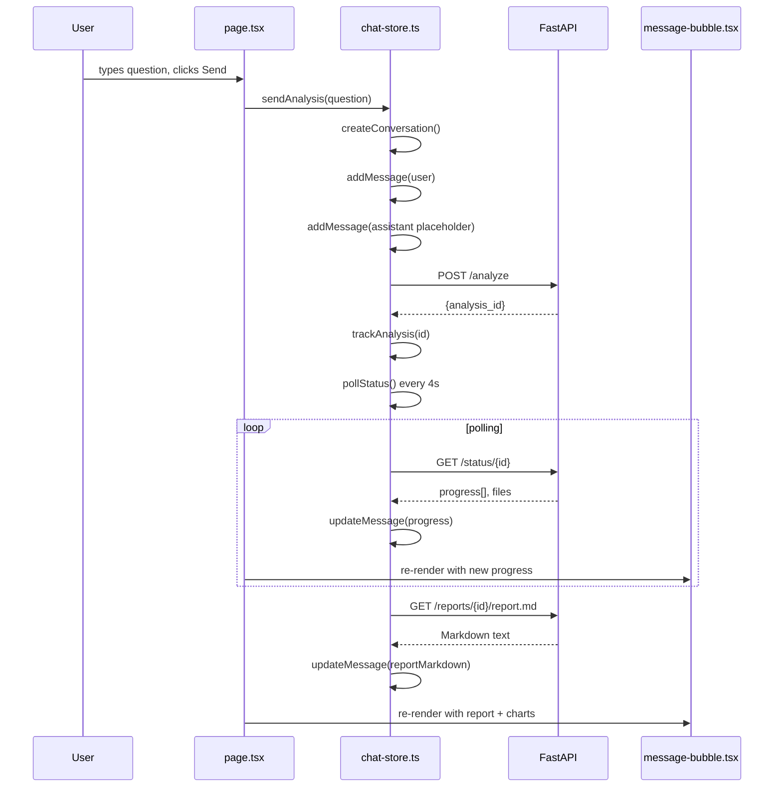

# 06 — UI Deep Dive: React, Zustand, and the Chat Store

> **Goal:** You will understand how the frontend page is built, how state is managed, how polling works, and how messages turn into Markdown + charts.

---

## The file map

| File | Responsibility |
|------|----------------|
| `src/app/ai-chat/page.tsx` | Layout: sidebar + header + message list + input area |
| `src/app/ai-chat/stores/chat-store.ts` | Zustand store: conversations, messages, polling, analysis tracking |
| `src/app/ai-chat/stores/role-store.ts` | Current user role (mechanic / technologist / manager) |
| `src/app/ai-chat/stores/settings-store.ts` | UI tunables: context window size, token budgets |
| `src/app/ai-chat/components/message-bubble.tsx` | Renders one chat bubble (user or assistant) |
| `src/app/ai-chat/components/chat-input.tsx` | Textarea + send button + template selector |
| `src/app/ai-chat/components/empty-state.tsx` | Welcome screen with suggested questions |
| `src/app/ai-chat/components/history-sidebar.tsx` | List of past conversations |
| `src/app/ai-chat/components/markdown.tsx` | `react-markdown` wrapper with chart image rewriting |
| `src/app/ai-chat/components/data-tiles.tsx` | Live structured data tiles from `STRUCTURED_OUTPUT:` events |

---

## 1. The page layout — `page.tsx`

```tsx
export default function AiChatPage() {
  const {
    activeConversationId,
    activeConversation,
    isLoading,
    hydrateFromServer,
  } = useChatStore();

  const role = useRoleStore((s) => s.role);
  const setRole = useRoleStore((s) => s.setRole);
  const hydrateRole = useRoleStore((s) => s.hydrate);
  const roleHydrated = useRoleStore((s) => s.hydrated);

  const bottomRef = useRef<HTMLDivElement>(null);
  const scrollContainerRef = useRef<HTMLDivElement>(null);
  const prevConvIdRef = useRef<string | null | undefined>(undefined);
```

**What is happening:**
- `useChatStore()` is a Zustand hook. It gives us reactive access to the global chat state.
- `useRoleStore()` is a separate, smaller store for the user's role.
- `useRef` is used for DOM scrolling (auto-scroll to bottom on new messages).

### Hydration flow

```tsx
useEffect(() => { hydrateRole(); }, [hydrateRole]);

useEffect(() => {
  if (!roleHydrated) return;
  void hydrateFromServer();
}, [roleHydrated, hydrateFromServer]);
```

1. On mount, read `localStorage` for the saved role.
2. Once the role is known, ask the server: "Give me the conversation list for this role."
3. The server returns a list of past analyses; the store reconciles them with local cache.

### Scroll behavior

```tsx
useEffect(() => {
  if (prevConvIdRef.current !== undefined && prevConvIdRef.current !== activeConversationId) {
    scrollContainerRef.current?.scrollTo({ top: 0 });      // switched conv → jump to top
  } else {
    bottomRef.current?.scrollIntoView({ behavior: "smooth" }); // same conv → scroll to bottom
  }
  prevConvIdRef.current = activeConversationId;
}, [messages, activeConversationId]);
```

---

## 2. The chat store — `chat-store.ts`

Zustand is like Redux but with less boilerplate. The entire store is one function that returns an object of state + actions.

### Types

```ts
export interface ChatMessage {
  id: string;
  role: "user" | "assistant" | "system";
  content: string;
  timestamp: string;
  analysisId?: string;          // links the assistant bubble to a backend analysis
  status?: "pending" | "running" | "completed" | "failed";
  reportFiles?: string[];       // .md files produced
  chartFiles?: string[];        // .png files produced
  reportMarkdown?: string;      // full text of the report (fetched eagerly)
  progressMessages?: ProgressMessage[];
  error?: string;
}

export interface Conversation {
  id: string;
  title: string;
  createdAt: string;
  messages: ChatMessage[];
  status: "idle" | "running" | "completed" | "failed";
  analysisId?: string;          // the root analysis ID for this conversation
  role?: string;
}
```

### LocalStorage caching

```ts
function storageKey(role: string): string {
  return `ai-chat-conversations:${role}`;
}

function loadConversations(role: string): Conversation[] {
  const raw = localStorage.getItem(storageKey(role));
  if (!raw) return [];
  const parsed: Conversation[] = JSON.parse(raw);
  // Reset any stuck "running" conversations to "failed" on reload
  return parsed.map((c) =>
    c.status === "running" ? { ...c, status: "failed" as const } : c,
  );
}

function saveConversations(conversations: Conversation[]) {
  const role = getCurrentRole();
  localStorage.setItem(storageKey(role), JSON.stringify(conversations));
}
```

**Why localStorage?**
- The server is the **source of truth** for the conversation list.
- LocalStorage is a **fast cache** for message bubbles, chart lists, and report text.
- If the user refreshes the page, the UI restores instantly from localStorage while re-hydrating from the server in the background.

### Starting an analysis — `sendAnalysis()`

```ts
sendAnalysis: async (question: string, templateId?: string) => {
  const { createConversation, addMessage, updateMessage, trackAnalysis } = get();

  // 1. Create a new conversation
  const convId = createConversation(truncate(question));

  // 2. Add user message bubble
  addMessage({ role: "user", content: question });

  // 3. Add placeholder assistant bubble (spinner)
  const assistantMsg = addMessage({
    role: "assistant",
    content: "",
    status: "pending",
  });

  // 4. Mark conversation as running
  set((s) => {
    const updated = s.conversations.map((c) =>
      c.id === convId ? { ...c, status: "running" as const } : c,
    );
    saveConversations(updated);
    return { conversations: updated, isLoading: true };
  });

  try {
    // 5. Read user settings (context budgets)
    const { useSettingsStore } = await import("./settings-store");
    const settings = useSettingsStore.getState().getSettings();

    // 6. POST to FastAPI
    const res = await apiFetch("/api/v1/agentic/analyze", {
      method: "POST",
      headers: { "Content-Type": "application/json" },
      body: JSON.stringify({ question, settings, ...(templateId ? { template_id: templateId } : {}) }),
    });

    const data = await res.json();
    const analysisId = data.analysis_id;

    // 7. Store analysisId on the conversation
    set((s) => {
      const updated = s.conversations.map((c) =>
        c.id === convId ? { ...c, analysisId } : c,
      );
      saveConversations(updated);
      return { conversations: updated };
    });

    // 8. Update placeholder to "running" text
    updateMessage(assistantMsg.id, {
      analysisId,
      status: "running",
      content: "Анализът е стартиран. Агентите работят...",
    });

    // 9. Start polling
    trackAnalysis(analysisId, assistantMsg.id, convId);
  } catch (err) {
    // 10. Show error in the assistant bubble
    updateMessage(assistantMsg.id, {
      status: "failed",
      content: `Грешка при стартиране: ${err instanceof Error ? err.message : "Unknown"}`,
    });
    set((s) => ({ ...s, isLoading: false }));
  }
},
```

**The trick:** The UI never waits for the analysis to finish. It:
1. Creates the conversation immediately.
2. Shows a spinner instantly.
3. Fires the HTTP request.
4. Starts polling independently.

### Polling — `pollStatus()`

```ts
pollStatus: (analysisId, messageId, convId, reportAnalysisId, followUpStartedAt) => {
  const fileAnalysisId = reportAnalysisId || analysisId;
  const isFollowUp = typeof followUpStartedAt === "number";

  let consecutiveFailures = 0;
  let everSucceeded = false;
  const MAX_FAILURES_COLD = 15;
  const MAX_POLL_DURATION_MS = 600_000; // 10 minutes
  const startTime = Date.now();

  const interval = setInterval(async () => {
    // Safety timeout
    if (Date.now() - startTime > MAX_POLL_DURATION_MS) {
      stopPolling();
      return;
    }

    try {
      const res = await apiFetch(`/api/v1/agentic/status/${analysisId}`);
      if (!res.ok) {
        consecutiveFailures++;
        if (everSucceeded) return; // transient glitch, keep trying
        if (consecutiveFailures >= MAX_FAILURES_COLD) {
          // Analysis probably does not exist
          updateMessage(messageId, { status: "failed", content: "Анализът не е намерен." });
          stopPolling();
        }
        return;
      }

      consecutiveFailures = 0;
      everSucceeded = true;
      const data = await res.json();

      const terminal = await applyStatusData(data, { messageId, convId, fileAnalysisId, isFollowUp, followUpStartedAt }, get, set);
      if (terminal) stopPolling();
    } catch (err) {
      console.error("Polling error:", err);
    }
  }, POLL_INTERVAL_MS); // 4000 ms

  set({ pollingInterval: interval });
},
```

**Key behaviors:**
- **Cold-start tolerance:** If the first 15 polls fail, assume the analysis ID is invalid and stop.
- **Transient tolerance:** If we ever got a 200, keep polling forever (up to 10 minutes) even if individual requests fail.
- **10-minute hard cap:** Prevents a zombie poll if the server silently drops the task.

### Applying the status payload — `applyStatusData()`

```ts
async function applyStatusData(data, ctx, get, set): Promise<boolean> {
  const { updateMessage } = get();
  const { messageId, convId, fileAnalysisId, isFollowUp, followUpStartedAt } = ctx;

  // 1. Update progress checklist
  const progress = (data.progress as ProgressMessage[]) || [];
  if (progress.length > 0) {
    updateMessage(messageId, { progressMessages: progress });
  }

  // 2. Completed?
  if (data.status === "completed") {
    const reportFiles = (data.report_files as string[]) || [];
    const chartFiles = (data.chart_files as string[]) || [];
    const reportMtimes = (data.report_files_mtime as Record<string, number>) || {};
    const chartMtimes = (data.chart_files_mtime as Record<string, number>) || {};

    // For follow-ups: only treat files with mtime >= followUpStartedAt as "new"
    const isNewOrUpdated = (f: string, mtimeMap: Record<string, number>) => {
      if (!isFollowUp) return true;
      const mt = mtimeMap[f];
      return typeof mt === "number" && mt >= (followUpStartedAt as number);
    };

    const newReportFiles = reportFiles.filter((f) => isNewOrUpdated(f, reportMtimes));
    const newChartFiles = chartFiles.filter((f) => isNewOrUpdated(f, chartMtimes));

    // 3. Fetch the newest .md report eagerly
    let mdToShow: string | undefined;
    if (newReportFiles.length > 0) {
      mdToShow = [...newReportFiles].sort((a, b) => (reportMtimes[b] || 0) - (reportMtimes[a] || 0))[0];
    } else if (!isFollowUp && reportFiles.length > 0) {
      mdToShow = reportFiles[0];
    }

    let reportMarkdown: string | undefined;
    if (mdToShow) {
      const mdRes = await apiFetch(`/api/v1/agentic/reports/${fileAnalysisId}/${encodeURIComponent(mdToShow)}`);
      if (mdRes.ok) reportMarkdown = await mdRes.text();
    }

    // 4. Update the assistant bubble with final content
    updateMessage(messageId, {
      status: "completed",
      content: (data.final_answer as string) || "Анализът е завършен.",
      reportFiles: newReportFiles,
      chartFiles: newChartFiles,
      reportMarkdown,
    });

    // 5. Mark conversation done
    set((s) => {
      const updated = s.conversations.map((c) =>
        c.id === convId ? { ...c, status: "completed" as const } : c,
      );
      saveConversations(updated);
      return { conversations: updated, isLoading: false };
    });

    return true; // terminal — stop polling
  }

  // 6. Failed?
  if (data.status === "failed") {
    updateMessage(messageId, {
      status: "failed",
      content: `Анализът е неуспешен: ${(data.error as string) || "Неизвестна грешка"}`,
      error: data.error as string,
    });
    set((s) => ({ ...s, isLoading: false }));
    return true; // terminal
  }

  return false; // still running, keep polling
}
```

**Why fetch Markdown eagerly?**

When the status endpoint says "completed", the store immediately fetches the `.md` report text so the `MessageBubble` can render it instantly without a second round-trip.

---

## 3. Rendering a message — `message-bubble.tsx`

```tsx
export default function MessageBubble({ message, analysisId }: Props) {
  const isUser = message.role === "user";

  return (
    <div className={`flex ${isUser ? "justify-end" : "justify-start"}`}>
      <div className={`max-w-3xl rounded-lg px-4 py-3 ${isUser ? "bg-blue-600 text-white" : "bg-white border"}`}>
        {isUser ? (
          <p>{message.content}</p>
        ) : (
          <AssistantContent message={message} analysisId={analysisId} />
        )}
      </div>
    </div>
  );
}
```

### Assistant content states

```tsx
function AssistantContent({ message, analysisId }) {
  // 1. Pending / running → spinner + progress checklist
  if (message.status === "pending" || message.status === "running") {
    return (
      <>
        <Spinner />
        <ProgressChecklist items={message.progressMessages} />
      </>
    );
  }

  // 2. Failed → red error box
  if (message.status === "failed") {
    return <ErrorBox content={message.content} error={message.error} />;
  }

  // 3. Completed → Markdown report + chart gallery + data tiles
  return (
    <>
      <DataTiles message={message} />
      <MarkdownRenderer content={message.reportMarkdown || message.content} analysisId={analysisId} />
      <ChartGallery chartFiles={message.chartFiles} analysisId={analysisId} />
      <FileDownloads reportFiles={message.reportFiles} analysisId={analysisId} />
    </>
  );
}
```

---

## 4. Markdown rendering — `markdown.tsx`

The AI writes reports with image references like:

```markdown

```

But the browser cannot resolve `distribution_plots.png` directly. It must go through the API.

```tsx
function makeMarkdownComponents(analysisId?: string) {
  return {
    img({ src, alt }: { src?: string; alt?: string }) {
      if (!src) return null;
      const apiUrl = analysisId
        ? `/api/v1/agentic/reports/${analysisId}/${encodeURIComponent(src)}`
        : src;
      return ;
    },
  };
}
```

**Every image tag is rewritten to point at the FastAPI file-serving endpoint.** The `analysisId` is passed down from the conversation through the message bubble into the Markdown renderer.

---

## 5. Role store — `role-store.ts`

```ts
export const ROLES = [
  { key: "mechanic", label: "Механик" },
  { key: "technologist", label: "Технолог" },
  { key: "manager", label: "Мениджър" },
] as const;

export type Role = (typeof ROLES)[number]["key"];

interface RoleState {
  role: Role;
  hydrated: boolean;
  setRole: (role: Role) => void;
  hydrate: () => void;
}

export const useRoleStore = create<RoleState>((set) => ({
  role: "technologist",
  hydrated: false,
  setRole: (role) => {
    localStorage.setItem("ai-chat-role", role);
    set({ role });
  },
  hydrate: () => {
    const saved = localStorage.getItem("ai-chat-role");
    if (saved && ROLES.some((r) => r.key === saved)) {
      set({ role: saved as Role, hydrated: true });
    } else {
      set({ hydrated: true });
    }
  },
}));
```

**Why a separate store?**
- The role is needed by many components (header, sidebar, settings).
- Keeping it in its own store avoids re-rendering the entire chat store on every role change.
- When the role changes, `chat-store.ts` automatically re-hydrates the conversation list from the server.

---

## Summary diagram



---

> **Next step:** `02_architecture.md` to see how all these pieces fit together at the process level, then `07_request_lifecycle.md` to trace one real request end-to-end.
