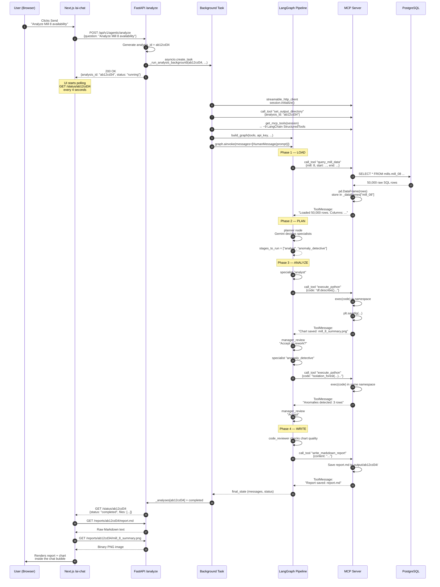

# 07 — Request Lifecycle (Beginner Edition)

> **Goal:** Follow one real request from the moment the user hits Send until the chart appears on screen. You will see who does what, where data gets converted, and what happens when things go wrong.

---

## The big picture: four phases

Every analysis request goes through four logical phases, even though the UI and the backend work in parallel.



---

## Phase 1: Load (the data fetch)

**What happens:** The first node in the LangGraph pipeline is always `data_loader`. It asks the MCP server to fetch mill data from PostgreSQL.

**In code (simplified):**

```python
# Inside graph.py — data_loader node
from tools.db_tools import query_mill_data

def data_loader(state):
    # The AI decides which mills and date range
    result = query_mill_data(mill=8, start="2024-01-01", end="2024-06-01")
    return {"messages": [ToolMessage(content=result)]}
```

**The conversion chain:**

| Step | From | To | Why it matters |
|------|------|-----|----------------|
| 1 | PostgreSQL table | SQL rows (50,000) | Raw data lives in the database |
| 2 | SQL rows | pandas DataFrame | Easier to analyze in Python |
| 3 | DataFrame | String summary in ToolMessage | The AI can only read text, not binary DataFrames |

**Key detail:** The `_dataframes` dict on the MCP server keeps the full DataFrame in memory. The AI does not see the full 50,000 rows. It sees a summary like:

```
Loaded 50,000 rows. Columns: timestamp, ore, water, motor_amp, psi80.
Date range: 2024-01-01 to 2024-06-01.
```

---

## Phase 2: Plan (who does what)

**What happens:** The `planner` node reads the user's question and picks which specialists to run. It also decides if a pre-defined `template` should override the plan.

**In code (simplified):**

```python
# Inside graph.py — planner node
planner_prompt = """
You are the planner. Based on the user's question,
list the specialists needed from this pool:
- data_loader (already done)
- analyst (statistics, trends)
- forecaster (time-series prediction)
- anomaly_detective (outlier detection)
- shift_reporter (per-shift breakdown)
- optimization_advisor (parameter tuning)
- code_reviewer (chart quality check)
- reporter (final markdown report)
"""

response = llm.invoke(planner_prompt)
stages = parse_specialists(response)
# stages = ["analyst", "anomaly_detective"]
```

**Important:** The planner does not run the analysis. It just writes a to-do list. The actual work happens in Phase 3.

---

## Phase 3: Analyze (the specialists work)

**What happens:** Each specialist in the plan gets its own turn. A specialist is an LLM call with a specific system prompt and a specific set of tools.

**One specialist loop (simplified):**

```python
# Inside graph.py — make_specialist_node factory
def specialist_node(state):
    # 1. Build a focused context (only relevant messages)
    context = build_focused_context(state.messages, stage_name="analyst")

    # 2. Call Gemini with the specialist prompt
    response = llm.invoke(context)

    # 3. If Gemini wants to run a tool, execute it
    if response.tool_calls:
        tool_result = execute_tool(response.tool_calls[0])
        return {"messages": [response, tool_result]}

    # 4. Otherwise, return the answer
    return {"messages": [response]}
```

**The tool call loop:**

A specialist can call tools multiple times. Each call follows this pattern:

1. **Specialist decides:** "I need a histogram of ore grades."
2. **LangGraph routes:** to the `tools` node.
3. **Tool runs:** `execute_python` writes Python code, runs it, saves a `.png`.
4. **Result returns:** A `ToolMessage` with the stdout and file paths.
5. **Specialist reviews:** "The histogram looks good. Here is my conclusion..."

**Manager review between specialists:**

After each specialist finishes, the `manager_review` node checks the work. It can:
- **ACCEPT** → move to the next specialist
- **REWORK** → send the same specialist back once more
- **ACCEPT (last specialist)** → move to the reporter

**Context compression (the secret sauce):**

Before each specialist starts, `build_focused_context` filters the message history:

| Kept | Discarded |
|------|-----------|
| System prompt for this specialist | System prompts for other specialists |
| Previous specialists' final conclusions | Previous specialists' intermediate tool arguments |
| Tool results with `STRUCTURED_OUTPUT` | Full stdout from every tool call |
| User's original question | Every `review_chart` call and result |

This keeps the context window small so Gemini does not get confused.

---

## Phase 4: Write (the report)

**What happens:** After all specialists finish, the `reporter` node writes a final Markdown report. It calls `write_markdown_report` to save it to disk.

**In code (simplified):**

```python
# Inside graph.py — reporter node
reporter_prompt = """
You are the reporter. Write a comprehensive Markdown report
using the findings from all previous specialists.
Include:
- Executive summary
- Methodology
- Key findings with chart references
- Recommendations
Save the report using write_markdown_report.
"""

report = llm.invoke(reporter_prompt)
# The reporter calls write_markdown_report as a tool
```

**What the user sees:**

The UI polls `/status/ab12cd34`. When it sees `"status": "completed"`, it:
1. Fetches `report.md` and renders it as HTML inside the chat bubble.
2. Fetches each `.png` file and shows it as an inline image gallery.
3. Enables the follow-up input so the user can ask: "What about Mill 9?"

---

## What each actor can and cannot see

| Actor | Can see | Cannot see |
|-------|---------|------------|
| **User** | The final report, charts, progress messages | SQL queries, raw DataFrames, tool arguments |
| **UI (React)** | JSON from `/status`, file bytes from `/reports` | The MCP server, the LangGraph pipeline, the database |
| **FastAPI** | The `_analyses` dict, file paths on disk | The internal reasoning inside each specialist node |
| **LangGraph** | The message history, tool results, planner output | The raw PostgreSQL connection, the full disk path outside output/ |
| **MCP Server** | The DataFrames, the Python namespace, the output directory | The user's role, the conversation history, the planner's logic |
| **Gemini (LLM)** | Only the text we send it in each invoke call | Nothing outside the current context window |

**The rule:** Each layer is blind to the layers above and below it, except through the narrow interfaces we design (HTTP JSON, MCP JSON-RPC, SQL rows).

---

## Common failure modes and recovery

| Failure | Where it happens | Why | Recovery |
|---------|------------------|-----|----------|
| **Database timeout** | MCP `query_mill_data` | Query too broad (no date filter) | MCP returns error; specialist narrows date range and retries |
| **Python code error** | MCP `execute_python` | AI wrote invalid syntax | MCP returns traceback; specialist sees it and fixes the code |
| **Context overflow** | LangGraph specialist node | Too many tool messages | `compress_messages` truncates old tool outputs to 500 chars each |
| **Manager rejects work** | `manager_review` node | Chart is missing or wrong | Specialist is sent back once with feedback; max 1 rework |
| **MCP server crashes** | MCP process | Out of memory | FastAPI catches exception; analysis status = failed; user sees error message |
| **UI polling stops** | Browser tab close | User closes tab | FastAPI background task still finishes; files saved to disk; user can reopen and see history |
| **Follow-up without parent** | FastAPI `/followup` | User asks follow-up but parent analysis was deleted | FastAPI returns 404; UI shows "Start a new analysis instead" |

---

## A condensed timeline (typical 2-minute analysis)

| Time | Event | Actor |
|------|-------|-------|
| T+0s | User clicks Send | User |
| T+0.2s | POST /analyze returns `analysis_id` | FastAPI |
| T+1s | UI starts polling /status | UI |
| T+2s | MCP session initialized, output dir set | Background Task |
| T+3s | DataLoader fetches 50k rows from PostgreSQL | MCP / DB |
| T+5s | Planner picks [analyst, anomaly_detective] | LangGraph |
| T+10s | Analyst calls execute_python → chart saved | MCP |
| T+15s | Manager accepts analyst work | LangGraph |
| T+20s | Anomaly detective calls execute_python → anomalies found | MCP |
| T+25s | Manager accepts detective work | LangGraph |
| T+30s | Reporter writes markdown report | MCP |
| T+32s | FastAPI marks status = completed | FastAPI |
| T+34s | UI poll sees completed, fetches report.md | UI |
| T+36s | UI renders report + chart gallery | User sees it |

---

> **Next step:** `08_output_management.md` to learn how per-analysis output folders isolate files, or `09_configuration.md` to see how settings and templates are merged before the pipeline starts.
