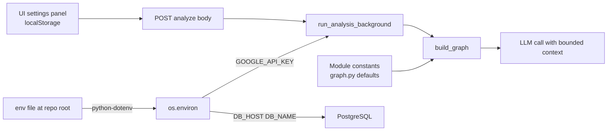

# 09 — Configuration (Beginner Edition)

> **Goal:** Know where every setting lives, how it flows from `.env` → code → LLM call, and how the UI can override defaults per analysis.

---

## Three places settings live

| Place                  | Who edits it        | Examples                                      | Lifetime                                     |
| ---------------------- | ------------------- | --------------------------------------------- | -------------------------------------------- |
| **`.env` file**        | DevOps / operator   | `GOOGLE_API_KEY`, `DB_HOST`, `DB_PASSWORD`    | Persistent (file on disk)                    |
| **Python constants**   | Developer           | `MAX_MESSAGES_WINDOW`, `MAX_SPECIALIST_ITERS` | Code-level (change → restart server)         |
| **`AnalysisSettings`** | End user (UI panel) | Context budget, timeout, role                 | Per-request (attached to each POST /analyze) |

---

## The flow: from `.env` to LLM call



**How to read it:**

1. The server reads `.env` once at startup.
2. `api_endpoint.py` uses `GOOGLE_API_KEY` to authenticate with Gemini.
3. `graph.py` uses module constants as fallback limits.
4. If the user tweaked the settings panel, those values override the defaults.
5. The LLM call receives the final, merged budget.

---

## `.env` variables (secrets and connections)

Create a `.env` file in the repo root:

```bash
# AI provider
GOOGLE_API_KEY=your_gemini_api_key_here

# Database
DB_HOST=your_postgres_host
DB_PORT=5432
DB_NAME=em_pulse_data
DB_USER=your_user
DB_PASSWORD=your_password

# Optional: role-based access secret
SECRET_KEY=your_jwt_signing_key
```

**Loaded in code:**

```python
# inside api_endpoint.py (and other files)
from dotenv import load_dotenv
import os

load_dotenv()
api_key = os.getenv("GOOGLE_API_KEY")
```

> ⚠️ Never commit `.env` to git. It contains secrets.

---

## Python constants (safety limits)

Inside `graph.py`, there are hard limits to prevent runaway analysis:

```python
# graph.py — top of file
MAX_TOOL_OUTPUT_CHARS = 8_000      # Truncate tool stdout after 8k chars
MAX_AI_MSG_CHARS     = 12_000      # Truncate Gemini responses after 12k chars
MAX_MESSAGES_WINDOW  = 20          # Keep only last 20 messages in context
MAX_SPECIALIST_ITERS = 6           # Specialist can loop tool calls max 6 times
```

**Why these exist:** If the AI generates a pandas `describe()` output of 100,000 characters, we cut it to 8,000 so the next LLM call does not explode.

**To change them:** Edit `graph.py` and restart the FastAPI server.

---

## `AnalysisSettings` (user-controlled per request)

When the user opens the settings panel in `/ai-chat`, they can tweak:

| Setting         | Default       | What it controls                                     |
| --------------- | ------------- | ---------------------------------------------------- |
| Context budget  | 80,000 tokens | How much text the LLM sees per call                  |
| Max specialists | 4             | How many pipeline stages run                         |
| Timeout         | 300 seconds   | How long before the background task is killed        |
| Role            | "operator"    | Which conversation history and templates are visible |

**In the UI:**

```typescript
// chat-store.ts or settings component
const settings = {
  contextBudget: 80000,
  maxSpecialists: 4,
  timeout: 300,
  role: "operator",
};
```

**In the backend:**

```python
# api_endpoint.py — start_analysis
settings_dict = request.settings.model_dump() if request.settings else None

# Passed into build_graph
graph = build_graph(
    tools=langchain_tools,
    api_key=os.getenv("GOOGLE_API_KEY"),
    settings=settings_dict,
)
```

**How it overrides defaults:** If `settings.contextBudget` is present, `compress_messages` uses it instead of the hardcoded `MAX_AI_MSG_CHARS`.

---

## Summary: which file to edit for what

| You want to...                  | Edit this                              | Restart server?      |
| ------------------------------- | -------------------------------------- | -------------------- |
| Change the Gemini API key       | `.env` → `GOOGLE_API_KEY`              | Yes                  |
| Change database host            | `.env` → `DB_HOST`                     | Yes                  |
| Allow longer tool outputs       | `graph.py` → `MAX_TOOL_OUTPUT_CHARS`   | Yes                  |
| Let users pick more specialists | `graph.py` → `MAX_SPECIALIST_ITERS`    | Yes                  |
| Change default UI settings      | `src/app/ai-chat/stores/chat-store.ts` | No (browser refresh) |

---

> **Next step:** `10_extending.md` to learn how to add a new tool, skill, specialist, or template.
