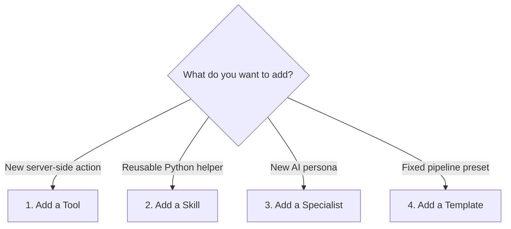

# 10 — Extending the System (Beginner Edition)

> **Goal:** Know exactly which files to touch and in what order when you want to add a new capability to the AI analysis system.

---

## Four ways to extend



**Rule of thumb:** Start with the least invasive option.

- New analysis logic any specialist can use? → **Skill**.
- New server action (database, file system, external API)? → **Tool**.
- New AI personality with its own prompt? → **Specialist**.
- Fixed sequence of existing specialists? → **Template**.

---

## 1. Adding a new MCP tool

A tool is something the AI can _call_ to make the server do work.

### Step-by-step checklist

**Step 1 — Create the tool file**

Create `python/agentic/tools/my_tool.py`:

```python
import json
from mcp import types

# 1. Define the JSON Schema for the tool's arguments
my_tool_input_schema = {
    "type": "object",
    "properties": {
        "mill_number": {"type": "integer", "description": "Which mill (1-12)"},
        "start_date": {"type": "string", "description": "ISO date, e.g. 2024-01-01"},
    },
    "required": ["mill_number", "start_date"],
}

# 2. Create the Tool descriptor
my_tool = types.Tool(
    name="query_lab_data",
    description="Fetch laboratory quality data for a mill and date range.",
    inputSchema=my_tool_input_schema,
)

# 3. Write the handler
async def query_lab_data(arguments: dict) -> list[types.TextContent]:
    mill = arguments["mill_number"]
    start = arguments["start_date"]

    # ... your SQL query or API call here ...
    result = f"Lab data for Mill {mill} from {start}: ..."

    return [types.TextContent(type="text", text=result)]
```

**Step 2 — Register it**

Open `python/agentic/tools/__init__.py` and add:

```python
from .my_tool import my_tool, query_lab_data

tools = {
    # ... existing tools ...
    my_tool.name: {"tool": my_tool, "handler": query_lab_data},
}
```

**Step 3 — Gate it (optional)**

If only certain specialists should use this tool, add it to `TOOL_SETS` in `graph.py`:

```python
# graph.py
TOOL_SETS = {
    "analyst": ["query_mill_data", "execute_python", "query_lab_data"],
    # ... other specialists ...
}
```

**Step 4 — Restart the MCP server**

The MCP server loads the registry at startup. You must restart it for new tools to appear.

> ✅ **Done.** The AI can now call `query_lab_data` just like any other tool.

---

## 2. Adding a new skill

A skill is a reusable Python function that lives inside `execute_python`'s namespace. It is _not_ a separate MCP tool. It is a helper function the AI can import while running code.

### Step-by-step checklist

**Step 1 — Create the skill file**

Create `python/agentic/skills/my_skill.py`:

```python
def calculate_spc_limits(series, sigma=3):
    """Calculate upper and lower control limits for a time series."""
    mean = series.mean()
    std = series.std()
    ucl = mean + sigma * std
    lcl = mean - sigma * std
    return {"mean": mean, "ucl": ucl, "lcl": lcl}
```

**Step 2 — Auto-import it**

The `python_executor.py` tool automatically imports every file in the `skills/` folder into the AI's namespace:

```python
# inside python_executor.py (already exists)
import importlib
import os

skills_dir = os.path.join(os.path.dirname(__file__), "..", "skills")
for filename in os.listdir(skills_dir):
    if filename.endswith(".py") and not filename.startswith("_"):
        module_name = filename[:-3]
        globals()[module_name] = importlib.import_module(f"skills.{module_name}")
```

**Step 3 — Tell the AI it exists**

Update the `execute_python` tool description in `python_executor.py`:

```python
execute_python_tool = types.Tool(
    name="execute_python",
    description="""
    Run Python code. Available libraries: pandas, numpy, matplotlib.
    Available skills: calculate_spc_limits (from my_skill.py).
    """,
    inputSchema={...},
)
```

> ✅ **Done.** The AI can now write `calculate_spc_limits(df['psi80'])` inside `execute_python`.

---

## 3. Adding a new specialist

A specialist is a new AI persona with its own system prompt and allowed tools.

### Step-by-step checklist

**Step 1 — Add to the specialist pool**

Open `graph.py` and add your specialist to `SPECIALIST_POOL`:

```python
# graph.py
SPECIALIST_POOL = {
    "analyst": { ... },
    "forecaster": { ... },
    "maintenance_advisor": {
        "prompt": """
        You are a maintenance advisor. Focus on predicting bearing wear,
        motor overload risk, and lubrication schedules based on vibration
        and temperature trends. Use execute_python to calculate MTBF.
        """,
        "tools": ["query_mill_data", "execute_python", "write_markdown_report"],
    },
}
```

**Step 2 — Add labels for progress messages**

Still in `graph.py`, update `_STAGE_LABELS` so the UI shows a nice name:

```python
_STAGE_LABELS = {
    "data_loader": "Зареждане на данни",
    "planner": "Планиране",
    "analyst": "Анализ",
    "maintenance_advisor": "Поддръжка",  # Bulgarian label
    "manager_review": "Преглед",
    "reporter": "Отчет",
}
```

**Step 3 — Update the planner prompt**

The planner needs to know the new specialist exists. Update the planner's system prompt in `graph.py`:

```python
planner_system_prompt = """
Available specialists:
- data_loader (always first)
- analyst (statistics, trends)
- forecaster (time-series)
- anomaly_detective (outliers)
- maintenance_advisor (bearing wear, motor health)  # <-- add this
- reporter (always last)

Pick 1-4 specialists based on the user's question.
"""
```

**Step 4 — Update TOOL_SETS (if needed)**

```python
TOOL_SETS = {
    "maintenance_advisor": [
        "query_mill_data",
        "execute_python",
        "review_chart",
        "write_markdown_report",
    ],
}
```

> ✅ **Done.** The planner can now dispatch `maintenance_advisor` for relevant questions.

---

## 4. Adding a new template

A template is a pre-defined specialist sequence that bypasses the planner. Use it for common, repeatable workflows.

### Step-by-step checklist

**Step 1 — Define the template**

Open `analysis_templates.py` (or the templates dict in `api_endpoint.py`):

```python
TEMPLATES = {
    "weekly_review": {
        "stages": ["data_loader", "analyst", "shift_reporter", "reporter"],
        "description": "Standard weekly mill performance review.",
        "default_settings": {"contextBudget": 100_000},
    },
    "maintenance_health_check": {  # <-- new template
        "stages": ["data_loader", "maintenance_advisor", "reporter"],
        "description": "Check bearing and motor health for a specific mill.",
        "default_settings": {"contextBudget": 80_000},
    },
}
```

**Step 2 — Expose it in the API**

The `/templates` endpoint already returns `TEMPLATES.keys()`. No extra code needed if you added it to the same dict.

**Step 3 — Use it in the UI**

The UI fetches `/templates` and shows them as quick-start cards. When the user clicks "Maintenance Health Check", the frontend sends:

```json
{
  "question": "Check Mill 8 maintenance health",
  "template_id": "maintenance_health_check"
}
```

> ✅ **Done.** Users can now launch a fixed pipeline with one click.

---

## Extension comparison

| Type           | Files touched                       | Server restart? | LLM retraining? | Difficulty  |
| -------------- | ----------------------------------- | --------------- | --------------- | ----------- |
| **Tool**       | `tools/new.py`, `tools/__init__.py` | MCP only        | No              | ⭐ Easy     |
| **Skill**      | `skills/new.py`                     | No              | No              | ⭐ Easy     |
| **Specialist** | `graph.py` (3 places)               | FastAPI only    | No              | ⭐⭐ Medium |
| **Template**   | `analysis_templates.py`             | No              | No              | ⭐ Easy     |

---

> **Next step:** Go back to `00_index.md` to pick another topic, or dive into `03_mcp_deep_dive.md` to understand the exact code inside `server.py`.
