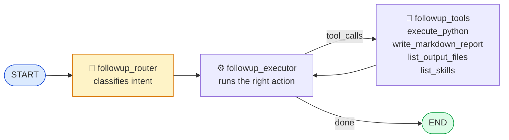
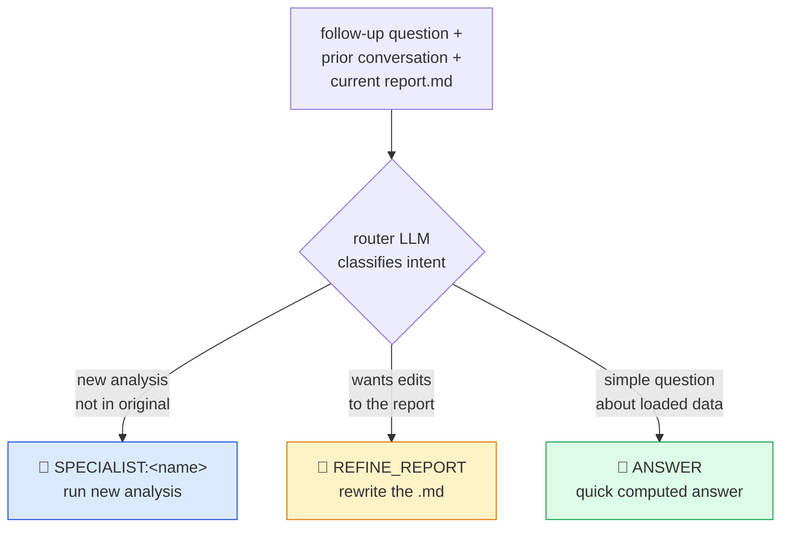

# 10 — Follow-Up Conversations

The main `build_graph` handles a _single_ question end-to-end. Once a report
is on disk the user can ask a **follow-up**: _"Add PSI200 analysis to the
report"_, _"What was the mean Ore on shift 2?"_, _"Run an anomaly check on
DensityHC."_

Follow-ups are served by a second, lighter graph: `build_followup_graph`.

## Why a separate graph?

- The main pipeline is too heavy for one-off questions — no need to replan,
  no need for a full reporter cycle, no need for manager review loops.
- Data is already loaded on the MCP server — the follow-up must not re-query
  the database.
- The output folder is already set — the follow-up should **re-use** it so new
  charts land next to the original report.
- The user may want to _modify_ the report rather than add new analysis — the
  main pipeline can't do that because the reporter always writes from scratch.

## Conversation persistence

After each main analysis completes, `api_endpoint._run_analysis_background`
stores the conversation for later replay:

```python
_analyses[analysis_id]["conversation_history"] = _serialize_messages(
    final_state["messages"]
)
```

`_serialize_messages`:

- Skips `ToolMessage`s (they require `tool_call_id`s that would be orphaned).
- Skips `AIMessage`s that only contain tool calls.
- Keeps the plain text content of `HumanMessage` / `AIMessage`.

When the user sends a follow-up, `_rebuild_messages` recreates LangChain
`HumanMessage` / `AIMessage` / `SystemMessage` objects from the serialised
dicts and keeps the last 30 for context.

## Follow-up graph shape



Three nodes only — no manager review, no rework loop, no specialist pool.

### What the router decides



## The router

`FOLLOWUP_ROUTER_PROMPT` asks the LLM to classify the user's intent into one
of three actions:

| Action              | When to use                                            | What the executor does                                                       |
| ------------------- | ------------------------------------------------------ | ---------------------------------------------------------------------------- |
| `SPECIALIST:<name>` | User asks for NEW analysis not in the original report. | Run the named specialist's style of analysis on the existing data.           |
| `REFINE_REPORT`     | User wants the existing report modified/expanded.      | Call `list_output_files`, then `write_markdown_report` with updated content. |
| `ANSWER`            | Quick question ("what's the mean of X?").              | One-shot `execute_python` with a printed answer.                             |

Output format:

```
ACTION: SPECIALIST:analyst
INSTRUCTION: Compute PSI200 descriptive stats and add an SPC chart.
```

Parser is forgiving — case-insensitive, tolerates extra text, defaults to
`ACTION: ANSWER` on any failure.

## The executor

A single node with a dynamically built system prompt:

```python
if action.startswith("SPECIALIST:"):
    system = f"{FOLLOWUP_SPECIALIST_PROMPT}\n\nYou are acting as the {name} specialist.\nTask: {instruction}"
elif action == "REFINE_REPORT":
    system = f"{FOLLOWUP_SPECIALIST_PROMPT}\n\nTask: Refine the existing report. {instruction}\n…"
else:   # ANSWER
    system = f"{FOLLOWUP_SPECIALIST_PROMPT}\n\nTask: {instruction}\nAnswer the user's question using the loaded data."
```

The executor is bound to a fixed tool set:

```python
FOLLOWUP_TOOLS = ["execute_python", "list_output_files",
                  "write_markdown_report", "list_skills"]
```

Note the absence of `query_mill_data` / `query_combined_data` — the follow-up
intentionally cannot reload the database.

### Loop logic

```python
def executor_router(state):
    last = state["messages"][-1]
    if hasattr(last, "tool_calls") and last.tool_calls:
        return "followup_tools"
    return "end"
```

Tools run, result returns to the executor, executor either calls more tools or
produces a text answer → END. There is no manager review and no iteration cap
— the LLM is trusted here because the context is narrow.

## Output folder re-use

Before the follow-up graph starts, `_run_followup_background` calls:

```python
await session.call_tool("set_output_directory", {"analysis_id": analysis_id})
# NOTE: analysis_id is the *original* id, not the followup_id
```

This is essential — any new chart produced by the follow-up must land next to
the original report so the existing `` references keep
working.

The status endpoint also honours this:

```python
parent_id = entry.get("parent_analysis_id", analysis_id)
analysis_dir = os.path.join(OUTPUT_DIR, parent_id)
```

So GET `/status/{followup_id}` returns the files of the **parent** analysis
(which now includes the follow-up's additions).

## Follow-up IDs

```python
followup_id = f"{analysis_id}-f{uuid[:4]}"     # e.g. "ab12cd34-f7e0"
```

The `-f` prefix makes follow-ups easy to distinguish in logs and telemetry.
Each follow-up is tracked as its own entry in `_analyses`, with
`parent_analysis_id` set so the status endpoint knows where the files are.

## After a follow-up

The follow-up executor's messages are appended to the main conversation:

```python
_analyses[analysis_id]["conversation_history"] = _serialize_messages(
    final_state["messages"]
)
```

So a second follow-up sees the first follow-up's context. The history grows
unbounded in memory; the `[-30:]` slice in `_run_followup_background` keeps
the prompt size bounded even for long chains of follow-ups.

## Failure handling

The background runner catches `BaseException` (not just `Exception`) because
LangGraph wraps concurrent errors in `ExceptionGroup`. If an `ExceptionGroup`
is caught, each sub-exception is logged separately so the full cause is
visible in stdout. The status endpoint then returns `status: "failed"` with
the truncated error message.
