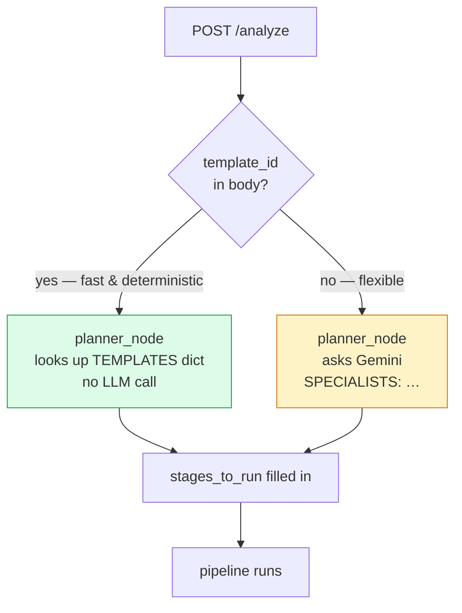

# 11 — Analysis Templates

Templates are named, fixed specialist pipelines that **bypass the planner LLM
call**. When a user picks a template from the UI ("Full analysis", "Forecast",
"Shift comparison", …), the API forwards `template_id` and the planner node
skips its Gemini call entirely.

## Template vs free-form prompt



**When to use which:**

- **Template** when the user picks a button on the empty state — saves one
  Gemini call, guarantees the same shape of report each time.
- **Free-form** when the user types a question — the planner reads it and
  picks specialists dynamically.

## Why templates?

- **Deterministic UX** — "Full analysis" always produces the same sections,
  the same charts, in the same order.
- **Cheaper** — save one Gemini call per analysis.
- **Curated** — the six available templates are known to produce good
  reports. The planner can still be wrong; templates can't.
- **Faster first run** — users exploring the system pick a template instead of
  crafting a prompt.

## Registry

`analysis_templates.TEMPLATES` is a plain dict keyed by `template_id`:

```python
TEMPLATES = {
    "comprehensive": {
        "label":    "Пълен анализ",
        "label_en": "Comprehensive Analysis",
        "description": "EDA + аномалии + сменен отчет — пълен доклад за мелница",
        "specialists": ["analyst", "anomaly_detective", "shift_reporter"],
    },
    "forecast":              {..., "specialists": ["analyst", "forecaster"]},
    "quality":               {..., "specialists": ["analyst", "optimizer"]},
    "shift_comparison":      {..., "specialists": ["shift_reporter"]},
    "anomaly_investigation": {..., "specialists": ["anomaly_detective", "bayesian_analyst"]},
    "optimization":          {..., "specialists": ["analyst", "optimizer"]},
}
```

### Catalogue

| ID                      | Label (bg / en)                                 | Specialists                                |
| ----------------------- | ----------------------------------------------- | ------------------------------------------ |
| `comprehensive`         | Пълен анализ / Comprehensive Analysis           | analyst, anomaly_detective, shift_reporter |
| `forecast`              | Прогноза / Forecast Report                      | analyst, forecaster                        |
| `quality`               | Качество на смилане / Grinding Quality          | analyst, optimizer                         |
| `shift_comparison`      | Сравнение на смени / Shift Comparison           | shift_reporter                             |
| `anomaly_investigation` | Разследване на аномалии / Anomaly Investigation | anomaly_detective, bayesian_analyst        |
| `optimization`          | Оптимизация / Process Optimization              | analyst, optimizer                         |

Each template produces a full pipeline
`FIXED_PREFIX + specialists + FIXED_SUFFIX`:

```
data_loader → planner → {template specialists …} → code_reviewer → reporter
```

The planner node still runs, but only to emit a short AIMessage recording the
template selection. It does not call Gemini.

## Helpers

```python
get_template(template_id)            -> dict | None   # full entry (or None)
get_template_specialists(template_id)-> list[str] | None
list_templates()                     -> list[dict]    # UI-friendly list with id
```

`list_templates()` powers the `GET /api/v1/agentic/templates` endpoint.

## End-to-end wiring

### Frontend (Next.js)

The chat empty-state shows a grid of template cards, each calling:

```ts
POST /api/v1/agentic/analyze
{
  "question":     "...",
  "template_id":  "comprehensive",
  "mill_number":  8,
  "start_date":   "2025-03-01",
  "end_date":     "2025-03-08"
}
```

### API (`api_endpoint.py`)

```python
asyncio.create_task(_run_analysis_background(
    analysis_id, full_prompt,
    settings=settings_dict,
    template_id=request.template_id,     # forwarded
))
```

### Graph (`graph_v3.build_graph`)

```python
def build_graph(..., template_id=None, ...):
    _template_id = template_id

    def planner_node(state):
        if _template_id:
            tpl_specialists = get_template_specialists(_template_id)
            if tpl_specialists:
                selected = [s for s in tpl_specialists if s in SPECIALIST_POOL]
                stages   = FIXED_PREFIX + selected + FIXED_SUFFIX
                _progress("planner", f"Шаблон: {' → '.join(_label(s) for s in selected)}")
                return {"messages": [AIMessage(content=f"Using template '{_template_id}'. SPECIALISTS: {', '.join(selected)}", name="planner")],
                        "stages_to_run": stages,
                        "current_stage": "planner"}
        # … fall through to normal LLM planning …
```

The guard `s in SPECIALIST_POOL` protects against typos in a template
definition — a bad entry is silently dropped rather than crashing the graph.

## Adding a new template

1. Add an entry to `TEMPLATES` with a unique `id`, Bulgarian and English
   labels, a description, and a valid specialist list.
2. Restart the FastAPI server (templates are read at import time).
3. Verify via `GET /api/v1/agentic/templates` — the new template appears in
   the response.
4. The UI template gallery is data-driven, so it picks up the new entry with
   no code changes.

Constraints:

- Every `specialist` name must exist in `SPECIALIST_POOL` (case-sensitive,
  snake_case).
- Don't include `data_loader`, `planner`, `code_reviewer`, or `reporter` —
  those are appended automatically.
- Order matters: put foundational specialists (usually `analyst`) first.

## When _not_ to use templates

- The user's question is specific and unusual — let the planner route it.
- You want to experiment with a new specialist combo without freezing it yet.
- A/B testing prompt changes in the planner.

For those cases, simply omit `template_id` from the request and the planner
runs normally.
