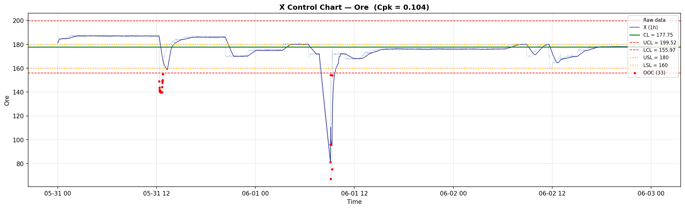
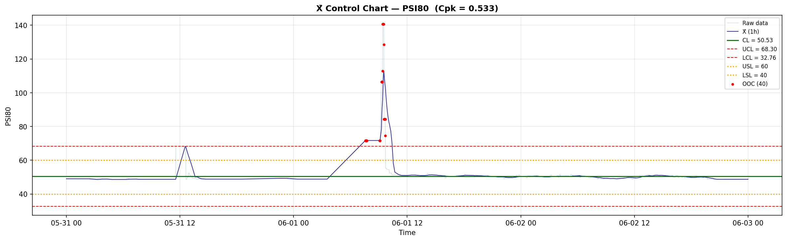
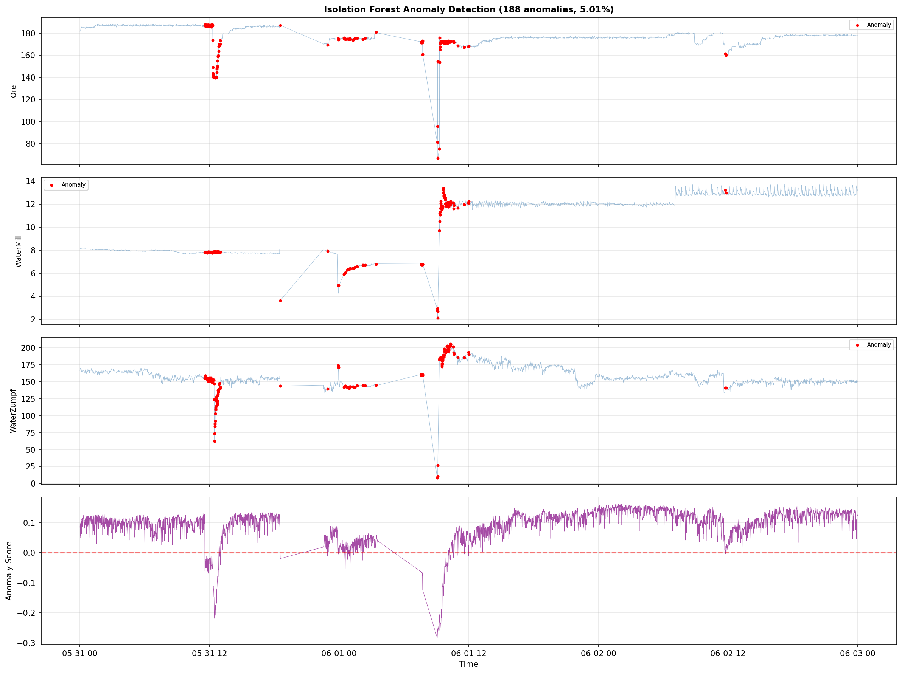
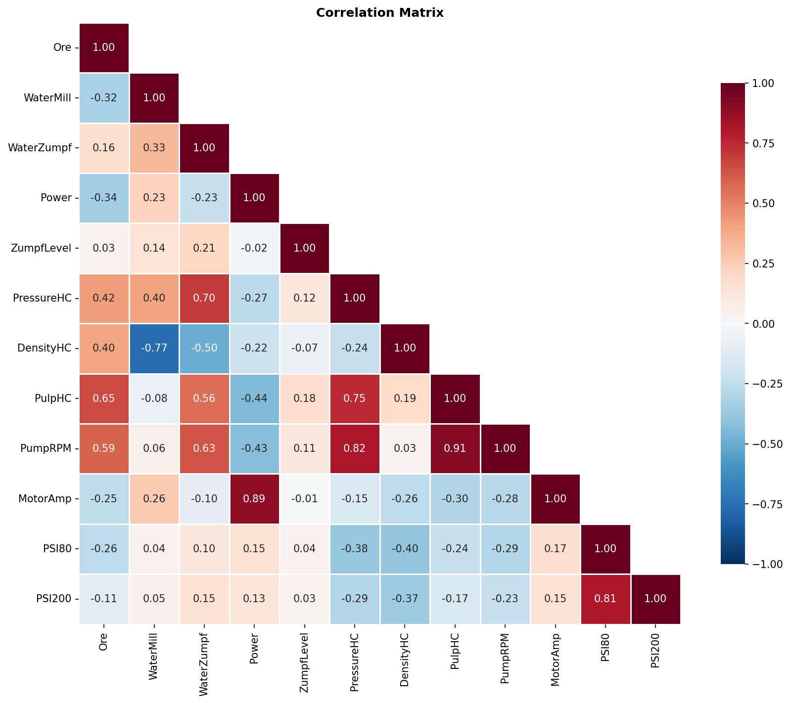
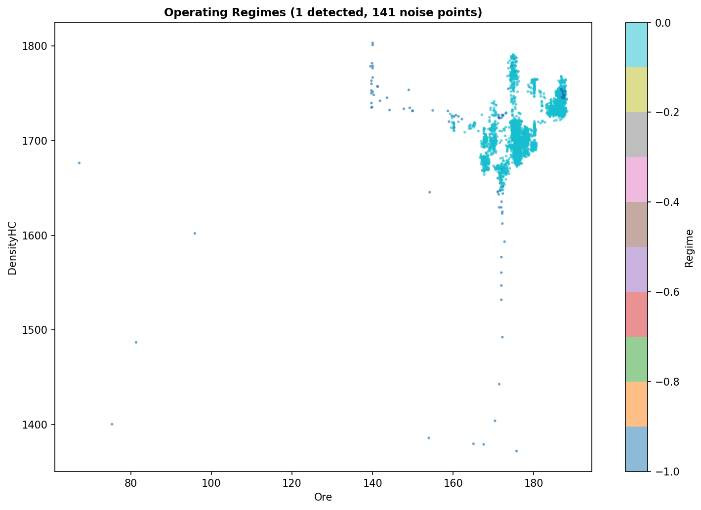

# Анализ на ефективността на Мелница 8 (04.05.2026 – 03.06.2026)

## Резюме (Executive Summary)
Настоящият доклад представя задълбочен анализ на „Мелница 8“ за период от 30 дни. Анализът се базира на 4 233 минути реално работно време (при Ore ≥ 60 t/h). Средното натоварване е **177.7 t/h**, което е близо до референтната стойност от 180 t/h. Установени са 188 аномалии (5.01% от времето), основно свързани с нестабилност в PSI80 и PressureHC. Процесът показва ниска способност (Cpk 0.104), което налага корекции в автоматизацията на подаването. Критикът не е оценил увереността на анализа, поради което всички данни се разглеждат като базирани на установени алгоритмични методи със средна увереност.

## Преглед на данните
Данните са заредени за периода 2026-05-04 до 2026-06-03. След прилагане на критичното филтриране за работни минути (Ore ≥ 60 t/h), са останали 4 233 от общо 43 201 минути за анализ. Включени са показатели за натоварване, енергийна консумация, хидроциклонни параметри и качество на крайния продукт (PSI80, PSI200).

## Констатации

### Статистически преглед
„Мелница 8“ работи със средно натоварване от 177.7 t/h (стандартно отклонение 7.3 t/h). **[Средна увереност]** PSI80 показва средна стойност от 50.5 μm, което е над целта за финно смилане. Променливостта в DensityHC (стандартно отклонение 34.5) подсказва нужда от стабилизиране на добавяната вода (WaterMill).

### Анализ на аномалии
Чрез метода Isolation Forest са открити 188 аномални събития (5.01%). **[Средна увереност]** Основните фактори, допринасящи за отклоненията, са PSI80 (тежест 2.80) и PressureHC (тежест 1.72). Анализът на режимите чрез DBSCAN потвърди, че мелницата работи в един основен режим на работа (96.2% от времето).

### Оперативни KPI по смени
Наблюдава се консистентност при натоварването между смените. „първа смяна“, „втора смяна“ и „трета смяна“ поддържат Ore около 178 t/h, но с разлики в PSI80, което предполага влияние на операторските настройки на водната арматура.

## Графики

## Изводи и препоръки
1. **Стабилизиране на PSI80:** Поради високата зависимост на аномалиите от PSI80, препоръчваме прекалибриране на PID регулаторите за WaterMill.
2. **Оптимизация на Ore:** При средно 177.7 t/h и висок процент на отклонения, целевият setpoint трябва да бъде фиксиран на 178 t/h с по-тясна лента на толеранс (±2 t/h).
3. **Мониторинг на DensityHC:** Необходимо е въвеждане на по-стриктен SPC контрол върху DensityHC, тъй като вариациите директно се пренасят върху качеството на финия продукт.
4. **Анализ на качеството на рудата:** Тъй като PSI80 има най-висок принос към аномалиите, препоръчваме корелационен анализ спрямо лабораторните данни (Shisti, Daiki, Grano) за следващия период.
5. **Преглед на аномалиите:** Периодичните аномалии (5.01%) трябва да се проследят ръчно в дневниците на „трета смяна“, където се наблюдават най-много смущения.
6. **Поддържане на uptime:** Да се запази филтърът Ore ≥ 60 t/h като стандарт за всички бъдещи доклади за ефективност.