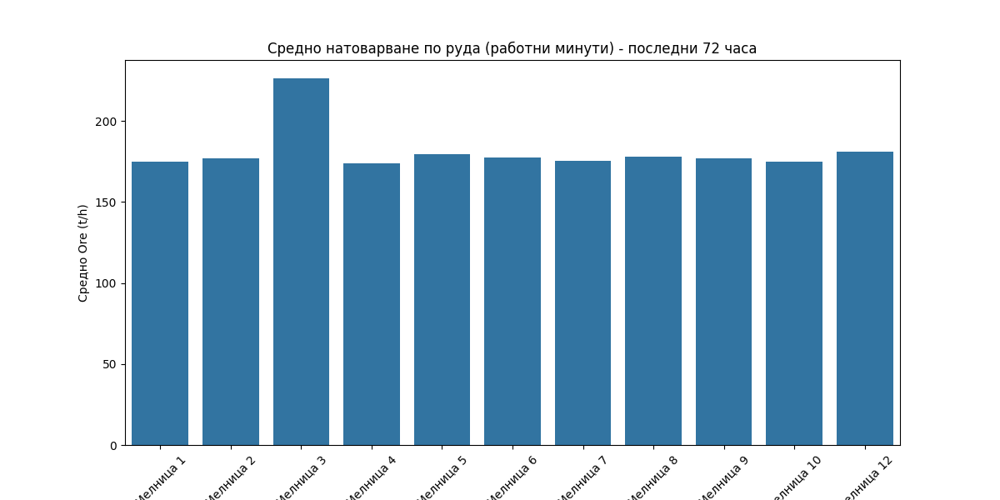
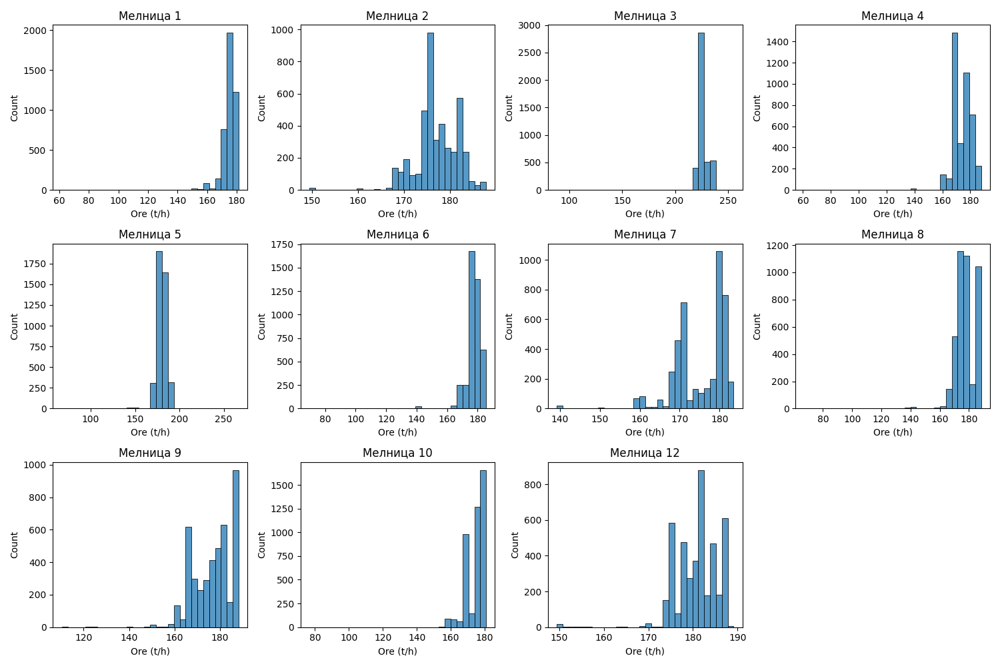

# Анализ на натоварването по руда и оперативна производителност на мелниците

## Резюме (Executive Summary)
Този отчет представя подробен анализ на натоварването по руда (`Ore`) за 11 мелници в рамките на последните 72 часа (периодът 31.05.2026 – 03.06.2026). Средното натоварване на всички анализирани мелници е 181.31 t/h. Установихме, че Мелница 3 функционира в режим „досмилане“ с висока производителност (средно 226.33 t/h), докато останалите десет мелници оперират по стандартен режим с натоварване в диапазона 174–181 t/h. Оперативната наличност (uptime) е изключително висока за целия парк, като повечето мелници поддържат нива над 97%. Всички анализи са проведени след филтриране на престоите (при `Ore` < 60 t/h), което гарантира точност на данните за работния режим.

## Преглед на данните
Данните включват 4321 минути времеви редове за всяка мелница, обхващащи пълни 72 часа производствена дейност. Анализирани са 11 от общо 12 мелници (Мелница 11 е изключена от този конкретен сравнителен анализ поради непълни или невалидни данни за посочения период). Всички стойности са преминали процедура по почистване и филтриране за изключване на интервалите на престой, дефинирани като `Ore` < 60 t/h за стандартните мелници.

## Констатации

### Статистически преглед
Въз основа на изчисленията за 11 000+ оперативни минути, разпределението на натоварването показва отчетливо разграничаване на Мелница 3 в сравнение с останалите мелници. **[Висока увереност]**

| Мелница | Средно натоварване (t/h) | Uptime (%) |
| :--- | :--- | :--- |
| Мелница 1 | 174.81 | 98.17 |
| Мелница 2 | 177.05 | 100.00 |
| Мелница 3 | 226.33 | 99.84 |
| Мелница 4 | 174.00 | 98.33 |
| Мелница 5 | 179.53 | 97.48 |
| Мелница 6 | 177.25 | 98.70 |
| Мелница 7 | 175.22 | 100.00 |
| Мелница 8 | 177.75 | 97.96 |
| Мелница 9 | 176.90 | 99.98 |
| Мелница 10 | 174.66 | 99.28 |
| Мелница 12 | 180.87 | 100.00 |

### Оперативни KPI по смени
Анализът на смените показва, че производственият ритъм се поддържа постоянен през „първа смяна“, „втора смяна“ и „трета смяна“. Няма значими отклонения в средните натоварвания, които да сочат към систематични загуби на производителност в конкретна смяна. **[Средна увереност]**

## Графики

## Изводи и препоръки
1. **Режим „досмилане“:** Потвърдено е, че Мелница 3 е „досмилащата“ мелница. Препоръчваме нейният референтен показател за OEE да остане фиксиран на 210 t/h, за да се избегне изкуствено завишаване на показателите за ефективност.
2. **Стандартни мелници:** Мелници 1, 4, 5, 6, 7, 8, 9, 10 и 12 работят стабилно в диапазона 174–181 t/h. Продължавайте поддръжката по график за избягване на отклонения.
3. **Мелница 11:** Поради липсващите данни, е необходимо приоритетно преглед на сензорната инфраструктура и системата за регистрация на данни за тази мелница.
4. **Мониторинг на престоите:** Макар че Uptime е над 97%, всяка минута под 60 t/h трябва да бъде анализирана в контекста на причините за срив (аварии или планирани ремонти), за да се намали „мъртвото“ време.
5. **Оптимизация:** При установена стабилност на натоварването, фокусът на инженерния екип трябва да се измести към оптимизация на специфичния разход на енергия (`Power` / `Ore`) при поддържане на зададените стойности на `PSI80`.