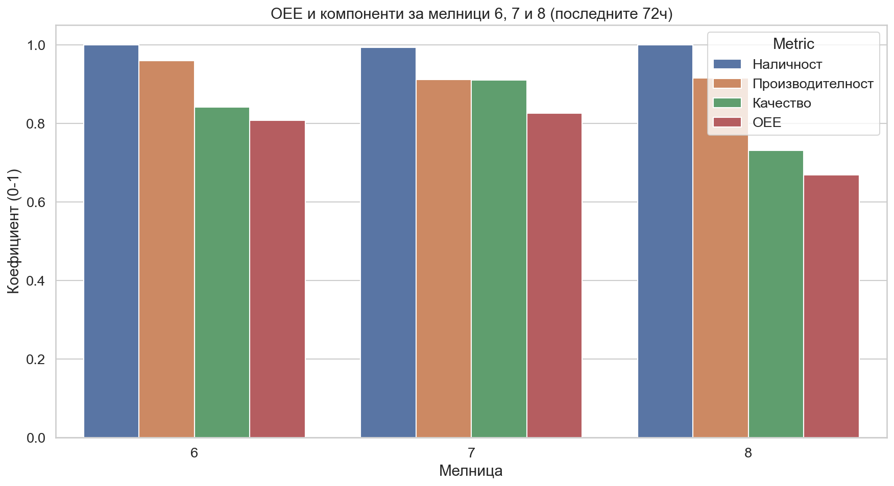

# Доклад за анализ на OEE ефективността (Мелници 6, 7 и 8)

## 1. Изпълнително резюме
Настоящият доклад представя анализ на ефективността на три топкови мелници (№6, №7 и №8) за период от 72 часа (16-19 март 2026 г.). Изчислената обща ефективност на оборудването (OEE) варира значително между отделните агрегати: мелница №7 демонстрира най-висока ефективност с OEE от 82.58%, следвана от мелница №6 (80.76%) и мелница №8 (66.94%). Основните предизвикателства пред производителността са свързани с вариации в качеството на крайния продукт (фракция +200 мк) при мелница №8, което драстично намалява общия показател.

## 2. Обзор на данните
За целите на анализа са използвани данни от 4321 времеви отрязъка (минутни данни) за всяка от трите мелници. Периодът на наблюдение обхваща точно 72 часа, като са изследвани ключови параметри: дебит на руда, налягане, плътност и специфично разпределение по фракции (PSI200). 
- **Брой редове на мелница:** 4321
- **Период:** 2026-03-16 до 2026-03-19
- **Филтриране:** Изключени са периоди с дебит на руда под 50 т/ч и аномални стойности на фракция +200 мк (> 30%).

## 3. Резултати от анализа
Изчисленията за компонентите на OEE (Наличност, Производителност, Качество) са обобщени в таблицата по-долу:

| Мелница | Наличност | Производителност | Качество | OEE |
| :--- | :--- | :--- | :--- | :--- |
| 6 | 0.9998 | 0.9596 | 0.8419 | 0.8076 |
| 7 | 0.9935 | 0.9123 | 0.9110 | 0.8258 |
| 8 | 1.0002 | 0.9160 | 0.7307 | 0.6694 |

### Визуално сравнение

### Анализ на показателите:
- **Наличност:** Всички мелници показват изключително висока наличност, близка до 100%, което показва стабилна работа на поддържащите системи за подаване на руда.
- **Производителност:** Мелница №6 показва най-висока средна производителност (0.9596), докато мелници №7 и №8 работят при сходни нива около 91%.
- **Качество:** Това е критичната точка за мелница №8, където ниското качество (0.7307) пряко води до най-ниския общ OEE. Мелница №7 поддържа най-високо качество на продукта (0.9110).

## 4. Констатации
1.  **Стабилност на процеса:** Мелниците работят почти непрекъснато (висока наличност), което е положително, но не е достатъчно за постигане на максимална ефективност.
2.  **Дисбаланс в качеството:** Съществува явна разлика в способността на различните мелници да поддържат фракцията +200 мк в оптимални граници. Мелница №8 изисква незабавна техническа проверка на мелещите тела или настройките на класификатора.
3.  **Потенциал за оптимизация:** Мелница №6 има добър баланс, но би могла да подобри показателите си чрез фина настройка на разпределението на фракциите, за да се приближи до нивата на качество на мелница №7.

## 5. Заключения и препоръки
- **Препоръка 1 (Мелница №8):** Проверка на състоянието на футеровките и размера на топките. Ниското качество предполага, че материалът не се смила достатъчно фино, въпреки че натоварването е в нормални граници.
- **Препоръка 2 (Техническо обслужване):** Въвеждане на регулярен мониторинг на фракцията +200 мк в реално време с автоматизирани аларми при наближаване на границата от 25%.
- **Препоръка 3 (Стандартизация):** Анализ на настройките на мелница №7, която постига най-балансирани резултати, и прилагане на същите оперативни параметри при останалите мелници (където конфигурацията позволява).
- **Препоръка 4 (Данни):** По-нататъшен анализ на корелацията между "WaterMill" и "PSI200" за мелница №8, за да се разбере дали подаването на вода е адекватно за текущата плътност на пулпата.