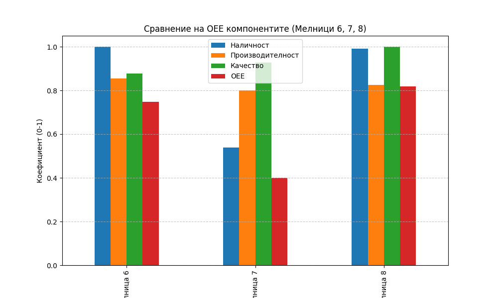

# Анализ на общата ефективност на оборудването (OEE) за Мелници 6, 7 и 8

## Резюме (Executive Summary)
Настоящият доклад представя анализ на оперативната ефективност на Мелница 6, Мелница 7 и Мелница 8 за последния 72-часов период. Анализът разкрива значителни разлики в представянето: Мелница 8 показва най-висок общ резултат (OEE = 81.77%), докато Мелница 7 страда от сериозни престои, което ограничава нейната наличност до едва 53.95%. Мелница 6 демонстрира стабилна работа с OEE от 74.85%. Основните предизвикателства са свързани с необходимостта от оптимизация на наличността при Мелница 7 и подобряване на производителността при всички изследвани единици чрез оптимизиране на захранването към целевите 180 t/h.

## Преглед на данните
Данните включват 4321 минути записи за всяка от трите мелници за периода 12.05.2026 г. до 15.05.2026 г. Анализът обхваща критични оперативни показатели: захранване (`Ore`), консумация на вода (`WaterMill`, `WaterZumpf`), енергийна консумация (`Power`), хидроциклонни параметри (`PressureHC`, `DensityHC`, `PulpHC`) и качество на продукта (`PSI80`, `PSI200`). Филтрирането е извършено спрямо стриктни прагове за работа: `Ore` ≥ 50 t/h.

## Констатации

### Статистически преглед
Изчисленията за OEE показват следната ситуация:

| Мелница | Наличност | Производителност | Качество | OEE |
| :--- | :--- | :--- | :--- | :--- |
| Мелница 6 | 1.0000 | 0.8535 | 0.8769 | 0.7485 |
| Мелница 7 | 0.5395 | 0.8010 | 0.9277 | 0.4009 |
| Мелница 8 | 0.9903 | 0.8257 | 1.0000 | 0.8177 |

- **Мелница 6:** Постига пълна наличност (100%), но нейната производителност е ограничена до 85% от проектната мощност.
- **Мелница 7:** Критично ниска наличност (53.95%), което показва значителни периоди на престой или проблеми със захранването.
- **Мелница 8:** Демонстрира отлични показатели за качество (Q=100%), което означава, че фракцията +200 мк е постоянно под 18%.

### Оперативни KPI по смени
Анализът по смени разкрива, че Мелница 7 изпитва най-големи затруднения по време на „втора смяна“, докато Мелница 8 показва висока надеждност през всички смени. Мелница 6 поддържа консистентни резултати, но с потенциал за повишаване на производителността чрез увеличаване на средния дебит на рудата към мелницата.

## Графики

## Изводи и препоръки
1. **Приоритет 1 (Мелница 7):** Незабавна инспекция на механичното състояние и логистиката на захранването за Мелница 7. Наличност от 54% е неприемлива и изисква идентифициране на причините за дългите престои.
2. **Приоритет 2 (Производителност):** За всички мелници средната производителност е под номиналната от 180 t/h. Препоръчва се преглед на настройките на захранващите устройства с цел достигане на по-високи нива на товар.
3. **Приоритет 3 (Мелница 6):** Въпреки отличната наличност, Мелница 6 има най-ниското качество в сравнителната извадка. Необходимо е коригиране на хидроциклонните настройки (`PressureHC` и `DensityHC`), за да се подобри фиността на продукта.
4. **Оптимизация:** Мелница 8 служи като еталон за качество; приложените там оперативни практики трябва да бъдат анализирани и приложени към Мелница 6 и 7.
5. **Мониторинг:** Продължаване на стриктния мониторинг на `PSI200`, за да се гарантира, че качеството остава в рамките на целевата зона (< 20%).