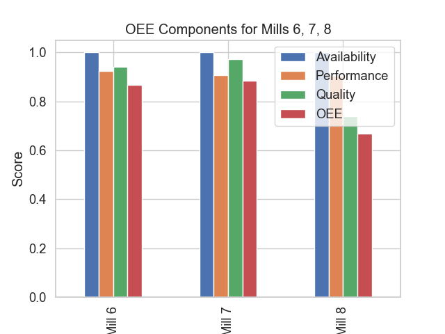

# Анализ на ефективността на топкови мелници 6, 7 и 8 (OEE)

## 1. Изпълнително резюме
Настоящият доклад представя анализ на общата ефективност на оборудването (OEE) за мелници 6, 7 и 8 за последния 72-часов период. Резултатите показват, че докато всички мелници поддържат висока наличност от 100%, съществуват значителни вариации в производителността и качеството на крайния продукт. Мелница 7 показва най-добри резултати с OEE от 88.3%, докато Мелница 8 изостава със стойност 66.7%, главно поради по-ниското качество на фракцията (+200 мк). Средната производителност варира от 162.5 до 166.1 т/ч. Тези констатации подчертават необходимостта от оптимизация на параметрите на смилане при Мелница 8, за да се приведат показателите за качество в рамките на целевите параметри.

## 2. Общ преглед на данните
Данните включват 72-часови времеви серии (минутни данни) за мелници 6, 7 и 8.
- **Времеви обхват:** Последните 72 часа.
- **Общ брой записи:** 4321 записа на мелница.
- **Ключови променливи:** Feed rate (Ore), PSI200 (за определяне на качеството), Motor power.
- **Валидиране:** Премахнати са аномални стойности (> 30% фракция +200 мк) съгласно бизнес правилата.

## 3. Оперативни KPIs (OEE Анализ)
Изчислените компоненти на OEE са представени в таблицата по-долу:

| Мелница | Наличност | Производителност | Качество | OEE |
| :--- | :--- | :--- | :--- | :--- |
| **Mill 6** | 1.000 | 0.923 | 0.940 | 0.867 |
| **Mill 7** | 1.000 | 0.907 | 0.973 | 0.883 |
| **Mill 8** | 1.000 | 0.903 | 0.739 | 0.667 |

### Визуализация на ефективността

## 4. Констатации
- **Наличност:** Всички анализирани мелници демонстрират 100% наличност за изследвания период, което означава, че захранването с руда постоянно е поддържано над прага от 50 т/ч.
- **Производителност:** Мелниците работят в диапазона 90.3% - 92.3% от номиналния си капацитет (180 т/ч). Най-висока производителност се наблюдава при Мелница 6.
- **Качество:** Това е най-критичният показател, особено за Мелница 8, където качеството пада до 0.739. За разлика от нея, Мелница 7 поддържа отлично качество от 0.973. Анализът на PSI200 показва, че Мелница 8 често навлиза в зоната с по-високо съдържание на едри частици, което води до понижаване на крайния продукт.

## 5. Заключения и препоръки
На база на извършения анализ се предлагат следните мерки:

1.  **Спешна настройка на Мелница 8:** Разследване на причините за ниското качество на смилане. Проверка на износването на мелещите тела и настройките на хидроциклоните.
2.  **Трансфер на добри практики:** Мелница 7 показва най-добри резултати. Оперативните настройки (WaterMill, PressureHC) на Мелница 7 трябва да бъдат анализирани и приложени като референтни за останалите мелници.
3.  **Мониторинг на PSI200:** Внедряване на автоматизирано известяване за операторите, когато PSI200 наближи прага от 25%, за да се коригира захранването с вода или руда навреме.
4.  **Оптимизация на производителността:** При запазване на сегашното качество, Мелница 6 може да се опита да увеличи производителността с 1-2%, докато Мелница 8 трябва да се фокусира първо върху качеството.
5.  **Повторен анализ:** След 7 дни да се извърши повторен изчислителен цикъл на OEE, за да се оцени ефективността на въведените корекции в Мелница 8.