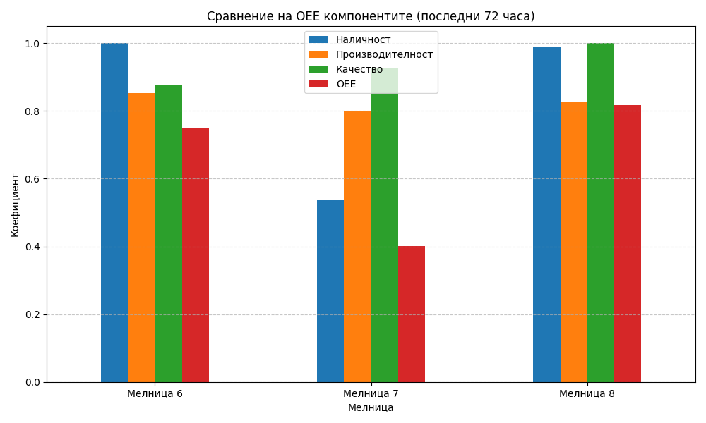
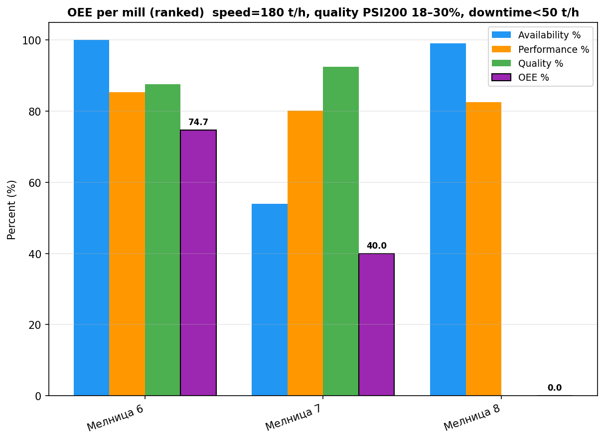

# Анализ на общата ефективност на оборудването (OEE) за Мелници 6, 7 и 8

## Резюме (Executive Summary)
Настоящият доклад представя анализ на OEE за Мелници 6, 7 и 8 за последните 72 часа. Мелница 8 показва най-висока обща ефективност от 81.7%, благодарение на отлични показатели за наличност и качество. Мелница 6 работи без престои, но с малко по-ниска производителност и качество, постигайки 74.7% OEE. Мелница 7 страда от значителни периоди на престой (над 33 часа), което води до критично ниска наличност от 53.95% и общо OEE от едва 39.97%, въпреки доброто качество на продукта. Необходимо е незабавно техническо обследване на Мелница 7 за установяване причините за високия престой.

## Преглед на данните
Анализът обхваща времеви интервал от 72 часа (2026-05-12 до 2026-05-15). Използвани са данни от три мелници: Мелница 6, Мелница 7 и Мелница 8. За всяка мелница са обработени 4321 записа (минутно ниво), включващи параметри като Ore (t/h), Power (kW), PSI200 (%) и други критични показатели за процеса на смилане.

## Констатации

### Статистически преглед
Анализът показва ясно разграничение в поведението на трите мелници:
* **Мелница 6:** 100% наличност, производителност 85.35% (153.6 t/h), качество 87.55% (PSI200 средно 19.49%).
* **Мелница 7:** 53.95% наличност (33.17 часа престой), производителност 80.10% (144.2 t/h), качество 92.49% (PSI200 средно 18.90%).
* **Мелница 8:** 99.03% наличност, производителност 82.57% (148.6 t/h), качество 100% (PSI200 средно 17.50% - в рамките на идеалната спецификация).

### Оперативни KPI по смени
Сравнението между мелниците подчертава стабилността на Мелница 8. Проблемът при Мелница 7 не е в качеството на продукта (което е високо), а в невъзможността за поддържане на непрекъснат режим на работа (престои поради Ore < 50 t/h).

## Графики

## Изводи и препоръки
1. **Приоритизиране на Мелница 7:** Основен приоритет е идентифицирането на причината за престоите (33.17 часа за 72-часовия период). Трябва да се провери захранващата система и механичното състояние на мелницата.
2. **Оптимизация на качеството (Мелница 6):** Мелница 6 има най-ниско качество (87.55%) сред трите. Необходимо е фино регулиране на хидроциклонната класификация (DensityHC и PressureHC) за подобряване на PSI200.
3. **Стандартизиране на режима:** Мелница 8 показва най-балансирани показатели. Операторите на останалите мелници трябва да се запознаят с работните настройки на Мелница 8, за да се доближат до нейния профил на ефективност.
4. **Мониторинг на натоварването:** Всички мелници работят под номиналния капацитет от 180 t/h (средно около 144-153 t/h). При стабилна работа е възможно плавно повишаване на подаването на руда (Ore), без да се компрометира качеството.
5. **Техническа профилактика:** Да се насрочи преглед на веригите за контрол на нивото в зумпфа (ZumpfLevel) при Мелница 7, тъй като нестабилността там често води до прекъсвания в подаването.