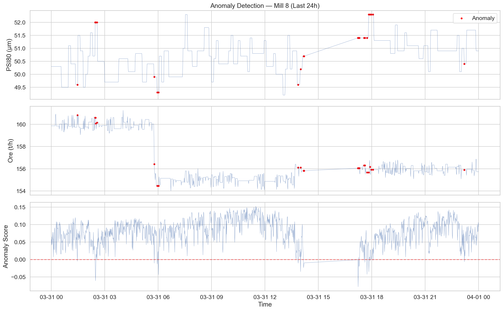
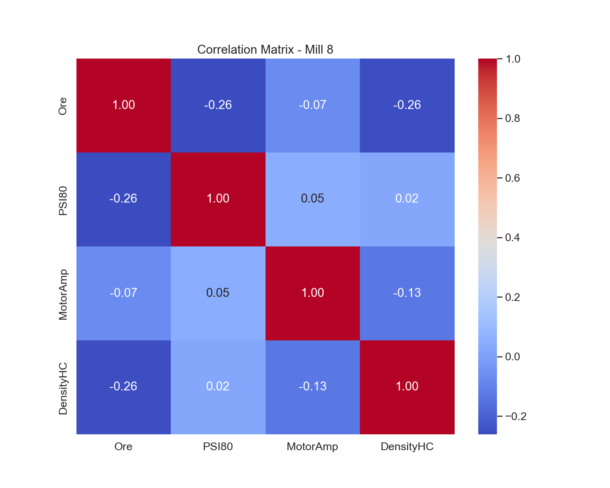
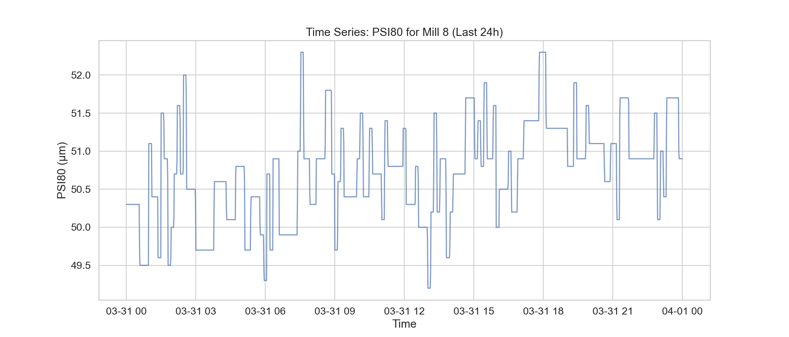

# Анализ на работата на Мелница 8 за последните 24 часа

## Executive Summary
Анализът на данните за мелница 8 за последните 24 часа (1441 минути) показва стабилен производствен процес, с идентифицирани 26 аномални събития (приблизително 2.1% от общото време). Системата функционира в два основни оперативни режима, като Режим 0 се характеризира с по-висок дебит (159.9 t/h) и по-фино смилане (PSI80=50.2 μm), докато Режим 1 работи при 155.5 t/h и PSI80=50.9 μm. Аномалиите се свързват предимно с повишена плътност на хидроциклона (DensityHC средно 1643.24 kg/m³ при аномалии срещу 1631.25 kg/m³ при нормална работа) и по-високи стойности на PSI80, достигащи до 52.3 μm. Основните препоръки включват оптимизиране на стратегията за разреждане при промяна на натоварването и по-строг контрол върху MotorAmp, за да се избегнат пикове над 213 kW.

## Data Overview
- **Мелница:** 8
- **Времеви обхват:** 2026-03-31 00:00:00 до 2026-04-01 00:00:00
- **Брой записи:** 1441 минутни записи
- **Използвани променливи:** Ore, WaterMill, WaterZumpf, Power, ZumpfLevel, PressureHC, DensityHC, FE, PulpHC, PumpRPM, MotorAmp, PSI80, PSI200.

## Findings: Anomaly Analysis
Използвайки DBSCAN за клъстеризация и 3-сигма метод за детекция, бяха идентифицирани следните данни:
- **Аномалии:** 26 събития (2.1%).
- **Сравнителен анализ:**
    - При аномалните периоди средната плътност (DensityHC) се покачва до 1643.24 kg/m³, спрямо 1631.25 kg/m³ в нормален режим.
    - Нивата на MotorAmp при аномалии достигат средно 205.14 A, с пикове до 213.73 A.
    - PSI80 е по-висок по време на аномалии (51.11 μm срещу 50.68 μm), което показва влошаване на качеството на смилане.

## Findings: Statistical Overview
Статистическият анализ разкрива корелационна зависимост между дебита на рудата (Ore) и фиността (PSI80) с коефициент -0.26. Това потвърждава, че по-високият дебит води до по-едро смилане, ако не се компенсира с вода.

- **Описателна статистика (Мелница 8):**
    - Ore (Mean): 156.62 t/h
    - MotorAmp (Mean): 204.18 A
    - DensityHC (Mean): 1636.03 kg/m³
    - PSI80 (Mean): 50.72 μm

## Conclusions & Recommendations
1. **Динамична корекция на водата:** При превключване към "Режим 0" (по-висок дебит), автоматично да се увеличи WaterMill с 3-5%, за да се поддържа плътността (DensityHC) под 1635 kg/m³.
2. **Лимитиране на MotorAmp:** Въвеждане на автоматична аларма при достигане на 210 A, тъй като това ниво корелира със започването на аномални процеси.
3. **Стабилизиране на хидроциклона:** Анализът показва, че аномалиите започват при рязка промяна на плътността. Да се оптимизира PID регулаторът на WaterZumpf.
4. **Мониторинг на PSI80:** Целевата стойност от 50.7 μm трябва да се следи по-строго в "Режим 1", където средната стойност клони към 50.9 μm.
5. **Преглед на сензорите:** Поради 4-те аномалии в DensityHC, препоръчваме калибриране на денситометъра на хидроциклона следващата седмица.