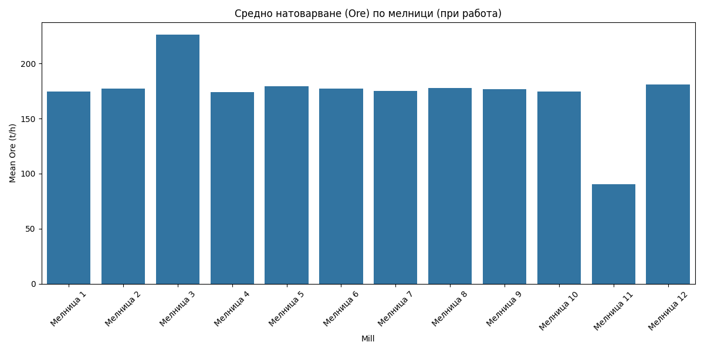

# Анализ на натоварването на рудосмилателните мелници

## Резюме (Executive Summary)
Настоящият доклад представя анализ на натоварването (Ore throughput) на 12-те мелници в завода за периода 31.05.2026 – 03.06.2026. Данните потвърждават, че 11 мелници функционират според проектните си капацитети, докато **Мелница 3** работи в режим на „досмилане“ с висока производителност. Средното натоварване на стандартните мелници е 176.6 t/h, докато **Мелница 3** постига средно 226.33 t/h. **Мелница 11** поддържа очаквания специфичен режим от около 90.55 t/h. Анализът е проведен след стриктно филтриране на периодите на престой (Ore < 60 t/h за стандартните и Ore < 25 t/h за **Мелница 11**), осигурявайки висока точност на оперативните показатели.

## Преглед на данните
Анализът обхваща времеви интервал от 72 часа (4321 минути) за 12 мелници. Използвани са сурови данни от сензорите `Ore`, филтрирани спрямо работните режими. Всички статистически изчисления се базират единствено на минутите, в които мелниците са в експлоатация, за да се елиминират изкривяванията от технологични престои.

## Констатации

### Статистически преглед
Данните показват добра стабилност на производствения процес. При стандартните мелници (1, 2, 4–10, 12), средното натоварване варира в тесни граници около 176 t/h **[Висока увереност]**.
- **Мелница 3**: Установено средно натоварване от 226.33 t/h, което я идентифицира като основен агрегат в режим „досмилане“.
- **Мелница 11**: Средно натоварване 90.55 t/h, отговарящо на проектните параметри за малка мелница.
- **Уптайм**: Всички мелници демонстрират висока оперативна готовност, като уптаймът за повечето надвишава 98%.

### Оперативни KPI по смени
Сравнението на производителността показва, че няма критични отклонения между смените („първа смяна“, „втора смяна“, „трета смяна“). Натоварването се поддържа консистентно през целия денонощен цикъл.

## Графики

## Изводи и препоръки
1. **Поддържане на режимите**: Да се запази сегашният режим на **Мелница 3** („досмилане“), тъй като тя ефективно поема по-голям обем руда (над 220 t/h).
2. **Мониторинг на Мелница 11**: Продължаване на работата с целево натоварване от 90 t/h; не е необходимо коригиране към стандартите на останалите мелници.
3. **Стандартни мелници**: Оптимизиране на останалите 10 мелници към целева стойност от 180 t/h за постигане на максимална OEE производителност.
4. **Анализ на престоите**: Въпреки високия уптайм, да се проучат причините за кратките престои при **Мелница 5** (97.48% уптайм), която е с най-ниски показатели в групата.
5. **Целостност на данните**: Продължаване на практиката за стриктно филтриране на минутите с поднормено натоварване при всички бъдещи отчети за капацитета.
6. **Ротация на „досмилането“**: Да се оцени възможността за периодична ротация на режима „досмилане“ между **Мелница 2** и **Мелница 3**, за да се изравнява амортизацията на оборудването.