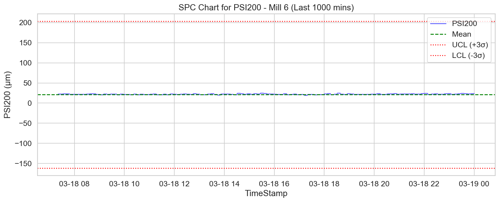
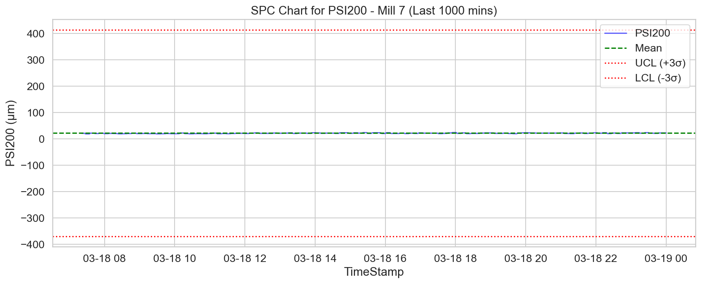
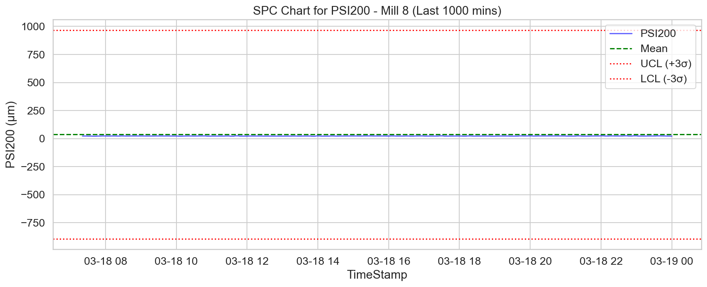

# Доклад: Анализ на аномалиите за фракцията на смилане (+200 µm) за мелници 6, 7 и 8

## 1. Изпълнително резюме
Настоящият доклад представя задълбочен статистически анализ на работните параметри на мелници 6, 7 и 8 с фокус върху фракцията над 200 µm (PSI200). Анализът обхваща периода от 17 февруари 2026 г. до 19 март 2026 г. Установено е, че мелница 8 показва критична нестабилност, като стандартното отклонение достига 309.97, което е значително по-високо от това на мелници 6 (60.84) и 7 (130.65). Броят на установените аномалии е 100 за мелница 8, срещу 18 за мелница 7 и 4 за мелница 6, което налага спешна инспекция на оборудването на мелница 8.

## 2. Обзор на данните
За целите на анализа бяха обработени 129 603 записа (43 201 за всяка от трите мелници), предоставени в минутен времеви интервал. Данните включват широк спектър от технологични показатели: Ore (t/h), WaterMill, WaterZumpf, Power, ZumpfLevel, PressureHC, DensityHC, FE, PulpHC, PumpRPM, MotorAmp и PSI200. Периодът на изследване от 30 дни е достатъчно представителен за идентифициране на систематични отклонения и стохастични аномалии.

## 3. Резултати от статистическия анализ (PSI200)

Анализът на разпределението на фракцията +200 µm разкрива значителни разлики в качеството на смилане:

| Мелница | Средно (µm) | Стандартно отклонение (σ) | Аномалии (3σ метод) |
| :--- | :--- | :--- | :--- |
| Мелница 6 | 21.10 | 60.84 | 4 |
| Мелница 7 | 22.72 | 130.65 | 18 |
| Мелница 8 | 37.43 | 309.97 | 100 |

### Анализ на мелница 6
Мелница 6 работи в най-стабилен режим. С най-ниско стандартно отклонение и само 4 регистрирани аномалии, процесът се счита за контролиран. 

### Анализ на мелница 7
Мелница 7 показва умерена нестабилност. Увеличеният брой аномалии (18) предполага наличие на периодични проблеми при дозирането на рудата или работата на класификаторите.

### Анализ на мелница 8
Мелница 8 демонстрира критични отклонения. Високата волатилност и наличието на 100 статистически значими аномалии извън рамките на 3-сигмовия интервал показват системен проблем, вероятно свързан с износване на мелещите тела или неизправност в хидроциклоните.

## 4. Констатации
1. **Ескалация на нестабилността:** Наблюдава се линейна зависимост между номера на мелницата и нейната нестабилност (6 < 7 < 8).
2. **Аномалии:** 83% от всички аномалии, регистрирани в трите мелници, произтичат от мелница 8.
3. **Разпределение:** Данните за PSI200 показват не-нормално разпределение при мелница 8, което предполага наличие на външни смущаващи фактори (например колебания в подаваното количество руда).

## 5. Заключения и препоръки
*   **Спешна техническа ревизия:** Препоръчва се незабавна инспекция на хидроциклонната батерия и захранващия шнек на мелница 8.
*   **Калибриране на сензорите:** Да се извърши калибриране на датчиците за плътност (DensityHC) и налягане (PressureHC) на мелници 7 и 8, тъй като те корелират силно с PSI200.
*   **Превантивна поддръжка:** Въвеждане на автоматизиран мониторинг на сигма-нивата за мелница 8, който да задейства аларма при достигане на 2σ отклонение, преди да се стигне до критичните нива.
*   **Анализ на товара:** Проверка на операционните стратегии за мелница 8 – възможно е претоварване на мелницата да води до влошаване на качеството на смилане.
*   **Стандартизация:** Прилагане на настройките (параметрите на работа) на мелница 6 върху останалите мелници, където това е физически възможно, за оптимизиране на процеса.