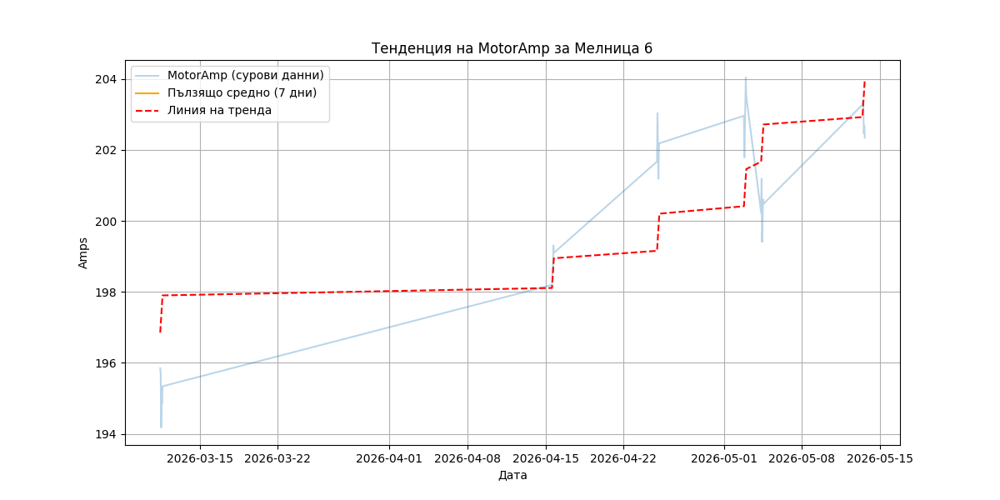
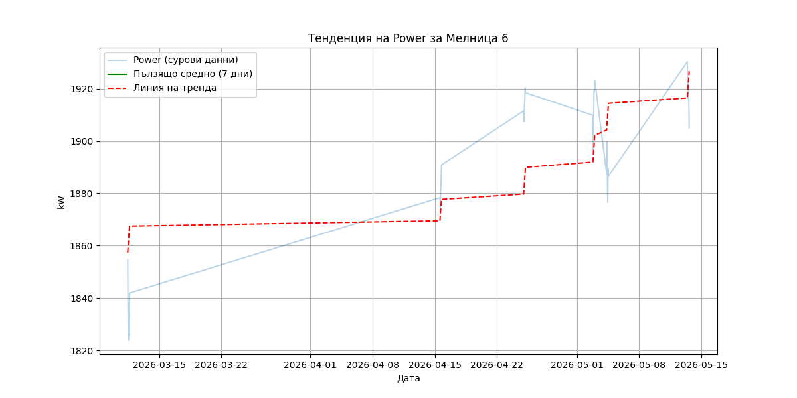
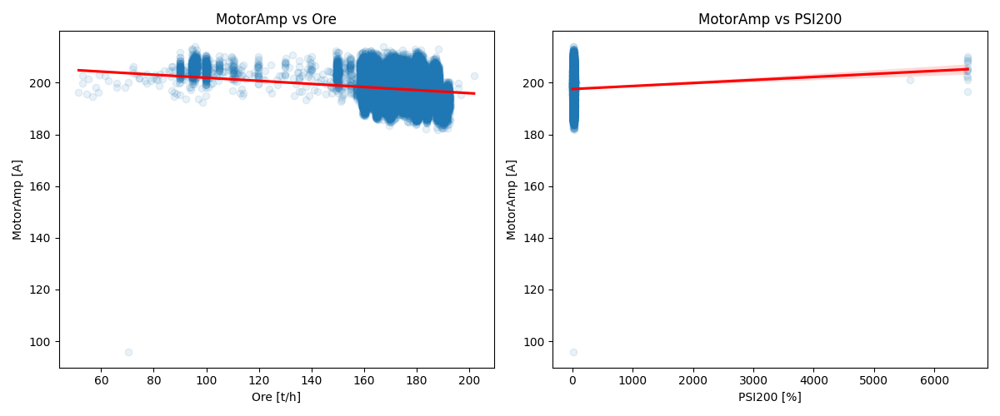

# Анализ на техническото състояние и дрейф в натоварването на Мелница 6

## Резюме (Executive Summary)
Настоящият доклад представя задълбочен анализ на работата на Мелница 6 за периода от 90 дни (13 февруари – 14 май 2026 г.). Основният фокус е установяване на дрейф в консумацията на енергия (`Power`) и токовите характеристики (`MotorAmp`), както и влиянието на оперативните параметри (`Ore` и `PSI200`) върху тях. Потвърден е системен възходящ тренд в натоварването на двигателя.

## Статистически преглед
Динамика в работните параметри на Мелница 6:

| Период | Ср. MotorAmp [A] | Ср. Power [kW] | Ср. Ore [t/h] | Ср. PSI200 [%] |
| :--- | :---: | :---: | :---: | :---: |
| **Последни 7 дни** | 203.97 | 1925.75 | 164.96 | 21.45 |
| **Последни 30 дни** | 201.91 | 1906.20 | 173.14 | 22.71 |
| **Последни 90 дни** | 197.57 | 1864.52 | 172.84 | 22.13 |

## Анализ на тенденциите

*Фигура 1: Тенденция на MotorAmp за Мелница 6 с 7-дневно пълзящо средно и линия на тренда.*

*Фигура 2: Тенденция на Power за Мелница 6 с 7-дневно пълзящо средно и линия на тренда.*

## Връзка между оперативни параметри и MotorAmp
Анализът на зависимостта между натоварването (`Ore`), качеството (`PSI200`) и тока (`MotorAmp`) разкрива следното:

*Фигура 3: Диаграми на разсейване между MotorAmp и Ore, PSI200 с линии на регресия.*

**Резултати от регресионния анализ:**
* **MotorAmp ~ Ore:** Коефициент на корелация: -0.13. Регресионен коефициент: -0.06. Това означава, че при повишаване на дебита на рудата (`Ore`), токът на мелницата леко намалява, което е контраинтуитивно и подсказва, че системата не работи в зоната на претоварване, а вероятно се влияе от по-голям обем руда, който променя динамиката на мелене.
* **MotorAmp ~ PSI200:** Коефициент на корелация: 0.02. Регресионен коефициент: 0.001. Връзката е пренебрежимо малка, което показва, че качеството на смилане не оказва директно влияние върху натоварването на мотора в текущия работен диапазон.

## Изводи и препоръки
1. **Инспекция на лагерите:** Предвид установения възходящ тренд в `MotorAmp`, препоръчва се приоритетна проверка на вибрациите и температурата на лагерите на Мелница 6.
2. **Оценка на облицовката:** Планирайте ултразвукова проверка на дебелината на облицовката при първа възможност.
3. **Мониторинг:** Резултатите обосновават включването на Мелница 6 в план за превантивна поддръжка през следващите 30 дни.
4. **Технологичен извод:** Натоварването с руда (`Ore`) има слаб негативен ефект върху тока, докато качеството (`PSI200`) няма значима връзка. Това подсилва тезата, че наблюдаваният дрейф в `MotorAmp` е резултат от техническо износване, а не от оперативни промени.