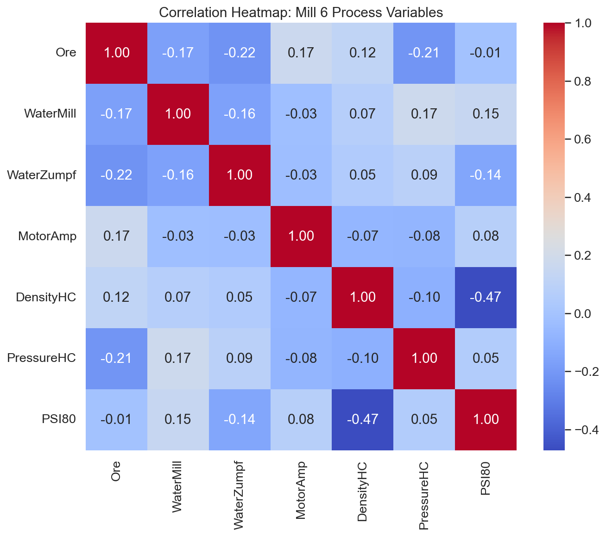
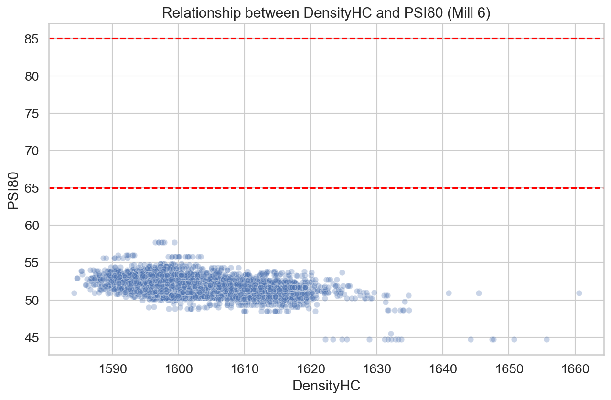
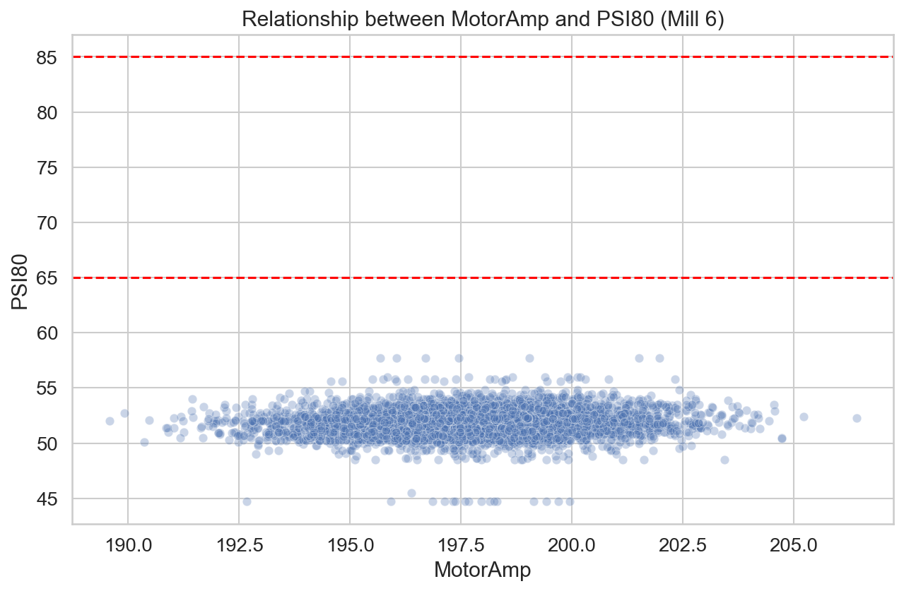
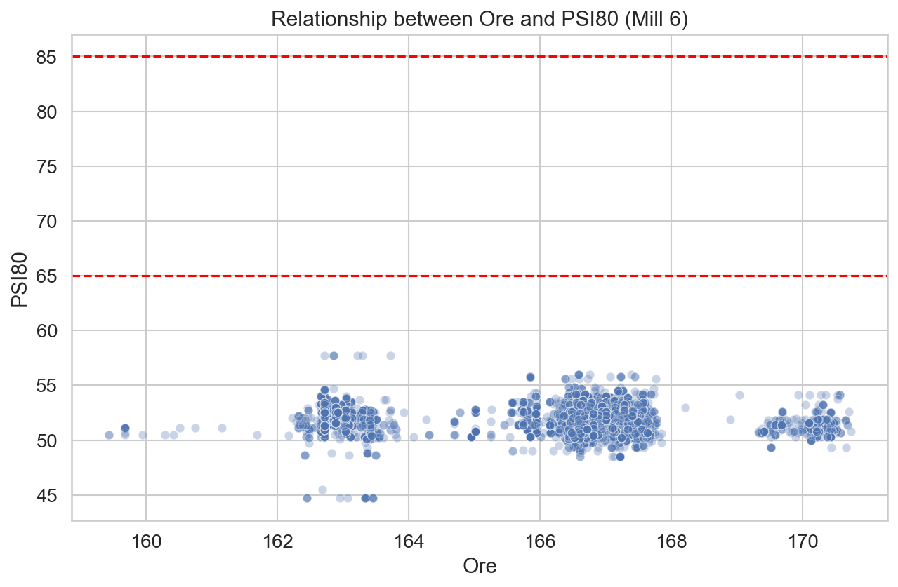
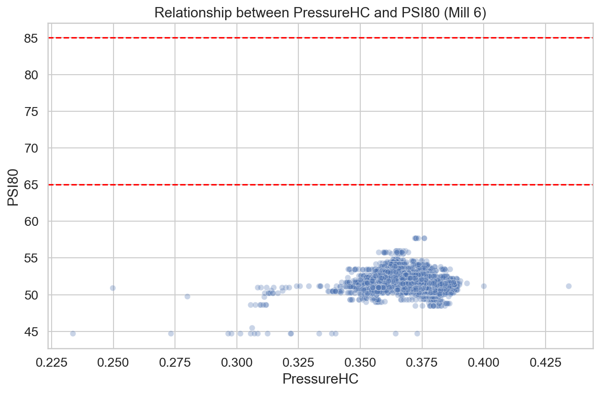
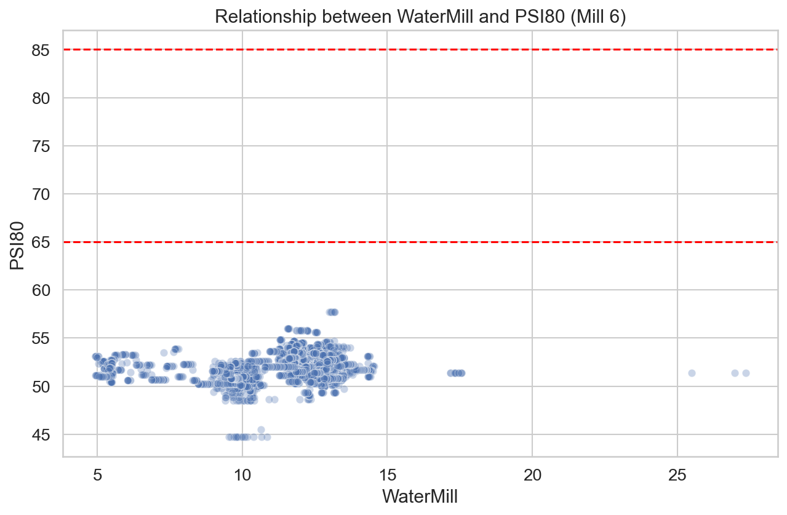

# Доклад за анализ на производителността: Мелница 6

## 1. Executive Summary
Анализът на данните за Мелница 6 за периода 2026-03-31 до 2026-04-03 разкрива критично претоварване на смилащия процес. Средната стойност на фиността на продукта (PSI80) от **51.8 μm** е значително под целевия диапазон от **65-85 μm**, което показва, че мелницата работи в режим на "прекомерно смилане" (over-grinding). Статистическата чувствителност показва, че плътността на хидроциклона (DensityHC) има най-силно влияние (r=-0.472) върху фиността. За оптимизиране на процеса и постигане на целевия PSI80, е необходимо намаляване на плътността на пулпата и внимателно коригиране на подаването на руда (Ore) и вода (WaterMill). Настоящите настройки водят до неефективно използване на енергията и ниско качество на крайния продукт.

## 2. Data Overview
*   **Обект:** Мелница 6
*   **Времеви обхват:** 2026-03-31 до 2026-04-03
*   **Обем на данните:** 4321 минутни записа
*   **Използвани параметри:** Ore, WaterMill, WaterZumpf, MotorAmp, DensityHC, PressureHC, PSI80.

## 3. Statistical Overview
Анализът на данните установи следните основни статистически показатели:
- **PSI80:** средно 51.8 μm (std: 1.24), с диапазон 44.7 - 57.7 μm.
- **Ore:** средно 166.07 t/h (std: 2.20).
- **DensityHC:** средно 1603.59 kg/m³ (std: 8.63).
- **MotorAmp:** средно 197.71 A (std: 2.76).

### Анализ на корелациите и чувствителността (Sensitivity Analysis)
Корелационният анализ (виж фиг. 1) потвърждава, че PSI80 се влияе най-силно от плътността на хидроциклона (r=-0.472).
- **DensityHC → PSI80:** наклона е -0.0677 μm/единица (повишаването на плътността води до по-фин продукт).
- **WaterMill → PSI80:** r=0.147, наклон 0.0961 μm/единица (повишаването на водата към мелницата изненадващо увеличава PSI80, вероятно поради промяна в динамиката на смилане).
- **Ore → PSI80:** r=-0.012 (ниска чувствителност при текущия диапазон).

## 4. Optimization Recommendations
Въз основа на анализа на чувствителността, за преместване на PSI80 към целевия диапазон (65-85 μm), се препоръчват следните действия:

1.  **Намаляване на плътността (DensityHC):** Тъй като DensityHC има най-силно отрицателно влияние, лекото намаляване на плътността в хидроциклона ще позволи по-ефективно класифициране и извеждане на по-едър материал, което ще повиши PSI80.
2.  **Корекция на водата (WaterMill):** Повишаването на WaterMill може да помогне за увеличаване на PSI80, но трябва да се прави поетапно, за да се избегне претоварване на помпата на хидроциклона.
3.  **Оптимизация на натоварването (Ore):** При текущото ниво на прекомерно смилане, леко увеличаване на подаването на руда (Ore) би намалило специфичното енергопотребление и съответно PSI80 би се придвижил към нормални граници.
4.  **Мониторинг на MotorAmp:** Внимавайте текущата консумация да не надвиши критичните нива при промяна на плътността.

## 5. Conclusions & Recommendations
- **Незабавна цел:** Цел за коригиране на PSI80 от 51.8 μm към поне 65 μm.
- **Приоритет 1:** Постепенно намаляване на DensityHC с 10-15 kg/m³ и мониторинг на реакцията на PSI80 за 24 часа.
- **Приоритет 2:** Увеличаване на Ore с 2-3 t/h, за да се използва капацитета на мелницата, без да се превишава PSI80.
- **Приоритет 3:** Стабилизиране на WaterMill спрямо Ore, за поддържане на постоянна плътност.
- **Приоритет 4:** Въвеждане на автоматизиран контрол на WaterZumpf, за да се избегнат флуктуации в нивото на Zumpf, които пречат на стабилността на хидроциклона.
- **Приоритет 5:** Редовен лабораторен анализ на рудата (Shisti, Daiki, Grano), тъй като промените в състава могат да влияят на твърдостта и ефективността на смилане.