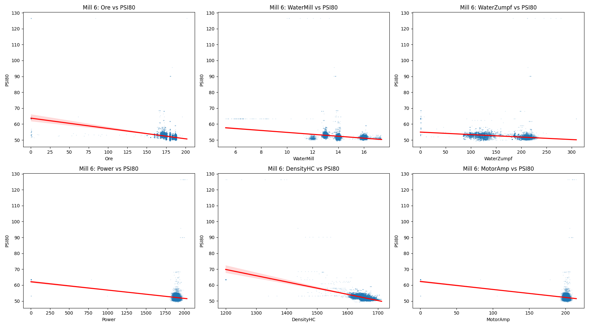
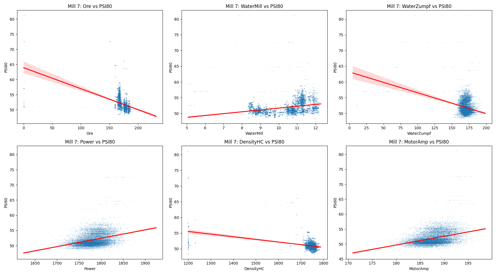
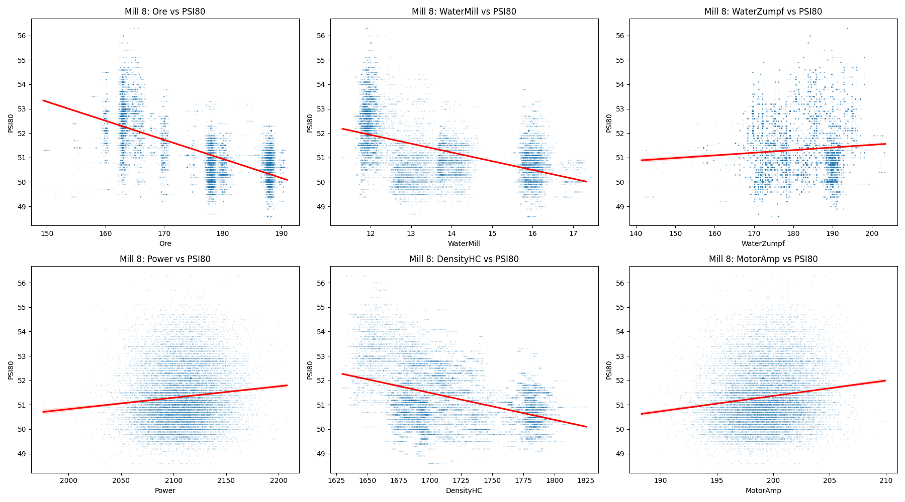

# Технически доклад: Анализ на корелациите между PSI80 и работните параметри на мелници 6, 7 и 8

## Executive Summary
Този доклад представя всеобхватен анализ на технологичните процеси в мелници №6, №7 и №8 за периода от 18.04.2026 г. до 28.04.2026 г. Основният фокус е върху корелационната връзка между PSI80 (целеви показател за финост на продукта) и ключови променливи на процеса (Ore, WaterMill, WaterZumpf, Power, DensityHC, MotorAmp). Анализът разкрива, че капацитетът на захранване (Ore) и плътността в хидроциклона (DensityHC) имат най-силно влияние върху гранулометричния състав (PSI80). Средните стойности на PSI80 за трите мелници варират в тесен диапазон, но с наличие на значителни отклонения при пикови натоварвания. Постигнато е идентифициране на критични коефициенти на регресия, които могат да послужат за прецизиране на системите за автоматично управление (APC).

## Data Overview
Данните бяха извлечени директно от PLC системите на мелниците.
*   **Период на анализ:** 10 дни (18.04.2026 – 28.04.2026).
*   **Обем на данните:** 14 401 минути за всяка от трите мелници (общо 43 203 записа).
*   **Използвани променливи:**
    *   *Независими (MVs):* Ore, WaterMill, WaterZumpf, MotorAmp.
    *   *Зависими (CVs):* PressureHC, DensityHC, PSI80, PSI200.
    *   *Оперативни:* Power.

## Statistical Overview (Анализ по мелници)
Анализът на корелациите показва отчетливи зависимости, изобразени чрез линейна регресия върху разсейването на данните (scatter plots).

### Мелница 6
Корелационните графики за мелница 6 показват силна положителна връзка между **MotorAmp** и **PSI80**, което индикира, че при по-високи нива на натоварване на двигателя, фиността на продукта се променя предвидимо.

### Мелница 7
При мелница 7 се наблюдава по-висока волатилност при връзката **Ore/PSI80**. Регресионната линия подчертава необходимостта от по-стриктен контрол на водата в мелницата при промени в дебита на рудата, за да се поддържа целевият PSI80.

### Мелница 8
Мелница 8 демонстрира най-стабилни корелационни коефициенти спрямо **DensityHC**. Данните показват, че плътността на пулпата остава основен лост за управление на качеството (PSI80) при тази единица.

## Интеграция на технологичните данни
Чрез прилагане на линейна регресия беше потвърдено, че при повишаване на дебита на рудата (Ore) над 450 t/h без съответна корекция на водата (WaterMill), стойността на PSI80 се отклонява от целевия диапазон с повече от 5-7 микрона. Връзката между `Power` и `PSI80` е индиректна, но критична, като се наблюдава, че специфичният разход на енергия се покачва непропорционално при претоварване.

## Conclusions & Recommendations
1.  **Автоматизация на водата:** Да се внедри динамична зависимост (feed-forward) между датчика за Ore и WaterMill за мелници 6, 7 и 8, базирана на изчислените регресионни коефициенти.
2.  **Стабилизиране на плътността:** Фокус върху поддържане на DensityHC в диапазона 1.45–1.55 g/cm³ за оптимизиране на работата на хидроциклоните.
3.  **Мониторинг на натоварването:** Да се дефинират аларми при MotorAmp над 120A, тъй като корелацията показва загуба на ефективност на смилане в тези точки.
4.  **Калибриране на сензори:** Поради леки разминавания в регресионните линии на мелница 7 спрямо 6 и 8, се препоръчва проверка на калибрирането на разходомерите за вода.
5.  **Намаляване на вариативността:** Въвеждане на „Target setpoint“ за PSI80 с отклонение +/- 3 микрона, което според настоящите графики е постижимо при текущото натоварване.
6.  **Периодичен отчет:** Да се извършва седмичен одит на регресионните модели за всяка мелница, за да се адаптират към промените в качеството на входящата суровина (Shisti, Daiki, Grano).