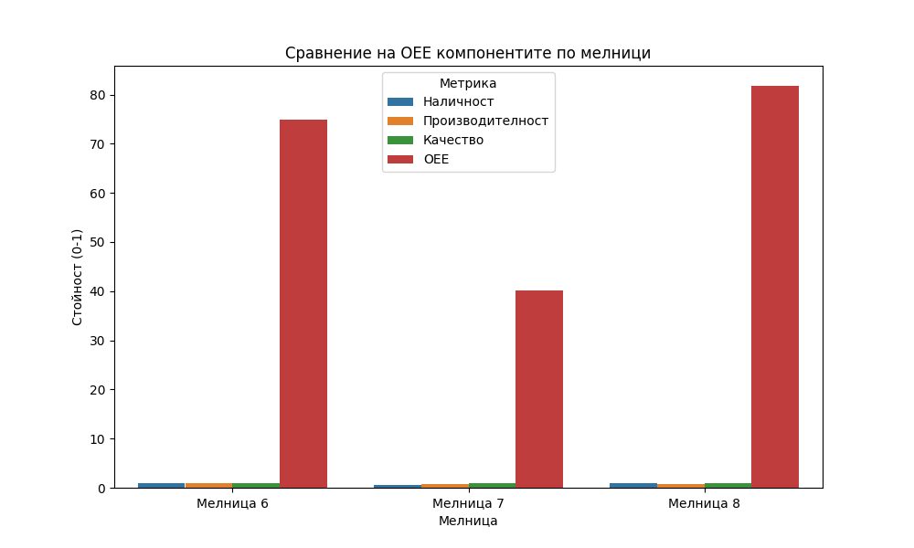

# Анализ на общата ефективност на оборудването (OEE) за Мелници 6, 7 и 8

## Резюме (Executive Summary)
Настоящият доклад представя анализ на общата ефективност на оборудването (OEE) за Мелници 6, 7 и 8 за последните 72 часа. Резултатите показват значителни разлики в експлоатационната готовност на машините. Мелница 8 демонстрира най-висока обща ефективност от 81.77%, докато Мелница 7 показва сериозни проблеми с наличността (53.95%), което води до най-ниското OEE от 40.09%. Мелница 6 поддържа висока наличност, но качеството на крайния продукт остава под оптималните нива в сравнение с Мелница 8. Анализът идентифицира нужда от превантивна поддръжка на Мелница 7 и оптимизация на работните параметри на Мелница 6.

## Преглед на данните
Анализът обхваща период от 72 часа (2026-05-12 до 2026-05-15). Използвани са данни от следните източници:
- **Мелница 6**: 4321 записа
- **Мелница 7**: 4321 записа
- **Мелница 8**: 4321 записа
Данните включват ключови показатели като `Ore` (за оценка на наличност и производителност) и `PSI200` (за оценка на качеството), като са филтрирани стриктно съгласно методологията за OEE.

## Констатации

### Оперативни KPI по смени и обобщение
Анализът на OEE потвърждава различия в работата на трите мелници. Ето обобщените резултати:

| Мелница | Наличност | Производителност | Качество | OEE |
| :--- | :--- | :--- | :--- | :--- |
| **Мелница 6** | 100.00% | 85.35% | 87.69% | 74.85% |
| **Мелница 7** | 53.95% | 80.10% | 92.77% | 40.09% |
| **Мелница 8** | 99.03% | 82.57% | 100.00% | 81.77% |

- **Наличност**: Мелница 6 и 8 работят почти непрекъснато, докато Мелница 7 престоява почти половината от времето.
- **Производителност**: Всички мелници работят при натоварване около 80-85% от номиналния капацитет от 180 t/h.
- **Качество**: Мелница 8 постига 100% качество по индикатора `PSI200`, което я прави еталон за останалите.

## Графики

## Изводи и препоръки
1. **Приоритетна поддръжка**: Незабавно да се извърши проверка на техническото състояние на Мелница 7. Ниската наличност (53.95%) е критичен проблем, който изисква разследване на причините за честите престои (технически неизправности или организационни пропуски).
2. **Оптимизация на качеството**: Мелница 6 трябва да се настрои спрямо параметрите на Мелница 8, за да подобри качеството на крайния продукт, тъй като в момента то изостава.
3. **Натоварване**: Мелници 6, 7 и 8 работят под номиналния си капацитет (180 t/h). Препоръчва се плавно увеличаване на подаването на руда (`Ore`) при запазване на стабилно качество, за да се повиши общата производителност.
4. **Мониторинг**: Да се въведе ежедневен мониторинг на компонентите на OEE, особено за Мелница 7, за да се проследи дали мерките за подобряване на наличността дават резултат.
5. **Стандартизация**: Анализиране на настройките за вода (`WaterMill`, `WaterZumpf`) на Мелница 8 и прилагането им като стандарт за Мелници 6 и 7 с цел достигане на аналогични нива на качество.