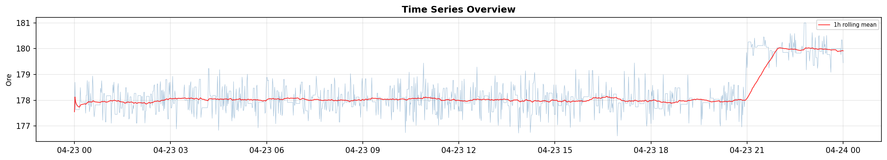
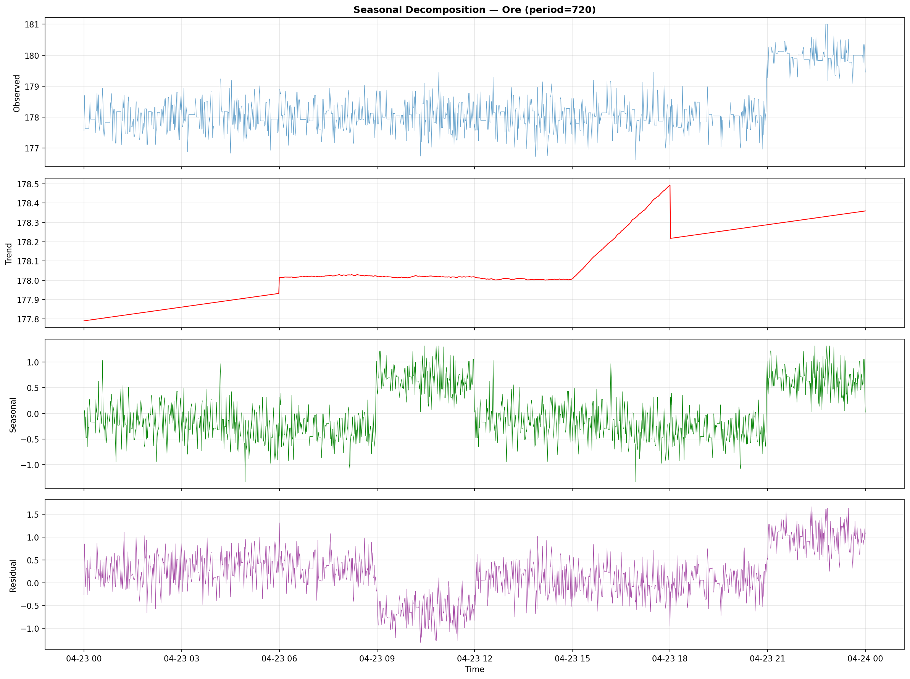
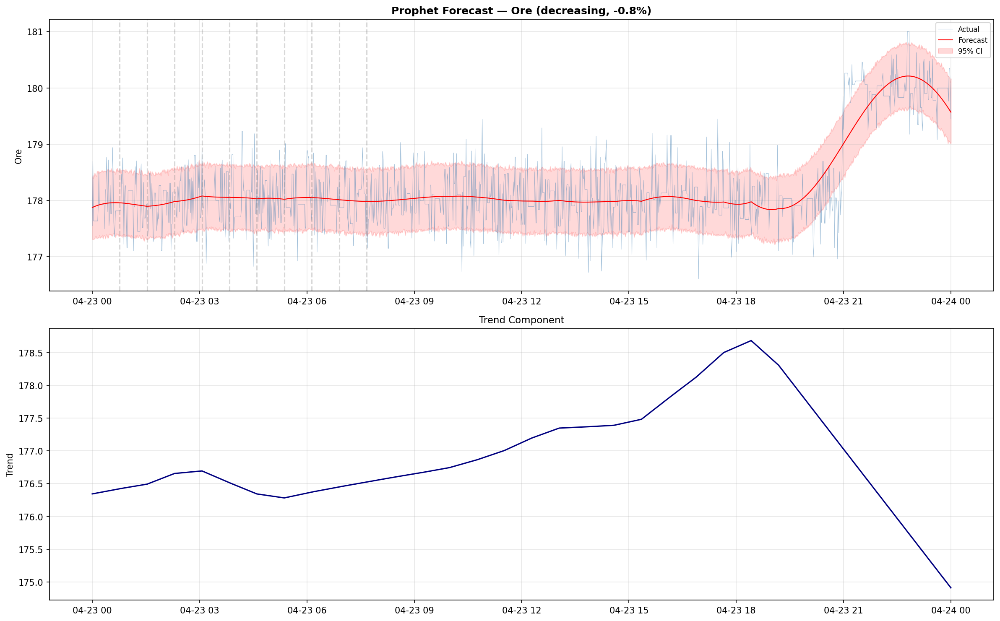
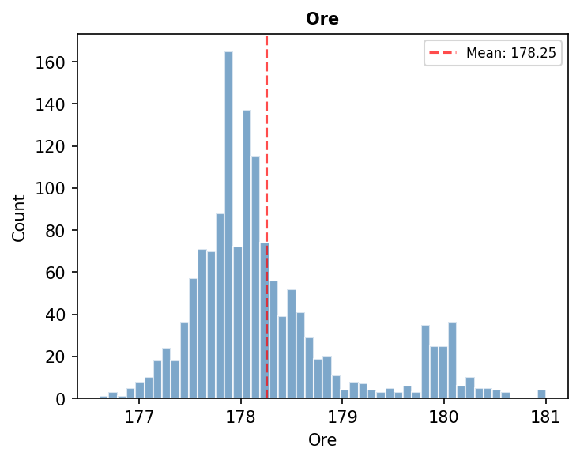

# Анализ на натоварването на мелница 8

### Резюме на анализа
*   **Данни:** Последните 24 часа (1441 записа).
*   **Средна стойност (Ore):** 178.25 t/h.
*   **Тенденция:** Леко понижение от -0.81% (силно стабилен режим).
*   **Стабилност:** 25 точки на промяна (чести оперативни корекции).
*   **Сезонност:** Сила на сезонността 0.468.

### Визуални резултати

### Допълнителен анализ: Хистограма на подаването на руда
За по-добро разбиране на вариациите в натоварването на мелница 8, добавихме хистограма на честотното разпределение на Ore feed rate:

Хистограмата показва честотата на срещане на различните нива на натоварване, което позволява визуализиране на работния режим на мелницата спрямо средната стойност.