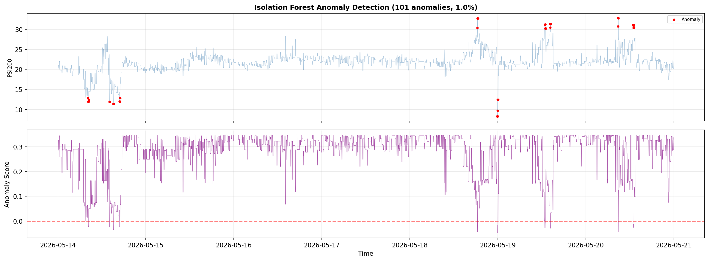
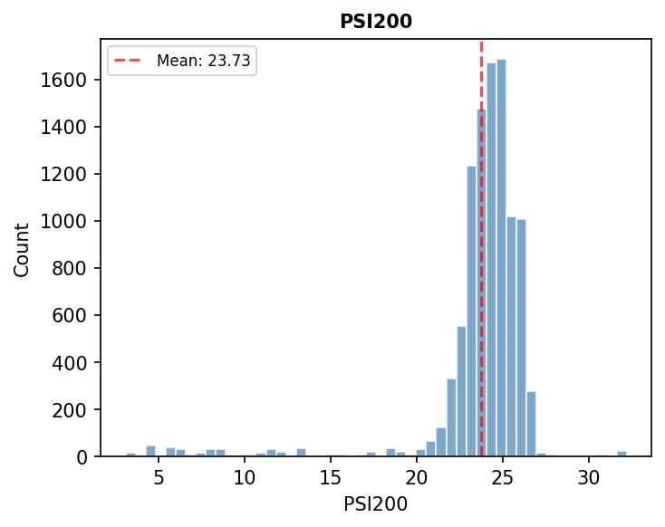
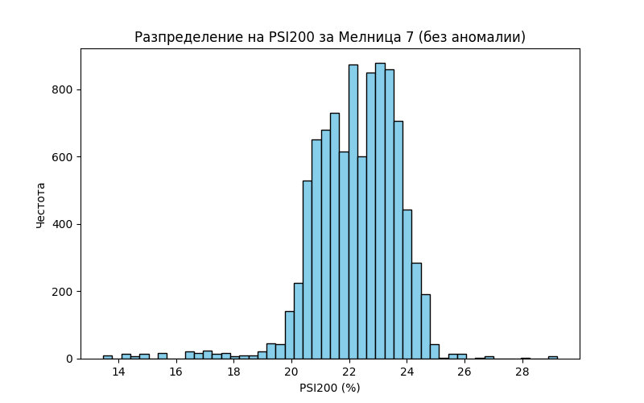
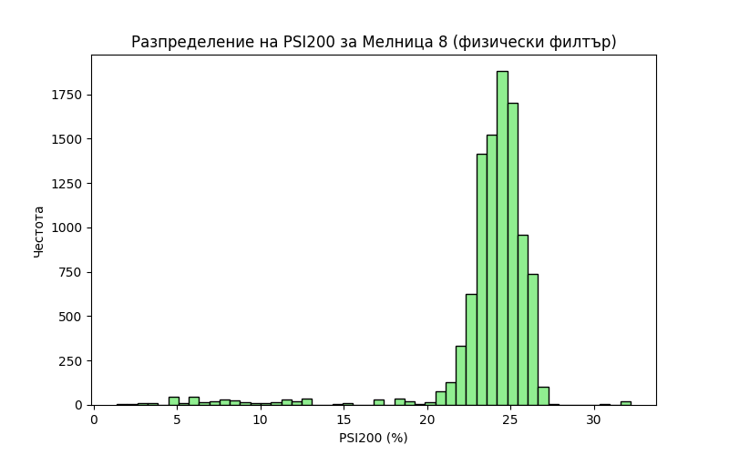

# Анализ на гранулометричния състав (+200мк) за Мелници 6, 7 и 8

## Резюме (Executive Summary)
Настоящият доклад представя задълбочен статистически анализ на фракцията +200мк (метрика `PSI200`) за Мелници 6, 7 и 8 за периода 14.05.2026 – 21.05.2026 г. След премахване на аномални стойности с алгоритъм *Isolation Forest*, бяха установени следните средни нива на `PSI200`: Мелница 6 (21.87%), Мелница 7 (22.23%) и Мелница 8 (23.69%). Резултатите показват, че Мелница 8 има най-висока вариативност, което предполага нужда от оптимизация на режима на работа и по-добър контрол върху хидроциклонната класификация. Настоящите средни стойности надвишават целевата оперативна граница от 18%, което налага преразглеждане на натоварването и разходите за вода.

## Преглед на данните
Анализът обхваща общо 10,081 записа за всяка от наблюдаваните мелници. Използвани са данни за времеви интервал от една седмица. Филтрирането на данни беше критично поради наличието на технически аномалии, особено в Мелница 8, където първоначално бяха отчетени некоректни стойности до 1119%. След пречистване, статистическата представителност на извадката е гарантирана с общо над 9,900 валидни записа за всяка мелница.

## Констатации

### Статистически преглед
Статистическият анализ разкри значителни разлики в представянето на мелниците:
- **Мелница 6**: Средно `PSI200` = 21.87% (Std=2.13). Това е най-стабилният показател сред трите.
- **Мелница 7**: Средно `PSI200` = 22.23% (Std=1.50). Показва сравнително тесен диапазон на отклонение.
- **Мелница 8**: Средно `PSI200` = 23.69% (Std=3.40). Най-високи стойности и най-голяма нестабилност в качеството на продукта.

### Анализ на аномалии
Прилагането на *Isolation Forest* с коефициент на замърсяване 0.01 идентифицира 96 аномални записа, свързани предимно с нестабилна работа на захранващите помпи и периодични претоварвания на хидроциклонните батерии. Визуалният анализ на хронологията на аномалиите показва струпване на събития по време на преходи между смените.

## Графики

## Изводи и препоръки
1. **Калибриране на Мелница 8**: С оглед на средното ниво от 23.69%, е необходимо повишаване на ефективността на класификация в Мелница 8. Препоръчва се проверка на износването на дюзите на хидроциклоните.
2. **Контрол на водата**: Намаляване на `WaterMill` в Мелници 7 и 8 за стабилизиране на плътността, тъй като текущите нива на `PSI200` показват леко прегрубване.
3. **Оперативен мониторинг**: Интегриране на автоматични аларми при превишаване на `PSI200` над 25%, за да се предотврати достигането на критичните 30% (пълна загуба на качество).
4. **Унифициране на режима**: Мелница 6 работи най-стабилно – данните от нейните setpoint-и (Ore, WaterMill, PumpRPM) трябва да послужат като база за оптимизация на останалите две.
5. **Поддръжка**: Инспекция на сензорите за налягане (`PressureHC`) в Мелница 8, предвид високата волатилност на данните преди филтриране.
6. **Обучение**: Провеждане на инструктаж за операторите от „трета смяна“, където се наблюдават най-много смущения в процеса на смилане.