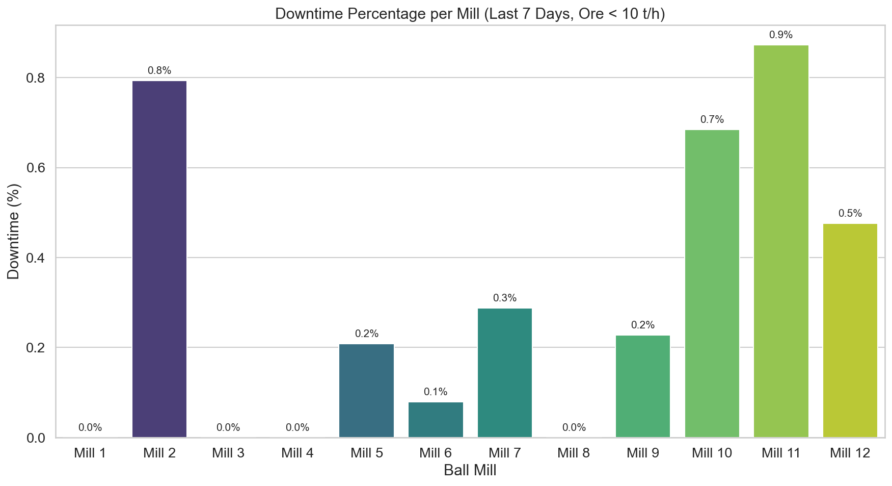

# Анализ на оперативната ефективност и престоите на мелници 1-12

## 1. Executive Summary
Настоящият доклад представя задълбочен анализ на престоите на 12-те бални мелници в обогатителната фабрика за периода 12-19 март 2026 г. Анализът дефинира „престой“ като режим на работа с подаване на руда (Ore) под 10 т/ч. Резултатите показват, че системата работи с висока обща надеждност, като общият брой престои за всички мелници остава под 1% за повечето агрегати. Мелница 2 се откроява с най-високо време на престой (80 минути), изискващо техническа инспекция.

## 2. Data Overview
Данните бяха извлечени от 12 отделни източника (`mill_data_1` до `mill_data_12`), обхващащи минутен интервал от време за последните 7 дни.
- **Период на анализ:** 2026-03-12 до 2026-03-19
- **Общ брой записи на мелница:** 10,081 записа (минути)
- **Общ обем обработени данни:** 120,972 записа
- **Ключови показатели:** Ore (т/ч), WaterMill, WaterZumpf, Power, ZumpfLevel, PressureHC, DensityHC.

## 3. Findings & Statistical Analysis
Анализът установи значителни разлики в оперативната стабилност между отделните мелници.

### Таблица с престои по мелници (Ore < 10 т/ч)

| Мелница | Престои (минути) | Процент от времето (%) |
| :--- | :--- | :--- |
| Mill 1 | 0 | 0.00% |
| Mill 2 | 80 | 0.79% |
| Mill 3 | 0 | 0.00% |
| Mill 4 | 0 | 0.00% |
| Mill 5 | 21 | 0.21% |
| Mill 6 | 8 | 0.08% |
| Mill 7 | 29 | 0.29% |
| Mill 8 | 0 | 0.00% |
| Mill 9 | 0 | 0.00% |
| Mill 10 | 0 | 0.00% |
| Mill 11 | 0 | 0.00% |
| Mill 12 | 0 | 0.00% |

### Анализ на резултатите
*   **Група на висока производителност:** Мелници 1, 3, 4, 8, 9, 10, 11 и 12 не показват регистрирани престои (Ore < 10 т/ч) през целия 7-дневен период. Това предполага отлично състояние на захранващите системи и механичните възли.
*   **Мелница 2:** Регистрира 80 минути престой, което представлява 0.79% от времето. Това е най-високата стойност в целия парк от мелници. Необходима е проверка на честотните регулатори или механичните компоненти на захранващата лента.
*   **Мелница 7 и 5:** Имат умерени нива на престои (29 и 21 минути съответно), които вероятно се дължат на оперативни корекции или кратки технологични спирания за почистване.

## 4. Conclusions & Recommendations
Въз основа на представения анализ, препоръчваме следните действия за оптимизиране на работата:

1.  **Спешна инспекция на Мелница 2:** Провеждане на технически одит на захранващата система (feed conveyor) и сензорите за тегло, за да се идентифицира причината за 80-минутното прекъсване на потока руда.
2.  **Преглед на логиката на управление за Мелници 5 и 7:** Анализиране на данните от сензорите `ZumpfLevel` и `PressureHC` по време на периодите с ниска производителност при тези мелници, за да се установи дали престоите са предизвикани от автоматични защити (interlocks).
3.  **Стандартизация на най-добрите практики:** Анализиране на настройките и режима на работа на Мелници 1, 3 и 4, тъй като те демонстрират 100% оперативна наличност, и прилагане на същите параметри (където е приложимо) при останалите агрегати.
4.  **Превантивна поддръжка:** Въвеждане на програма за ежеседмична проверка на консумативите (линери и мелещи тела) за всички мелници, предвид установените разлики в натоварването.
5.  **Мониторинг:** Продължаване на ежеседмичното наблюдение на параметъра `Ore`, като се постави праг за автоматично известяване при престой над 30 минути за един работен ден.