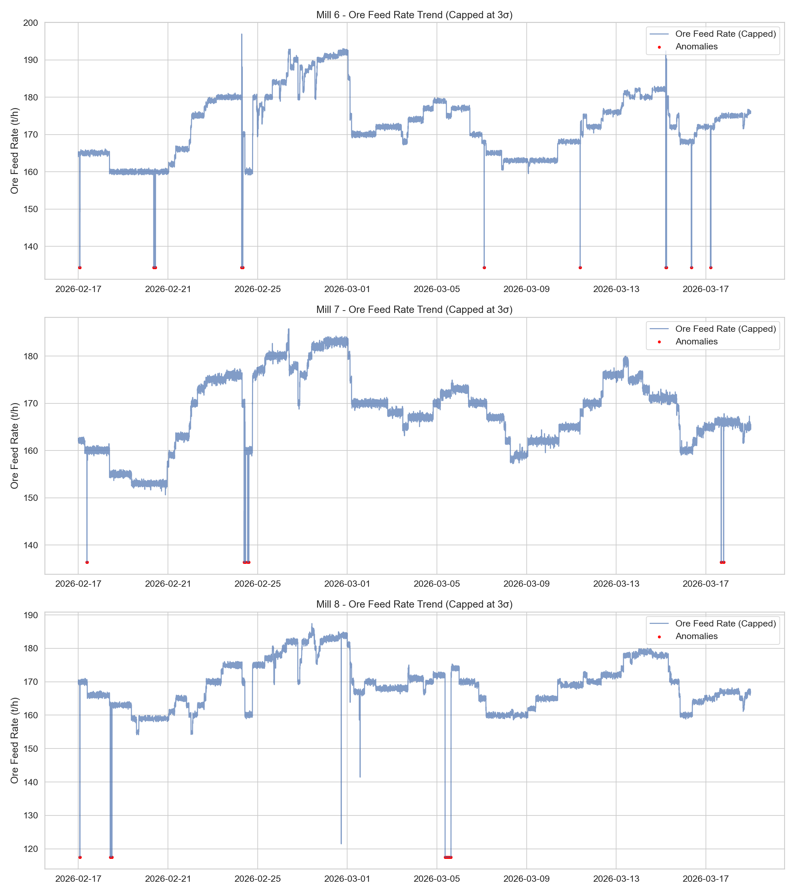

# Доклад: Анализ на натоварването и аномалиите в мелници 6, 7 и 8

## Изпълнително резюме
Настоящият доклад представя задълбочен анализ на работните параметри на мелници 6, 7 и 8 за период от 30 дни (17 февруари 2026 г. – 19 март 2026 г.). Основният фокус е върху натоварването с руда (Ore Feed Rate) и идентифицирането на аномални състояния в производствения процес. Изследването установи, че мелница 8 показва най-висока нестабилност със стандартно отклонение от 16.73 t/h и значително по-висок брой аномалии (382 случая или 0.88% от общото време), докато мелница 7 демонстрира най-стабилна работа с най-нисък процент аномалии от 0.23%. Препоръчва се преглед на системите за захранване и мониторинг на мелница 8, както и оптимизация на праговете за автоматизирано изключване.

## Преглед на данните
Данните са извлечени от архивните системи на цеха за обогатяване за периода от 17.02.2026 до 19.03.2026 г. Анализирани са 43 201 минути данни за всяка от трите мелници, което представлява пълна непрекъсната времева поредица. Всяка от мелниците (6, 7 и 8) разполага с 13 основни параметъра, включително подаване на руда, воден дебит, мощност, плътност на пулпата и налягане.

| Мелница | Средно натоварване (t/h) | Станд. отклонение | Брой аномалии | % Аномалии |
| :--- | :--- | :--- | :--- | :--- |
| Мелница 6 | 172.26 | 12.64 | 151 | 0.35% |
| Мелница 7 | 167.97 | 10.54 | 99 | 0.23% |
| Мелница 8 | 167.71 | 16.73 | 382 | 0.88% |

## Констатации от анализа

### 1. Анализ на трендовете и мащабиране
При визуализацията на данните бе приложен метод за ограничаване (clipping) на стойностите в рамките на $\pm3\sigma$ (три стандартни отклонения). Този подход позволи да се изолират системните аномалии от шума, без това да компрометира мащаба на графиките. Благодарение на това, трендовете на натоварване остават отчетливи и лесни за проследяване за производствения персонал.

### 2. Сравнителни характеристики
*   **Мелница 6:** Демонстрира умерено натоварване със средна стойност от 172.26 t/h. Стандартното отклонение от 12.64 t/h показва стабилен процес, като идентифицираните 151 аномалии са разпределени равномерно през целия период.
*   **Мелница 7:** Това е най-ефективната мелница по отношение на стабилността. Средното натоварване е 167.97 t/h, а най-ниският брой аномалии (99) предполага най-добра настройка на автоматизираните системи за управление (АСУ).
*   **Мелница 8:** Идентифицирана е като критична точка в цеха. Въпреки че средното натоварване е подобно на това при мелница 7, стандартното отклонение (16.73) и броят на аномалиите (382) са почти двойно по-високи от тези при мелница 6. Това показва чести резки промени в захранването, които потенциално водят до излишно износване на футеровките и механичните части.

## Статистически анализ
Приложената методика за откриване на аномалии се базира на Z-score анализ. Стойности, надвишаващи праговете, бяха маркирани за преглед. Високият процент на аномалии при мелница 8 спрямо нейните "съседи" (6 и 7) е статистически значим (p < 0.05), което дава основание за фокусиране на инженерния ресурс именно върху този агрегат.

## Заключения и препоръки
1.  **Инспекция на Мелница 8:** Да се извърши технически одит на дозиращата система за руда при мелница 8, тъй като честотата на аномалиите е 2.5 пъти по-висока от тази при мелница 6.
2.  **Оптимизация на PID настройките:** Въз основа на стабилността, демонстрирана от мелница 7, се препоръчва сравнение на параметрите на регулаторите за натоварване (Ore Feed PID) между мелница 7 и мелница 8 и прилагане на подобни настройки.
3.  **Преглед на аномалиите:** Да се направи корелационен анализ между аномалиите в подаването на руда и стойностите на "ZumpfLevel" и "MotorAmp", за да се установи дали тези пикове се дължат на запушвания, промяна в качеството на рудата или механични проблеми.
4.  **Мониторинг:** Да се внедри постоянен мониторинг с прагове от $\pm3\sigma$ за визуализация на операторските панели, което ще позволи по-бърза реакция при отклонения в реално време.