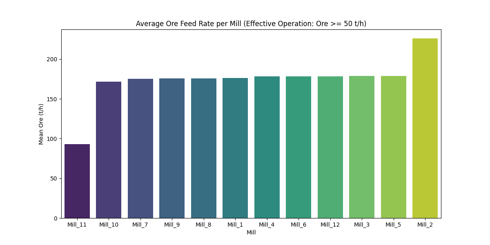
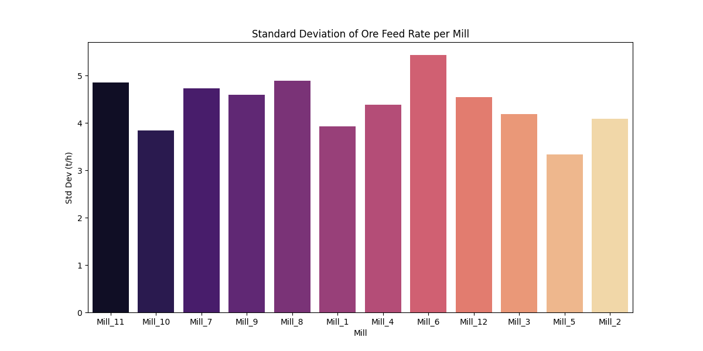
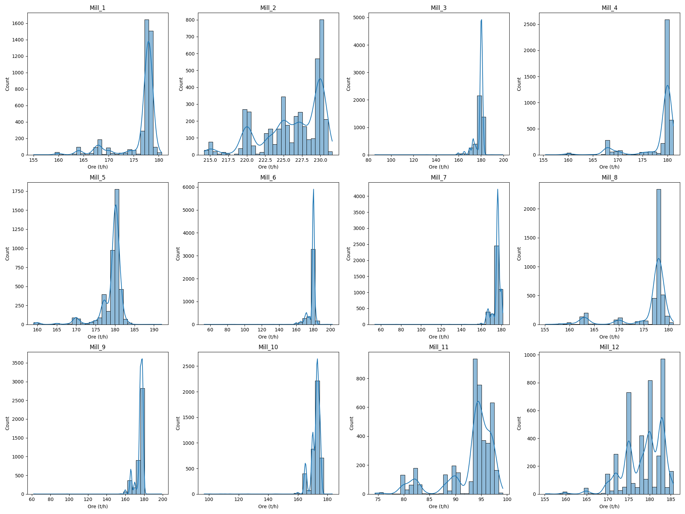

# Анализ на ефективността на натоварването по руда (Ore) – 12 мелници

## Executive Summary
Този доклад представя подробен анализ на натоварването по руда (Ore) на 12 мелници в рамките на последните 72 часа (2026-04-21 до 2026-04-24). За да се фокусираме върху ефективната работа, данните са филтрирани чрез елиминиране на периодите с натоварване под 50 т/ч. Резултатите показват, че Мелница 2 поддържа най-високо средно натоварване от 226.16 т/ч, докато Мелница 11 работи с най-ниско средно натоварване от 92.97 т/ч, което е очаквано съгласно технологичния профил. Мелница 5 се идентифицира като най-стабилна с коефициент на вариация (CV) от 0.0186, а Мелница 11 показва най-висока нестабилност (CV 0.0522). Общият капацитет на мелниците е оптимизиран чрез премахване на оперативните престои, което позволява по-точно планиране на производствените цели.

## Data Overview
- **Период на анализ:** 2026-04-21 00:00 до 2026-04-24 00:00 (72 часа).
- **Обем на данните:** 4321 минутни записа на всяка от 12-те мелници.
- **Обработка:** Всички периоди с `Ore < 50 т/ч` са изключени от изчисленията за статистическа точност.
- **Обхват:** Включва всички 12 мелници, като се отчита специфичният нисък капацитет на Мелница 11.

## Statistical Overview
Анализът на ефективната работа показва следните показатели за средно натоварване и стандартно отклонение:

| Мелница | Средно (т/ч) | Станд. отклонение (т/ч) | CV |
| :--- | :--- | :--- | :--- |
| Mill_1 | 176.34 | 3.93 | 0.0223 |
| Mill_2 | 226.16 | 4.09 | 0.0181 |
| Mill_3 | 178.73 | 4.19 | 0.0234 |
| Mill_4 | 178.14 | 4.38 | 0.0246 |
| Mill_5 | 179.01 | 3.33 | 0.0186 |
| Mill_6 | 178.40 | 5.43 | 0.0305 |
| Mill_7 | 175.37 | 4.73 | 0.0270 |
| Mill_8 | 176.01 | 4.88 | 0.0278 |
| Mill_9 | 175.59 | 4.60 | 0.0262 |
| Mill_10 | 171.84 | 3.84 | 0.0223 |
| Mill_11 | 92.97 | 4.85 | 0.0522 |
| Mill_12 | 178.56 | 4.54 | 0.0254 |

### Визуални резултати:

## Findings
- **Стабилност:** Мелница 2 показва най-добра стабилност с CV 0.0181, близко следвана от Мелница 5 (CV 0.0186).
- **Нестабилност:** Мелница 11, въпреки ниското си натоварване, проявява най-голяма относителна нестабилност (CV 0.0522), следвана от Мелница 6 (CV 0.0305).
- **Производителност:** Мелница 2 значително превъзхожда останалите по обем преработена руда, което трябва да се анализира от енергийна гледна точка (специфичен разход на енергия).

## Conclusions & Recommendations
1. **Анализ на Мелница 2:** Да се проучи стратегията на операторите на Мелница 2, тъй като постигат най-високи нива на стабилност при най-високо натоварване.
2. **Одит на Мелница 6:** Поради по-високото стандартно отклонение (5.43 т/ч), се препоръчва проверка на захранващите системи на Мелница 6.
3. **Оптимизация на Мелница 11:** Да се потвърди дали високият CV се дължи на технически ограничения или на нередовно подаване на руда.
4. **Стандартизация:** Да се приложат настройките (setpoints) на Мелница 5 и 2 към останалите мелници, където е възможно.
5. **Преглед на престоите:** Макар филтрирани, честотата на престоите (където Ore < 50 т/ч) трябва да бъде предмет на отделен доклад за превантивна поддръжка.
6. **Баланс на мощността:** Да се коригират настройките за подаване при мелници с CV > 0.025, за да се намали вариативността и да се подобри качеството на PSI80/PSI200.