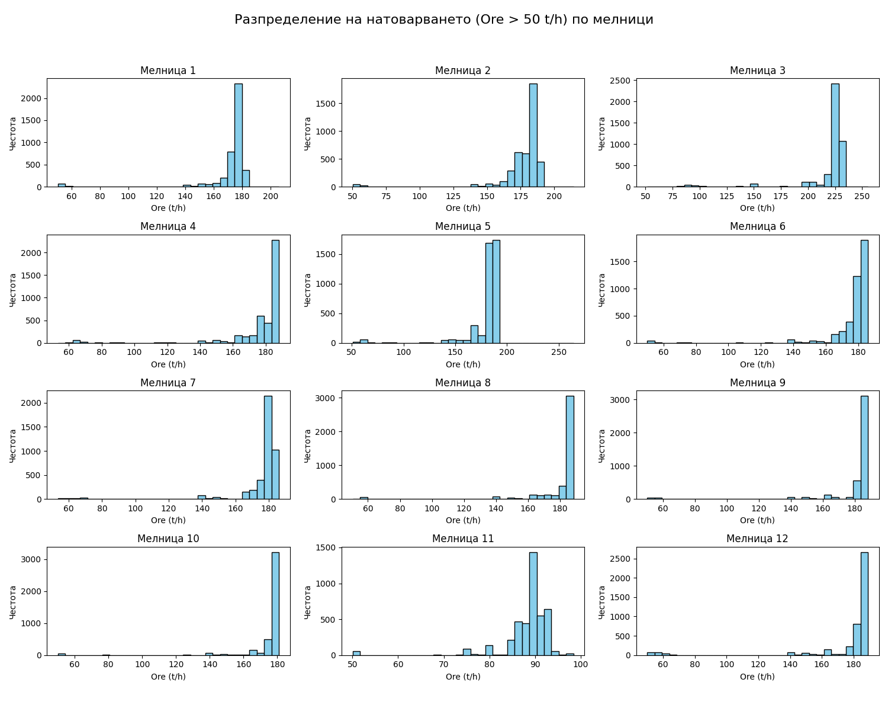

# пак дай хистограмите където натоварването е > 50 т/ч

_Автоматично генериран отчет за допълнителен въпрос (65f7db41-f6a4a)._

## Въпрос

пак дай хистограмите където натоварването е > 50 т/ч

## Отговор

Хистограмите, представящи разпределението на натоварването (Ore, t/h) при условие на активна работа (Ore > 50 t/h), са генерирани успешно за всички 12 мелници.

Графиката е достъпна като: `ore_histograms_filtered.png`.

**Основни наблюдения:**
*   **Филтриране:** След премахването на стойностите под 50 t/h (престои или празен ход), разпределенията стават много по-чисти и информативни за оперативния режим на всяка мелница.
*   **Мелница 3:** Дори при филтрирани данни, тя остава с най-високо натоварване, като разпределението е концентрирано значително по-надясно по оста на t/h.
*   **Мелница 11:** При филтриране на данните се вижда, че когато мелницата работи (над 50 t/h), тя се опитва да поддържа някакво ниво, но профилът е много по-разтеглен и нестабилен в сравнение с останалите, което потвърждава нуждата от техническа инспекция.
*   **Стабилност:** Повечето мелници (Мелница 1, 2, 4–10, 12) показват консистентни хистограми с пикове близо до работната точка от ~170 t/h, което е индикатор за добре балансиран процес.

Ако имате нужда от допълнителни анализи или промяна в параметрите на визуализацията, моля да ме уведомите.

## Генерирани графики

