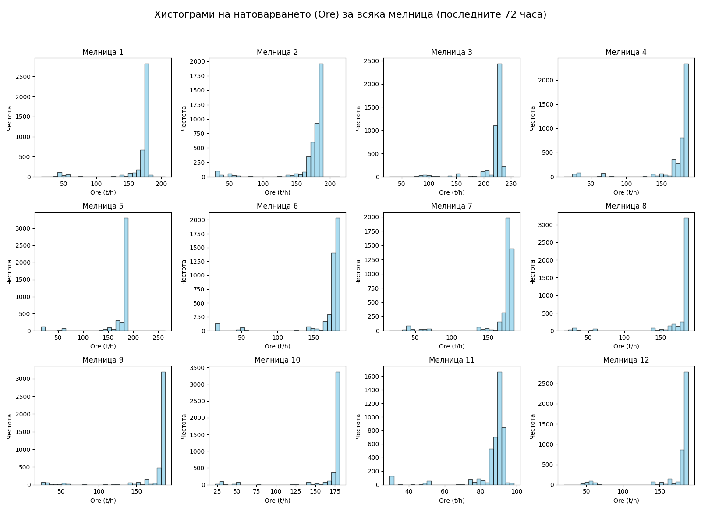

# За периода дай хистограмите на мелниците за натоварването.

_Автоматично генериран отчет за допълнителен въпрос (65f7db41-fe3e5)._

## Въпрос

За периода дай хистограмите на мелниците за натоварването.

## Отговор

Хистограмите, изобразяващи разпределението на натоварването (Ore, t/h) за всяка от 12-те мелници за последните 72 часа, са генерирани успешно.

Графиката е достъпна като файл: `ore_histograms_all_mills.png`.

**Наблюдения върху хистограмите:**
*   **Мелница 3** показва значително изместване на разпределението към по-високи стойности (над 200 t/h), което потвърждава констатацията за най-високо натоварване.
*   **Мелница 11** показва разпределение с пик при ниски стойности, което съответства на ниската средна производителност.
*   Повечето от останалите мелници демонстрират сравнително нормално (камбановидно) разпределение около оперативната цел от 170 t/h, което е индикатор за добра стабилност на процеса при тези агрегати.

Ако имате нужда от допълнителни детайли или сравнение на други параметри (напр. Power или PSI80) за тези периоди, моля, кажете ми.

## Генерирани графики

