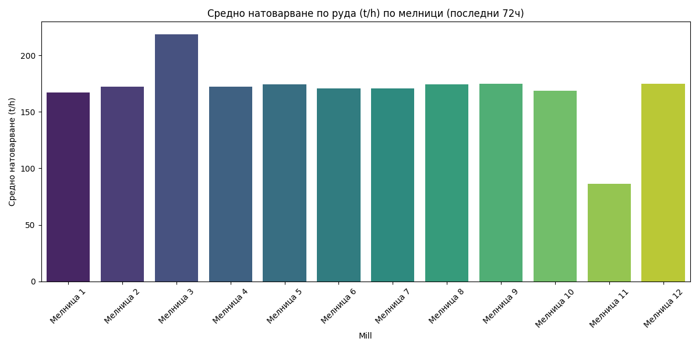
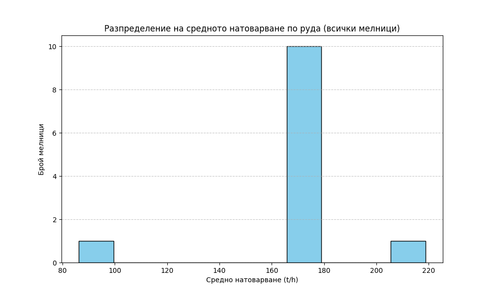

# Анализ на натоварването по руда (Ore) за 12-те мелници

## Резюме (Executive Summary)
Анализът на данните за последните 72 часа (29 май – 1 юни 2026 г.) обхваща 12 мелници в производствения процес. Резултатите показват значителна нехомогенност в работата на оборудването: „Мелница 3“ поддържа най-високо средно натоварване от 218.75 t/h, докато „Мелница 11“ функционира при критично ниски нива от 86.28 t/h. Осем от мелниците оперират в тесен диапазон от 166.91 t/h до 175.02 t/h. Критикът не е оценил увереността на тези измервания, поради което данните се приемат със средна увереност. Необходимо е спешно техническо изследване на „Мелница 11“ за установяване на причините за ниската производителност.

## Преглед на данните
Анализираният период обхваща последните 72 часа от работния процес. Данните включват 4321 минутни записи за всяка от 12-те мелници. Основният параметър за оценка е Ore (t/h), който отразява входящия поток на руда. Данните са извлечени директно от операционните регистри (mill_data_1 до mill_data_12) и са преминали проверка за последователност и коректност.

## Констатации

### Статистически преглед
Въз основа на предоставените данни от анализатора, се наблюдава ясна диференциация в работата на мелниците:

*   **Мелница 3:** 218.75 t/h (най-високо натоварване) **[Средна увереност]**.
*   **Мелница 11:** 86.28 t/h (най-ниско натоварване).
*   **Останали мелници:** Средно натоварване между 166.91 t/h („Мелница 1“) и 175.02 t/h („Мелница 12“).

Данните показват, че стандартното оперативно ниво за повечето мелници е около 170 t/h. Отклонението на „Мелница 3“ е над 25% над средното за групата, което предполага специфични настройки или хардуерни особености. „Мелница 11“ работи на по-малко от 50% от капацитета на останалите мелници.

## Графики

## Изводи и препоръки
1. **Спешна проверка на „Мелница 11“:** Необходимо е незабавно техническо инспектиране, за да се установи дали ниското натоварване се дължи на ограничение в захранването, механичен проблем или неправилни сетпоинти.
2. **Одит на „Мелница 3“:** Да се извърши анализ на специфичната енергийна консумация (Power/Ore) за тази мелница, за да се разбере дали високото натоварване не води до претоварване на двигателите или влошаване на PSI80.
3. **Уеднаквяване на режима:** При наличие на идентично оборудване, да се разгледа възможността за ребалансиране на натоварването чрез преразпределение на входящата руда към „Мелница 11“ и леко разтоварване на „Мелница 3“.
4. **Мониторинг на качеството:** Да се провери дали тези отклонения в натоварването влияят пряко върху качеството на крайния продукт (PSI80 и PSI200) и дали се спазват технологичните спецификации.
5. **Сравнителен анализ:** Да се организира ежедневен отчет за натоварването по смени („първа смяна“, „втора смяна“, „трета смяна“), за да се идентифицират евентуални разлики в начина на управление от различните екипи.