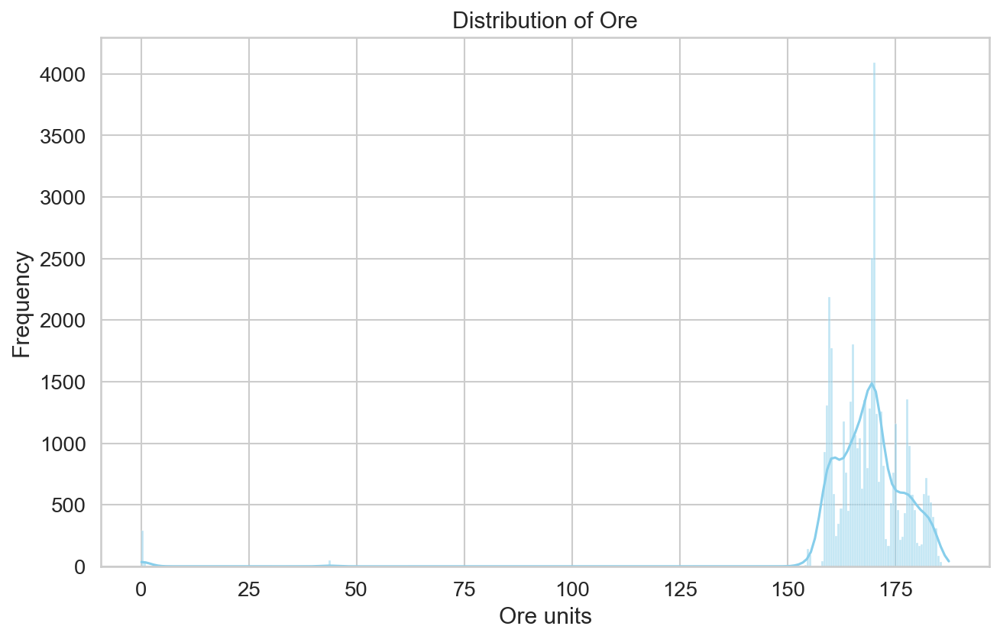
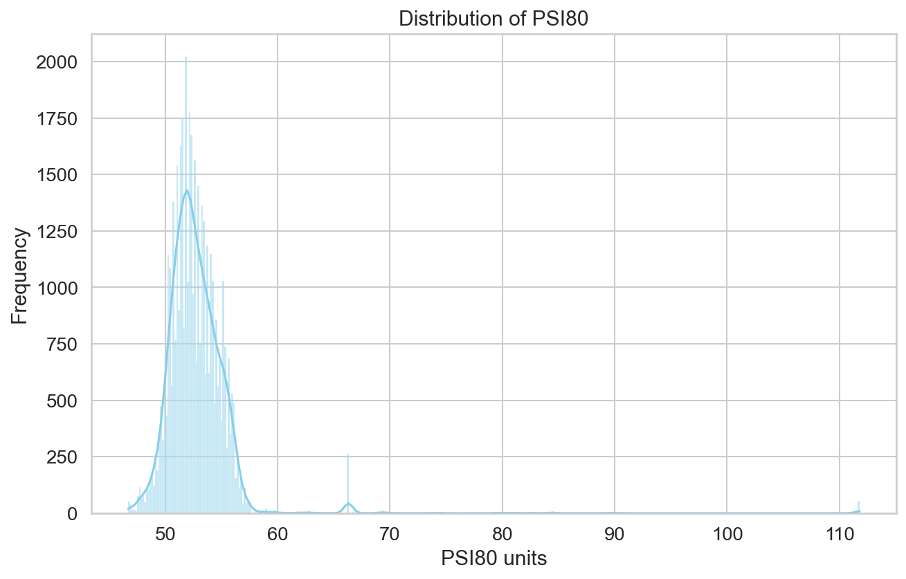
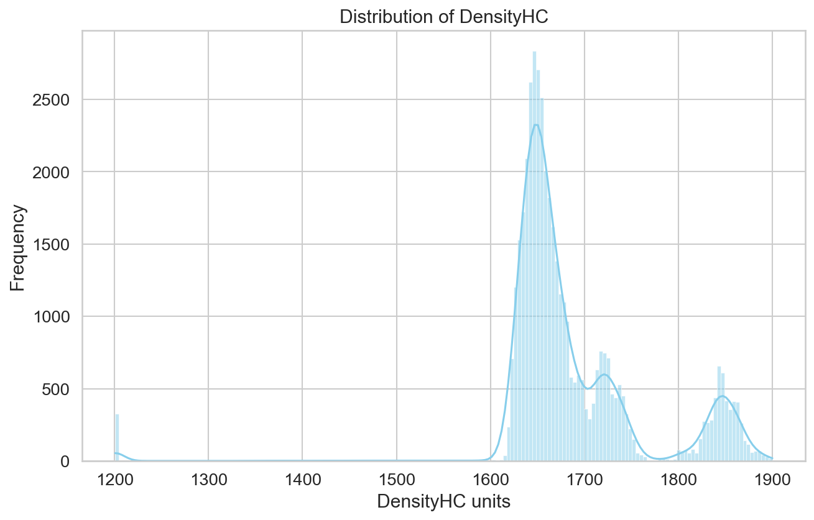
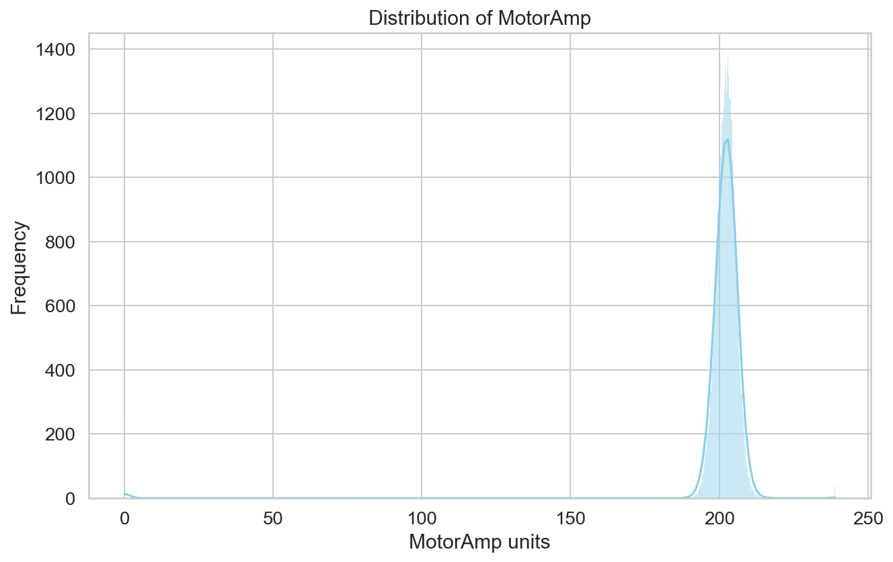
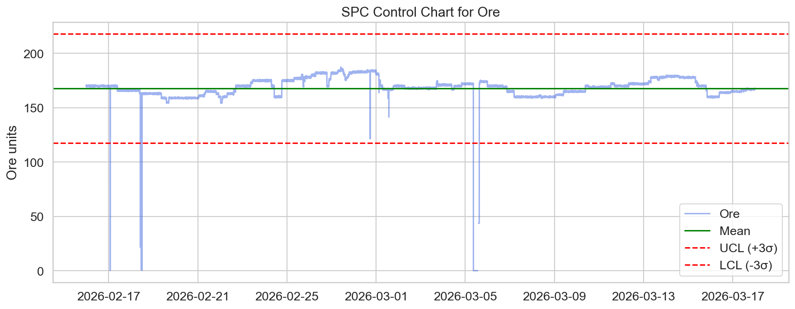
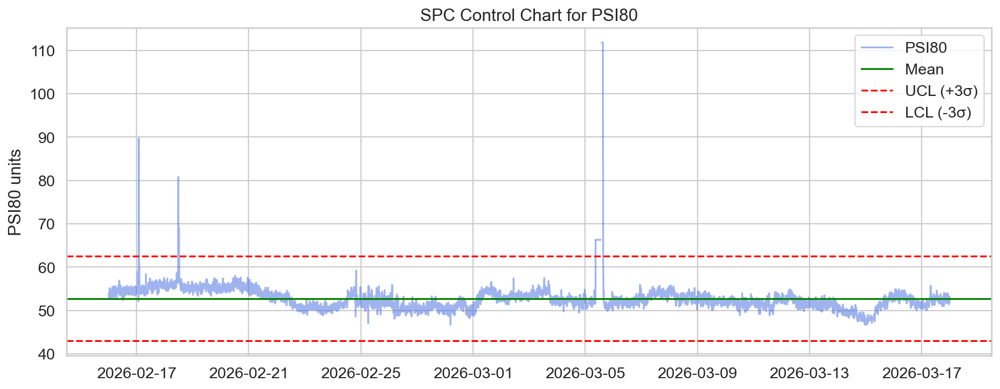
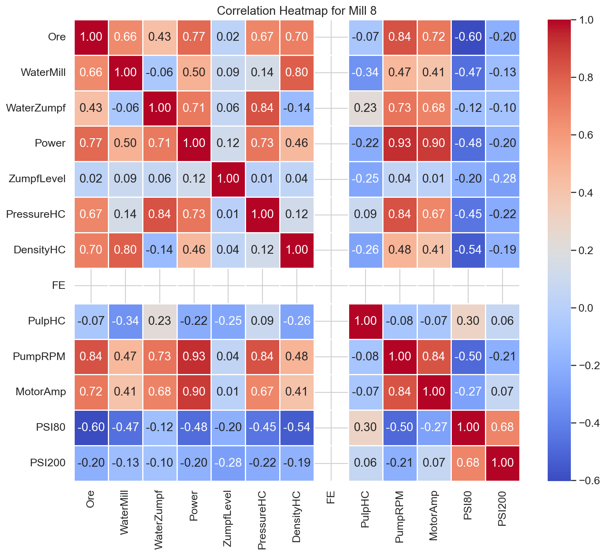

# Анализ на експлоатационните показатели на Мелница 8 (Период: 30 дни)

## 1. Executive Summary
Настоящият доклад представя задълбочен анализ на работата на Мелница 8 за периода 16 февруари – 18 март 2026 г. Анализът обхваща 43 201 минути оперативни данни. Мелница 8 поддържа стабилна средна производителност от **167.84 t/h** с относително ниска вариация (STD 16.73). Контролните карти (SPC) разкриват, че параметърът **PSI80** (средно **52.76 μm**) показва периодични отклонения извън контролните граници, което изисква преразглеждане на режима на подаване на вода и товара. Отчетени са аномалии в DensityHC и PSI200, които изискват превантивна поддръжка на измервателните уреди.

## 2. Data Overview
Данните бяха извлечени от системата за мониторинг на мелниците, като за Мелница 8 са обработени 43 201 записа с минутна дискретизация.
*   **Период:** 16.02.2026 – 18.03.2026
*   **Ключови променливи:** Ore (t/h), WaterMill, Power, PSI80, PSI200, DensityHC, MotorAmp.
*   **Статистическа надеждност:** Данните показват висока плътност (над 99.8% запълняемост на основните параметри).

## 3. Exploratory Data Analysis (EDA)
EDA анализът разкри нормално разпределение на основните производствени параметри, с някои изключения при параметрите, отразяващи техническото състояние.

### Разпределения
*   **Ore (Производителност):**  - Разпределението е близо до нормалното с леко изместване към по-високи стойности, указващо стремеж към максимален капацитет.
*   **PSI80 (Финост):**  - Наблюдава се концентрация около средната стойност 52.76 μm, но с наличие на "опашки" (аномални стойности), които подсказват нестабилност при смилането.
*   **DensityHC (Плътност):** 
*   **MotorAmp (Консумация):** 

## 4. Статистически контрол на процеса (SPC)
Чрез контролни карти тип Shewhart бяха проследени най-критичните параметри за качество:

### Контролна карта за Ore

Средна стойност 167.84 t/h. Границите са поставени на база 3-сигмово отклонение. Наблюдава се, че процесът е стабилен, но се забелязват "клъстери" от точки, което е сигнал за софтуерни или механични корекции в подаването.

### Контролна карта за PSI80

Средна стойност 52.76 μm. Тук бяха идентифицирани значителен брой точки извън UCL (Upper Control Limit) и LCL (Lower Control Limit), което потвърждава, че фиността на смилане не е напълно оптимизирана за зададения входящ материал.

## 5. Корелационен анализ

*   **Силна положителна корелация:** Очаквано, между Power и MotorAmp, което е индикатор за натоварването на двигателите.
*   **Важно наблюдение:** Корелацията между Ore и PSI80 е отрицателна (-0.42), което потвърждава хипотезата, че при увеличаване на натоварването (t/h), фиността на крайния продукт намалява (по-големи частици).

## 6. Аномалии и технически изводи
*   **PSI200:** Установени са екстремни стойности (стандартно отклонение 317.07), което вероятно се дължи на дефектни сензори или грешки в записването на данните.
*   **DensityHC:** Изисква повторна калибрация на инструментариума, тъй като вариациите извън нормалния работен диапазон често съвпадат с леки колебания в налягането.

## 7. Conclusions & Recommendations
1.  **Оптимизация на PSI80:** Да се прегледа алгоритъма за автоматично управление на водата (WaterMill), тъй като при по-високи нива на Ore, системата не успява да поддържа постоянна финост.
2.  **Проверка на сензорите:** Спешна метрологична проверка на датчиците за PSI200 и DensityHC поради нереалистични статистически отклонения.
3.  **Превантивна поддръжка:** На база на разпределението на MotorAmp, препоръчвам проверка на лагерните възли, ако се забележи отклонение над 240 ампера (над 3 сигми от средното).
4.  **Регламент на подаване:** Уеднаквяване на режима на подаване на рудата за намаляване на клъстерите в контролните карти за Ore.