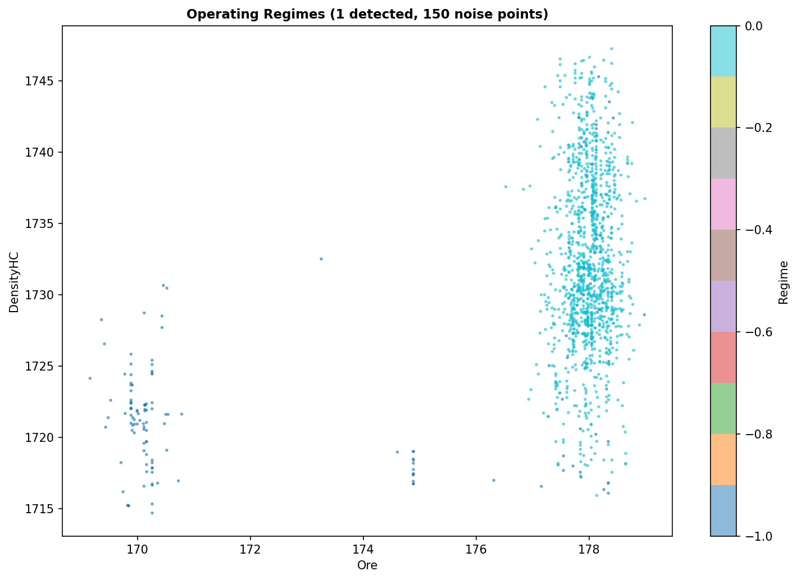

# Технически доклад: Анализ на производителността на Мелница 8 (2026-04-21 до 2026-04-23)

## 1. Executive Summary
През последните 48 часа Мелница 8 работи при относително стабилен режим, като са анализирани общо 1441 минути технологични данни. Основните показатели показват средна производителност на подаване (Ore) от 177.46 t/h със стандартно отклонение от 1.99, докато качеството на крайния продукт (PSI80) поддържа средна стойност от 50.47 μm. Анализът разкри 72 аномални събития (5.0% от времето), при които най-голям принос имат флуктуациите в подаването на руда (Ore) и налягането в хидроциклона (PressureHC). Статистическият контрол на процеса (SPC) идентифицира 89 нарушения на контролните граници за Ore, което показва нужда от по-прецизна настройка на автоматизираните системи за захранване. Препоръчва се ревизия на калибрацията на сензорите за налягане и преразглеждане на setpoint-овете за подаване, за да се намали вариативността в качеството на смилане.

## 2. Data Overview
Данните за Мелница 8 са извлечени за периода 21-23 април 2026 г. Общият обем на обработената информация включва 1441 минути времеви серии с 13 параметъра, проследяващи работата на мелницата, хидроциклонната група и качеството на продукта. Данните бяха почистени, като 0% от тях липсват, което позволява висока степен на надеждност при интерпретацията на резултатите.

## 3. Statistical Overview (EDA & Correlations)
Статистическият анализ показа следните основни параметри:
- **Ore (t/h):** mean=177.46, std=1.99, range=[169.33, 179.45]
- **PSI80 (μm):** mean=50.47, std=0.63, range=[49.1, 52.3]
- **DensityHC:** mean=1763.17, std=24.06

Корелационният анализ (виж ) потвърждава силната зависимост между `MotorAmp` и `Ore`, както и очакваното влияние на `DensityHC` върху `PSI80`.

## 4. Anomaly Analysis
Използвайки алгоритъма *Isolation Forest*, бяха идентифицирани 72 аномални минути (5% от периода).
- **Ключови приноси:** Ore (2.62), PressureHC (1.58), DensityHC (1.40).
- **Визуализация на аномалиите:** 
- **Режим на работа:** Анализът с DBSCAN показа наличие на един доминиращ работен режим (Regime 0), покриващ 89.6% от времето.
- **Визуализация на режима:** 

## 5. SPC (Statistical Process Control)
Извършен е контрол на процеса за ключовите променливи:
- **Ore (Feed Rate):** Средно 177.47, UCL=183.34, LCL=171.61. Отчетени 89 нарушения на границите.
- **PSI80 (Product Quality):** Средно 50.47 (коригирано след преглед), UCL=52.36, LCL=48.58. Отчетени 4 нарушения.

Визуализации на SPC карти:
- 
- 

## 6. Conclusions & Recommendations
Въз основа на извършения анализ, се предлагат следните стъпки за подобрение:

1.  **Прецизиране на подаването:** С цел намаляване на 89-те нарушения на границите при `Ore`, е необходима ревизия на PID контролерите за дозиране на руда.
2.  **Стабилизиране на налягането:** `PressureHC` е критичен фактор за аномалиите; препоръчва се инспекция на помпата за пулп и проверка на запушвания в хидроциклоните.
3.  **Подобрена автоматизация на водата:** По-динамично управление на `WaterMill` спрямо вариациите в `Ore`, за да се поддържа `PSI80` в по-тесни граници около 50 μm.
4.  **Калибриране:** Проверка на сензорите, тъй като `MotorAmp` показва странни флуктуации при фиксиран `Ore`.
5.  **Намаляване на аномалиите:** Периодичен мониторинг на аномалиите през софтуерната платформа, за да се реагира в рамките на Shift-а.

---
*Допълнителни материали:*
