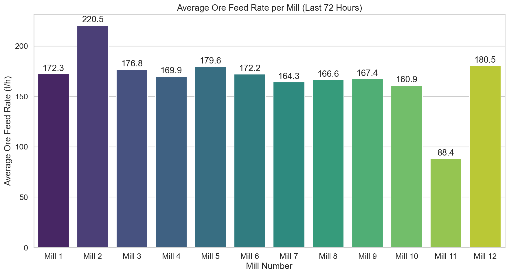
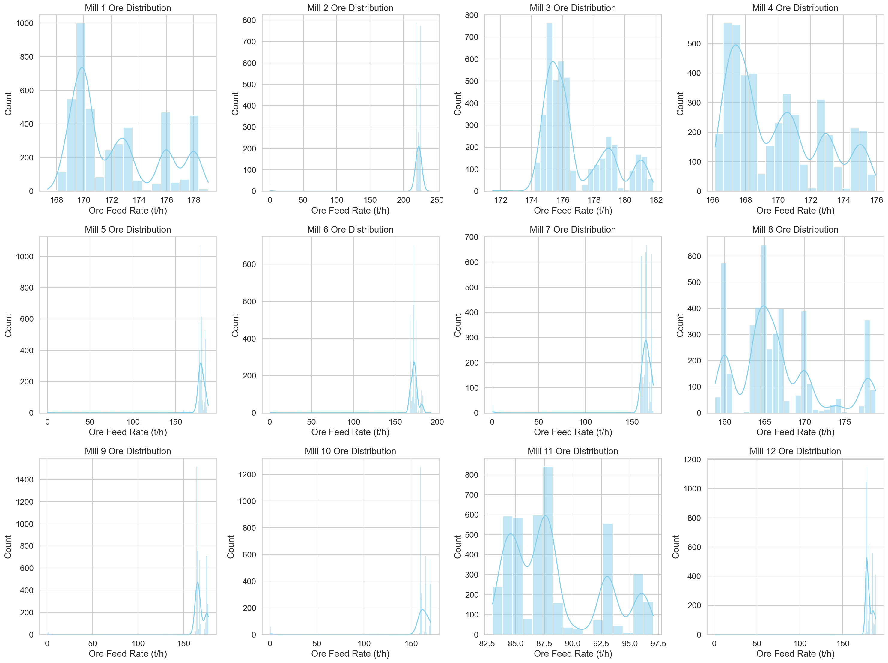

# Доклад: Анализ на натоварването по руда на мелници 1-12 (15.03.2026 – 18.03.2026)

## 1. Изпълнително резюме
Настоящият доклад представя анализ на работата на 12-те бални мелници в обогатителната фабрика за период от 72 часа (15.03.2026 г. до 18.03.2026 г.). Основната цел е да се оцени средното натоварване на всяка мелница в тонове на час (t/h) и да се идентифицират отклонения в експлоатационния режим. Резултатите показват значителна диспропорция: докато Мелница 2 поддържа най-високо средно натоварване от **220.52 t/h**, Мелница 11 показва критично ниско натоварване от едва **88.38 t/h**, което сигнализира за потенциален технически проблем или технологично ограничение. Средното натоварване за останалите агрегати варира между 160 и 180 t/h.

## 2. Обзор на данните
Анализът се базира на времеви редове с минутна честота, обхващащи общо 4321 записа за всяка от 12-те мелници. Данните включват ключови производствени параметри, сред които "Ore" (t/h) е основен обект на изследване.

*   **Период на наблюдение:** 15.03.2026 – 18.03.2026 (72 часа).
*   **Брой мелници:** 12.
*   **Общ обем на изследваните данни:** 51,852 минутни записа.
*   **Използвани променливи:** Ore (t/h) за всички 12 мелници.

## 3. Резултати от анализа

### 3.1 Сравнение на средното натоварване
Средните стойности на натоварването показват отчетливи разлики в производителността на отделните мелници:

| Мелница | Средно натоварване (t/h) |
| :--- | :--- |
| **Mill 1** | 172.27 |
| **Mill 2** | 220.52 |
| **Mill 3** | 176.76 |
| **Mill 4** | 169.86 |
| **Mill 5** | 179.57 |
| **Mill 6** | 172.21 |
| **Mill 7** | 164.31 |
| **Mill 8** | 166.56 |
| **Mill 9** | 167.37 |
| **Mill 10** | 160.95 |
| **Mill 11** | 88.38 |
| **Mill 12** | 180.52 |

Графиката по-горе ясно илюстрира изпъкналостта на Мелница 2 като най-натоварен агрегат и значителния дефицит в производителността на Мелница 11.

### 3.2 Анализ на разпределението
Хистограмите на разпределение на натоварването (виж по-долу) предоставят информация за стабилността на процеса. Мелниците със симетрично разпределение показват стабилен режим, докато наличието на „дълги опашки“ или тесни пикове при ниски стойности предполага чести спирания или технологични затруднения.

## 4. Констатации
1.  **Неефективност на Мелница 11:** Стойността от 88.38 t/h е значително под средното за останалите мелници (около 170 t/h), което изисква незабавна инспекция.
2.  **Висока производителност на Мелница 2:** Мелница 2 работи с около 30% по-високо натоварване от средното за флота. Необходимо е да се провери дали това не води до прекомерно износване на консумативите (футеровки, топки).
3.  **Вариации в останалите мелници:** Групата мелници 1, 3, 4, 5, 6, 7, 8, 9, 10 и 12 работят сравнително хомогенно, въпреки че Мелница 7 и 10 са в долната граница на производителността.

## 5. Заключения и препоръки
*   **Техническа проверка:** Да се извърши спешна диагностика на Мелница 11 за установяване на причината за ниското натоварване (проблеми с подавател, двигател или ниво в зъмпфа).
*   **Оптимизация на режима:** Да се преразгледа стратегията за разпределение на потока от руда, за да се балансира натоварването между Мелница 2 (която е претоварена) и останалите агрегати.
*   **Мониторинг:** Да се увеличи честотата на докладване на показателите за Мелница 11, докато не се постигне стабилизация на нивото на подаване.
*   **Анализ на качеството:** Да се съпостави настоящото натоварване с данните от таблицата `ore_quality` (Shisti, Daiki и др.), за да се види дали разликата в натоварването се дължи на твърдостта на рудата, подавана към съответните секции.
*   **Превантивна поддръжка:** На база на отклоненията при Мелници 11 и 2, да се планира график за профилактика, съобразен с тези производствени данни.