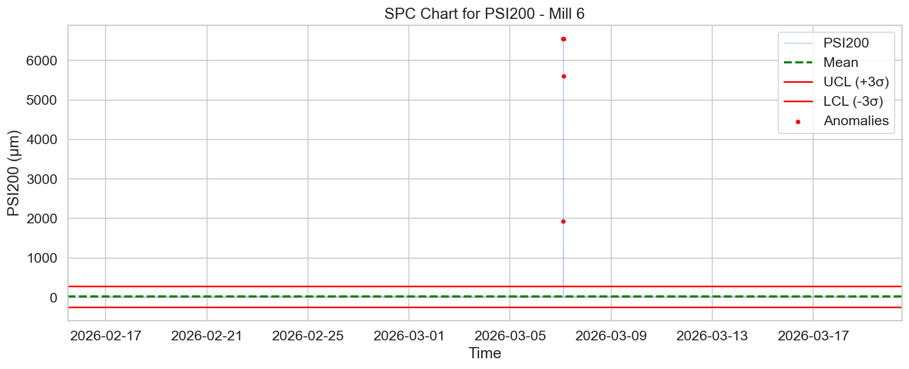
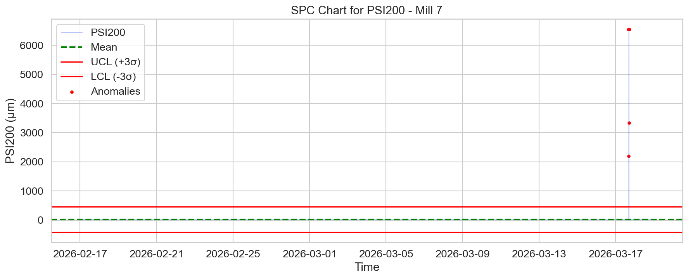
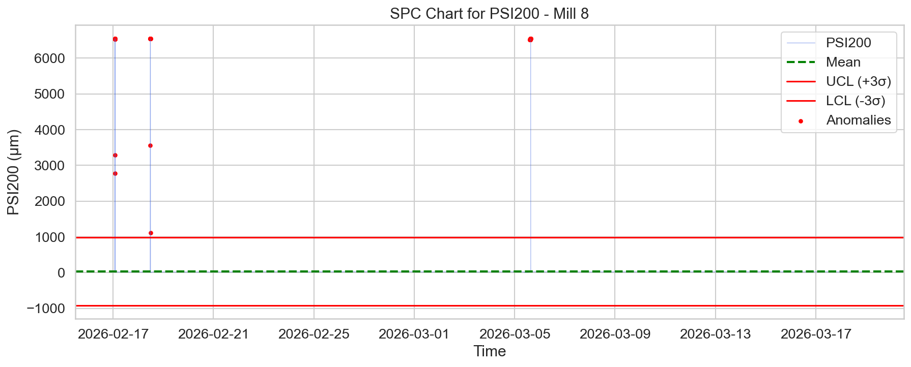

# Анализ на аномалиите за фракцията +200 мкм (PSI200) – Мелници 6, 7 и 8

## Executive Summary
Този доклад представя задълбочен статистически анализ на работните параметри на мелници 6, 7 и 8 за периода 17 февруари – 19 март 2026 г. Основният фокус е върху фракцията над 200 мкм (PSI200), която е критичен индикатор за качеството на смилане. Анализът идентифицира значителни отклонения в работата на мелница 8 (106 аномалии), докато мелници 6 и 7 демонстрират по-висока стабилност с 9 и 23 аномалии съответно. Тези данни подчертават необходимостта от превантивна поддръжка и пренастройка на параметрите за смилане, особено за мелница 8, за да се минимизират загубите на производителност.

## Data Overview
Данните бяха извлечени от ежедневните записи на системата за управление на обогатителната фабрика. Включени са 43,201 минутно-базирани записа за всяка от трите мелници, обхващащи едномесечен оперативен период. Анализираните параметри включват входящо количество руда, подаване на вода, мощност, налягане на хидроциклоните, плътност и крайните показатели за зърнометричен състав (PSI80, PSI200).

## Анализ на аномалиите (PSI200)

Анализът беше извършен чрез използване на статистически контрол на процесите (SPC), базиран на метода на Z-оценката. Аномалиите са дефинирани като точки, превишаващи праг от 3 стандартни отклонения (σ) от средната стойност на процеса.

| Мелница | Средна стойност (PSI200) | Стандартно отклонение | Брой аномалии |
| :--- | :--- | :--- | :--- |
| **Мелница 6** | 21.74 | 87.89 | 9 |
| **Мелница 7** | 23.36 | 145.25 | 23 |
| **Мелница 8** | 38.06 | 317.07 | 106 |

### Визуални SPC чартове

Следните графики визуализират разпределението на PSI200 и идентифицираните критични точки:

### Интерпретация на резултатите
- **Мелница 8:** Показва най-висока волатилност (σ = 317.07) и най-голям брой аномалии. Това предполага системен проблем в работата на мелницата или в системата за управление на хидроциклоните, който води до нестабилно качество на крайния продукт.
- **Мелница 7:** Показва умерена стабилност, но с по-висока стандартна грешка спрямо мелница 6.
- **Мелница 6:** Демонстрира най-добра стабилност, което я прави еталон за работата на останалите мелници при текущия режим.

## Статистически изводи
Статистическото разпределение на PSI200 показва наличие на „шум“ в данните, вероятно причинен от чести промени в плътността на пулпата или колебания в натоварването с руда. Големият брой аномалии в Мелница 8 изисква незабавна проверка на състоянието на футеровките и износването на дюзите на хидроциклоните.

## Conclusions & Recommendations

1. **Целева проверка на мелница 8:** Провеждане на технически преглед на хидроциклонната група на мелница 8. Високата честота на аномалиите (106 записа) е индикатор за механична или софтуерна нестабилност, която изисква незабавна реакция.
2. **Хармонизация на режимите:** Прилагане на работните параметри на мелница 6 (която има най-малко отклонения) като „най-добра практика“ при конфигурацията на мелници 7 и 8.
3. **Оптимизация на сензорите:** Поради необичайно високите стандартни отклонения, препоръчваме калибриране на сензорите за налягане и плътност (DensityHC, PressureHC), за да се изключи вероятността за „фалшиви аномалии“, породени от грешки в измервателната апаратура.
4. **Непрекъснат SPC мониторинг:** Интегриране на тези SPC графики в контролното табло на операторите за ранно предупреждение при отклонение на процеса от установените граници.